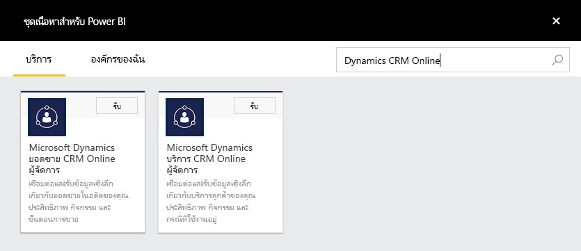
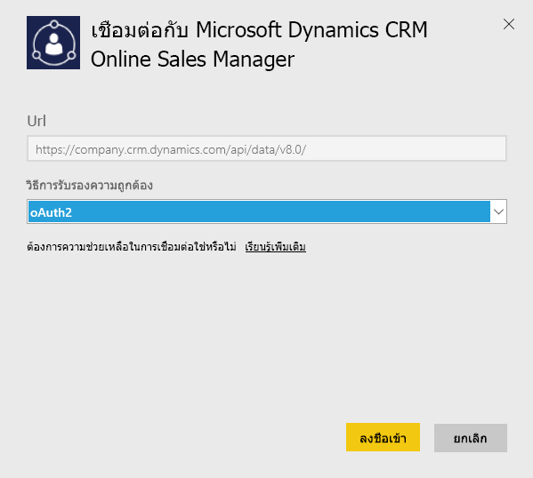
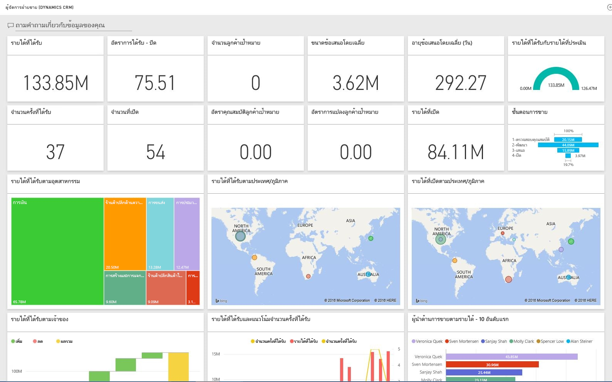

# เชื่อมต่อกับ Microsoft Dynamics CRM ด้วย Power BI
Microsoft Dynamics CRM Online สำหรับ Power BI ให้คุณสามารถเข้าถึง และวิเคราะห์ข้อมูลของคุณได้อย่างง่ายดาย Power BI ใช้ตัวดึงข้อมูล OData เพื่อสร้างรูปแบบคำอธิบาย ที่มีทุกเอนทิตี้และหน่วยวัดที่จำเป็น เช่น บัญชี กิจกรรม โอกาส ผลิตภัณฑ์ ลูกค้าเป้าหมาย ผู้ใช้ และอีกมากมาย หลังจากที่คุณติดตั้งแอป คุณสามารถดูแดชบอร์ดและรายงานในบริการของ Power BI ([https://powerbi.com](https://powerbi.com)) และในแอป Power BI สำหรับอุปกรณ์เคลื่อนที่ได้ 

เชื่อมต่อ Dynamics CRM Online [ผู้จัดการฝ่ายขาย](https://msit.powerbi.com/groups/me/getdata/services/dynamics-crm-sales-manager) หรือ[ผู้จัดการฝ่ายบริการ](https://msit.powerbi.com/groups/me/getdata/services/dynamics-crm-customer-service) อ่านเพิ่มเติมเกี่ยวกับ[การรวม Dynamics CRM Online](https://powerbi.microsoft.com/integrations/microsoft-dynamicscrm) กับ Power BI

การเชื่อมต่อนี้ต้องการ **Microsoft Dynamics CRM Online 2016 หรือใหม่กว่า** รายละเอียดเพิ่มเติมเกี่ยวกับ[ข้อกำหนด](#Requirements) อยู่ที่ด้านล่าง

## วิธีการเชื่อมต่อ
[!INCLUDE [powerbi-service-apps-get-more-apps](./includes/powerbi-service-apps-get-more-apps.md)]
3. เลือก **Microsoft Dynamics CRM ผู้จัดการฝ่ายขาย**หรือ **Microsoft Dynamics CRM ผู้จัดการฝ่ายบริการ** แล้วคลิก**เชื่อมต่อ**
   
   
4. ใส่ URL ของบริการที่เชื่อมโยงกับบัญชีของคุณ  ซึ่งจะอยู่ในรูปแบบ `https://company.crm.dynamics.com` ดูรายละเอียดเพิ่มเติมที่[ด้านล่าง](#FindingParams)
   
   
5. เมื่อได้รับข้อความปรากฏ ให้ใส่ข้อมูลประจำตัวของคุณ (คุณอาจข้ามขั้นตอนนี้ไปหากคุณลงชื่อเข้าใช้อยู่แล้วด้วยเบราว์เซอร์ของคุณ) สำหรับวิธีการรับรองความถูกต้อง ใส่ **oAuth2** และคลิก**ลงชื่อเข้าใช้**:
   
   
6. หลังจากการเชื่อมต่อ คุณจะเห็นแดชบอร์ดที่กำหนดเองสำหรับผู้จัดการฝ่ายขาย หรือผู้จัดการฝ่ายบริการ ที่เติมด้วยข้อมูลของคุณเอง:
   
   

## ดูแดชบอร์ดและรายงานของ Microsoft Dynamics CRM
[!INCLUDE [powerbi-service-apps-open-app](./includes/powerbi-service-apps-open-app.md)]

[!INCLUDE [powerbi-service-apps-open-app](./includes/powerbi-service-apps-what-now.md)]

## มีอะไรรวมอยู่บ้าง
ส่วนด้านล่าง จะแสดงรายละเอียดว่ามีอะไรรวมอยู่ใน[ผู้จัดการฝ่ายขาย](#Sales) และ[ผู้จัดการฝ่ายบริการ](#Service)บ้าง

จำกัดข้อมูลตามบทบาทความปลอดภัยที่กำหนดให้กับผู้ใช้ Dynamics CRM Online

แดชบอร์ดและรายงาน มีไว้เพื่อรายงานการดำเนินงานสำหรับข้อมูลระยะใกล้ โดยโฟกัสไปที่ทีมหรือกลุ่ม แต่ละคิวรี ถูกจำกัดให้เรียกใช้ได้สูงสุด 100K ระเบียนจาก Dynamics CRM Online หากเกินขีดจำกัดนี้เนื่องจากมีข้อมูลในองค์กรของคุณเป็นจำนวนมาก การกำหนดจะล้มเหลวเนื่องจากการรีเฟรชข้อมูล Dynamics CRM Online จะหยุด ถ้าบัญชีของคุณมีขนาดใหญ่เกินไป พิจารณาสร้างโซลูชันแบบกำหนดเอง และการเชื่อมต่อผ่านทาง Power BI Desktop

### ผู้จัดการฝ่ายขาย
แดชบอร์ดและรายงานประกอบด้วยเมตริกหลักเช่น:  

* รายได้ที่ชนะแล้ว   
* อัตราการชนะ   
* รายได้ที่เปิด   
* รายได้ที่สูญหาย   
* รายได้ที่คาดไว้  
* ขนาดการซื้อขายโดยเฉลี่ย ฯลฯ  

แดชบอร์ดและรายงานยังมีแผนภูมิที่สำคัญเช่น:  

* แนวโน้มรายได้ที่ชนะและที่สูญหาย, แนวโน้มรายได้ที่ชนะ เทียบกับรายได้ที่คาดไว้  
* รายได้ที่ชนะ ตามมิติต่าง ๆ เช่น อุตสาหกรรม, ภูมิภาค, ดินแดน   
* ผู้นำยอดขาย ตามรายได้, กิจกรรม   
* ลูกค้าองค์กรระดับบนสุด, การซื้อขายที่ชนะ/แพ้อันดับต้น ๆ    
* แนวโน้มลูกค้าเป้าหมายใหม่, ไปป์ไลน์การขาย ฯลฯ   

เมตริกและแผนภูมิเหล่านี้ ช่วยให้คุณทำความเข้าใจประสิทธิภาพขององค์กรการขายของคุณ และวิเคราะห์ขั้นตอนการขายของทั้งทีมขายของคุณ

ตารางต่อไปนี้แสดงรายการเอนทิตี้ CRM ที่มีสำหรับบริการนี้ และยังให้รายละเอียดของตัวกรองที่ใช้กับแต่ละระเบียนของเอนทิตี้

| เอนทิตี้ CRM | ตัวกรองที่ใช้ |
| --- | --- |
| บัญชี |บัญชีทั้งหมดที่เกี่ยวข้องกับโอกาสทางการขายที่มีการเปลี่ยนแปลงใน 365 วันที่ผ่านมา |
| กิจกรรม |กิจกรรมทั้งหมดที่มีการเปลี่ยนแปลงใน 90 วันที่ผ่านมา   [modifiedon] > today - 90 days |
| หน่วยธุรกิจ |หน่วยธุรกิจทั้งหมดที่ไม่ได้ปิดใช้งาน   [isdisabled] = false |
| สาเหตุ |ลูกค้าเป้าหมายทั้งหมดที่มีการเปลี่ยนแปลงใน 180 วันที่ผ่านมา   [modifiedon] > วันนี้ - 180 วัน |
| โอกาสทางการขาย |โอกาสทางการขายทั้งหมดที่มีการเปลี่ยนแปลงใน 365 วันที่ผ่านมา   [modifiedon] > วันนี้ - 365 วัน |
| ผลิตภัณฑ์ของโอกาสทางการขาย |ผลิตภัณฑ์ของโอกาสทางการขายทั้งหมดที่มีการเปลี่ยนแปลงใน 365 วันที่ผ่านมา   [modifiedon] > วันนี้ - 365 วัน |
| ผลิตภัณฑ์ |ผลิตภัณฑ์ที่ใช้งานอยู่ทั้งหมด   [statecode] <> 1 |
| ดินแดน |อาณาเขตทั้งหมด |
| ผู้ใช้ |ผู้ใช้ที่ใช้งานอยู่ทั้งหมด ที่ไม่เป็นผู้ดูแลระบบที่ได้รับมอบสิทธิ์    [isdisabled] = false and [accessmode] <> 4 |

### ผู้จัดการฝ่ายบริการ
แดชบอร์ดและรายงานเหล่านี้ ประกอบด้วยเมตริกหลักเช่น:  

* เปอร์เซ็นต์ CSAT   
* เปอร์เซ็นต์ที่เป็นไปตาม SLA   
* เปอร์เซ็นต์ของกรณีและปัญหาที่เลื่อนระดับ   
* ค่าเฉลี่ยเวลาในการจัดการ   
* กรณีและปัญหาที่แก้ไขแล้วทั้งหมด  
* กรณีและปัญหาที่ใช้งานอยู่ทั้งหมด  
* จำนวนครั้งที่บทความของฐานข้อมูลองค์ความรู้ถูกใช้ในกรณีและปัญหา ฯลฯ    

แดชบอร์ดและรายงานยังมีแผนภูมิที่สำคัญเช่น:   

* แนวโน้มปริมาณกรณีและปัญหา สำหรับกรณีและปัญหาที่เข้ามา, ที่แก้ไขแล้ว และที่เลื่อนระดับ   
* ปริมาณกรณีและปัญหาตามมิติต่าง ๆ เช่น จุดเริ่มต้น, ตำแหน่ง, ลำดับความสำคัญ, ชนิด  
* ผู้นำ ตามเปอร์เซ็นต์ CSAT, เปอร์เซ็นต์ที่เป็นไปตาม SLA, กิจกรรม, กรณีและปัญหาที่แก้ไขแล้ว  
* บทความของฐานข้อมูลองค์ความรู้ที่ใช้มากที่สุด, ที่ดูมากที่สุด ฯลฯ  
    เมตริกและแผนภูมิเหล่านี้ช่วยให้คุณทำความเข้าใจประสิทธิภาพขององค์กรฝ่ายสนับสนุนของคุณ และวิเคราะห์ปริมาณงานกรณีและปัญหาทั่วทีมบริการ และคิวบริการของคุณ

ตารางต่อไปนี้แสดงรายการของเอนทิตี้ CRM ที่มีในบริการนี้ ตลอดจนรายละเอียดเกี่ยวกับตัวกรองใช้กับแต่ละระเบียนของเอนทิตี้

| เอนทิตี้ CRM | ตัวกรองที่ใช้ |
| --- | --- |
| บัญชี |บัญชีทั้งหมดที่เกี่ยวข้องกับกรณีและปัญหา ที่มีการเปลี่ยนแปลงใน 90 วันที่ผ่านมา |
| กิจกรรม |กิจกรรมทั้งหมดที่มีการเปลี่ยนแปลงใน 90 วันที่ผ่านมา   [modifiedon] > today - 90 days |
| กรณีและปัญหา |กรณีและปัญหาทั้งหมดที่มีการเปลี่ยนแปลงใน 90 วันที่ผ่านมา   [modifiedon] > today - 90 days |
| กิจกรรมการแก้ไขกรณีและปัญหา |กิจกรรมการแก้ไขกรณีและปัญหาทั้งหมดที่มีการเปลี่ยนแปลงใน 90 วันที่ผ่านมา   [modifiedon] > today - 90 days |
| ผู้ติดต่อ |ผู้ติดต่อทั้งหมดที่มีกรณีที่เกี่ยวข้องซึ่งมีการเปลี่ยนแปลงใน 90 วันที่ผ่านมา |
| บทความองค์ความรู้ |บทความองค์ความรู้เวอร์ชันล่าสุดทั้งหมด    [islatestversion] = true |
| เหตุการณ์บทความองค์ความรู้ |เหตุการณ์บทความองค์ความรู้ที่มีการเปลี่ยนแปลงใน 90 วันที่ผ่านมา   [modifiedon] > today - 90 days |
| คิว |คิวที่ใช้งานอยู่ทั้งหมด    [statecode] = 0 |
| รายการคิว |รายการลำดับที่เกี่ยวข้องกับทุกกรณีที่สร้างขึ้นใน 365 วันที่ผ่านมา    [createdon] > today - 365 days and   [objecttypecode] = 112 |
| ผู้ใช้ |ผู้ใช้ที่ใช้งานอยู่ทั้งหมด    [isdisabled] = false |

## ข้อกำหนดของระบบ
* อินสแตนซ์ Dynamics CRM Online 2016 หรือใหม่กว่า ที่ถูกต้อง (Power BI จะไม่ทำงานกับรุ่น CRM ภายในองค์กร) ถ้าคุณไม่มีรุ่น 2016 หรือใหม่กว่า:
* ผู้ดูแลระบบต้องเปิดใช้งานจุดสิ้นสุด OData ในการตั้งค่าไซต์
* บัญชีผู้ใช้ ที่มีระเบียนในตารางใด ๆ น้อยกว่า 100k ระเบียน ถ้าบัญชีผู้ใช้ มีสิทธิ์เข้าถึงระเบียนมากกว่า 100k การนำเข้าจะล้มเหลว

## การค้นหาพารามิเตอร์
ที่อยู่ของอินสแตนซ์ สามารถหาได้จากในแถบ URL ของเบราว์เซอร์คุณ โดยทั่วไปจะมีรูปแบบ: `https://[instance_name].crm.dynamics.com`

Power BI สนับสนุนเฉพาะจุดสิ้นสุดของ Dynamics CRM 2016 เท่านั้น การเชื่อมต่อจะไม่ทำงานกับ CRM Online เวอร์ชันก่อนหน้า ใช้ Power BI Desktop เพื่อเชื่อมต่อกับบัญชีของคุณโดยตรง

## การแก้ไขปัญหา
ถ้าคุณกำลังมีปัญหาในการเชื่อมต่อ กรุณาตรวจสอบเพื่อให้แน่ใจว่า:  

* คุณให้ URL ของอินสแตนซ์ที่ถูกต้อง (ตรวจสอบกับผู้ดูแลระบบของคุณ)  
* อินสแตนซ์คือ CRM Online 2016  
* เปิดใช้งานจุดสิ้นสุด OData แล้ว  

นอกจากนี้ ยังลองเชื่อมต่อโดยตรงใน Power BI Desktop ด้วย URL OData `https://[instance_name].crm.dynamics.com/api/data/v8.0/`

ถ้าคุณยืนยันว่าคุณมี Dynamics CRM Online 2016 แต่คุณยังคงมีปัญหาการเชื่อมต่อ ติดต่อผู้ดูแลระบบ CRM ของคุณเพื่อยืนยันว่าคุณได้ติดตั้งอัปเดตทั้งหมดแล้ว

ถ้าคุณไม่มี CRM Online 2016 หรือรุ่นที่ใหม่กว่า ใช้ Power BI Desktop เพื่อเชื่อมต่อกับบัญชีของคุณโดยตรง

ถ้าคุณเห็นข้อผิดพลาด "การรีเฟรชข้อมูลล้มเหลวเนื่องจากแบบสอบถามเกินขีดจำกัดสูงสุดของ 100000 ระเบียน" ลองเชื่อมต่อโดยตรงจาก Power BI Desktop หรือใช้ประโยชน์จากเทมเพลตโซลูชัน CRM

## ขั้นตอนถัดไป
* [แอป Power BI คืออะไร](service-create-distribute-apps.md)
* [รับข้อมูลใน Power BI](service-get-data.md)
* มีคำถามเพิ่มเติมหรือไม่ [ลองถามชุมชน Power BI](http://community.powerbi.com/)

