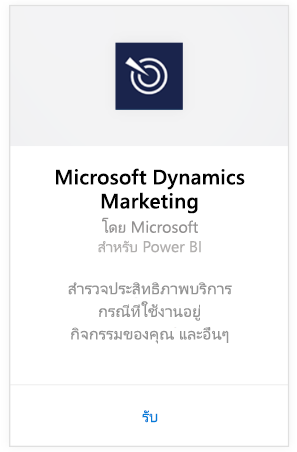
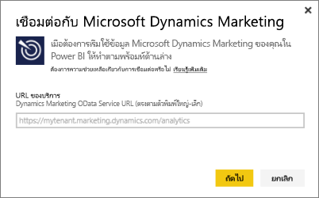
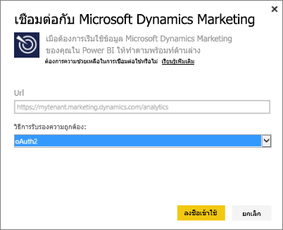
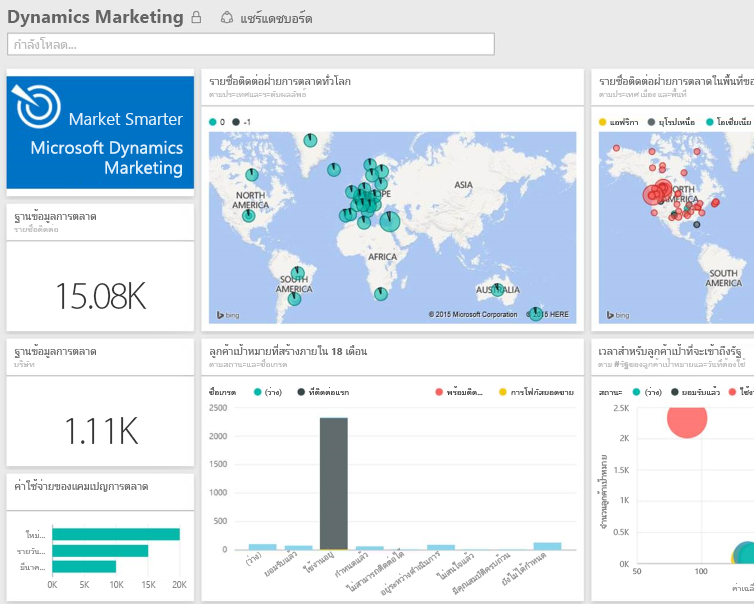

# เชื่อมต่อกับ Microsoft Dynamics Marketing ด้วย Power BI
ชุดเนื้อหา Microsoft Dynamics Marketing สำหรับ Power BI ช่วยให้คุณสามารถเข้าใช้งานและวิเคราะห์ข้อมูลของคุณจาก Dynamics Marketing ได้อย่างง่ายดาย ชุดเนื้อหาดังกล่าวใช้แบบจำลองเชิงพรรณาที่ด้านบนสุดของตัวดึงข้อมูล OData โดยมีเอนทิตีและหน่วยวัดที่จำเป็นทั้งหมด เช่น โปรแกรม แคมเปญ รายชื่อติดต่อทางการตลาดและลูกค้าเป้าหมายของบริษัท การโต้ตอบกับลูกค้าเป้าหมายและการให้คะแนนลูกค้าเป้าหมาย ข้อความทางการตลาดที่ส่งผ่านอีเมล และเว็บไซต์ การสังเกตพฤติกรรม งบประมาณ ธุรกรรมทางการเงิน ประสิทธิภาพของ KPI และอื่น ๆ อีกมากมาย 

เชื่อมต่อกับ[ชุดเนื้อหา Dynamics Marketing ](https://app.powerbi.com/getdata/services/microsoft-dynamics-marketing)สำหรับ Power BI

>[!NOTE]
>คุณจำเป็นต้องระบุ URL ของ OData ที่ถูกต้องสำหรับตัวอย่าง Dynamics Marketing (ชุดเนื้อหาจะไม่ทำงานกับรุ่น CRM ภายในองค์กร) ดูข้อกำหนดเพิ่มเติมที่ด้านล่าง

## วิธีการเชื่อมต่อ
1. เลือกรับข้อมูลที่ด้านล่างของพื้นที่นำทางด้านซ้ายมือ
   
    
2. ในกล่อง**บริการ** เลือก**รับ**
   
    
3. เลือก**Microsoft Dynamics Marketing** \> **รับ**
   
   
4. ให้ URL สำหรับ OData ที่เชื่อมโยงกับบัญชีของคุณ  นี่จะอยู่ในรูปแบบ " https://[instance\_name].marketing.dynamics.com/analytics "
   
   
5. เมื่อได้รับข้อความปรากฏ ให้ใส่ข้อมูลประจำตัวของคุณ (คุณอาจข้ามขั้นตอนนี้ไปถ้าคุณลงชื่อเข้าใช้อยู่แล้วด้วยเบราว์เซอร์ของคุณ) สำหรับวิธีการรับรองความถูกต้อง ใส่**oAuth2**และคลิก**ลงชื่อเข้าใช้**:
   
   
6. หลังจากเชื่อมต่อแล้ว คุณจะเห็นแดชบอร์ด Dynamics Marketing ที่เติมข้อมูลของคุณเอง เครื่องหมายดอกจันสีเหลืองทำเครื่องหมายรายการใหม่ในแผงนำทางด้านซ้าย
   
   

**ฉันต้องทำอะไรต่อ?**

* ลอง[ถามคำถามในกล่อง Q&A](power-bi-q-and-a.md)ที่ด้านบนของแดชบอร์ด
* [เปลี่ยนไทล์](service-dashboard-edit-tile.md)ในแดชบอร์ด
* [เลือกไทล์](service-dashboard-tiles.md)เพื่อเปิดรายงานด้านใน
* ถึงแม้ว่าชุดข้อมูลของคุณถูกกำหนดให้รีเฟรซรายวัน คุณสามารถเปลี่ยนแปลงกำหนดเวลารีเฟรช หรือลองรีเฟรชตามความต้องการ โดยใช้**รีเฟรชทันที**

## ข้อกำหนดของระบบ
* คุณจำเป็นต้องระบุ URL ของ OData ที่ถูกต้องสำหรับตัวอย่าง Dynamics Marketing (ชุดเนื้อหาจะไม่ทำงานกับรุ่น CRM ภายในองค์กร)  
* ผู้ดูแลระบบต้องเปิดใช้งานจุดยุติ OData ในการตั้งค่าไซต์ ที่อยู่ของจุดสิ้นสุด OData สามารถดูได้ โดยการนำทางไปยัง**หน้าแรก\>ตั้งค่า\>ตั้งค่าไซต์**ในส่วน**บริการข้อมูลองค์กร**  OData URL มีรูปแบบ: https://[instance\_name].marketing.dynamics.com/analytics  
* บัญชี/ข้อมูลประจำตัวผู้ใช้ที่คุณใช้เพื่อเข้าถึง Microsoft Dynamics Marketing ต้องเหมือนกันกับบัญชี/ข้อมูลประจำตัวที่คุณลงทะเบียนใช้งานกับ Power BI เมื่อคุณลงชื่อเข้าใช้ใน Microsoft Dynamics Marketing คุณจะลงชื่อเข้าใช้โดยอัตโนมัติด้วยข้อมูลประจำตัวเดียวกันกับที่คุณใช้สำหรับ Power BI ถ้าคุณต้องการลงชื่อเข้าใช้ลงใน Microsoft Dynamics Marketing ด้วยบัญชีอื่น โปรดลงทะเบียนเป็นผู้ใช้ Power BI โดยใช้บัญชีผู้ใช้อื่น เราหวังว่าจะแก้ไขปัญหานี้ในการเผยแพร่ครั้งถัดไป   

## การแก้ไขปัญหา
ถ้าคุณเห็นข้อความ "การเข้าสู่ระบบล้มเหลว" เมื่อพยายามเชื่อมต่อกับบัญชี Dynamics CRM ของคุณ โปรดยืนยันว่าคุณกำลังลงชื่อเข้าใช้ Power BI ด้วยบัญชีเดียวกันกับบัญชีที่คุณใช้เพื่อเข้าใช้งานตัวดึงข้อมูล CRM Online OData ลองเข้าสู่ระบบในตัวดึงข้อมูลในเบราว์เซอร์ของคุณด้วยเพื่อทำการทดสอบ

ขอให้ผู้ดูแลระบบของคุณยืนยัน URL ของ OData ที่ถูกต้อง และมีการเปิดใช้งานจุดสิ้นสุด OData อยู่

ตรวจสอบเวอร์ชันของ Dynamics Marketing ที่คุณใช้งานอยู่ มีการแก้ไขเพิ่มเติมในเวอร์ชั่น 18.0 และ 18.1 ถ้าคุณยังคงมีปัญหานี้อยู่และยังอยู่ในเวอร์ชันเก่า คุณควรพิจารณาอัปเกรดเวอร์ชัน

ถ้าคุณยังคงพบปัญหานี้อยู่ เปิดตั๋วการสนับสนุนเพื่อติดต่อทีม Power BI:

* ขณะที่อยู่ในแอปฯ Power BI เลือกเครื่องหมายคำถาม\> **ติดต่อฝ่ายสนับสนุน**
* จากไซต์ Power BI สนับสนุน (ตำแหน่งที่คุณกำลังอ่านบทความนี้), เลือก**ติดต่อฝ่ายสนับสนุน**ทางด้านขวาของหน้า

## ขั้นตอนถัดไป
[รับข้อมูลสำหรับ Power BI](service-get-data.md)

[Power BI คืออะไร](power-bi-overview.md)

