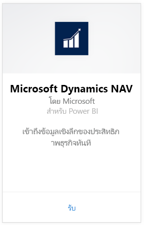
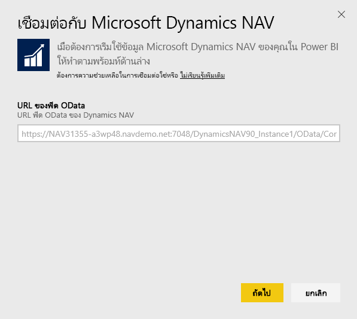
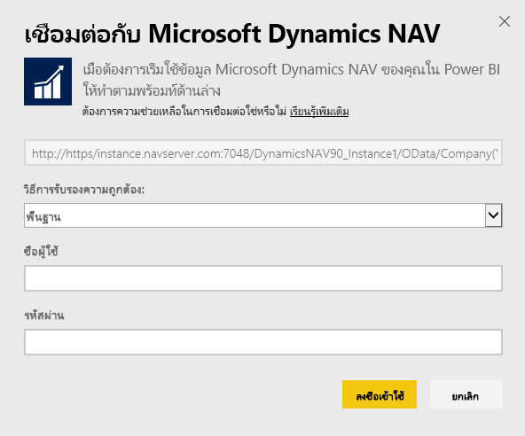
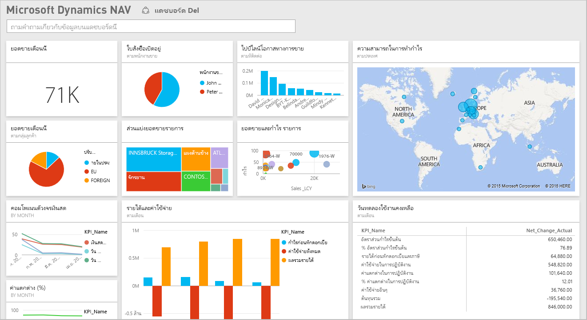

# เชื่อมต่อกับ Microsoft Dynamics NAV ด้วย Power BI
รับข้อมูลเชิงลึกลงในข้อมูล Microsoft Dynamics NAV ของคุณนั้นทำได้ง่ายด้วย Power BI Power BI ดึงข้อมูลของคุณ ทั้งยอดขายและข้อมูลทางการเงิน จากนั้นสร้างแอปและแดชบอร์ด และรายงานที่ยึดตามข้อมูลนั้น Power BI จำเป็นต้องอนุญาตให้ไปยังตารางที่จะดึงข้อมูลจาก ในกรณีนี้ข้อมูลยอดขายและข้อมูลทางการเงิน รายละเอียดเพิ่มเติมเกี่ยวกับข้อกำหนดด้านล่าง หลังจากที่คุณติดตั้งแอป คุณสามารถดูแดชบอร์ดและรายงานในบริการของ Power BI ([https://powerbi.com](https://powerbi.com)) และในแอป Power BI สำหรับอุปกรณ์เคลื่อนที่ได้ 

[เชื่อมต่อกับ Microsoft Dynamics NAV สำหรับ Power BI](https://app.powerbi.com/getdata/services/microsoft-dynamics-nav)หรืออ่านเพิ่มเติมเกี่ยวกับ[การรวม Dynamics NAV](https://powerbi.microsoft.com/integrations/microsoft-dynamics-nav)ด้วย Power BI

## วิธีการเชื่อมต่อ
[!INCLUDE [powerbi-service-apps-get-more-apps](./includes/powerbi-service-apps-get-more-apps.md)]

1. เลือก**Microsoft Dynamics NAV**แล้วเลือก**รับ**  
   
2. เมื่อถูกถาม ให้ใส่ URL ของ OData Microsoft Dynamics NAV URL ควรตรงกับรูปแบบต่อไปนี้
   
    `https//instance.navserver.com:7048/DynamicsNAV90_Instance1/OData/Company('CRONUS%20International%20Ltd.')`
   
   * "instance.navserver.com" กับชื่อเซิร์ฟเวอร์ NAV ของคุณ
   * " DynamicsNAV90\_Instance1 " กับชื่ออินสแตนซ์ของเซิร์ฟเวอร์ NAV ของคุณ
   * "Company('CRONUS%20International%20Ltd.')" กับชื่อ บริษัท NAV ของคุณ
     
     วิธีง่ายๆ ในการขอรับ URL อยู่ใน Dynamics NAV เมื่อต้องไปยัง Web Services ค้นหา powerbifinance Web Services และคัดลอก OData URL แต่ปล่อย " / powerbifinance " จากสตริง URL  
     
3. เลือก**พื้นฐาน**และใส่ข้อมูลประจำตัว Microsoft Dynamics NAV ของคุณ
   
    คุณต้องมีข้อมูลประจำตัวผู้ดูแลระบบ (หรืออย่างน้อยสิทธิ์ในการขายและข้อมูลทางการเงิน) สำหรับบัญชี Microsoft Dynamics NAV ของคุณ  เฉพาะ พื้นฐาน (ชื่อผู้ใช้และรหัสผ่าน) รับรองตัวตนในขณะนี้อยู่ถูกรับรอง
   
    
4. Power BI จะดึงข้อมูล Microsoft Dynamics NAV ของคุณและสร้างแดชบอร์ดและรายงานแบบพร้อมใช้งานขึ้น   
   

## ดูแดชบอร์ดและรายงาน
[!INCLUDE [powerbi-service-apps-open-app](./includes/powerbi-service-apps-open-app.md)]

[!INCLUDE [powerbi-service-apps-open-app](./includes/powerbi-service-apps-what-now.md)]

## มีอะไรรวมอยู่บ้าง
แดชบอร์ดและรายงานที่ประกอบด้วยข้อมูลจากตารางต่อไปนี้ (ตัวพิมพ์ใหญ่เล็กต่างกัน)  

* ItemSalesAndProfit  
* ItemSalesByCustomer  
* powerbifinance  
* SalesDashboard  
* SalesOpportunities  
* SalesOrdersBySalesPerson  
* TopCustomerOverview  

## ความต้องการของระบบ
เพื่อนำเข้าข้อมูล Microsoft Dynamics NAV ของคุณ ลงใน Power BI คุณจำเป็นต้องมีสิทธิ์ในตารางการขายและข้อมูลทางการเงินที่ข้อมูลถูกนำมา(ตามรายการด้านล่าง) ตารางยังจำเป็นต้องมีข้อมูลบางส่วน ขณะนี้ตารางว่างจะล้มเหลวในการนำเข้า

## การแก้ไขปัญหา
Power BI ใช้เว็บเซอร์วิซของ Microsoft Dynamics NAV เพื่อรับข้อมูลของคุณ ถ้าคุณมีข้อมูลจำนวนมากในอินสแตนซ์ Microsoft Dynamics NAV ของคุณ คำแนะนำเพื่อลดผลกระทบกับการใชเว็บเซอร์วิซของคุณคือการ เปลี่ยนความถี่ในการรีเฟรชตามความต้องการของคุณ คำแนะนำของอื่นจะมีผู้ดูแลระบบเพียงคนเดียวที่สร้างแอปและแชร์แทนที่ผู้ดูแลทุกคนจะสร้างของตนเอง

**“ไม่สามารถตรวจสอบความถูกต้องของพารามิเตอร์ โปรดตรวจสอบให้แน่ใจว่าพารามิเตอร์ทั้งหมดถูกต้อง”**  
ถ้าคุณเห็นข้อผิดพลาดนี้หลังพิมพ์ URL ของ Microsoft Dynamics NAV ของคุณ ตรวจสอบให้แน่ใจว่าข้อกำหนดต่อไปนี้ถูกยอมรับหรือไม่

* URL ทำตามรูปแบบนี้
  
    `https//instance.navserver.com:7048/DynamicsNAV90_Instance1/OData/Company('CRONUS%20International%20Ltd.')`
  
  * "instance.navserver.com" กับชื่อเซิร์ฟเวอร์ NAV ของคุณ
  * " DynamicsNAV90\_Instance1 " กับชื่ออินสแตนซ์ของเซิร์ฟเวอร์ NAV ของคุณ
  * "Company('CRONUS%20International%20Ltd.')" กับชื่อ บริษัท NAV ของคุณ
* ตรวจสอบให้แน่ใจว่า ตัวอักษรทั้งหมดเป็นตัวพิมพ์เล็ก  
* ตรวจสอบให้แน่ใจว่า URL เป็น 'https'  
* ตรวจสอบให้แน่ใจว่าไม่มีที่ส่วนท้ายของ URL หลังสแลช

**"การเข้าสู่ระบบล้มเหลว"**  
ถ้าคุณได้รับข้อผิดพลาด "การเข้าสู่ระบบล้มเหลว" หลังจากใช้ข้อมูลประจำตัว Microsoft Dynamics NAV ของคุณ เข้าสู่ระบบจากนั้นคุณอาจสามารถเข้าถึงหนึ่งในปัญหาต่อไปนี้:

* บัญชีที่คุณกำลังใช้ไม่มีสิทธิ์ในการดึงข้อมูล Microsoft Dynamics NAV จากบัญชีของคุณ ตรวจสอบนี่เป็นบัญชีผู้ดูแลระบบ และลองอีกครั้ง
* อินสแตนซ์ Dynamics NAV ที่คุณกำลังพยายามจะเชื่อมต่อยังไม่มีใบรับรอง SSL ที่ถูกต้อง ในกรณีนี้ คุณจะเห็นข้อผิดพลาดที่ละเอียดยิ่งขึ้น ("ไม่สามารถสร้างความสัมพันธ์ SSL ที่เชื่อถือได้") โปรดทราบว่าใบรับรองที่เซ็นชื่อด้วยตนเองไม่ได้รับการรองรับ

**"ขออภัย"**  
ถ้าคุณเห็นกล่องโต้ตอบข้อผิดพลาดการ "Oops" หลังจากที่คุณเลื่อนผ่านกล่องโต้ตอบการรับรองตัวตน Power BI กำลังทำงานลงในปัญหาขณะโหลดข้อมูล

* ตรวจสอบ URL ตามรูปแบบที่ระบุไว้ข้างต้น ข้อผิดพลาดทั่วไปคือการระบุ
  
    `https//instance.navserver.com:7048/DynamicsNAV90\_Instance1/OData`
  
    อย่างไรก็ตาม คุณจำเป็นต้องมีส่วน 'Company('CRONUS%20International%20Ltd.')' กับชื่อ บริษัท NAV ของคุณ
  
    `https//instance.navserver.com:7048/DynamicsNAV90\_Instance1/OData/Company('CRONUS%20International%20Ltd.')`

## ขั้นตอนถัดไป
* [แอป Power BI คืออะไร](service-install-use-apps.md)
* [รับข้อมูลใน Power BI](service-get-data.md)
* มีคำถามเพิ่มเติมหรือไม่ [ลองถามชุมชน Power BI](http://community.powerbi.com/)

