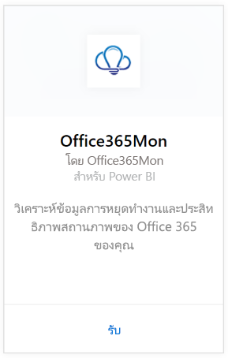
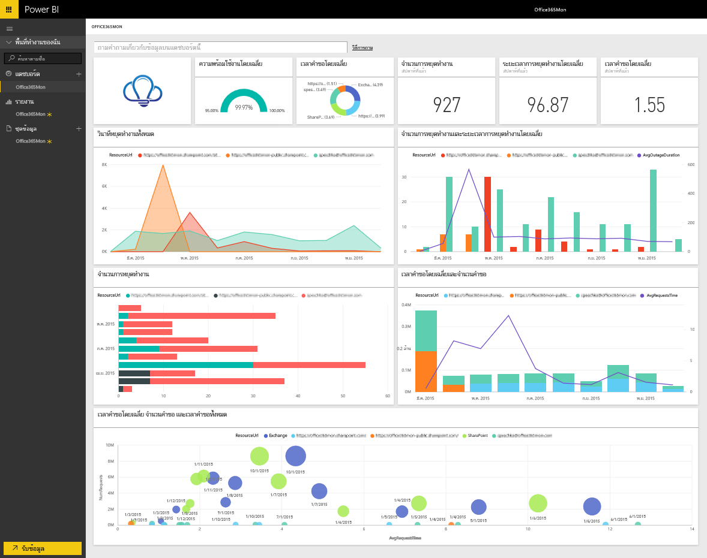

# เชื่อมต่อกับ Office365Mon ด้วย Power BI
กำลังวิเคราะห์การหยุดการทำงานและข้อมูลสมรรถนะทางสุขภาพของ Office 365 ของคุณ ซึ่งทำได้ง่ายด้วย Power BI และชุดเนื้อหา Office365Mon Power BI ดึงข้อมูลของคุณ ทั้งการหยุดทำงานและปัญหาด้านสุขภาพ จากนั้นสร้างแดชบอร์ดแบบคิดนอกกรอบและรายงานที่ยึดตามข้อมูลนั้น

เชื่อมต่อไปยัง[ชุดเนื้อหา Office365Mon](https://app.powerbi.com/groups/me/getdata/services/office365mon)สำหรับ Power BI

>[!NOTE]
>จำเป็นต้องมีบัญชีผู้ดูแลระบบ Office365Mon เพื่อเชื่อมต่อและโหลดชุดเนื้อหา Power BI

## วิธีการเชื่อมต่อ
1. เลือกปุ่ม**รับข้อมูล**ที่ด้านล่างของพื้นที่นำทางด้านซ้ายมือ
   
   
2. ในกล่อง**บริการ** เลือก**รับ**
   
    
3. เลือก**Office365Mon** \> **รับ**
   
   
4. สำหรับวิธีการรับรองความถูกต้อง ให้เลือก **oAuth2** \> **ลงชื่อเข้าใช้**
   
   เมื่อไดถูกถาม ให้ใส่ข้อมูลประจำตัวของผู้ดูแลระบบ Office365Mon และทำตามกระบวนการรับรองความถูกต้อง
   
   
   
   
5. หลังจากที่ Power BI นำเข้าข้อมูลแล้ว คุณจะเห็นแดชบอร์ด รายงาน และชุดข้อมูลใหม่ ในบานหน้าต่างนำทางด้านซ้ายมือ รายการใหม่ถูกทำเครื่องหมายด้วยเครื่องหมายดอกจันสีเหลือง \* เลือกกรอก Office365Mon
   
   

**ฉันต้องทำอะไรตอนนี้**

* ลอง[ถามคำถามในกล่อง Q&A](power-bi-q-and-a.md)ที่ด้านบนของแดชบอร์ด
* [เปลี่ยนไทล์](service-dashboard-edit-tile.md)ในแดชบอร์ด
* [เลือกไทล์](service-dashboard-tiles.md)เพื่อเปิดรายงานด้านใน
* ถึงแม้ว่าชุดข้อมูลของคุณถูกกำหนดให้รีเฟรซรายวัน คุณสามารถเปลี่ยนแปลงกำหนดเวลารีเฟรช หรือลองรีเฟรชตามความต้องการ โดยใช้**รีเฟรชทันที**

## การแก้ไขปัญหา
ถ้าคุณได้รับข้อผิดพลาด **"เข้าสู่ระบบล้มเหลว"** หลังจากใช้ข้อมูลประจำตัวของการสมัครใช้งาน Office365Mon เข้าระบบ จากนั้นบัญชีคุณไม่มีสิทธิ์ในการดึงข้อมูล Office365Mon จากบัญชีของคุณ ตรวจสอบนี่เป็นบัญชีผู้ดูแลระบบ และลองอีกครั้ง

## ขั้นตอนถัดไป
[Power BI คืออะไร](power-bi-overview.md)

[รับข้อมูลสำหรับ Power BI](service-get-data.md)

