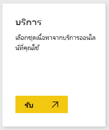
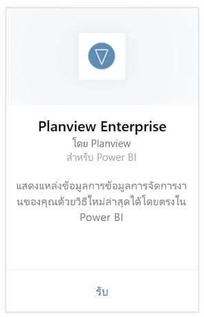
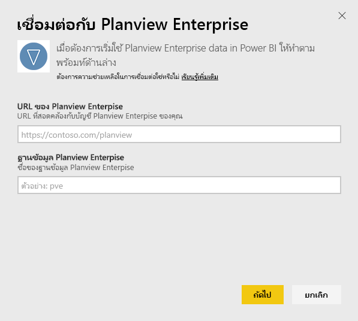
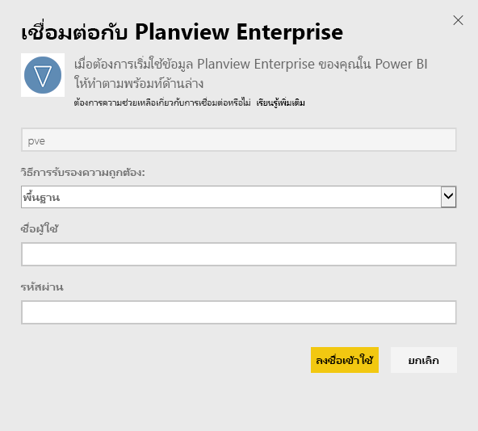
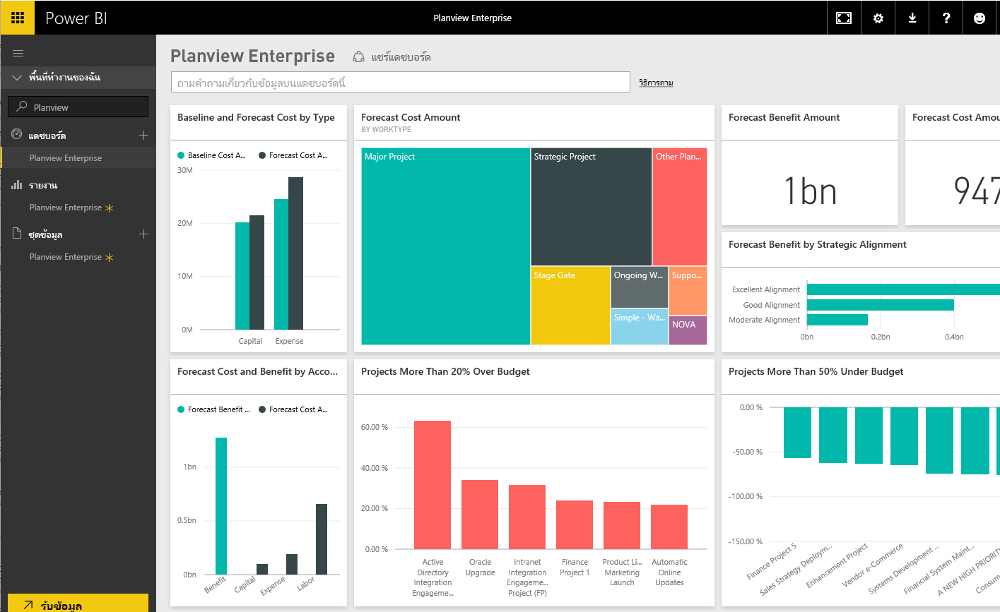

# เชื่อมต่อกับ Planview Enterprise ด้วย Power BI
ด้วยชุดเนื้อหา Planview Enterprise คุณสามารถมองเห็นภาพทรัพยากรของคุณ และทำงานเพื่อจัดการข้อมูลในวิธีการใหม่ทั้งกระบวนการได้โดยตรงใน Power BI ใช้ข้อมูลประจำตัวการลงชื่อเข้าใช้ของ Planview Enterprise เพื่อดูการใช้จ่ายพอร์ตลงทุนแบบโต้ตอบของคุณ ทำความเข้าใจว่าคุณอยู่ตรงจุดไหน เกินงบประมาณหรือต่ำกว่างบประมาณ และดูว่าโครงการของคุณสอดคล้องกับลำดับความสำคัญเชิงกลยุทธ์ขององค์กรของคุณมากน้อยเพียงใด นอกจากนี้ คุณยังสามารถขยายแดชบอร์ดและรายงานแบบใช้งานทันทีเพื่อรับข้อมูลเชิงลึกที่มีความสำคัญมากที่สุดสำหรับคุณ

เชื่อมต่อกับ[ชุดเนื้อหา Planview Enterprise ใน Power BI](https://app.powerbi.com/getdata/services/planview-enterprise)

>[!NOTE]
>ในการนำเข้าข้อมูล Planview Enterprise ของคุณไปยัง Power BI คุณต้องเป็นผู้ใช้ Planview Enterprise ที่มีการเปิดใช้งานคุณลักษณะ Reporting Portal Viewer ในบทบาทของคุณ ดูข้อกำหนดเพิ่มเติมที่ด้านล่าง

## วิธีการเชื่อมต่อ
1. เลือกปุ่ม**รับข้อมูล**ที่ด้านล่างของพื้นที่นำทางด้านซ้ายมือ
   
    
2. ในกล่อง**บริการ** เลือก**รับ**
   
    
3. บนหน้า Power BI เลือก**Planview Enterprise** แล้วเลือก**รับ**:  
    
4. ในกล่องข้อความ Planview Enterprise URL ใส่ URL สำหรับเซิร์ฟเวอร์ Planview Enterprise ที่คุณต้องการใช้ ในกล่องข้อความฐานข้อมูล Planview Enterprise ใส่ชื่อของฐานข้อมูล Planview Enterprise จากนั้นคลิกถัดไป  
    
5. ในรายการวิธีการรับรองความถูกต้อง เลือก**พื้นฐาน**ถ้ายังไม่ได้เลือกไว้ ใส่**ชื่อผู้ใช้**และ**รหัสผ่าน**สำหรับบัญชีของคุณ แล้วเลือก**ลงชื่อเข้าใช้**  
   
6. ในแผงด้านซ้าย เลือก Planview Enterprise จากรายการของแดชบอร์ด  
     Power BI นำเข้าข้อมูล Planview Enterprise ลงในแดชบอร์ด โปรดทราบว่าอาจใช้เวลาสักครู่ในการโหลดข้อมูล  
    

**ฉันต้องทำอะไรต่อ?**

* ลอง[ถามคำถามในกล่อง Q&A](consumer/end-user-q-and-a.md)ที่ด้านบนของแดชบอร์ด
* [เปลี่ยนไทล์](service-dashboard-edit-tile.md)ในแดชบอร์ด
* [เลือกไทล์](consumer/end-user-tiles.md)เพื่อเปิดรายงานด้านใน
* แม้ว่าชุดข้อมูลของคุณจะถูกกำหนดให้รีเฟรชรายวัน แต่คุณสามารถเปลี่ยนกำหนดการรีเฟรช หรือลองรีเฟรชตามความต้องการได้โดยใช้**รีเฟรชเดี๋ยวนี้**

## ความต้องการของระบบ
ในการนำเข้าข้อมูล Planview Enterprise ของคุณไปยัง Power BI คุณต้องเป็นผู้ใช้ Planview Enterprise ที่มีการเปิดใช้งานคุณลักษณะ Reporting Portal Viewer ในบทบาทของคุณ ดูข้อกำหนดเพิ่มเติมที่ด้านล่าง

ขั้นตอนนี้ถือว่าคุณลงชื่อเข้าใช้โฮมเพจ Microsoft Power BI ด้วยบัญชี Power BI แล้ว ถ้าคุณไม่มีบัญชี Power BI ไปที่ [powerbi.com](https://powerbi.microsoft.com/get-started/) และด้านล่าง **Power BI - การทำงานร่วมกันและการแชร์บนระบบคลาวด์** เลือก **ทดลองใช้ฟรี** แล้ว คลิก**รับข้อมูล**

## ขั้นตอนถัดไป:

[Power BI คืออะไร](power-bi-overview.md)

[รับข้อมูลสำหรับ Power BI](service-get-data.md)