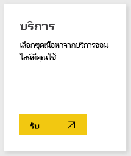
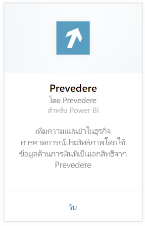
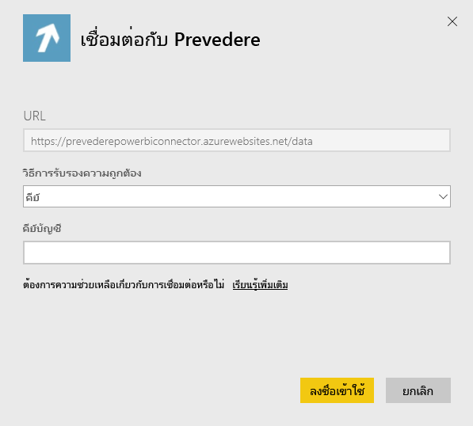
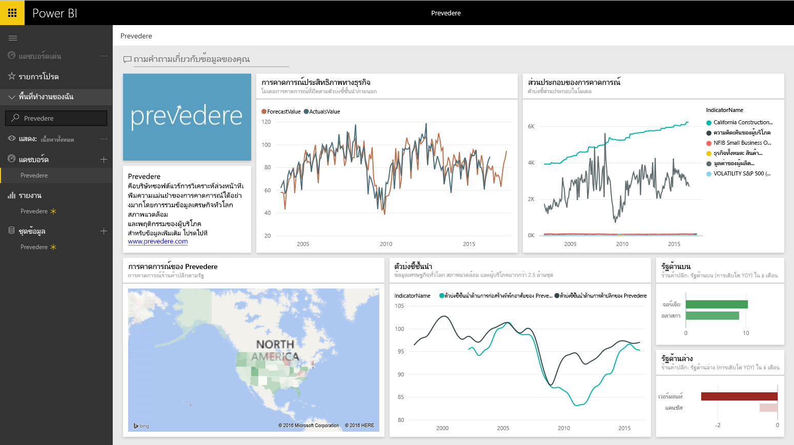

# เชื่อมต่อกับ Prevedere ด้วย Power BI
เข้าถึงข้อมูลทางการเงินที่เฉพาะและสำคัญ เพื่อให้มั่นใจและมุ่งขับเคลื่อนธุรกิจของคุณไปข้างหน้า

เชื่อมต่อกับ[ชุดเนื้อหา Prevedere](https://app.powerbi.com/getdata/services/prevedere)สำหรับ Power BI

>[!NOTE]
>ถ้าคุณไม่ใช่ผู้ใช้ที่มีอยู่ Prevedere โปรดใช้[คีย์ตัวอย่าง](https://prevederepowerbiconnector.azurewebsites.net/static/learnmore.html)เพื่อลองใช้

## วิธีการเชื่อมต่อ
1. เลือกปุ่ม**รับข้อมูล**ที่ด้านล่างของพื้นที่นำทางด้านซ้ายมือ
   
   
2. ในกล่อง**บริการ** เลือก**รับ**
   
   
3. เลือก**Prevedere**แล้วเลือก**รับ**
   
   
4. สำหรับ**วิธีการรับรองตัวตน**เลือก**คีย์**และใส Prevedere API key ของคุณ
   
    
5. เลือก**ลงชื่อเข้าใช้**เพื่อเริ่มกระบวนการนำเข้า เมื่อเสร็จสิ้น แดชบอร์ดใหม่ รายงาน และแบบจำลองจะปรากฏในบานหน้าต่างนำทาง เลือกแดชบอร์ดเพื่อดูข้อมูลที่นำเข้าของคุณ
   
     

**ฉันต้องทำอะไรตอนนี้**

* ลอง[ถามคำถามในกล่อง Q&A](consumer/end-user-q-and-a.md)ที่ด้านบนของแดชบอร์ด
* [เปลี่ยนไทล์](service-dashboard-edit-tile.md)ในแดชบอร์ด
* [เลือกไทล์](consumer/end-user-tiles.md)เพื่อเปิดรายงานด้านใน
* แม้ว่าชุดข้อมูลของคุณจะถูกกำหนดให้รีเฟรชรายวัน แต่คุณสามารถเปลี่ยนกำหนดการรีเฟรช หรือลองรีเฟรชตามความต้องการได้โดยใช้**รีเฟรชเดี๋ยวนี้**

## มีอะไรรวมอยู่บ้าง
ชุดเนื้อหารับข้อมูลเชิงลึกเกี่ยวกับการคาดการณ์การขายปลีก แบบจำลองการคาดการณ์ ตัวบ่งชี้นำ และอื่น ๆของคุณ

## ความต้องการของระบบ
ชุดเนื้อหานี้จำเป็นต้องมีการเข้าถึงคีย์ Prevedere API หรือแป้นตัวอย่าง (ดูด้านล่าง)

## การค้นหาพารามิเตอร์

ลูกค้าที่มีอยู่สามารถเข้าถึงข้อมูลของพวกเขาโดยใช้คีย์ API ของพวกเขา ถ้าคุณยังไม่ได้เป็นลูกค้า คุณสามารถดูตัวอย่างของข้อมูลและการวิเคราะห์ที่ใช้ใน[คีย์ตัวอย่าง](https://prevederepowerbiconnector.azurewebsites.net/static/learnmore.html)ได้

## การแก้ไขปัญหา
อาจใช้เวลาสักครู่ในการโหลดข้อมูล โดยขึ้นอยู่กับขนาดตัวอย่างของคุณ

## ขั้นตอนถัดไป
[เริ่มต้นใช้งานใน Power BI](service-get-started.md)

[รับข้อมูลใน Power BI](service-get-data.md)

