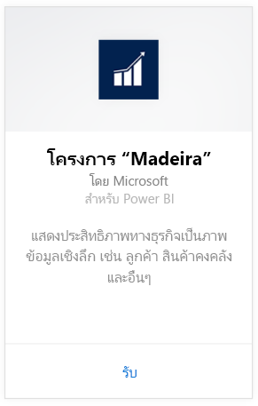
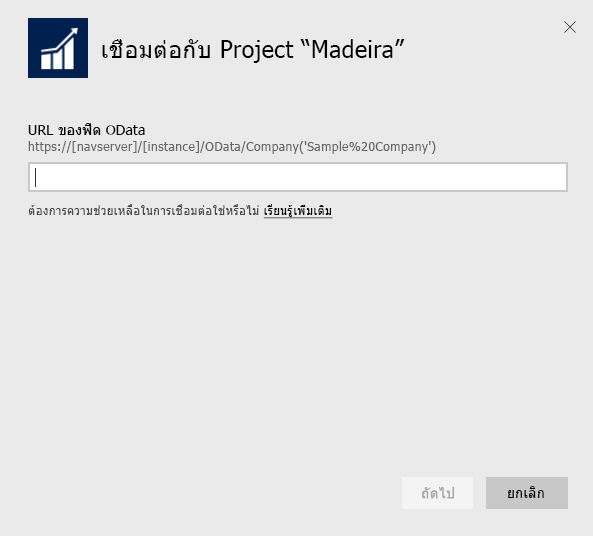
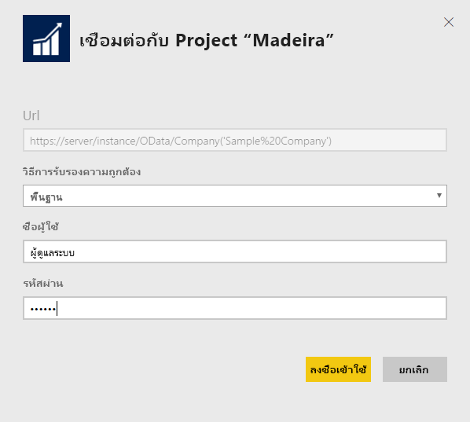
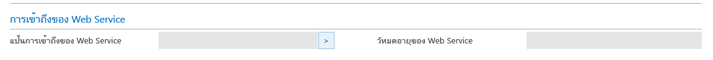
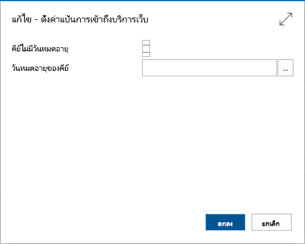
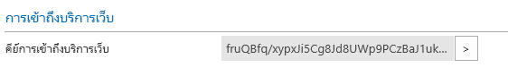

# เชื่อมต่อกับ Project Madeira ด้วย Power BI
รับข้อมูลเชิงลึกลงในโครงการ "Madeira"ของคุณ ข้อมูลเป็นเรื่องง่ายด้วย Power BI และแพคเนื้อหาโครงการ "Madeira" Power BI ดึงข้อมูลของคุณ ทั้งยอดขายและข้อมูลทางการเงิน จากนั้นสร้างแดชบอร์ดแบบคิดนอกกรอบและรายงานที่ยึดตามข้อมูลนั้น
เชื่อมต่อไปยังโครงการ "Madeira" สำหรับ Power BI หรืออ่านเพิ่มเติมเกี่ยวกับโครงการ "Madeira" รวมกับ Power BI

>[!NOTE]
>ชุดเนื้อหานี้จำเป็นต้องอนุญาตให้ไปยังตารางที่จะดึงข้อมูลจาก ในกรณีนี้ข้อมูลยอดขายและข้อมูลทางเงิน รายละเอียดเพิ่มเติมเกี่ยวกับข้อกำหนด[ด้านล่าง](#Requirements)

เชื่อมต่อไปยัง[ชุดเนื้อหา Project "Madeira" Analytics ](https://app.powerbi.com/getdata/services/project-madeira)สำหรับ Power BI

## วิธีการเชื่อมต่อ
1. เลือกปุ่ม**รับข้อมูล**ที่ด้านล่างของพื้นที่นำทางด้านซ้ายมือ  
    
2. ในกล่อง**บริการ** เลือก**รับ**  
    
3. เลือก**โครงการ "Madeira"** แล้วเลือก**รับ**  
    
4. เมื่อไดถูกถามให้ใส่ URL โครงการ "Madeira" ของคุณ URL ต้องอยู่ในรูปแบบต่อไปนี้เท่านั้น <https://mycronusus.projectmadeira.com:7048/NAV/OData/Company('CRONUS%20US>') ที่มีชื่อโครงการ “Madeira”ชื่อบริษัท โปรดสังเกตว่า ไม่มีเครื่องหมายทับต่อที่ส่วนท้าย และการเชื่อมต่อจะต้องเป็น https ดูรายละเอียดในการค้นหา URL นี้[ด้านล่าง](#FindingParams)  
   
    
5. เมื่อได้รับการถาม ให้เลือก Basic เป็นวิธีการรับรองตัวตน ให้ใส่โครงการ "Madeira" ของคุณ อีเมลเป็นชื่อผู้ใช้ และจากนั้น ป้อน access key บริการเว็บสำหรับบัญชีโครงการ "Madeira" ของคุณเป็นรหัสผ่าน ถ้าคุณลงชื่อเข้าใช้ไปยังโครงการ "Madeira" ในเบราว์เซอร์ของคุณแล้ว คุณอาจไม่ถูกถามข้อมูลประจำตัว ดูรายละเอียดในการสร้าง access key นี้[ด้านล่าง](#FindingParams)  
   
    >[!NOTE]
    >คุณต้องเป็นผู้ใช้ขั้นสูงในโครงการ "Madeira"
   
   
6. เมื่อเชื่อมต่อแล้ว แดชบอร์ด รายงาน และชุดข้อมูลจะโหลดโดยอัตโนมัต เมื่อเสร็จสมบูรณแล้ว์ ไทล์จะอัปเดตด้วยข้อมูลจากบัญชีของคุณ  
   
    

**ฉันต้องทำอะไรตอนนี้**

* ลอง[ถามคำถามในกล่อง Q&A](power-bi-q-and-a.md)ที่ด้านบนของแดชบอร์ด
* [เปลี่ยนไทล์](service-dashboard-edit-tile.md)ในแดชบอร์ด
* [เลือกไทล์](service-dashboard-tiles.md)เพื่อเปิดรายงานด้านใน
* ถึงแม้ว่าชุดข้อมูลของคุณถูกกำหนดให้รีเฟรซรายวัน คุณสามารถเปลี่ยนแปลงกำหนดเวลารีเฟรช หรือลองรีเฟรชตามความต้องการ โดยใช้**รีเฟรชทันที**

## ความต้องการของระบบ
เพื่อนำเข้าข้อมูลโครงการ "Madeira" ของคุณ ลงใน Power BI คุณจำเป็นต้องมีสิทธิ์ในตารางการขายและข้อมูลทางการเงินที่ข้อมูลถูกนำมา ตารางทั้งหมด (ตรวจตัวพิมพ์ใหญ่พิมพ์เล็ก) จำเป็นสำหรับชุดเนื้อหานี้ประกอบด้วย  
 
    ´´´ 
    - ItemSalesAndProfit  
    - ItemSalesByCustomer  
    - powerbifinance  
    - SalesDashboard  
    - SalesOpportunities  
    - SalesOrdersBySalesPerson  
    - TopCustomerOverview  
    ´´´ 

## การค้นหาพารามิเตอร์
**รับ URL ขวา**วิธีง่ายๆ ในการขอรับ URL นี้คือในโครงการ "Madeira" ไปที่ Web Services ค้นหา powerbifinance Web Services และคัดลอก URL ของ Odata (คลิกขวาใช้และคัดลอชาร์ตคัต) แล้วบันทึกไฟล์ " / powerbifinance..." ส่วนหนึ่งจากสตริง URL

**Web Service Access Keys** เพื่อที่ใช้ข้อมูลจากโครงการ "Madeira" คุณจะต้องสร้างคีย์การเข้าถึง Web Service สำหรับบัญชีผู้ใช้ของคุณ ในโครงการ "Madeira" ให้ค้นหาหน้าผู้ใช้ และจากนั้น เปิดการ์ดหรับบัญชีผู้ใช้ของคุณ ที่นี่คุณสามารถสร้าง access key เข้า web services ใหม่ และคัดลอกไปยังเขตข้อมูล Password ในหน้าการเชื่อมต่อของ Power BI ได้

เมื่อคุณเริ่มต้นใช้งาน access key เข้า web services คุณจะต้องใช้งานแบบไปข้างหน้า ดังนั้นเลือกตกลงที่ข้อความที่ปรากฏขึ้น
เมื่อสร้างคีย์ที่คุณสามารถเลือกว่าจะหมดอายุในวันที่เฉพาะเจาะจงหรือไม่

เมื่อคุณเลือกตกลง คีย์ที่สร้างดังนั้นคุณสามารถคัดลอการใหเขตข้อมูล Password ในหน้าการเชื่อมต่อ Power BI

## การแก้ไขปัญหา
แดชบอร์ด Power BI ขึ้นกับ web services ที่เผยแพร่แล้วที่จะแสดงอยู่ด้านบน และจะแสดงข้อมูลจากบริษัทสาธิตหรือบริษัทของคุณเองถ้าคุณนำเข้าข้อมูลจากโซลูชันการเงินปัจจุบันของคุณ อย่างไรก็ตาม ถ้ามีบางอย่างไม่ถูกต้อง ส่วนนี้มีการแก้ไขปัญหาชั่วคราวสำหรับปัญหาทั่วไปมากที่สุด

**“ไม่สามารถตรวจสอบความถูกต้องของพารามิเตอร์ โปรดตรวจสอบให้แน่ใจว่าพารามิเตอร์ทั้งหมดถูกต้อง”**

ถ้าคุณเห็นข้อผิดพลาดนี้หลังจากที่คุณใส่ URL โครงการ "Madeira" ของคุณ ตรวจสอบให้แน่ใจว่าจะพอใจกับข้อกำหนดต่อไปนี้  

- ให้ใช้ URL ตามนี้อย่างถูกต้อง https://*mycronusus*.projectmadeira.com:7048/NAV/OData/Company('<em>CRONUS%20US</em>')  
- ลบข้อความใดๆ หลังชื่อบริษัทในวงเล็บ  
- ตรวจสอบให้แน่ใจว่าไม่มีที่ส่วนท้ายของ URL หลังสแลช  
- ตรวจสอบให้แน่ใจว่า URL ถูกใช้เชื่อมต่อแบบปลอดภัยตามที่ระบุ โดยเริ่มต้น URL ที่มี https  

**"การเข้าสู่ระบบล้มเหลว"** ถ้าคุณได้รับข้อผิดพลาด "การเข้าสู่ระบบล้มเหลว" เมื่อคุณเข้าสู่ระบบไปยังแดชบอร์ด โดยใช้ข้อมูลประจำตัวโครงการ "Madeira" ของคุณ จากนั้นอาจมีสาเหตุของปัญหาต่อไปนี้  

   - บัญชีผู้ใช้คุณกำลังใช้ไม่ได้รับอนุญาตในการอ่านข้อมูลโครงการ "Madeira" จากบัญชีของคุณ ตรวจสอบบัญชีผู้ใช้ของคุณในโครงการ "Madeira" และตรวจสอบให้แน่ใจว่าคุณได้ใช้ access key ของ web service เป็นรหัสผ่าน และจากนั้นลองอีกครั้ง  
   - อินสแตนซ์โครงการ "Madeira" ที่คุณกำลังพยายามจะเชื่อมต่อที่ไม่มีไปยังใบรับรอง SSL ในกรณีนี้ คุณจะเห็นข้อผิดพลาดที่ละเอียดยิ่งขึ้น ("ไม่สามารถสร้างความสัมพันธ์ SSL ที่เชื่อถือได้") โปรดทราบว่าใบรับรองที่เซ็นชื่อด้วยตนเองไม่ได้รับการรองรับ  

**"Oops"** ถ้าคุณเห็นกล่องโต้ตอบข้อผิดพลาดการ "Oops" หลังจากที่คุณเลื่อนผ่านกล่องโต้ตอบการรับรองตัวตน สิ่งนี้เกิดบ่อยที่สุดจากปัญหาการเชื่อมต่อไปยังข้อมูลสำหรับชุดเนื้อหา ตรวจสอบว่า URL เป็นไปตามแบบที่ระบุไว้ก่อนหน้านี้  
    https://*mycronusus*.projectmadeira.com:7048/NAV/OData/Company ('<em>CRONUS % 20US</em>')

ข้อผิดพลาดทั่วไปคือการระบุ URL แบบเต็มสำหรับ web service บางตัว  
    https://*mycronusus*.projectmadeira.com:7048/NAV/OData/Company('<em>CRONUS%20US</em>')/powerbifinance

หรือคุณอาจลืมเมื่อต้องระบุชื่อบริษัท   
    https://<em>mycronusus</em>.projectmadeira.com:7048/NAV/OData/

## ขั้นตอนถัดไป
[Power BI คืออะไร](power-bi-overview.md)

[Power BI แนวคิดพื้นฐาน](service-basic-concepts.md)

