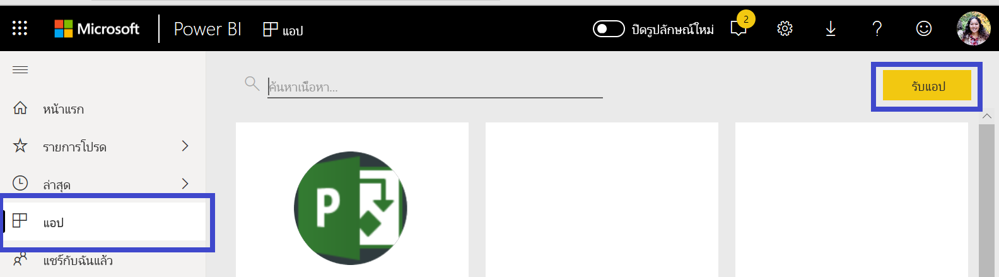
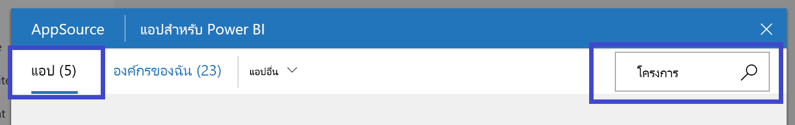
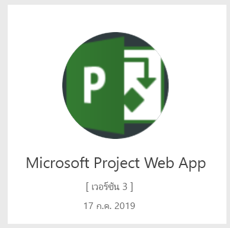
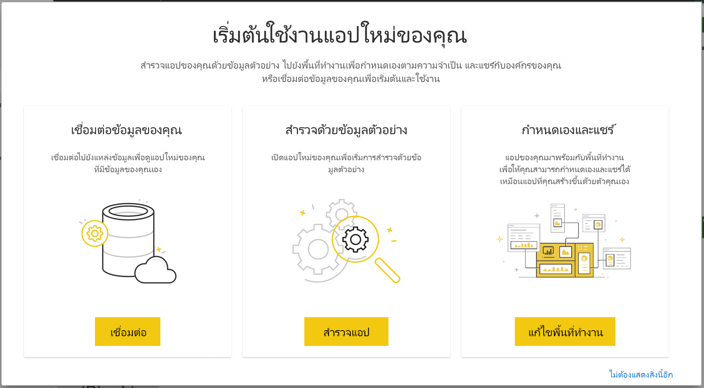

# เชื่อมต่อไปยัง Project Web App ด้วย Power BI
Microsoft Project Web App เป็นโซลูชันออนไลน์ที่ยืดหยุ่นสำหรับการจัดการพอร์ตโครงการ (PPM) และงานประจำวัน Project Web App ช่วยให้องค์กรสามารถเริ่มต้นและจัดลำดับความสำคัญการลงทุนในพอร์ตโครงการ และส่งมอบมูลค่าทางธุรกิจตามที่ต้องการได้ Project Web App Template App สำหรับ Power BI ช่วยให้คุณสามารถปลดล็อคข้อมูลเชิงลึกจาก Project Web App เพื่อจัดการโครงการ พอร์ตโครงการ และทรัพยากร

เชื่อมต่อไปยัง [Project Web App Template App](https://appsource.microsoft.com/product/power-bi/pbi_msprojectonline.pbi-microsoftprojectwebapp) สำหรับ Power BI

## วิธีการเชื่อมต่อ

1. เลือก**แอป**ในบานหน้าต่างนำทาง > เลือก**รับแอป**ในมุมบนขวา

    

2. ในกล่อง**บริการ** เลือก**รับ**
   
   
3. ใน AppSource เลือกแท็บ **Apps** และค้นหา/เลือก**Microsoft Project Web App**
   
4. คุณจะได้รับข้อความที่บอกว่า - **ติดตั้งแอป Power BI นี้หรือไม่** เลือก**ติดตั้ง** 

   
5. ในบานหน้าต่าง**แอป** ให้เลือกไทล์ **Microsoft Project Web App** 
   
   
6. ใน**เริ่มต้นใช้งานแอปใหม่ของคุณ** ให้เลือก**เชื่อมต่อข้อมูล**
   
   
7. ในกล่องข้อความ **Project Web App URL** ใส่ URL สำหรับ Project Web App (PWA) ที่คุณต้องการเชื่อมต่อ  หมายเหตุ ส่วนนี้อาจแตกต่างจากตัวอย่างดังกล่าวถ้าคุณมีโดเมนแบบกำหนดเอง ในกล่องข้อความ**PWA ไซต์ภาษา**พิมพ์หมายเลขที่แสดงภาษาของไซต์ PWA ของคุณ พิมพ์ตัวเลขหลักเดียว '1' สำหรับภาษาอังกฤษ '2' สำหรับภาษาฝรั่งเศส '3' สำหรับภาษาเยอรมัน '4' สำหรับภาษาโปรตุเกส (บราซิล), ' 5' สำหรับภาษาโปรตุเกส (โปรตุเกส) และ ' 6' สำหรับภาษาสเปน 
   
   
8. สำหรับวิธีการรับรองความถูกต้อง ให้เลือก **oAuth2** \> **ลงชื่อเข้าใช้** เมื่อได้รับข้อความปรากฏขึ้น ให้ใส่ข้อมูลประจำตัวของ Project Web App และทำตามกระบวนการรับรองความถูกต้อง

    > [!NOTE]
    > คุณจำเป็นต้องมีสิทธิ์การใช้งานสำหรับ Portfolio Viewer (ผู้ดูพอร์ตโครงการ) Portfolio Manager (ผู้จัดการพอร์ต) หรือ Administrator (ผู้ดูแลระบบ) สำหรับ Project Web App ที่คุณกำลังเชื่อมต่อ

9. คุณจะเห็นการแจ้งเตือนที่ระบุว่า กำลังโหลดข้อมูลของคุณ ขึ้นอยู่กับขนาดบัญชีของคุณ ซึ่งอาจใช้เวลาสักครู่ หลังจากที่ Power BI นำเข้าข้อมูลแล้ว คุณจะเห็นเนื้อหาของพื้นที่ทำงานใหม่ของคุณ คุณอาจจำเป็นต้องรีเฟรชชุดข้อมูลเพื่อรับการอัปเดตล่าสุด 

    หลังจากที่ Power BI นำเข้าข้อมูลแล้ว คุณจะเห็นรายงานที่มี 13 หน้า และชุดข้อมูลในบานหน้าต่างนำทาง 

10. หลังจากรายงานของคุณพร้อม ดำเนินการต่อและเริ่มการสำรวจข้อมูล Project Web App! Template App มาพร้อมกับรายงาน 13 หน้าที่เป็นภาพรวมการจัดการพอร์ตโครงการ (6 หน้ารายงาน), ภาพรวมทรัพยากร (5 หน้ารายงาน) และ สถานะของโครงการ (2 หน้ารายงาน) 

    
   
    
   
    

**ฉันต้องทำอะไรตอนนี้**

* แม้ว่าชุดข้อมูลของคุณจะถูกกำหนดให้รีเฟรชรายวัน แต่คุณสามารถเปลี่ยนกำหนดการรีเฟรช หรือลองรีเฟรชตามความต้องการได้โดยใช้**รีเฟรชเดี๋ยวนี้**

**ขยาย Template App**

ดาวน์โหลด[GitHub PBIT ไฟล์](https://github.com/OfficeDev/Project-Power-BI-Content-Packs)เมื่อต้องการกำหนดค่า และปรับปรุงชุดเนื้อหา

## ขั้นตอนถัดไป
[เริ่มต้นใช้งานใน Power BI](service-get-started.md)

[รับข้อมูลใน Power BI](service-get-data.md)

