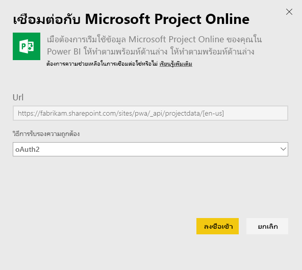
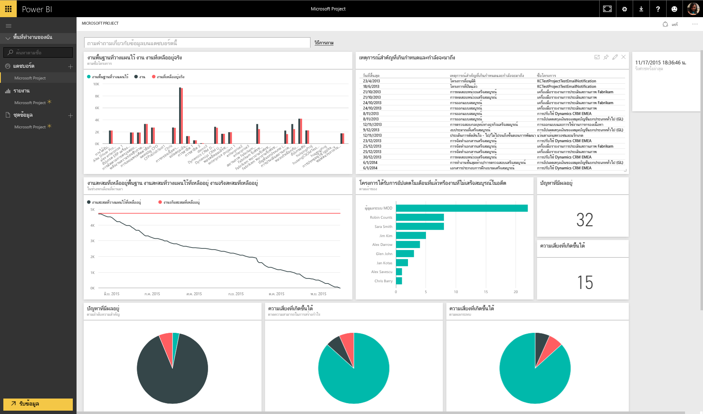

# เชื่อมต่อกับ Project Online ด้วย Power BI
Microsoft Project Online เป็นโซลูชันออนไลน์ที่ยืดหยุ่นสำหรับการจัดการพอร์ตโครงการ (Project Portfolio Management: PPM) และงานประจำวัน Project Online ช่วยให้องค์กรสามารถเริ่มต้นและจัดลำดับความสำคัญการลงทุนในพอร์ตโครงการ และส่งมอบมูลค่าทางธุรกิจตามที่ต้องการได้ ชุดเนื้อหา Project Online สำหรับ Power BI ช่วยให้คุณสามารถสำรวจข้อมูลโครงการของคุณด้วยเมตริกแบบใช้งานทันที เช่น สถานะพอร์ตและการปฏิบัติตามกฎระเบียบของโครงการ

เชื่อมต่อไปยัง[ชุดเนื้อหา Project Online](https://app.powerbi.com/getdata/services/project-online)สำหรับ Power BI

## วิธีการเชื่อมต่อ
1. เลือกปุ่ม**รับข้อมูล**ที่ด้านล่างของพื้นที่นำทางด้านซ้ายมือ
   
    
2. ในกล่อง**บริการ** เลือก**รับ**
   
   
3. เลือก**Microsoft Project Online** \> **รับ**
   
   
4. ในกล่องข้อความ**Project Web App URL** ใส่ URL สำหรับ Project Web Add (PWA) ที่คุณต้องการเชื่อมต่อ จากนั้นคลิก**ถัดไป** หมายเหตุ ส่วนนี้อาจแตกต่างจากตัวอย่างดังกล่าวถ้าคุณมีโดเมนแบบกำหนดเอง
   
    
5. สำหรับวิธีการรับรองความถูกต้อง ให้เลือก **oAuth2** \> **ลงชื่อเข้าใช้** เมื่อได้รับข้อความปรากฏขึ้น ให้ใส่ข้อมูลประจำตัวของ Project Online และทำตามกระบวนการรับรองความถูกต้อง
   
    
    
โปรดทราบว่าคุณจำเป็นต้องมีสิทธิ์การใช้งานสำหรับ Portfolio Viewer (ผู้ดูพอร์ต) Portfolio Manager (ผู้จัดการพอร์ต) หรือ Administrator (ผู้ดูแลระบบ) สำหรับ Project Web App ที่คุณกำลังเชื่อมต่อ

6. คุณจะเห็นการแจ้งเตือนที่ระบุว่า กำลังโหลดข้อมูลของคุณ ขึ้นอยู่กับขนาดบัญชีของคุณ ซึ่งอาจใช้เวลาสักครู่ หลังจาก Power BI นำเข้าข้อมูล คุณจะเห็นแดชบอร์ด รายงาน และชุดข้อมูลใหม่ในแผงนำทางด้านซ้าย นี่คือแดชบอร์ดตามเริ่มต้นที่ Power BI สร้างขึ้นเพื่อแสดงข้อมูลของคุณ คุณสามารถปรับเปลี่ยนแดชบอร์ดนี้เพื่อแสดงข้อมูลของคุณด้วยวิธีใดก็ตามที่คุณต้องการ
   
   

**ฉันต้องทำอะไรตอนนี้**

* ลอง[ถามคำถามในกล่อง Q&A](power-bi-q-and-a.md)ที่ด้านบนของแดชบอร์ด
* [เปลี่ยนไทล์](service-dashboard-edit-tile.md)ในแดชบอร์ด
* [เลือกไทล์](service-dashboard-tiles.md)เพื่อเปิดรายงานด้านใน
* ถึงแม้ว่าชุดข้อมูลของคุณถูกกำหนดให้รีเฟรซรายวัน คุณสามารถเปลี่ยนแปลงกำหนดเวลารีเฟรช หรือลองรีเฟรชตามความต้องการ โดยใช้**รีเฟรชทันที**

## ขั้นตอนถัดไป
[เริ่มต้นใช้งานใน Power BI](service-get-started.md)

[รับข้อมูลใน Power BI](service-get-data.md)

