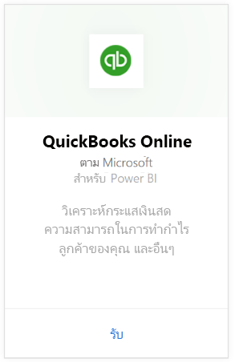
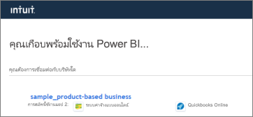
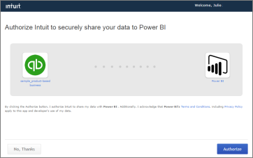
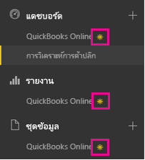
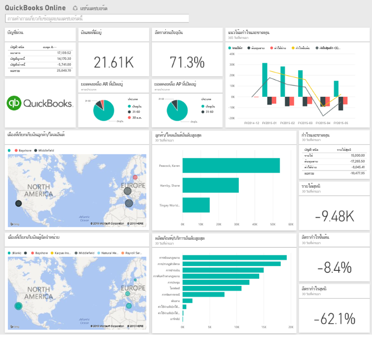
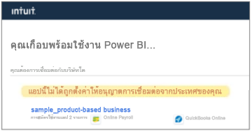

# เชื่อมต่อกับ QuickBooks Online ด้วย Power BI
เมื่อคุณเชื่อมต่อกับข้อมูลของคุณ QuickBooks Online จาก Power BI คุณจะได้รับแดชบอร์ด Power BI และรายงาน Power BI ที่มีข้อมูลเชิงลึกเกี่ยวกับกระแสเงินสดธุรกิจของคุณ กำไรจาก ลูกค้า และอื่น ๆ ทันที ใช้แดชบอร์ดและรายงานอย่างที่มันเป็น หรือปรับแต่งเพื่อไฮไลท์ข้อมูลที่คุณสนใจมากที่สุด ข้อมูลถูกรีเฟรชโดยอัตโนมัติวันละครั้ง

เชื่อมต่อไปยัง[ชุดเนื้อหา QuickBooks Online](https://dxt.powerbi.com/getdata/services/quickbooks-online)สำหรับ Power BI

>[!NOTE]
>เพื่อนำเข้าข้อมูล QuickBooks Online ของคุณไปยัง Power BI คุณจำเป็นต้องเป็นผู้ดูแลระบบของบัญชี QuickBooks Online ของคุณและลงชื่อเข้าใช้ด้วยข้อมูลประจำตัวแบบบัญชีผู้ดูแลระบบของคุณ

## วิธีการเชื่อมต่อ
1. เลือกปุ่ม**รับข้อมูล**ที่ด้านล่างของพื้นที่นำทางด้านซ้ายมือ
   
    
2. ในกล่อง**บริการ** เลือก**รับ**
   
    
3. เลือก**QuickBooks Online**แล้วเลือก**รับ**
   
   
4. สำหรับ **วิธีการรับรองตัวตน** ให้เลือก **oAuth2**ลงชื่อเข้าใช้ 
5. เมื่อถูกถาม ให้ใส่ข้อมูลประจำตัว QuickBooks Online ของคุณและทำตามกระบวนการรับรองตัวตนของ QuickBooks Online ถ้าคุณลงชื่อเข้าใช้ QuickBooks อยู่แล้วในเบราว์เซอร์ของคุณ คุณอาจไม่ได้รับข้อความให้ใส่ข้อมูลประจำตัว
   >[!NOTE]
   >คุณจำเป็นต้องมีข้อมูลประจำตัวแบบผู้ดูแลระบบของบัญชี QuickBooks ของคุณ
6. เลือกบริษัทที่คุณต้องการเชื่อมต่อกับ Power BI ในหน้าจอถัดไป
   
   
7. เลือก**อนุญาต**ในหน้าจอถัดไปเพื่อเริ่มกระบวนการนำเข้า ซึ่งอาจใช้เวลาสักครู่ ขึ้นอยู่กับขนาดของข้อมูลของบริษัทของคุณ 
   
   
   
   หลังจาก Power BI นำเข้าข้อมูล คุณจะเห็นแดชบอร์ด รายงาน และชุดข้อมูลใหม่ในแผงนำทางด้านซ้าย รายการใหม่จะถูกทำเครื่องหมายด้วยเครื่องหมายดอกจันสีเหลือง\*
   
   
8. เลือกแดชบอร์ QuickBooks Online นี่คือแดชบอร์ด Power BI ที่สร้างขึ้นโดยอัตโนมัติเมื่อต้องแสดงข้อมูลนำเข้าของคุณ คุณสามารถปรับเปลี่ยนแดชบอร์ดนี้เพื่อแสดงข้อมูลด้วยวิธีใดก็ตามที่คุณต้องการ 
   
   

**ฉันต้องทำอะไรตอนนี้**

* ลอง[ถามคำถามในกล่อง Q&A](power-bi-q-and-a.md)ที่ด้านบนของแดชบอร์ด
* [เปลี่ยนไทล์](service-dashboard-edit-tile.md)ในแดชบอร์ด
* [เลือกไทล์](service-dashboard-tiles.md)เพื่อเปิดรายงานด้านใน
* ถึงแม้ว่าชุดข้อมูลของคุณถูกกำหนดให้รีเฟรซรายวัน คุณสามารถเปลี่ยนแปลงกำหนดเวลารีเฟรช หรือลองรีเฟรชตามความต้องการ โดยใช้**รีเฟรชทันที**

## การแก้ไขปัญหา
**ขออภัย! มีข้อผิดพลาดเกิดขึ้น**

ถ้าคุณจะได้รับข้อความนี้หลังจากเลือก**อนุญาต**:

ขออภัย! มีข้อผิดพลาดเกิดขึ้น โปรดปิดหน้าต่างนี้และลองอีกครั้ง

ผู้ใช้อื่นสำหรับบริษัทนี้ได้สมัครใช้งานแอปพลิเคชันเรียบร้อยแล้ว โปรดติดต่อ [admin email] เพื่อเปลี่ยนแปลงการสมัครใช้งานนี้

...ซึ่งหมายความว่า ผู้ดูแลระบบรายอื่นในบริษัทของคุณได้เชื่อมต่อกับข้อมูลบริษัทของคุณด้วย Power BI แล้ว ขอให้ผู้ดูแลระบบแชร์แดชบอร์ดกับคุณ ในปัจจุบัน ผู้ใช้ผู้ดูแลคนเดียวเท่านั้นที่สามารถเชื่อมต่อกับชุดเฉพาะของข้อมูลบริษัทใน QuickBooks Online กับ Power BI หลังจาก Power BI สร้างแดชบอร์ด ผู้ดูแลระบบสามารถแชร์ให้เพื่อนร่วมงานหลายคน ภายในผู้เช่า Power BI เดียวกัน

**แอปนี้ไม่ได้ถูกตั้งค่าให้อนุญาตการเชื่อมต่อจากประเทศของคุณ**

ในขณะนี้ Power BI สนับสนุนเฉพาะรุ่นสำหรับสหรัฐอเมริกาของ QuickBooks Online 

## ขั้นตอนถัดไป
[เริ่มต้นใช้งาน Power BI](service-get-started.md)

[Power BI แนวคิดพื้นฐาน](service-basic-concepts.md)

