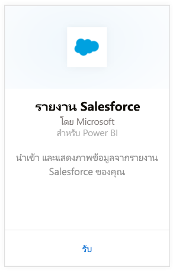
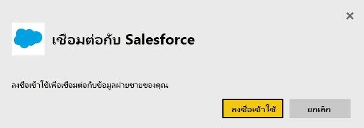
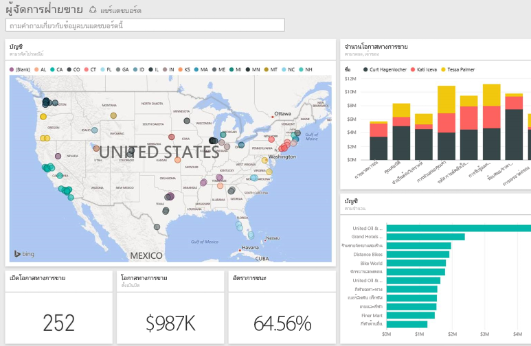

# เชื่อมต่อกับ Salesforce ด้วย Power BI
ด้วย Power BI คุณสามารถเชื่อมต่อกับบัญชี Salesforce.com ของคุณได้อย่างง่ายดาย สร้างการเชื่อมต่อนี้เพื่อดึงข้อมูลของคุณและมีแดชบอร์ด และรายงานที่เกี่ยวข้องที่ยึดตามข้อมูลของคุณโดยอัตโนมัติ

เชื่อมต่อกับ[ชุดเนื้อหา Salesforce](https://app.powerbi.com/getdata/services/salesforce)สำหรับ Power BI หรืออ่านเพิ่มเติมเกี่ยวกับการ[รวม Salesforce](https://powerbi.microsoft.com/integrations/salesforce)ด้วย Power BI

## วิธีการเชื่อมต่อ
1. เลือกปุ่ม**รับข้อมูล**ที่ด้านล่างของพื้นที่นำทางด้านซ้ายมือ
   
    
2. ในกล่อง**บริการ** เลือก**รับ**
   
    
3. คลิก**Salesforce**และเลือก**รับ**  
   
   
4. เลือก**ลงชื่อเข้าใช้**เพื่อเริ่มต้นขั้นตอนการเข้าสู่ระบบ
   
    
5. เมื่อมีข้อความถาม ให้ใส่ข้อมูลประจำตัวของ Salesforce คลิก**อนุญาต**เพื่อให้ Power BI สามารถเข้าถึงข้อมูล Salesforce พื้นฐานและข้อมูลของคุณ
   
   
6. กำหนดค่าสิ่งที่คุณต้องการนำเข้าลงใน Power BI โดยใช้ตัวเลือกรายการแบบดร๊อปดาวน์
   
   * **แดชบอร์ด**
     
     เลือกแดชบอร์ดที่กำหนดไว้ล่วงหน้าโดยยึดตาม persona (เช่น**ผู้จัดการฝ่ายขาย**) แดชบอร์ดเหล่านี้นำชุดข้อมูลมาตรฐานเฉพาะจาก Salesforce และจะไม่รวมเขตข้อมูลแบบกำหนดเอง
     
     
   * **รายงาน**
     
     เลือกอย่างน้อยหนึ่งรายงานแบบกำหนดเองจากบัญชี Salesforce ของคุณ รายงานเหล่านี้จะตรงกับมุมมองของคุณใน Salesforce และสามารถรวมข้อมูลจากเขตข้อมูลแบบกำหนดเองหรือวัตถุ
     
     
     
     ถ้าคุณไม่เห็นรายงานใดๆ ให้เพิ่มหรือสร้าบัญชี Salesforce ของคุณ แล้วลองเชื่อมต่ออีกครั้ง
7. คลิก **เชื่อมต่อ** เพื่อเริ่มกระบวนการนำเข้า ในระหว่างการนำเข้า คุณเห็นการแจ้งเตือนที่แสดงว่าการนำเข้ากำลังดำเนินการอยู่ เมื่อการนำเข้าเสร็จสมบูรณ์ คุณจะเห็นแดชบอร์ด รายงาน และชุดข้อมูลสำหรับข้อมูล Salesforce ของที่คุณแสดงอยู่ในบานหน้าต่างนำทางทางด้านซ้าย
   
   

คุณสามารถปรับเปลี่ยนแดชบอร์ดนี้เพื่อแสดงข้อมูลของคุณด้วยวิธีใดก็ตามที่คุณต้องการ คุณสามารถถามคำถาม Q&A หรือคลิกที่ไทล์เพื่อ[เปิดรายงานด้านใน](service-dashboard-tiles.md)และ[เปลี่ยนไทล์](service-dashboard-edit-tile.md)ในแดชบอร์ด

**ฉันต้องทำอะไรตอนนี้**

* ลอง[ถามคำถามในกล่อง Q&A](power-bi-q-and-a.md)ที่ด้านบนของแดชบอร์ด
* [เปลี่ยนไทล์](service-dashboard-edit-tile.md)ในแดชบอร์ด
* [เลือกไทล์](service-dashboard-tiles.md)เพื่อเปิดรายงานด้านใน
* ถึงแม้ว่าชุดข้อมูลของคุณถูกกำหนดให้รีเฟรซรายวัน คุณสามารถเปลี่ยนแปลงกำหนดเวลารีเฟรช หรือลองรีเฟรชตามความต้องการ โดยใช้**รีเฟรชทันที**

## ข้อกำหนดของระบบและข้อควรพิจารณา
- เชื่อมต่อกับบัญชีผลิตภัณฑ์ Salesforce ที่สามารถเข้าถึง API ที่เปิดใช้งาน
- สิทธิ์ที่มอบให้กับแอป Power BI ในระหว่างการเข้าสู่ระบบ
- บัญชีมีการเรียกใช้ API เพียงพอที่สามารถใช้งานดึงและรีเฟรชข้อมูล
- โทเค็นรับรองตัวตนที่จำเป็นกับการรีเฟรช ให้ทำให้แน่ใจว่า คุณมีชุดข้อมูล 5 ชุดหรือน้อยกว่า ชุดข้อมูล Salesforce ที่ถูกนำเข้า ด้วยที่ Salesforce มีขีดจำกัดของโทเค็นการรับรองความถูกต้อง 5 ตัวสำหรับแอปพลิเคชัน
- Salesforce Reports API มีข้อจำกัดที่สนับสนุนสูงสุด 2,000 แถวข้อมูล

## การแก้ไขปัญหา
ถ้าคุณพบข้อผิดพลาดใดๆ โปรดตรวจสอบความต้องการด้านบน โปรดทราบว่าความสามารถในการเข้าสู่ระบบแบบโดเมนแบบกำหนดเองหรือแบบ sandbox ยังไม่รองรับในขณะนี้

### ข้อความ “ไม่สามารถเชื่อมต่อกับเซิร์ฟเวอร์ระยะไกลได้”

ถ้าคุณได้รับข้อความ "ไม่สามารถเชื่อมต่อกับเซิร์ฟเวอร์ระยะไกล" เมื่อพยายามเชื่อมต่อกับบัญชี Salesforce ของคุณ ให้ดูโซลูชันนี้บนฟอรั่ม Outsystems: [ข้อความข้อผิดพลาดการลงชื่อเข้าระบบตัวเชื่อมต่อ Salesforce: ไม่สามารถเชื่อมต่อกับเซิร์ฟเวอร์ระยะไกลได้](https://www.outsystems.com/forums/Forum_TopicView.aspx?TopicId=17674&TopicName=log-in-error-message-unable-to-connect-to-the-remote-server&)

## ขั้นตอนถัดไป
[เริ่มต้นใช้งาน Power BI](service-get-started.md)

[รับข้อมูล](service-get-data.md)

