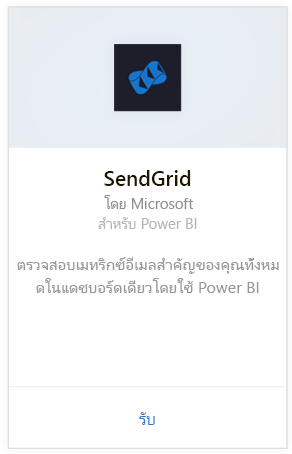
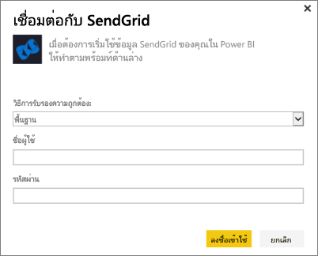
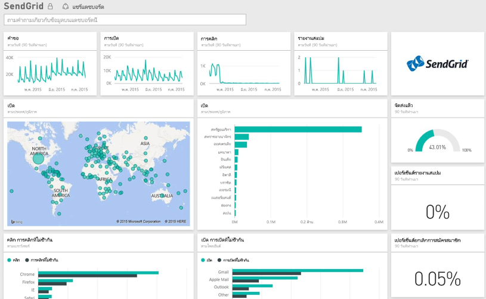

# เชื่อมต่อกับ SendGrid ด้วย Power BI
ชุดเนื้อหา Power BI สำหรับ SendGrid ช่วยให้คุณสามารถแยกข้อมูลเชิงลึกและสถิติจากบัญชี SendGrid ของคุณได้ การใช้ชุดเนื้อหา SendGrid ทำให้คุณสามารถมดูสถิติ SendGrid ของคุณในแดชบอร์ดได้

เชื่อมต่อไปยัง[ชุดเนื้อหา SendGrid](https://app.powerbi.com/getdata/services/sendgrid)สำหรับ Power BI

## วิธีการเชื่อมต่อ
1. เลือก**รับข้อมูล**ที่ด้านล่างของแผงนำทางด้านซ้ายมือ
   
    
2. ในกล่อง**บริการ** เลือก**รับ**
   
    
3. เลือกชุดเนื้อหา**SendGrid** และคลิก**รับ**
   
    
4. เมื่อปรากฏข้อความขึ้น ใส่ชื่อผู้ใช้และรหัสผ่าน SendGrid ของคุณ เลือก**ลงชื่อเข้าใช้**
   
   
5. หลังจากที่ Power BI นำเข้าข้อมูลแล้ว คุณจะเห็นแดชบอร์ด รายงาน และชุดข้อมูลใหม่ในแผงนำทางด้านซ้าย พร้อมด้วยข้อมูลสถิติของอีเมลในรอบ 90 วันที่ผ่านมา รายการใหม่จะถูกทำเครื่องหมายด้วย เครื่องหมายดอกจันสีเหลือง\*
   
   

**ฉันต้องทำอะไรต่อ?**

* ลอง[ถามคำถามในกล่องถามตอบ](power-bi-q-and-a.md)ที่ด้านบนของแดชบอร์ด
* [เปลี่ยนไทล์](service-dashboard-edit-tile.md)ในแดชบอร์ด
* [เลือกไทล์](service-dashboard-tiles.md)เพื่อเปิดรายงานพื้นฐาน
* ถึงแม้ว่าชุดข้อมูลของคุณถูกกำหนดให้รีเฟรซรายวัน คุณสามารถเปลี่ยนแปลงกำหนดเวลารีเฟรช หรือลองรีเฟรชตามความต้องการ โดยใช้**รีเฟรชทันที**

## มีอะไรรวมอยู่บ้าง
เมตริกต่อไปนี้จะพร้อมใช้งานในแดชบอร์ด SendGrid:

* สถิติอีเมลโดยรวม - คำขอ จัดส่งแล้ว ส่งกลับ สแปมที่ถูกบล็อก รายงานสแปม และอื่น ๆ
* สถิติอีเมลแยกตามประเภท
* สถิติอีเมลแยกตามภูมิศาสตร์
* สถิติอีเมลแยกตาม ISP
* สถิติอีเมลแยกตามอุปกรณ์ ไคลเอ็นต์ เบราว์เซอร์

## ขั้นตอนถัดไป
[เริ่มต้นใช้งาน Power BI](service-get-started.md)

[รับข้อมูล](service-get-data.md)

