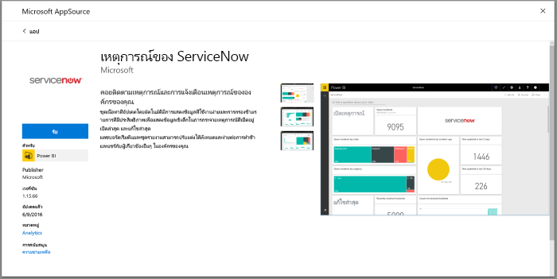
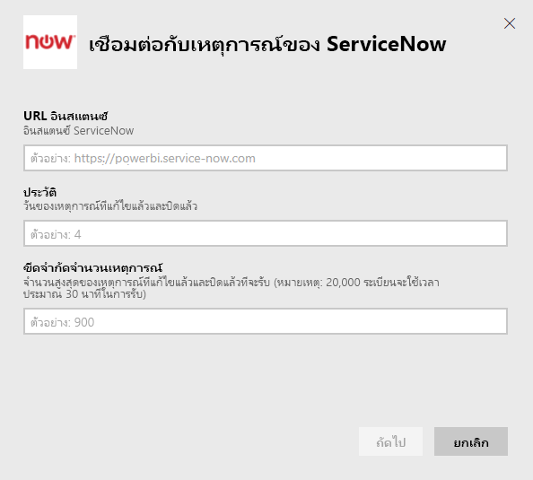
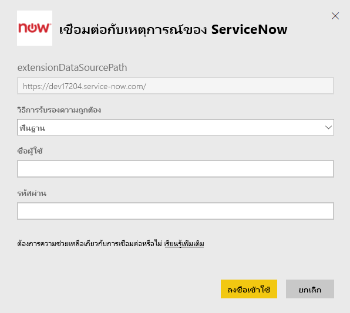
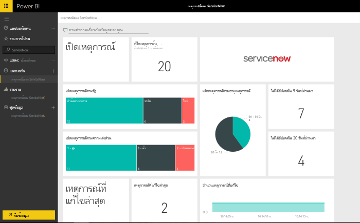

# เชื่อมต่อกับ ServiceNow ด้วย Power BI สำหรับการรายงานปัญหา
ServiceNow นำเสนอหลายผลิตภัณฑ์และการแก้ไขปัญหาที่รวมถึงทางด้านธุรกิจ การดำเนินการ และการจัดการ IT เพื่อปรับปรุงธุรกิจของคุณ ชุดเนื้อหานี้ประกอบด้วยหลายรายงานและข้อมูลเชิงลึกเกี่ยวกับการเปิด การแก้ไขล่าสุด และการปิดเหตุการณ์เมื่อเร็วๆนี้ของคุณ  

เชื่อมต่อกับชุดเนื้อหา Power BI สำหรับ[เหตุการณ์ใน ServiceNow](https://app.powerbi.com/getdata/services/servicenow)

## วิธีการเชื่อมต่อ
1. เลือกปุ่ม**รับข้อมูล**ที่ด้านล่างของพื้นที่นำทางด้านซ้ายมือ
   
    
2. ในกล่อง**บริการ** เลือก**รับ**
   
    
3. เลือก**เหตุการณ์ ServiceNow** \> **รับ**
   
   
4. ใส่ URL ของอินสแตนซ์ ServiceNow ของคุณและช่วงของวัน/รายการในการนำเข้า โปรดทราบว่า ทันทีทีถึงขีดจำกัดหการนำเข้าจะหยุดทันที
   
   
5. เมื่อได้รับการถาม ให้ใส่ข้อมูลประจำตัว ServiceNow **พื้นฐาน**ของคุณ โปรดทราบว่า การลงชื่อเข้าใช้เพียงครั้งเดียวยังไม่รองรับในปัจจุบัน รายละเอียดเพิ่มเติมเกี่ยวกับข้อกำหนดของระบบด้านล่างนี้
   
   
6. เมื่อขั้นตอนการเข้าสู่ระบบเสร็จสมบูรณ์ ระบบจะเริ่มกระบวนการนำเข้า เมื่อเสร็จสิ้น แดชบอร์ดใหม่ รายงาน และแบบจำลองจะปรากฏในบานหน้าต่างนำทาง เลือกแดชบอร์ดเพื่อดูข้อมูลที่นำเข้าของคุณ
   
    

**ฉันต้องทำอะไรตอนนี้**

* ลอง[ถามคำถามในกล่อง Q&A](power-bi-q-and-a.md)ที่ด้านบนของแดชบอร์ด
* [เปลี่ยนไทล์](service-dashboard-edit-tile.md)ในแดชบอร์ด
* [เลือกไทล์](service-dashboard-tiles.md)เพื่อเปิดรายงานด้านใน
* ถึงแม้ว่าชุดข้อมูลของคุณถูกกำหนดให้รีเฟรซรายวัน คุณสามารถเปลี่ยนแปลงกำหนดเวลารีเฟรช หรือลองรีเฟรชตามความต้องการ โดยใช้**รีเฟรชทันที**

## ความต้องการของระบบ
เมื่อต้องการเชื่อมต่อคุณจะต้อง  

* บัญชีผู้ใช้ที่สามารถเข้าถึง yourorganization.service-now.com ด้วยการรับรองตัวตนพื้นฐาน (ลงชื่อเข้าระบบเพียงครั้งเดียวไม่ได้รับการสนับสนุนในเวอร์ชันนี้)  
* บัญชีผู้ใช้ต้องมีบทบาท rest_service และอ่านการเข้าถึงแตารางเหตุการณ์  

## การแก้ไขปัญหา
ถ้าคุณกำลังเข้าถึงข้อมูลประจำตัวที่มีข้อผิดพลาดในระหว่างการโหลด โปรดตรวจสอบสิ่งจำเป็นในการเข้าถึงตรงด้านบน ถ้าคุณมีสิทธิ์ที่ถูกต้องและจะยังคงมีปัญหา โปรดทำงานกับผู้ดูแลระบบ ServiceNow ของคุณเพื่อให้แน่ใจว่า คุณมีสิทธิ์ต่างๆเพิ่มเติมที่อาจจำเป็นสำหรับอินสแตนซ์แบบกำหนดเองของคุณ

ถ้าคุณเห็นเวลาในการโหลดนาน โปรดตรวจสอบจำนวนของเหตุการณ์และจำนวนวันที่คุณระบุในระหว่างการเชื่อมต่อ และพิจารณาการลดมันลง

## ขั้นตอนถัดไป
[เริ่มต้นใช้งาน Power BI](service-get-started.md)

[Power BI แนวคิดพื้นฐาน](service-basic-concepts.md)

