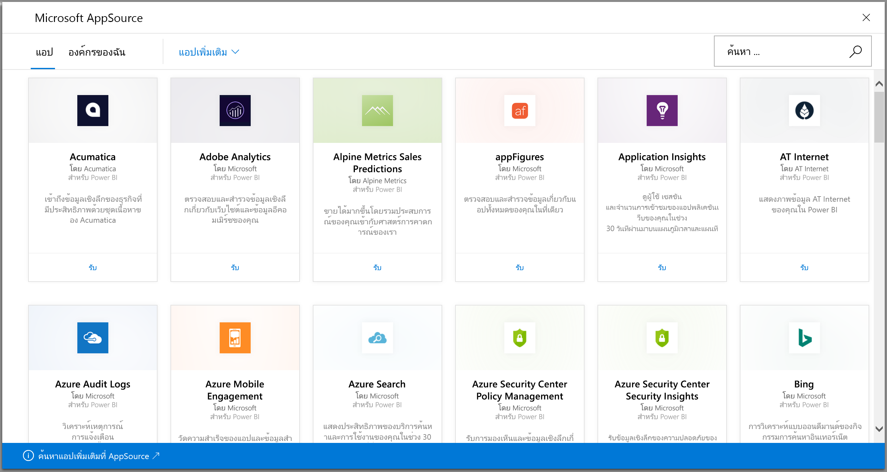
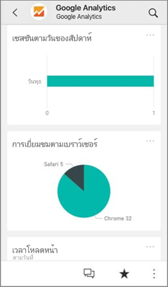
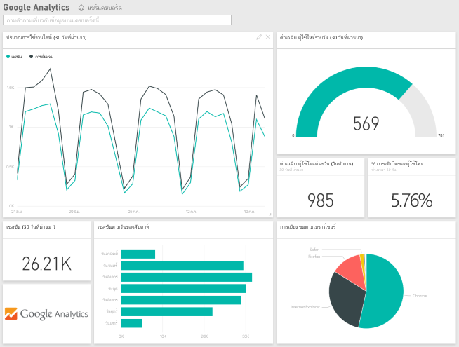
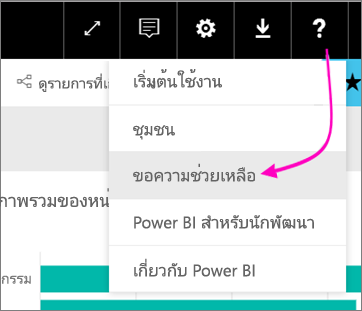

# เชื่อมต่อกับบริการที่คุณใช้กับ Power BI
คุณสามารถเชื่อมต่อกับบริการที่คุณใช้จำนวนหนึ่ง เพื่อเรียกใช้ธุรกิจของคุณ เช่น Salesforce, Microsoft Dynamics CRM และ Google Analytics Power BI เริ่มต้นโดยใช้ข้อมูลประจำตัวของคุณเพื่อเชื่อมต่อกับบริการ และจากนั้นสร้างแอป Power BI ด้วยแดชบอร์ดและชุดของรายงาน Power BI ที่แสดงข้อมูลของคุณและให้ข้อมูลภาพเชิงลึกเกี่ยวกับธุรกิจของคุณโดยอัตโนมัติ

เข้าสู่ระบบ Power BI เพื่อดู[บริการที่คุณสามารถเชื่อมต่อ](https://app.powerbi.com/getdata/services)ทั้งหมด ทีม Power BI เพิ่มบริการใหม่เป็นประจำ

หลังจากที่คุณติดตั้งแอป คุณสามารถดูแดชบอร์ดและรายงานในบริการของ Power BI ([https://powerbi.com](https://powerbi.com)) และในแอป Power BI สำหรับอุปกรณ์เคลื่อนที่ได้ 

## เริ่มใช้งาน
[!INCLUDE [powerbi-service-apps-get-more-apps](./includes/powerbi-service-apps-get-more-apps.md)]

## ดูแดชบอร์ดและรายงาน
เมื่อการนำเข้าเสร็จสมบูรณ์ แอปใหม่จะปรากฏบนหน้าแอป

1. เลือก**Apps**ในบานหน้าต่างนำทางด้านซ้าย > เลือกแอป
   
     
2. คุณสามารถถามคำถามโดยการพิมพ์ในกล่อง Q&A หรือคลิกที่ไทล์เพื่อเปิดรายงานด้านใน 
   
    
   
    คุณสามารถกรองและไฮไลต์ข้อมูลในรายงาน แต่คุณไม่สามารถบันทึกการเปลี่ยนแปลงของคุณ

## มีอะไรรวมอยู่บ้าง
หลังจากเชื่อมต่อกับบริการ คุณเห็นแอปที่สร้างขึ้นใหม่กับแดชบอร์ด รายงาน และชุดข้อมูล ข้อมูลจากบริการจะเน้นไปที่สถานการณ์เฉพาะ และอาจรวมถึงข้อมูลทั้งหมดจากบริการ ข้อมูลมีการจัดกำหนดการการรีเฟรชโดยอัตโนมัตหนึ่งครั้งต่อวัน คุณสามารถควบคุมการกำหนดเวลาโดยการเลือกชุดข้อมูล

คุณยังสามารถใช้[Power BI Desktop](desktop-get-the-desktop.md)เชื่อมต่อกับบริการบางอย่าง เช่น Google Analytics และสร้างแดชบอร์ดแบบกำหนดเองและรายงานของคุณเองได้  

สำหรับรายละเอียดเพิ่มเติมเกี่ยวกับการเชื่อมต่อกับบริการแบบเจาะจง โปรดดูวิธีใช้แต่ละหน้า

## การแก้ไขปัญหา
**ไทล์ที่ว่างเปล่า**  
ขณะที่ Power BI เชื่อมต่อไปยังบริการครั้งแรก คุณอาจเห็นชุดที่ว่างเปล่าของไทล์บนแดชบอร์ดของคุณ ถ้าคุณยังคงเห็นแดชบอร์ดว่างเปล่าหลังจากชั่วโมง 2 อาจเป็นได้ว่าการเชื่อมต่อล้มเหลว ถ้าคุณไม่เห็นข้อความการผิดพลาดกับรายละเอียดในการแก้ไขปัญหา โปรดเปิดทิกเก็ตการสนับสนุน

* เลือกไอคอนเครื่องหมายคำถาม (**?**) ที่มุมบนขวา > **รับความช่วยเหลือ**
  
    

**ข้อมูลที่หายไป**  
แดชบอร์ดและรายงานมีเนื้อหาข้อมูลจากบริการจะเน้นไปที่สถานการณ์เฉพาะ และอาจรวมถึงข้อมูลทั้งหมดจากบริการร ถ้ามีเมตริกเฉพาะที่คุณไม่เห็นในชุดเนื้อหา โปรดเพิ่มแนวคิดบนหน้า[สนับสนุน Power BI ](https://support.powerbi.com/forums/265200-power-bi)

## บริการให้คำปรึกษา
คุณใช้บริการและคุณต้องการให้คำแนะนำแอป Power BI ใช่หรือไม่ ไปที่[สนับสนุน Power BI ](https://support.powerbi.com/forums/265200-power-bi)หน้า และแจ้งให้เราทราบ

คุณมีเซอร์วิซที่คุณต้องการสร้างแอปให้หรือไม่ [ส่งการเสนอชื่อของคุณ](https://azure.microsoft.com/marketplace/programs/certified/apply/)และเลือก "เผยแพร่ชุดเนื้อหา Power BI " เพื่อเริ่มต้นใช้งาน

## ขั้นตอนถัดไป
* [แอป Power BI คืออะไร](service-install-use-apps.md)
* [รับข้อมูลใน Power BI](service-get-data.md)
* มีคำถามเพิ่มเติมหรือไม่ [ลองถามชุมชน Power BI](http://community.powerbi.com/)

