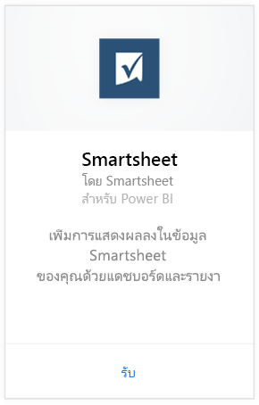
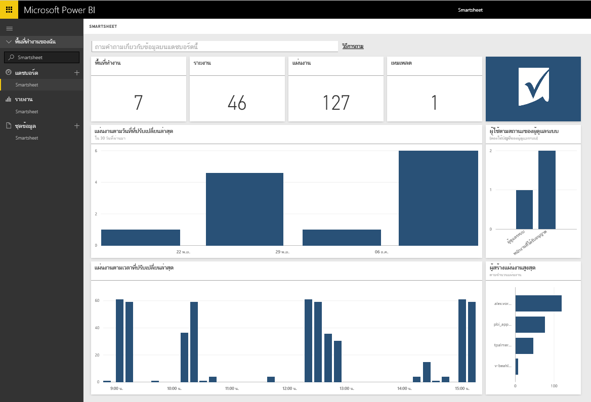

# เชื่อมต่อกับ Smartsheet ด้วย Power BI
Smartsheet มีแพลตฟอร์มอย่างง่าย สำหรับการทำงานร่วมกันและการแชร์ไฟล์ ชุดเนื้อหา Smartsheet สำหรับ Power BI มีแดชบอร์ด รายงาน และชุดข้อมูลที่แสดงภาพรวมของบัญชี Smartsheet ของคุณ คุณยังสามารถใช้ [Power BI Desktop](desktop-connect-to-data.md) เพื่อเชื่อมต่อโดยตรงไปยังแต่ละแผ่นงานในบัญชีของคุณได้ 

เชื่อมต่อไปยัง[ชุดเนื้อหา Smartsheet](https://app.powerbi.com/groups/me/getdata/services/smartsheet) สำหรับ Power BI

>[!NOTE]
>บัญชีผู้ดูแลระบบ Smartsheet เป็นบัญชีที่แนะนำสำหรับการเชื่อมต่อ และโหลดชุดเนื้อหา Power BI เนื่องจากมีการเข้าถึงเพิ่มเติม

## วิธีการเชื่อมต่อ
1. เลือก**รับข้อมูล**ที่ด้านล่างของบานหน้าต่างนำทางด้านซ้าย
   
   
2. ในกล่อง**บริการ** เลือก**รับ**
   
    
3. เลือก **Smartsheet \> รับ**
   
   
4. สำหรับวิธีการรับรองความถูกต้อง เลือก **oAuth2 \> ลงชื่อเข้าใช้**
   
   เมื่อได้รับพร้อมท์ ใส่ข้อมูลประจำตัวของ Smartsheet และทำตามกระบวนการรับรองความถูกต้อง
   
   
   
   
5. หลังจากที่ Power BI นำเข้าข้อมูลแล้ว คุณจะเห็นแดชบอร์ด รายงาน และชุดข้อมูลใหม่ ในบานหน้าต่างนำทางด้านซ้ายมือ รายการใหม่จะถูกทำเครื่องหมาย ด้วยเครื่องหมายดอกจันสีเหลือง \* เลือกรายการ Smartsheet
   
   

**ฉันต้องทำอะไรต่อ?**

* ลอง[ถามคำถามในกล่องถามตอบ](power-bi-q-and-a.md)ที่ด้านบนของแดชบอร์ด
* [เปลี่ยนไทล์](service-dashboard-edit-tile.md)ในแดชบอร์ด
* [เลือกไทล์](service-dashboard-tiles.md)เพื่อเปิดรายงานพื้นฐาน
* ถึงแม้ว่าชุดข้อมูลของคุณถูกกำหนดให้รีเฟรซรายวัน คุณสามารถเปลี่ยนแปลงกำหนดเวลารีเฟรช หรือลองรีเฟรชตามความต้องการ โดยใช้**รีเฟรชทันที**

## มีอะไรรวมอยู่บ้าง
ชุดเนื้อหา Smartsheet สำหรับ Power BI มีภาพรวมของบัญชี Smartsheet ของคุณ เช่น จำนวนของพื้นที่ทำงาน รายงาน และแผ่นงานที่คุณมี เมื่อใดที่ถูกแก้ไข ฯลฯ ผู้ใช้ที่เป็นผู้ดูแลระบบ จะเห็นข้อมูลเกี่ยวกับผู้ใช้ในระบบของพวกเขา เช่น ผู้ที่สร้างแผ่นงานอันดับต้น ๆ  

เพื่อเชื่อมต่อโดยตรงไปยังแต่ละแผ่นงานในบัญชีของคุณ คุณสามารถใช้ตัวเชื่อมต่อ Smartsheet ใน [Power BI Desktop](desktop-connect-to-data.md) ได้  

## ขั้นตอนถัดไป:

[เริ่มต้นใช้งานด้วย Power BI](service-get-started.md)

[รับข้อมูลสำหรับ Power BI](service-get-data.md)