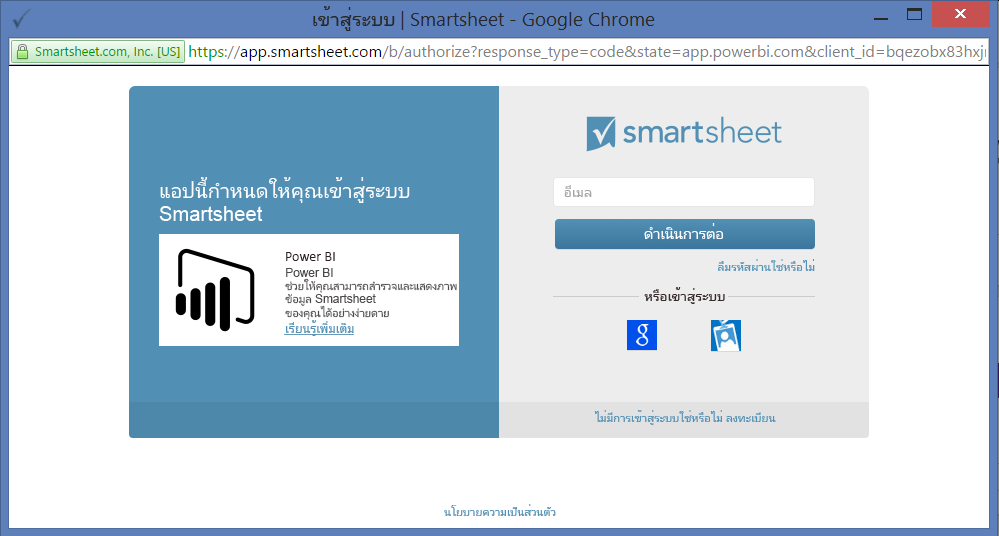
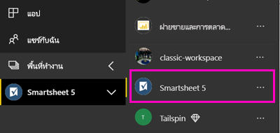

# เชื่อมต่อกับ Smartsheet ด้วย Power BI
บทความนี้แนะนำคุณเกี่ยวกับการดึงข้อมูลของคุณจากบัญชี Smartsheet ของคุณด้วยแอเทมเพลต Power BI Smartsheet มีแพลตฟอร์มอย่างง่าย สำหรับการทำงานร่วมกันและการแชร์ไฟล์ แอปเทมเพล Smartsheet สำหรับ Power BI มีแดชบอร์ด รายงาน และชุดข้อมูลที่แสดงภาพรวมของบัญชี Smartsheet ของคุณ คุณยังสามารถใช้[Power BI Desktop](desktop-connect-to-data.md)เพื่อเชื่อมต่อโดยตรงกับแต่ละแผ่นงานในบัญชีของคุณได้ 

หลังจากที่คุณติดตั้งแอปเทมเพล คุณสามารถเปลี่ยนแดชบอร์ดและรายงาน จากนั้น คุณสามารถแจกจ่ายเป็นแอปให้เพื่อนร่วมงานในองค์กรของคุณ

เชื่อมต่อไปยัง[Smartsheet เทมเพลแอ](https://app.powerbi.com/groups/me/getdata/services/smartsheet)สำหรับ Power BI

>[!NOTE]
>มีบัญชีผู้ดูแลระบบ Smartsheet เป็นสิ่งจำเป็นสำหรับการเชื่อมต่อ และโหลดแอเทมเพลต Power BI เนื่องจากมีการเข้าถึงเพิ่มเติม

## วิธีการเชื่อมต่อ

[!INCLUDE [powerbi-service-apps-get-more-apps](./includes/powerbi-service-apps-get-more-apps.md)]

3. เลือก**Smartsheet** \> **รับทันที**
4. ใน**ติดตั้งแอป Power BI นี้ใช่ไหม**เลือก**ติดตั้ง**
4. ในการ**แอ**บานหน้าต่าง เลือกแบบ**Smartsheet**ไทล์

    

6. ใน**เริ่มต้นใช้งานแอปของคุณใหม่**เลือก**เชื่อมต่อข้อมูล**

    

4. สำหรับวิธีการรับรองความถูกต้อง เลือก **oAuth2 \> ลงชื่อเข้าใช้**
   
   เมื่อได้รับพร้อมท์ ใส่ข้อมูลประจำตัวของ Smartsheet และทำตามกระบวนการรับรองความถูกต้อง
   
   
   
   

5. หลังจาก Power BI นำเข้าข้อมูล แดชบอร์ด Smartsheet เปิดขึ้น
   
   

## ปรับเปลี่ยน และแจกจ่ายแอปของคุณ

คุณได้ติดตั้งแอปเทมเพล Smartsheet ซึ่งหมายความว่า คุณจะสร้างพื้นที่ทำงานแอ Smartsheet ในพื้นที่ทำงาน คุณสามารถเปลี่ยนรายงานและแดชบอร์ด และแจกจ่ายเป็นแอ*แอ*ให้เพื่อนร่วมงานในองค์กรของคุณได้ 

1. เมื่อต้องดูเนื้อหาทั้งหมดของ Smartsheet พื้นที่ทำงานใหม่ ในแถบนำทางด้านซ้าย เลือก**พื้นที่ทำงาน** > **Smartsheet** 

    

    มุมมองนี้คือ รายการเนื้อหาสำหรับพื้นที่ทำงาน ในมุมขวาบน คุณเห็น**อัปเดตแอปฯ** เมื่อคุณพร้อมที่จะแจกจ่ายแอปของคุณให้เพื่อนร่วมงานของคุณ ที่อยู่ที่คุณจะเริ่มต้น 

    

2. เลือก**รายงาน**และ**ชุดข้อมูล**เพื่อดูองค์ประกอบอื่น ๆ ในพื้นที่ทำงาน

    อ่านเกี่ยวกับ[แจกจ่ายแอ](service-create-distribute-apps.md)ให้เพื่อนร่วมงานของคุณ

## มีอะไรรวมอยู่บ้าง
Smartsheet แอเทมเพลสำหรับ Power BI มีภาพรวมของบัญชีของคุณ Smartsheet เช่นจำนวนของพื้นที่ทำงาน รายงาน และแผ่นงานที่คุณมี เมื่อพวกเขากำลังปรับเปลี่ยนและอื่น ๆ ผู้ใช้ผู้ดูแลระบบยังดูข้อมูลเกี่ยวกับผู้ใช้ในระบบของพวกเขา เช่นผู้สร้างแผ่นงานที่ด้านบน  

เพื่อเชื่อมต่อโดยตรงไปยังแต่ละแผ่นงานในบัญชีของคุณ คุณสามารถใช้ตัวเชื่อมต่อ Smartsheet ใน [Power BI Desktop](desktop-connect-to-data.md) ได้  

## ขั้นตอนถัดไป

* [สร้างพื้นที่ทำงานใหม่ใน Power BI](service-create-the-new-workspaces.md)
* [ติดตั้งและใช้แอปฯใน Power BI](consumer/end-user-apps.md)
* [เชื่อมต่อกับแอป Power BI สำหรับบริการภายนอก](service-connect-to-services.md)
* มีคำถามหรือไม่ [ลองถามชุมชน Power BI](http://community.powerbi.com/)