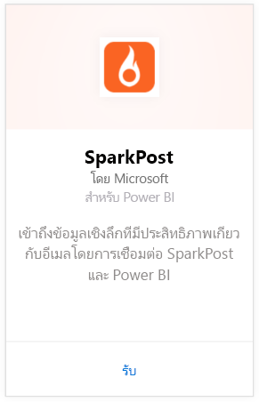
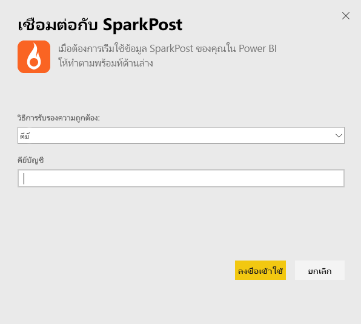
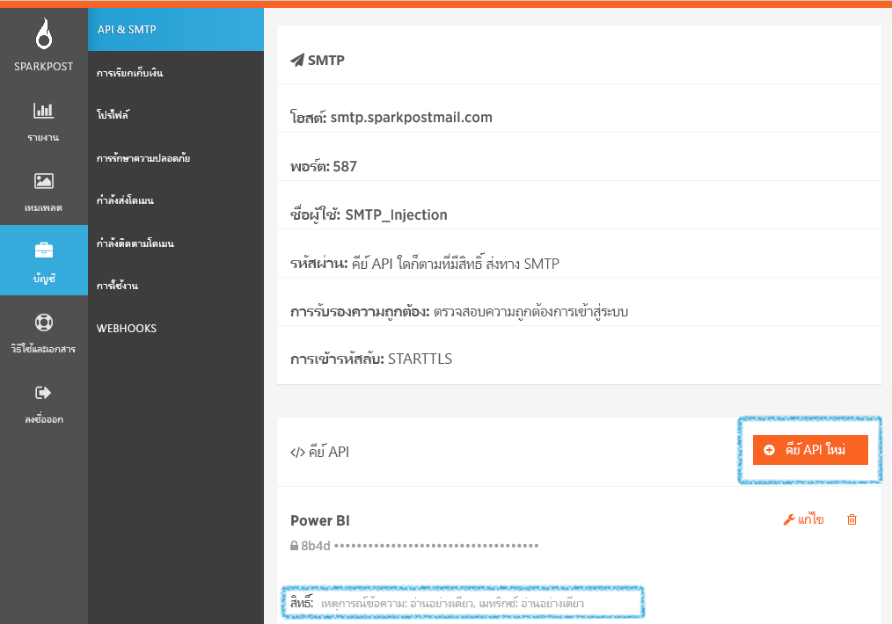

# เชื่อมต่อกับ SparkPost ด้วย Power BI
ชุดเนื้อหา Power BI สำหรับ SparkPost ให้คุณสามารถดึงชุดข้อมูลที่มีค่าจากบัญชี SparkPost ของคุณ ลงมาในแดชบอร์ดข้อมูลเชิงลึก ในแดชบอร์ดเดียว ด้วยชุดเนื้อหา SparkPost คุณสามารถแสดงภาพสถิติอีเมลโดยรวม รวมถึงโดเมน แคมเปญ และการมีส่วนร่วม แบ่งตาม ISP

เชื่อมต่อไปยัง[ชุดเนื้อหา SparkPost สำหรับ Power BI](https://app.powerbi.com/getdata/services/spark-post)

## วิธีการเชื่อมต่อ
1. เลือกปุ่ม**รับข้อมูล**ที่ด้านล่างของพื้นที่นำทางด้านซ้ายมือ
   
   
2. ในกล่อง**บริการ** เลือก**รับ**
   
   
3. เลือกชุดเนื้อหา **SparkPost** และคลิก**รับ** 
   
   
4. เมื่อได้รับพร้อมท์ ระบุคีย์ SparkPost API ของคุณ และเลือกลงชื่อเข้าใช้ ดูรายละเอียดที่ [การค้นหาพารามิเตอร์นี้](#FindingParams) ที่ด้านล่าง
   
   
5. ข้อมูลของคุณจะเริ่มโหลด ซึ่งอาจใช้เวลาสักระยะ ขึ้นอยู่กับขนาดของบัญชีคุณ หลังจากที่ Power BI นำเข้าข้อมูลแล้ว คุณจะเห็นแดชบอร์ด รายงาน และชุดข้อมูลเริ่มต้นในบานหน้าต่างนำทางด้านซ้าย พร้อมด้วยข้อมูลสถิติของอีเมลในรอบ 90 วันที่ผ่านมา รายการใหม่จะถูกทำเครื่องหมายด้วย เครื่องหมายดอกจันสีเหลือง \*
   
   

**ฉันต้องทำอะไรตอนนี้**

* ลอง[ถามคำถามในกล่อง Q&A](consumer/end-user-q-and-a.md)ที่ด้านบนของแดชบอร์ด
* [เปลี่ยนไทล์](service-dashboard-edit-tile.md)ในแดชบอร์ด
* [เลือกไทล์](consumer/end-user-tiles.md)เพื่อเปิดรายงานด้านใน
* แม้ว่าชุดข้อมูลของคุณจะถูกกำหนดให้รีเฟรชรายวัน แต่คุณสามารถเปลี่ยนกำหนดการรีเฟรช หรือลองรีเฟรชตามความต้องการได้โดยใช้**รีเฟรชเดี๋ยวนี้**

## มีอะไรรวมอยู่บ้าง
ชุดเนื้อหา SparkPost สำหรับ Power BI รวบรวมข้อมูล เช่น จำนวนคลิกที่ไม่ซ้ำกัน อัตราการยอมรับ อัตราแจ้งการตีกลับ อัตราการล่าช้า อัตราการปฏิเสธ และอีกมากมาย

## การค้นหาพารามิเตอร์
ชุดเนื้อหาใช้คีย์ API เพื่อเชื่อมต่อกับบัญชี SparkPost ของคุณไปยัง Power BI คุณสามารถค้นหาคีย์ API ของคุณ ในบัญชีคุณได้ที่ บัญชี \> API & SMTP (ดูรายละเอียดเพิ่มเติม[ที่นี่](https://support.sparkpost.com/customer/portal/articles/1933377-create-api-keys)) เราแนะนำให้ใช้คีย์ API ที่มีสิทธิ์สำหรับ `Message Events: Read-only ` และ `Metrics: Read-only`

