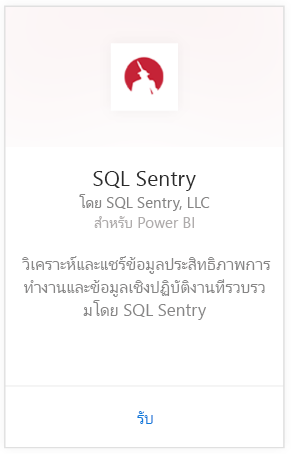
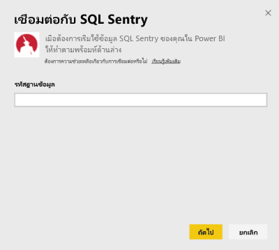
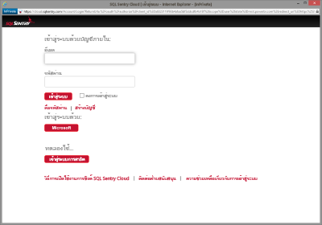
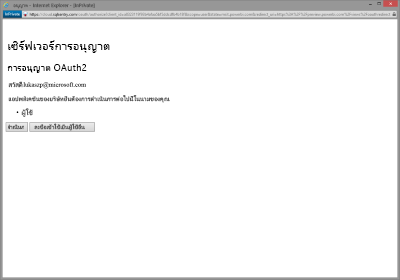
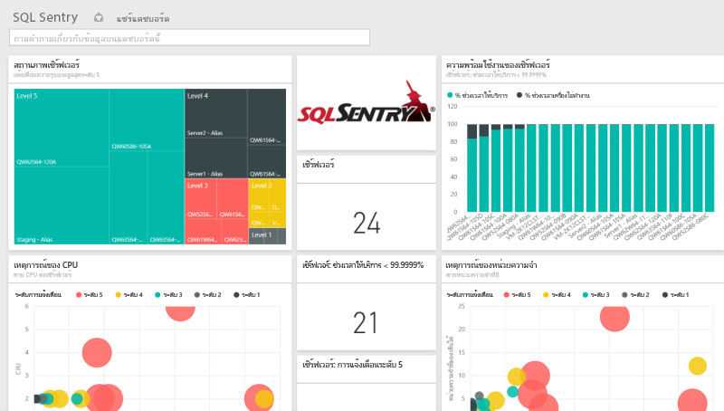
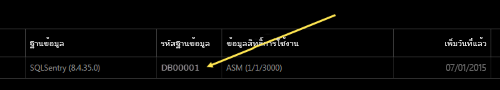
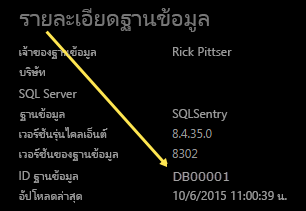

# เชื่อมต่อกับ SQL Sentry ด้วย Power BI
วิเคราะห์ข้อมูลประสิทธิภาพการทำงานของคุณที่รวบรวมโดย SQL Sentry ทำได้ง่ายขึ้นด้วย Power BI Power BI เรียกคืนข้อมูลของคุณ จากนั้นสร้างแดชบอร์ดค่าเริ่มต้นและรายงานที่เกี่ยวข้องที่ยึดตามข้อมูลนั้น

เชื่อมต่อไปยัง[ชุดเนื้อหา SQL Sentry สำหรับ Power BI](https://app.powerbi.com/groups/me/getdata/services/sql-sentry)

>[!NOTE]
>การเข้าถึงบัญชี SQL Sentry ที่คุณใช้สำหรับการเชื่อมต่อกับ http://cloud.sqlsentry.com และ ID ฐานข้อมูลที่คุณจะติดตาม จำเป็นสำหรับการเชื่อมต่อ  คำแนะนำสำหรับตำแหน่งที่จะค้นหา ID ของฐานข้อมูล มีอยู่ที่ด้านล่าง

## วิธีการเชื่อมต่อ
1. เลือกปุ่ม**รับข้อมูล**ที่ด้านล่างของพื้นที่นำทางด้านซ้ายมือ
   
   
2. ในกล่อง**บริการ** เลือก**รับ**
   
    
3. เลือก**SQL Sentry \>รับ**
   
   
4. ให้**ID ฐานข้อมูล**ของฐานข้อมูลที่คุณต้องการตรวจสอบใน Power BI ดูรายละเอียดเพิ่มเติมที่[การค้นหานี้](#FindingParams)ที่ด้านล่าง
   
   
5. สำหรับวิธีการรับรองความถูกต้อง ให้เลือก **oAuth2\> ลงชื่อเข้าใช้**
   
   เมื่อได้รับข้อความปรากฏขึ้น ให้ใส่ข้อมูลประจำตัวของ cloud.sqlsentry.com และทำตามกระบวนการรับรองความถูกต้องสำหรับ SQL Sentry
   
   
   
   ในครั้งแรกที่คุณเชื่อมต่อ Power BI จะปรากฏข้อความให้คุณอนุญาตให้เข้าถึงแบบอ่านอย่างเดียวสำหรับบัญชีของคุณ เลือก อนุญาต เพื่อเริ่มกระบวนการนำเข้า  กระบวนการนำเข้าอาจใช้เวลาสักครู่ โดยขึ้นอยู่กับปริมาณของข้อมูลในบัญชีของคุณ
   
   
6. หลังจาก Power BI นำเข้าข้อมูล คุณจะเห็นแดชบอร์ด รายงาน และชุดข้อมูลใหม่ในแผงนำทางด้านซ้าย รายการใหม่จะถูกทำเครื่องหมายด้วย เครื่องหมายดอกจันสีเหลือง\*:
   
   
7. เลือกแดชบอร์ด SQL Sentry
   
   นี่คือแดชบอร์ดตามเริ่มต้นที่ Power BI สร้างขึ้นเพื่อแสดงข้อมูลของคุณ คุณสามารถปรับเปลี่ยนแดชบอร์ดนี้เพื่อแสดงข้อมูลของคุณด้วยวิธีใดก็ตามที่คุณต้องการ
   
   

**ฉันต้องทำอะไรตอนนี้**

* ลอง[ถามคำถามในกล่อง Q&A](power-bi-q-and-a.md)ที่ด้านบนของแดชบอร์ด
* [เปลี่ยนไทล์](service-dashboard-edit-tile.md)ในแดชบอร์ด
* [เลือกไทล์](service-dashboard-tiles.md)เพื่อเปิดรายงานด้านใน
* ถึงแม้ว่าชุดข้อมูลของคุณถูกกำหนดให้รีเฟรซรายวัน คุณสามารถเปลี่ยนแปลงกำหนดเวลารีเฟรช หรือลองรีเฟรชตามความต้องการ โดยใช้**รีเฟรชทันที**

## มีอะไรรวมอยู่บ้าง
ข้อมูลต่อไปนี้จะพร้อมใช้งานจาก SQL Sentry ใน Power BI:

| ชื่อตาราง | คำอธิบาย |
| --- | --- |
| การเชื่อมต่อ |ตารางนี้แสดงข้อมูลเกี่ยวกับการเชื่อมต่อ SQL Sentry ที่กำหนดเองของคุณ |
| วันที่  |ตารางนี้ประกอบด้วยวันที่จากวันนี้ย้อนกลับไปยังวันที่แรกสุดที่มีการรวบรวมและเก็บรักษาข้อมูลประสิทธิภาพการทำงาน |
| ช่วงเวลาเครื่องไม่ทำงาน  |ตารางนี้ประกอบด้วยข้อมูลที่เกี่ยวข้องกับช่วงหยุดทำงานและช่วงพร้อมใช้งานสำหรับแต่ละเซิร์ฟเวอร์ที่ถูกตรวจติดตามในสภาพแวดล้อมของคุณ |
| การใช้หน่วยความจำ  |ตารางนี้ประกอบด้วยข้อมูลเกี่ยวกับปริมาณหน่วยความจำพร้อมใช้งานหรือฟรีในแต่ละเซิร์ฟเวอร์ของคุณ  |
| เซิร์ฟเวอร์  |ตารางนี้ประกอบด้วยบันทึกสำหรับแต่ละเซิร์ฟเวอร์ในสภาพแวดล้อมของคุณ |
| สถานภาพเซิร์ฟเวอร์  |ตารางนี้ประกอบด้วยข้อมูลสำหรับเหตุการณ์ทั้งหมดที่สร้างขึ้นโดยเงื่อนไขแบบกำหนดเองในสภาพแวดล้อมของคุณ รวมถึงความร้ายแรงและจำนวนด้วย |

## การค้นหาพารามิเตอร์
**ID ฐานข้อมูล**สามารถพบได้โดยการเข้าสู่ระบบ<https://cloud.sqlsentry.com>ในหน้าต่างเว็บเบราว์เซอร์ใหม่  **ID ฐานข้อมูล**จะแสดงอยู่บนเพจภาพรวมหลัก:

    

**ID ฐานข้อมูล**จะแสดงขึ้นบนหน้าจอรายละเอียดฐานข้อมูล:

    

## การแก้ไขปัญหา
ถ้าระบบไม่แสดงข้อมูลจากบางแอปฯของคุณใน Power BI ตรวจสอบให้แน่ใจว่า คุณกำลังใช้ ID ฐานข้อมูลที่ถูกต้องและที่คุณมีสิทธิ์ในการดูข้อมูล 

ถ้าคุณไม่ได้เป็นเจ้าของฐานข้อมูล SQL Sentry ที่มีการซิงโครไนซ์อยู่ <https://cloud.sqlsentry.com>โปรดติดต่อผู้ดูแลระบบของคุณเพื่อให้แน่ใจว่าคุณมีสิทธิ์ในการดูข้อมูลที่รวบรวมไว้

## ขั้นตอนถัดไป
[Power BI คืออะไร](power-bi-overview.md)

[รับข้อมูลสำหรับ Power BI](service-get-data.md)

