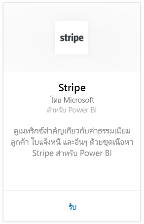
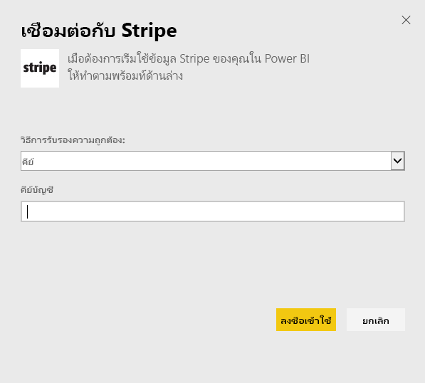

# เชื่อมต่อกับ Stripe ด้วย Power BI
ภาพและสำรวจข้อมูล Stripe ของคุณใน Power BI ด้วยชุดเนื้อหา Power BI ชุดเนื้อหา Power BI Stripe ดึงข้อมูลเกี่ยวกับลูกค้า ค่าธรรมเนียม เหตุการณ์ และใบแจ้งหนี้ ข้อมูลมีเหตุการณ์หมื่นเหตุการณ์ล่าสุดและค่าใช้จ่ายห้าพันใน 30 วันที่ผ่านมา เนื้อหาจะถูกรีเฟรชโดยอัตโนมัติวันละครั้งตามการกำหนดเวลาที่คุณควบคุม 

[!INCLUDE [include-short-name](./includes/service-deprecate-content-packs.md)]

เชื่อมต่อไปยัง[ชุดเนื้อหา Stripe สำหรับ Power BI](https://app.powerbi.com/getdata/services/stripe)

## วิธีการเชื่อมต่อ
1. เลือกรับข้อมูลที่ด้านล่างของพื้นที่นำทางด้านซ้ายมือ  
   
    
2. ในกล่อง**บริการ** เลือก**รับ**  
   
      
3. เลือก**Stripe** &gt; **รับ**  
   
      
4. ให้แจ้ง [คีย์ API](https://dashboard.stripe.com/account/apikeys) Stripe ของคุณเพื่อเชื่อมต่อ  
   
    
5. กระบวนการนำเข้าจะเริ่มโดยอัตโนมัติ เมื่อเสร็จ แดชบอร์ดใหม่ รายงาน และรูปแบบ จะปรากฏในบานหน้าต่างนำทาง ที่ทำเครื่องหมายดอกจันไว้ เลือกแดชบอร์ดเพื่อดูข้อมูลที่นำเข้าของคุณ
   
    

**ฉันต้องทำอะไรตอนนี้**

* ลอง[ถามคำถามในกล่อง Q&A](consumer/end-user-q-and-a.md)ที่ด้านบนของแดชบอร์ด
* [เปลี่ยนไทล์](service-dashboard-edit-tile.md)ในแดชบอร์ด
* [เลือกไทล์](consumer/end-user-tiles.md)เพื่อเปิดรายงานด้านใน
* แม้ว่าชุดข้อมูลของคุณจะถูกกำหนดให้รีเฟรชรายวัน แต่คุณสามารถเปลี่ยนกำหนดการรีเฟรช หรือลองรีเฟรชตามความต้องการได้โดยใช้**รีเฟรชเดี๋ยวนี้**

## ขั้นตอนถัดไป
[Power BI คืออะไร](power-bi-overview.md)

[รับข้อมูลสำหรับ Power BI](service-get-data.md)

