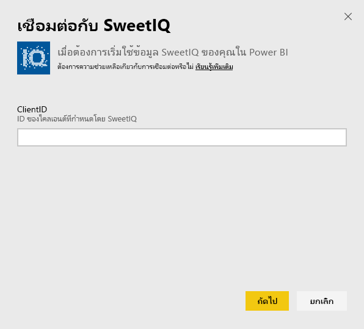
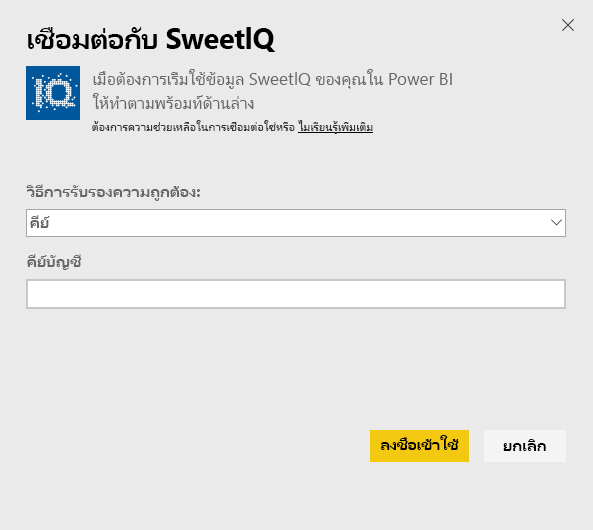
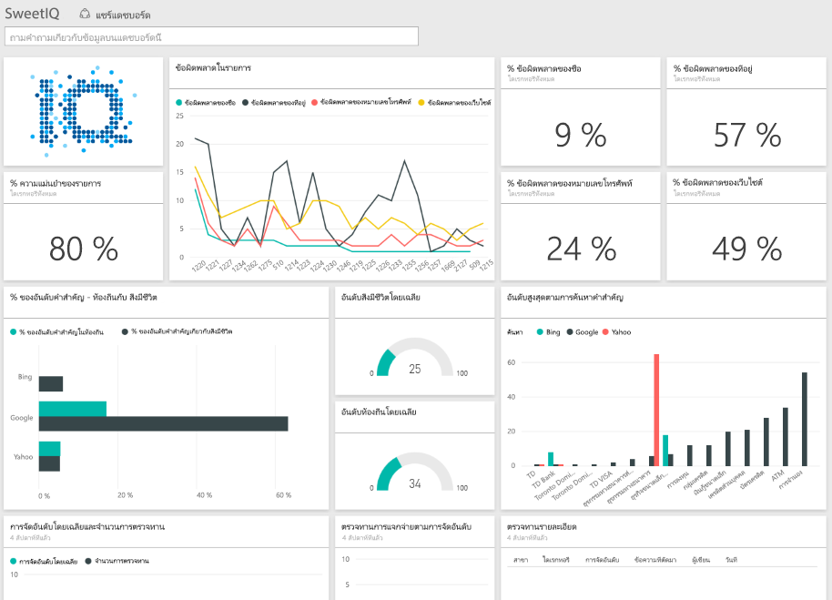

# เชื่อมต่อกับ SweetIQ ด้วย Power BI
ชุดเนื้อหา Power BI ดึงข้อมูลจากบัญชี SweetIQ ของคุณ และสร้างชุดเนื้อหาแบบใช้ทันทีที่ช่วยให้คุณสามารถสำรวจข้อมูลของคุณได้อย่างง่ายดาย ใช้ชุดเนื้อหา SweetIQ เพื่อวิเคราะห์ข้อมูลเกี่ยวกับตำแหน่งที่ตั้ง การจัดรายการ การจัดอันดับ และบทวิจารณ์ของคุณ ข้อมูลจะถูกตั้งค่าการรีเฟรชเป็นรีเฟรชทุกวัน เพื่อแน่ใจว่าข้อมูลที่คุณกำลังตรวจติดตามอัปเดตแล้ว

เชื่อมต่อไปยัง[ชุดเนื้อหา SweetIQ](https://app.powerbi.com/groups/me/getdata/services/sweetiq) สำหรับ Power BI

## วิธีการเชื่อมต่อ
1. ในแผงนำทางทางด้านซ้าย คลิก**รับข้อมูล**
   
    
2. เลือก**SweetIQ** และคลิก**รับ**
   
    
3. ระบุ SweetIQ Client ID ของคุณ ซึ่งโดยทั่วไปคือค่าตัวอักษรและตัวเลข สำหรับรายละเอียดในการค้นหาค่านี้ โปรดดูที่ด้านล่าง
   
    
4. เลือกประเภทการรับรองความถูกต้อง**คีย์**และใส่คีย์ Sweet IQ API ของคุณ ซึ่งโดยทั่วไปคือค่าตัวอักษรและตัวเลข สำหรับรายละเอียดในการค้นหาค่านี้ โปรดดูที่ด้านล่าง
   
    
5. Power BI จะเริ่มการโหลดข้อมูลของคุณ ซึ่งอาจใช้เวลาสักครู่ ทั้งนี้ขึ้นอยู่กับขนาดของข้อมูลในบัญชีของคุณ เมื่อดาวน์โหลดเสร็จสิ้นแล้ว คุณเห็นแดชบอร์ด รายงาน และชุดข้อมูลใหม่ในแผงนำทางด้านซ้าย
   
    

**ฉันต้องทำอะไรต่อ?**

* ลอง[ถามคำถามในกล่องถามตอบ](power-bi-q-and-a.md)ที่ด้านบนของแดชบอร์ด
* [เปลี่ยนไทล์](service-dashboard-edit-tile.md)ในแดชบอร์ด
* [เลือกไทล์](service-dashboard-tiles.md)เพื่อเปิดรายงานพื้นฐาน
* ถึงแม้ว่าชุดข้อมูลของคุณถูกกำหนดให้รีเฟรซรายวัน คุณสามารถเปลี่ยนแปลงกำหนดเวลารีเฟรช หรือลองรีเฟรชตามความต้องการ โดยใช้**รีเฟรชทันที**

## การค้นหาพารามิเตอร์
ID ไคลเอ็นต์และคีย์ API สำหรับชุดเนื้อหานี้จะไม่เหมือนกับชื่อผู้ใช้และรหัสผ่าน SweetIQ ของคุณ

เลือก ID ไคลเอ็นต์สำหรับหนึ่งในไคลเอ็นต์ที่บัญชีของคุณมีสิทธิ์เข้าถึง คุณสามารถค้นหารายการของไคลเอ็นต์ได้ที่ใต้ "การจัดการลูกค้า" ในบัญชี SweetIQ ของคุณ

พูดคุยกับผู้ดูแลระบบของคุณสำหรับคีย์ API ของคุณ เพื่อให้สามารถเข้าถึงข้อมูลสำหรับไคลเอ็นต์ที่เฉพาะเจาะจง

## ขั้นตอนถัดไป
[เริ่มต้นใช้งาน Power BI](service-get-started.md)

[รับข้อมูลสำหรับ Power BI](service-get-data.md)

