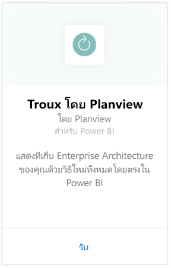
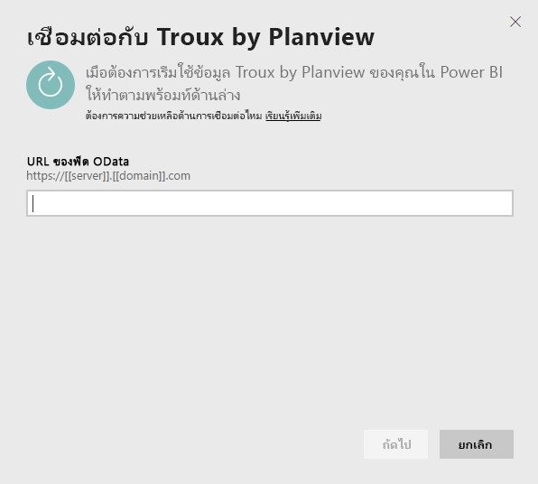
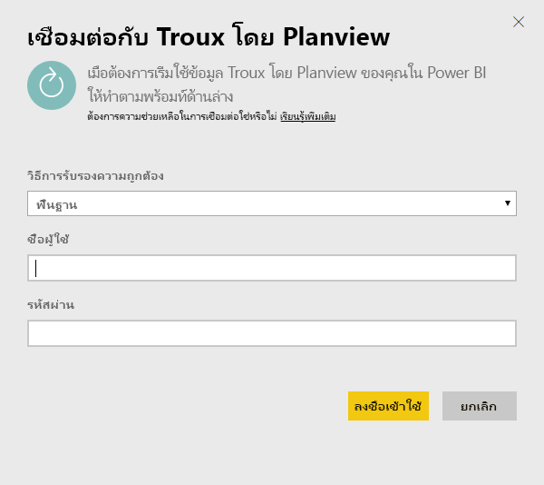
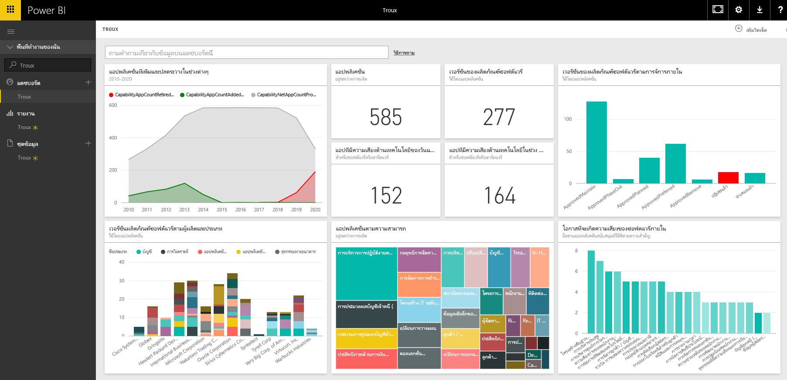

# เชื่อมต่อกับ Troux สำหรับ Power BI
ด้วยชุดข้อมูล Troux คุณสามารถแสดงที่จัดเก็บ Enterprise Architecture ของคุณด้วยวิธีใหม่ทั้งหมดโดยตรงใน Power BI ชุดเนื้อหานี้มีชุดของข้อมูลเชิงลึกเกี่ยวกับขีดความสามารถทางธุรกิจ รวมถึงแอปพลิเคชันที่นำเสนอขีดความสามารถเหล่านั้น และเทคโนโลยีที่สนับสนุนแอปพลิเคชันเหล่านั้นที่สามารถกำหนดเองได้เต็มรูปแบบโดยใช้ Power BI

เชื่อมต่อไปยัง[ชุดเนื้อหา Troux](https://app.powerbi.com/getdata/services/troux)สำหรับ Power BI

## วิธีการเชื่อมต่อ
1. เลือกปุ่ม**รับข้อมูล**ที่ด้านล่างของพื้นที่นำทางด้านซ้ายมือ
   
   
2. ในกล่อง**บริการ** เลือก**รับ**
   
   
3. เลือก**Troux** \> **รับ**
   
   
4. ระบุ Troux OData URL ของคุณ ดูรายละเอียดที่ [การค้นหาพารามิเตอร์เหล่านั้น](#FindingParams) ที่ด้านล่าง
   
   
5. สำหรับ**วิธีการรับรองความถูกต้อง** เลือก**พื้นฐาน**และใส่ชื่อผู้ใช้และรหัสผ่าน (ตัวพิมพ์ใหญ่-เล็ก) จากนั้นเลือก**ลงชื่อเข้าใช้**
   
    
6. หลังจากอนุมัติ กระบวนการนำเข้าจะเริ่มโดยอัตโนมัติ เมื่อเสร็จสิ้น แดชบอร์ดใหม่ รายงาน และแบบจำลองจะปรากฏในบานหน้าต่างนำทาง เลือกแดชบอร์ดเพื่อดูข้อมูลที่นำเข้าของคุณ
   
     

**ฉันต้องทำอะไรตอนนี้**

* ลอง[ถามคำถามในกล่อง Q&A](power-bi-q-and-a.md)ที่ด้านบนของแดชบอร์ด
* [เปลี่ยนไทล์](service-dashboard-edit-tile.md)ในแดชบอร์ด
* [เลือกไทล์](service-dashboard-tiles.md)เพื่อเปิดรายงานด้านใน
* ถึงแม้ว่าชุดข้อมูลของคุณถูกกำหนดให้รีเฟรซรายวัน คุณสามารถเปลี่ยนแปลงกำหนดเวลารีเฟรช หรือลองรีเฟรชตามความต้องการ โดยใช้**รีเฟรชทันที**

## ข้อกำหนดของระบบ
จำเป็นต้องมีการเข้าถึงตัวดึงข้อมูล Troux OData และ Troux 9.5.1 หรือสูงกว่า

## การค้นหาพารามิเตอร์
ทีมดูแลลูกค้า (Customer Care) ของคุณสามารถให้ URL เฉพาะสำหรับ Troux OData ของคุณให้กับคุณได้

## การแก้ไขปัญหา
ถ้าคุณเห็นข้อผิดพลาดการหมดเวลาหลังจากใส่ข้อมูลประจำตัว ให้ลองเชื่อมต่ออีกครั้ง

## ขั้นตอนถัดไป
[เริ่มต้นใช้งานใน Power BI](service-get-started.md)

[รับข้อมูลใน Power BI](service-get-data.md)

