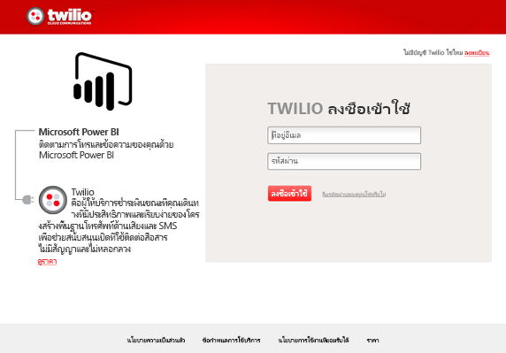
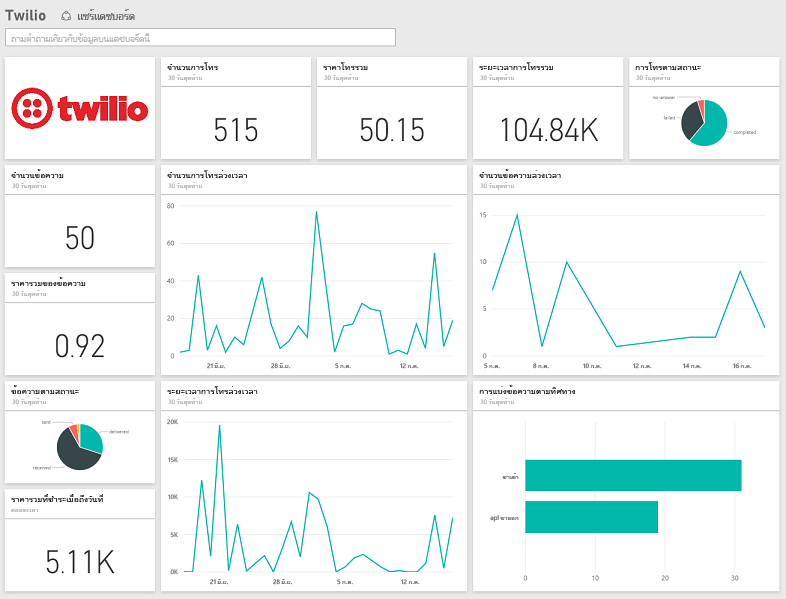

# เชื่อมต่อกับ Twilio ด้วย Power BI
ชุดเนื้อหา Microsoft Twilio สำหรับ Power BI ช่วยให้คุณสามารถดึงข้อมูลของคุณลงใน Power BI และกล่อง[แดชบอร์ด Twilio](https://powerbi.microsoft.com/integrations/twilio)แบบไม่ทั่วไป และรายงานที่แสดงข้อมูลเชิงลึกในข้อมูลของคุณ คุณยังสามารถสร้างรายงานแบบกำหนดเองของคุณ และสร้างแดชบอร์ดบนชุดข้อมูล Power BI ข้อมูลจะถูกรีเฟรชวันละครั้งเพื่อ ดังนั้นจะดูที่ข้อมูลล่าสุดเสมอ

[!INCLUDE [include-short-name](./includes/service-deprecate-content-packs.md)]

เชื่อมต่อไปยัง[ชุดเนื้อหา Twilio](https://app.powerbi.com/getdata/services/twilio)สำหรับ Power BI

## วิธีการเชื่อมต่อ
1. เลือกปุ่ม**รับข้อมูล**ที่ด้านล่างของพื้นที่นำทางด้านซ้ายมือ
   
    
2. ในกล่อง**บริการ** เลือก**รับ**
   
    
3. เลือก**Twilio** \> **รับ**
   
   
4. สำหรับ **วิธีการรับรองตัวตน** ให้เลือก **oAuth2** \> ลงชื่อเข้าใช้ เมื่อได้รับถูกเรียกถาม ให้ใส่ข้อมูลประจำตัว Twilio ของคุณ และอนุญาตให้แอปพลิเคชัน Power BI เข้าถึงข้อมูลของคุณ
   
   
5. ซึ่งจะเริ่มนำเข้าข้อมูลจากบัญชี Twilio ของคุณ และคุณจะมีแดชบอร์ดที่เต็มไปด้วยการโทรออกและข้อความของ 30 วันที่ผ่านมา 
   
   

**ฉันต้องทำอะไรตอนนี้**

* ลอง[ถามคำถามในกล่อง Q&A](consumer/end-user-q-and-a.md)ที่ด้านบนของแดชบอร์ด
* [เปลี่ยนไทล์](service-dashboard-edit-tile.md)ในแดชบอร์ด
* [เลือกไทล์](consumer/end-user-tiles.md)เพื่อเปิดรายงานด้านใน
* แม้ว่าชุดข้อมูลของคุณจะถูกกำหนดให้รีเฟรชรายวัน แต่คุณสามารถเปลี่ยนกำหนดการรีเฟรช หรือลองรีเฟรชตามความต้องการได้โดยใช้**รีเฟรชเดี๋ยวนี้**

## มีอะไรรวมอยู่บ้าง
รายละเอียดสำหรับรายการการโทรและข้อความทั้งหมดเป็นเวลา 30 วันล่าสุด คุณสามารถทำการเรียงลำดับทั้งหมดของการวิเคราะห์และการรวมข้อมูลนี้

ชุดของค่าทางสถิติที่ถูกรวมอยู่แล้วซึ่งคุณอาจต้องการเฝ้าดู ชุดนี้ประกอบด้วย

        All Time Calls Count  
        All Time Calls Duration  
        All Time Calls Price  
        All Time Messages Price  
        All Time Messages Count  
        All Time Count of Phone Numbers  
        All Time Price of Phone Numbers  
        All Time Twilio Client Calls Price  
        All Time Twilio Client Calls Duration  
        All Time Twilio Client Calls Count  
        All Time Total Price  
        All Time Inbound Calls Price  
        All Time Inbound Calls Duration  
        All Time Inbound Calls Count  
        All Time Outbound Calls Price  
        All Time Outbound Calls Duration  
        All Time Outbound Calls Count  
        This Month Calls Price  
        This Month Calls Duration  
        This Month Calls Count  
        This Month Messages Count  
        This Month Messages Price  
        This Month Count of Phone Numbers  
        This Month Price of Phone Numbers  
        This Month Twilio Client Calls Price  
        This Month Twilio Client Calls Duration  
        This Month Twilio Client Calls Count  
        This Month Total Price  
        This Month Inbound Calls Price  
        This Month Inbound Calls Duration  
        This Month Inbound Calls Count  
        This Month Outbound Calls Price  
        This Month Outbound Calls Duration  
        This Month Outbound Calls Count  
        This Month Inbound Messages Price  
        This Month Inbound Messages Count  
        This Month Outbound Messages Price  
        This Month Outbound Messages Count

## การแก้ไขปัญหา
ถ้าคุณมีจำนวนข้อมูลจำนวนมากในช่วง 30 วันล่าสุด (นับแสนรายการ) ขั้นตอนการเรียกข้อมูลอาจล่มได้ เรารับทราบปัญหาและกำลังทำงานเพื่อแก้ปัญหาดังกล่าว ขณะเดียวกัน ถ้าคุณพบปัญหานี้โปรดใช้โปรดใช้ลิงก์การสนับสนุนที่ด้านบนของหน้า Power BI ของคุณ เพื่อแจ้งให้เราทราบ และเราจะติดต่อคุณเพื่อตรวจสอบเพิ่มเติม

## ขั้นตอนถัดไป
[เริ่มต้นใช้งานใน Power BI](service-get-started.md)

[รับข้อมูลใน Power BI](service-get-data.md)

