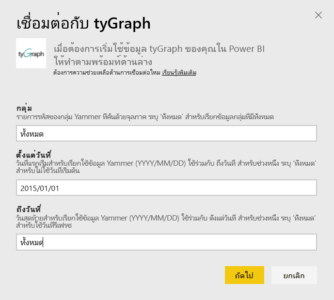
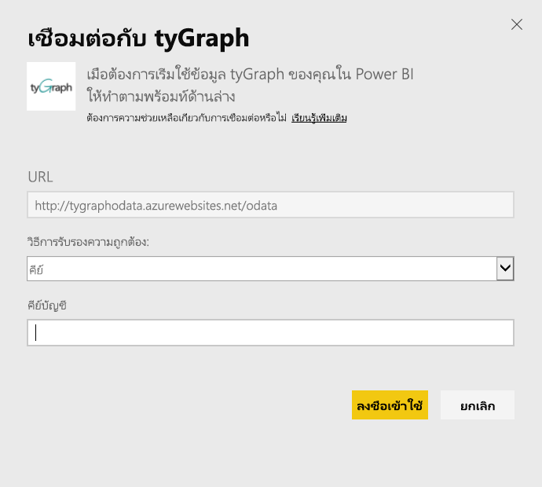
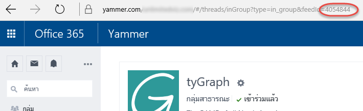

# เชื่อมต่อกับ tyGraph ด้วย Power BI
แสดงข้อมูลเป็นภาพและสำรวจข้อมูล tyGraph ของคุณใน Power BI ด้วยชุดเนื้อหา Power BI เริ่มต้นด้วยการเชื่อมต่อกับบัญชี tyGraph ของคุณ และโหลดแดชบอร์ด รายงาน และชุดข้อมูล เนื้อหาแบบใช้งานทันทีมีข้อมูลเชิงลึกเช่น Measure of Active Engagement (MAE score) และผู้สนับสนุนสูงสุด (Top Contributors) ปรับแต่งเพื่อไฮไลท์ข้อมูลเพิ่มเติมสำหรับข้อมูลที่คุณใส่ใจมากที่สุด  ระบบจะรีเฟรชข้อมูลโดยอัตโนมัติตามกำหนดการที่คุณตั้งค่าได้

เชื่อมต่อกับ[tyGraph สำหรับ Power BI](https://app.powerbi.com/getdata/services/tygraph)

## วิธีการเชื่อมต่อ
1. เลือกปุ่ม**รับข้อมูล**ที่ด้านล่างของพื้นที่นำทางด้านซ้ายมือ
   
   
2. ในกล่อง**บริการ** เลือก**รับ**
   
   
3. เลือก**tyGraph** \> **รับ**
   
   
4. ระบุกลุ่มและช่วงเวลาที่คุณต้องการเชื่อมต่อ มิฉะนั้น ระบุ "ทั้งหมด" เพื่อนำเข้าข้อมูลทั้งหมด โปรดทราบว่ารูปแบบวันที่ีที่คาดหมายคือ (ปี/เดือน/วัน) ดูรายละเอียด [การค้นหาพารามิเตอร์](#FindingParams) ที่ด้านล่าง
   
   
5. ให้คีย์ tyGraph เพื่อการเชื่อมต่อ ดูรายละเอียดการค้นพบนี้ที่ค่าด้านล่างนี้
   
    **ถ้าคุณเป็นผู้ดูแลระบบที่ผ่านการพิสูจน์ Yammer แล้ว**  
    ระบบจะส่งคีย์ API ถึงคุณในอีเมลเมื่อบัญชี tyGraph ของคุณถูกสร้างขึ้นเรียบร้อยแล้ว ถ้าคุณไม่สามารถค้นหาคีย์ของคุณได้ คุณสามารถร้องขอคีย์ใหม่ได้โดยการส่งอีเมลไปยังsupport@unlimitedviz.com ถ้าคุณยังไม่มีบัญชี tyGraph คุณสามารถเริ่มทดลองใช้ได้ที่ [http://www.tygraph.com/](http://www.tygraph.com/) 
   
    **ถ้าคุณไม่ได้เป็นผู้ดูแลระบบที่ผ่านการพิสูจน์ Yammer**
   
    ชุดเนืิ้อหา tyGraph จำเป็นต้องมีบัญชี tyGraph ที่สร้างขึ้นโดยผู้ดูแลระบบที่ผ่านการตรวจพิสูจน์ Yammer เมื่อสร้างขึ้นแล้ว ระบบจะออกคีย์เพิ่มเติมให้แก่ผู้ใช้ภายในองค์กรเดียวกัน ถ้าผู้ดูแลระบบที่ผ่านการตรวจพิสูจน์ของคุณไม่ได้สร้างบัญชี tyGraph ให้ติดต่อผู้ดูแลระบบเพื่อดำเนินการสร้างบัญชีดังกล่าว ถ้ามีแล้ว คุณสามารถร้องขอคีย์โดยการส่งอีเมลไปยัง<support@unlimitedviz.com> ได้
   
    
6. หลังจากการรับรองความถูกต้องสำเร็จแล้ว กระบวนการนำเข้าจะเริ่มโดยอัตโนมัติ เมื่อเสร็จสิ้น แดชบอร์ดใหม่ รายงาน และแบบจำลองจะปรากฏในบานหน้าต่างนำทาง เลือกแดชบอร์ดเพื่อดูข้อมูลที่นำเข้าของคุณ
   
    

**ฉันต้องทำอะไรตอนนี้**

* ลอง[ถามคำถามในกล่อง Q&A](consumer/end-user-q-and-a.md)ที่ด้านบนของแดชบอร์ด
* [เปลี่ยนไทล์](service-dashboard-edit-tile.md)ในแดชบอร์ด
* [เลือกไทล์](consumer/end-user-tiles.md)เพื่อเปิดรายงานด้านใน
* แม้ว่าชุดข้อมูลของคุณจะถูกกำหนดให้รีเฟรชรายวัน แต่คุณสามารถเปลี่ยนกำหนดการรีเฟรช หรือลองรีเฟรชตามความต้องการได้โดยใช้**รีเฟรชเดี๋ยวนี้**

## การค้นหาพารามิเตอร์
คุณสามารถนำเข้าข้อมูลในทุกกลุ่มที่คุณสามารถเข้าถึงได้ หรือคุณสามารถเลือกระบุชุดย่อยได้ นอกจากนี้ คุณยังสามารถสร้างชุดย่อยของข้อมูลแยกตามวันได้ คุณสามารถสร้างหลายแดชบอร์ด tyGraph เพื่อตรวจติดตามชุดเฉพาะของกลุ่มและ/หรือวันได้ รายละเอียดเกี่ยวกับพารามิเตอร์เหล่านี้อยู่ที่ด้านล่าง

**กลุ่ม**

TyGraph API สามารถกรองข้อมูลโดยแยกตาม ID กลุ่มที่ระบุได้ โดยกรอกส่วนเหล่านี้ในชุดเนื้อหาในรายการที่คั่นด้วยเครื่องหมายจุลภาค 

    Example: 2427647,946595,1154464

คุณสามารถระบุ ID ของกลุ่มสำหรับกลุ่มใดกลุ่มหนึ่งใน Yammer ได้ โดยการนำทางไปยังตัวดึงข้อมูลสำหรับกลุ่ม และตรวจสอบ URL นั้น

ในตัวอย่างข้างต้น Yammer Group ID คือ 4054844

**จากวันที่**

ฟังก์ชั่น จากวันที่ (From Date) จะช่วยให้คุณสามารถจำกัดค่าแรกสุดสำหรับข้อมูลที่ส่งกลับ ระบบจะโหลดเฉพาะข้อมูลที่ถูกสร้างขึ้นในวันที่นี้หรือหลังจากวันที่นี้ลงในชุดเนื้อหา รูปแบบของ จากวันที่ (From Date) จะเป็น ปี/เดือน/วัน 

    Example: 2013/10/29

ในตัวอย่างข้างต้น ข้อมูลทั้งหมดจากในวันที่หรือหลังจากวันที่ 29 ตุลาคม 2013 จะโหลดลงในชุดเนื้อหา 

ฟังก์ชั่น **ถึงวันที่ (To Date)** จะช่วยให้คุณสามารถจำกัดค่าล่าสุดสำหรับข้อมูลที่ส่งกลับ ซึ่งสามารถใช้ร่วมกันกับ จากวันที่ (From Date) เพื่อโหลดข้อมูลจากช่วงของวันที่ได้ ระบบจะโหลดเฉพาะข้อมูลที่ถูกสร้างขึ้นในวันที่นี้หรือก่อนวันที่นี้ลงในชุดเนื้อหา รูปแบบของวันที่ ถึงวันที่นี้ คือ ปี/เดือน/วัน 

    Example: 2014/10/20

ในตัวอย่างข้างต้น ทั้งหมดในวันที่หรือก่อนวันที่ 20 ตุลาคม 2014 จะโหลดข้อมูลลงในชุดเนื้อหา 

## ขั้นตอนถัดไป
[เริ่มต้นใช้งานใน Power BI](service-get-started.md)

[รับข้อมูลใน Power BI](service-get-data.md)

