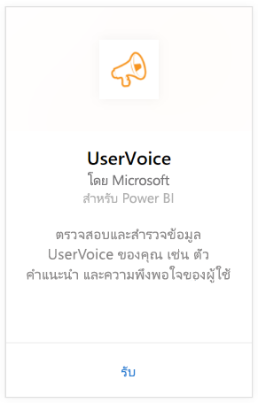
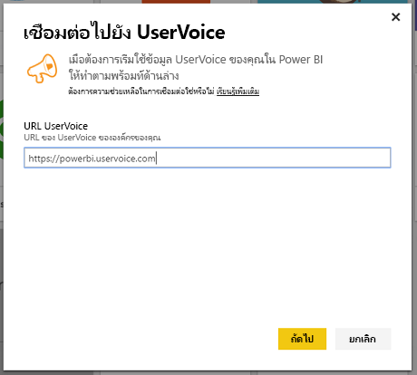
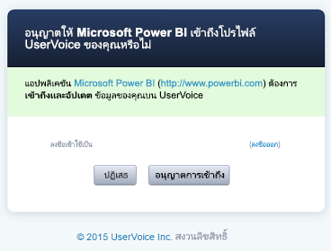
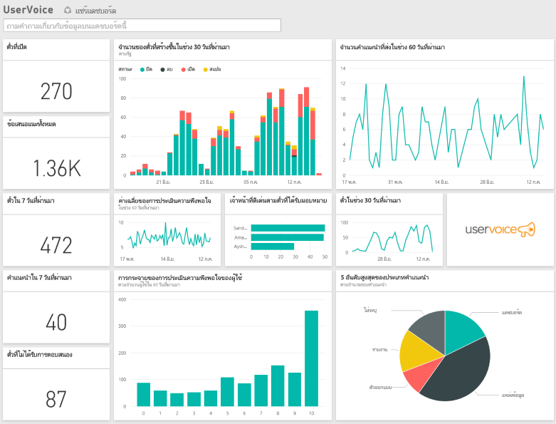

# เชื่อมต่อกับ UserVoice ด้วย Power BI
การติดตามและการสำรวจข้อมูล UserVoice ของคุณด้วย Power BI และชุดเนื้อหา UserVoice นั้นง่ายดาย Power BI ดึงข้อมูลของคุณ รวมทั้งทิ๊กเก็ต คำแนะนำและความพอใจ จากนั้นสร้างแดชบอร์ดแบบคิดนอกกรอบและรายงานที่ยึดตามข้อมูลนั้น

เชื่อมต่อกับ[ชุดเนื้อหา UserVoice](https://app.powerbi.com/getdata/services/uservoice) สำหรับ Power BI

>[!NOTE]
>จำเป็นต้องมีบัญชีผู้ดูแลระบบเพื่อเชื่อมต่อและโหลดชุดเนื้อหา Power BI ชุดเนื้อหาได้ยกระดับ UserVoice API และจะเป็นส่วนหนึ่งของการใช้งานจนถึงขีดจำกัดของ UserVoice รายละเอียดเพิ่มเติมที่ด้านล่าง

## วิธีการเชื่อมต่อ
1. เลือกปุ่ม**รับข้อมูล**ที่ด้านล่างของพื้นที่นำทางด้านซ้ายมือ
   
   
2. ในกล่อง**บริการ** เลือก**รับ**
   
    
3. เลือก**UserVoice**แล้วเลือก**รับ**
   
   
4. เมื่อได้รับการถาาม ให้ใส่ URL ของ UserVoice URL ต้องเป็นตามรูปแบบต่อไปนี้อย่างเคร่งคัด `https://fabrikam.uservoice.com` โดยแทนที่ "fabrikam" ด้วยชื่อผลิตภัณฑ์หรือบริการของคุณ
   
   >[!NOTE]
   >โปรดสังเกตว่า ไม่มีเครื่องหมายทับต่อที่ส่วนท้าย และการเชื่อมต่อจะต้องเป็น http**s**
   
   
5. เมื่อถูกถาม ให้ใส่ข้อมูลประจำตัวของ UserVoice และทำตามกระบวนการรับรองตัวตนของ UserVoice ถ้าคุณลงชื่อเข้าใช้ UserVoice อยู่แล้วในเบราว์เซอร์ของคุณ คุณอาจไม่ได้รับข้อความให้ใส่ข้อมูลประจำตัว อนุญาตให้แอปพลิเคชัน Power BI เข้าถึงในข้อมูลของคุณ โดยการคลิก "อนุญาตให้เข้าถึง"
   
   >[!NOTE]
   >คุณจำเป็นต้องมีข้อมูลประจำตัวผู้ดูแลระบบของบัญชี UserVoice ของคุณ
   
   
6. Power BI จะดึงข้อมูล UserVoice ของคุณและสร้างแดชบอร์ดและรายงานแบบพร้อมใช้งานสำหรับคุณขึ้นมา Power BI จะเรียกใช้ข้อมูลต่อไปนี้ คำแนะนำทั้งหมดของคุณ ตั๋วเปิดทั้งหมดของคุณ ตั๋วทั้งหมดที่สร้างขึ้นใน 30 วันรวมถึงตั๋วที่ปิดแล้ว และการจัดอันดับความพึงพอใจของผู้ใช้ทั้งหมด
   
   

**ฉันต้องทำอะไรตอนนี้**

* ลอง[ถามคำถามในกล่อง Q&A](consumer/end-user-q-and-a.md)ที่ด้านบนของแดชบอร์ด
* [เปลี่ยนไทล์](service-dashboard-edit-tile.md)ในแดชบอร์ด
* [เลือกไทล์](consumer/end-user-tiles.md)เพื่อเปิดรายงานด้านใน
* แม้ว่าชุดข้อมูลของคุณจะถูกกำหนดให้รีเฟรชรายวัน แต่คุณสามารถเปลี่ยนกำหนดการรีเฟรช หรือลองรีเฟรชตามความต้องการได้โดยใช้**รีเฟรชเดี๋ยวนี้**

## การแก้ไขปัญหา
**“ไม่สามารถตรวจสอบความถูกต้องของพารามิเตอร์ โปรดตรวจสอบให้แน่ใจว่าพารามิเตอร์ทั้งหมดถูกต้อง”**

ถ้าคุณเห็นข้อผิดพลาดนี้หลังจากพิมพ์ URL UserVoice ของคุณ ตรวจสอบให้แน่ใจว่าข้อกำหนดต่อไปนี้ถูกยอมรับหรือไม่

* URL เป็นตามรูปแบบนี้ `https://fabrikam.uservoice.com` โดยแทนที่ "fabrikam" ด้วยคำนำหน้า UserVoice URL ที่ถูกต้องของคุณ
* ตรวจสอบให้แน่ใจว่า ตัวอักษรทั้งหมดเป็นตัวพิมพ์เล็ก
* ตรวจสอบให้แน่ใจว่า URL เป็นแบบ 'http**s**'
* ตรวจสอบให้แน่ใจว่าไม่มีที่ส่วนท้ายของ URL หลังสแลช

**"การเข้าสู่ระบบล้มเหลว"**

ถ้าคุณได้รับข้อผิดพลาด "เข้าสู่ระบบล้มเหลว" หลังจากใช้ข้อมูลประจำตัว UserVoice เข้าระบบ จากนั้นบัญชีนี้ของคุณไม่มีสิทธิ์ในการดึงข้อมูล UserVoice จากบัญชีของคุณ ตรวจสอบนี่เป็นบัญชีผู้ดูแลระบบ และลองอีกครั้ง

**ขออภัย เกิดปัญหาบางอย่างขึ้น**

ถ้าคุณได้รับข้อผิดพลาดนี้ขณะกำลังโหลดข้อมูล ให้ตรวจสอบว่า บัญชี UserVoice ของคุณยังไม่เกินโควตาของการใช้ API การรายเดือน ถ้าทั้งหมดยังดูดี ลองเชื่อมต่ออีกครั้ง ถ้าปัญหายังคงอยู่ โปรดติดต่อฝ่ายสนับสนุน Power BI ที่ [https://community.powerbi.com](https://community.powerbi.com/)

**อื่น ๆ**  

ชุดเนื้อหา Power BI UserVoice ใช้ API ที่ของ UserVoice เพื่อรับข้อมูลของคุณ ตรวจสอบให้แน่ใจว่า คุณได้ตรวจสอบการใช้ API ของคุณเพื่อให้คุณไม่เกินขีดจำกัดของคุณ ถ้าคุณมีข้อมูลจำนวนมากในบัญชีของคุณ UserVoice คำแนะนำเพื่อลดผลกระทบต่อการใช้ API ของคุณคือเปลี่ยนความถี่ในการรีเฟรชจากค่าเริ่มต้นปัจจุบันซึ่งเป็นหนึ่งครั้งต่อวัน ให้เป็นหนึ่งครั้งต่อสัปดาห์หรือทุกๆวันอื่นขึ้นอยู่กับความต้องการของคุณ คำแนะนำของอื่นคือให้มีผู้ดูแลระบบเพียงคนเดียวที่สร้างและแชร์ชุดเนื้อหากับส่วนเหลือของทีม ทนที่จะมีผู้ดูแลทุกคนในองค์กรของคุณทำการดึงข้อมูลเอง ซึ่งทำให้ API โหลดโดยไม่จำเป็น

## ขั้นตอนถัดไป
[เริ่มต้นใช้งานใน Power BI](service-get-started.md)

[รับข้อมูลใน Power BI](service-get-data.md)

