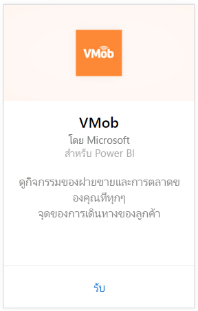
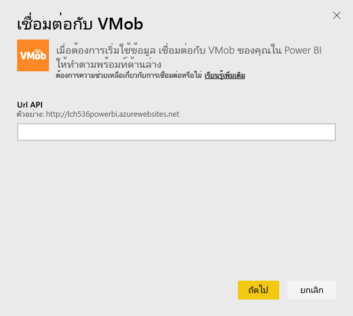
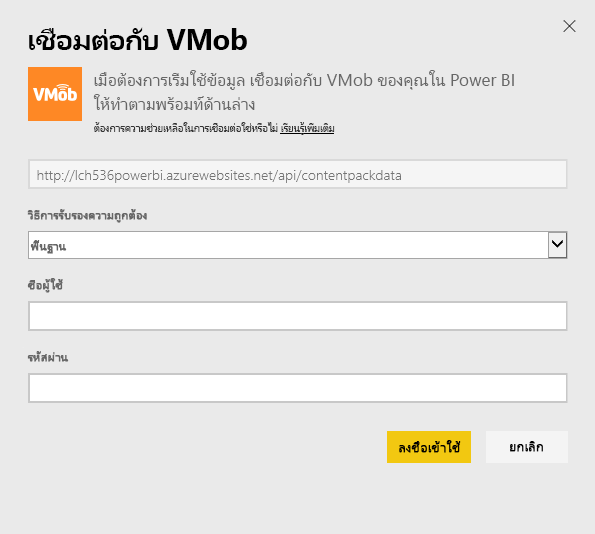
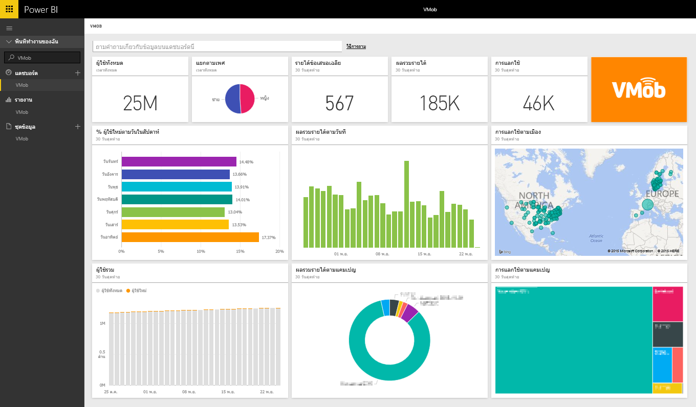

# เชื่อมต่อกับ VMob ด้วย Power BI
การติดตามและการสำรวจข้อมูล VMob ของคุณด้วย Power BI และชุดเนื้อหา VMob ทำได้ง่ายยิ่งขึ้น Power BI จะเรียกใช้ข้อมูลต่อไปนี้: สถิติผู้ใช้ในทุกเวลาและใน 30 วันที่ผ่านมา KPI ร้านค้าปลีกใน 30 วันที่ผ่านมา และประสิทธิภาพของแคมเปญในเวลา 30 วันที่ผ่านมา

เชื่อมต่อไปยัง[ชุดเนื้อหา VMob](https://app.powerbi.com/getdata/services/vmob) สำหรับ Power BI

## วิธีการเชื่อมต่อ
1. เลือกปุ่ม**รับข้อมูล**ที่ด้านล่างของพื้นที่นำทางด้านซ้ายมือ
   
    
2. ในกล่อง**บริการ** เลือก**รับ**
   
   
3. เลือก**VMob** \> **รับ**
   
   
4. เมื่อมีข้อความปรากฏ ให้ใส่ URL ของ VMob และคลิกที่ปุ่มถัดไป URL นี้จัดเตรียมโดย VMob ที่แยกต่างหาก
   
    
5. เลือกตัวเลือก**พื้นฐาน (Basic)** ในรายการวิธีการรับรองความถูกต้องแบบเลื่อนลง ใส่ชื่อผู้ใช้และรหัสผ่าน VMob ของคุณ จากนั้นคลิกที่ปุ่ม**ลงชื่อเข้าใช้**
   
    
6. กระบวนการนำเข้าจะเริ่มต้นโดยอัตโนมัติ และ Power BI จะดึงข้อมูล VMob ของคุณเพื่อสร้างรายงานและแดชบอร์ดแบบพร้อมใช้งานให้คุณ
   
   

**ฉันต้องทำอะไรต่อ?**

* ลอง[ถามคำถามในกล่อง Q&A](power-bi-q-and-a.md)ที่ด้านบนของแดชบอร์ด
* [เปลี่ยนไทล์](service-dashboard-edit-tile.md)ในแดชบอร์ด
* [เลือกไทล์](service-dashboard-tiles.md)เพื่อเปิดรายงานด้านใน
* ถึงแม้ว่าชุดข้อมูลของคุณถูกกำหนดให้รีเฟรซรายวัน คุณสามารถเปลี่ยนแปลงกำหนดเวลารีเฟรช หรือลองรีเฟรชตามความต้องการ โดยใช้**รีเฟรชทันที**

## ขั้นตอนถัดไป
[เริ่มต้นใช้งานใน Power BI](service-get-started.md)

[รับข้อมูลใน Power BI](service-get-data.md)

