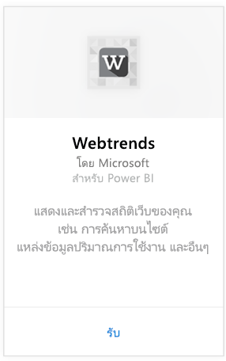
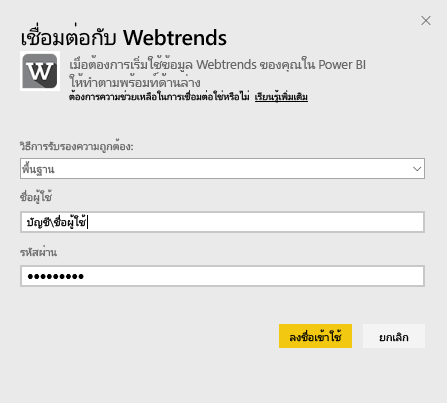
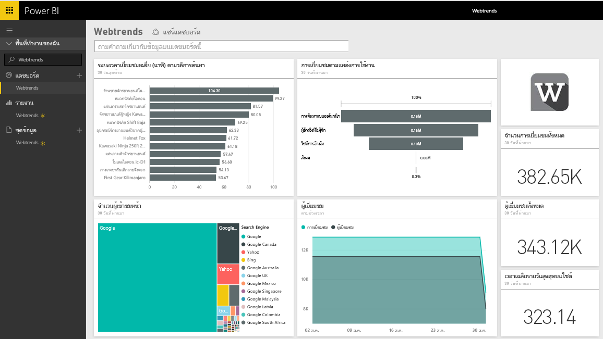
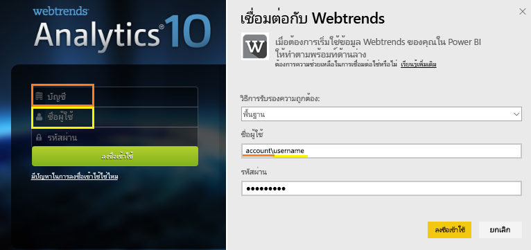

# เชื่อมต่อกับ Webtrends ด้วย Power BI
ชุดเนื้อหา Webtrends สำหรับ Power BI มีเมตริกแบบนอกกล่องหลายตัว เช่นมุมองเพจทั้งหมด และการเข้าชมด้วยปริมาณการใช้งานแหล่งข้อมูล แสดงผลเป็นภาพของข้อมูล Webtrends ของคุณใน Power BI ที่เริ่มต้นโดยการเชื่อมต่อกับบัญชี Webtrends ของคุณ คุณสามารถใช้แดชบอร์ดและรายงานที่แสดงไว้ หรือปรับแต่งเพื่อไฮไลต์ข้อมูลที่คุณสนใจมากที่สุด  ข้อมูลจะรีเฟรชโดยอัตโนมัตหนึ่งครั้งต่อวัน

เชื่อมต่อกับ[แพคเนื้อหาWebtrends สำหรับ Power BI](https://app.powerbi.com/getdata/services/webtrends)

## วิธีการเชื่อมต่อ
1. เลือกปุ่ม**รับข้อมูล**ที่ด้านล่างของพื้นที่นำทางด้านซ้ายมือ
   
   
2. ในกล่อง**บริการ** เลือก**รับ**
   
   
3. เลือก**Webtrends** \> **รับ**
   
   
4. ชุดเนื้อหานี้เชื่อมต่อกับโปรไฟล์ไอดี Webtrends แบบเฉพาะเจาะจง ดูรายละเอียดที่ [การค้นหาพารามิเตอร์นี้](#FindingParams) ที่ด้านล่าง
   
   
5. ใส่ข้อมูลประจำตัวของ Webtrends เพื่อเชื่อมต่อ โปรดทราบว่าเขตข้อมูลชื่อผู้ใช้ต้องการบัญชีผู้ใช้และชื่อผู้ใช้ของคุณ ดู[รายละเอียด](#FindingParams)ด้านล่าง
   
   
6. หลังจากอนุมัติ กระบวนการนำเข้าจะเริ่มโดยอัตโนมัติ เมื่อเสร็จสิ้น แดชบอร์ดใหม่ รายงาน และแบบจำลองจะปรากฏในบานหน้าต่างนำทาง เลือกแดชบอร์ดเพื่อดูข้อมูลที่นำเข้าของคุณ
   
   

**ฉันต้องทำอะไรตอนนี้**

* ลอง[ถามคำถามในกล่อง Q&A](power-bi-q-and-a.md)ที่ด้านบนของแดชบอร์ด
* [เปลี่ยนไทล์](service-dashboard-edit-tile.md)ในแดชบอร์ด
* [เลือกไทล์](service-dashboard-tiles.md)เพื่อเปิดรายงานด้านใน
* ถึงแม้ว่าชุดข้อมูลของคุณถูกกำหนดให้รีเฟรซรายวัน คุณสามารถเปลี่ยนแปลงกำหนดเวลารีเฟรช หรือลองรีเฟรชตามความต้องการ โดยใช้**รีเฟรชทันที**

## มีอะไรรวมอยู่บ้าง

ชุดเนื้อหา Webtrends ดึงข้อมูลจากรายงานต่อไปนี้  

| ชื่อรายงาน | รหัสรายงาน |
| --- | --- |
| เมตริกหลัก | |
| ค้นหาภายในไซต์ |34awBVEP0P6 |
| ออกจากหน้า |7FshY8eP0P6 |
| หน้าถัดไป |CTd5rpeP0P6 |
| หน้าก่อนนี้ |aSdOeaUgnP6 |
| หน้าไซต์ |oOEWQj3sUo6 |
| Clickthroughs โฆษณาภายในเว็บ |41df19b6d9f |
| เมือง |aUuHskcP0P6 |
| ประเทศ |JHWXJNcP0P6 |
| ผู้เยี่ยมชม |xPcmTDDP0P6 |
| ระยะเวลาการเยี่ยมชม |U5KAyqdP0P6 |
| วลีการค้นหา |IKYEDxIP0P6 |
| แหล่งข้อมูลปริมาณการใช้งาน |JmttAoIP0P6 |
| เครื่องมือค้นหา |yGz3gAGP0P6 |
| หน้ารายการ |i6LrkNVRUo6 |

>[!NOTE]
>สำหรับโพรไฟล์ SharePoint ชื่อเมตริกอาจแตกต่างเล็กน้อยจากสิ่งที่แสดงใน Webtrends UI การแมปต่อไปนี้เสร็จสิ้นแล้วเมื่อต้องการรักษาความสอดคล้องกันระหว่างโพรไฟล์ SharePoint และเว็บไซต์   

    - เซสชัน =การเยี่ยมชม  
    - ผู้ใช้ใหม่ =ผู้เยี่ยมชมใหม่  
    - การดูสำหรับแต่ละเซสชัน =การดูหน้าต่อการเยี่ยมชม  
    - ระยะเวลาของผู้ใช้รายวันเฉลี่ย =เวลาเฉลี่ยบนไซต์สำหรับแต่ละผู้เยี่ยมชม  

## ความต้องการของระบบ
ชุดเนื้อหานี้จำเป็นต้องมีการเข้าถึงด้วยโปรไฟล์ Webtrends ที่มี[ชุดของรายงานที่ถูกต้อง](#Included)เปิดใช้งานอยู่

## การค้นหาพารามิเตอร์
สามารถพบหัสโปรไฟล์ Webtrends ของคุณได้ใน URL หลังจากที่คุณเลือกโปรไฟล์

ข้อมูลประจำตัวของคุณจะตรงกับสิ่งที่คุณใส่เมื่อคุณลงชื่อเข้า Webtrends อย่างไรก็ตามเราคาดว่าบัญชีผู้ใช้และชื่อผู้ใช้ของคุณจะอยู่ในบรรทัดเดียวกันแล้วคั่นด้วยเครื่องหมายแบคสแลช

## การแก้ไขปัญหา
คุณอาจพบปัญหาขณะที่ชุดเนื้อหานี้กำลังโหลดอยู่ หลังจากที่คุณได้ให้ข้อมูลประจำตัวของคุณ ถ้าคุณเห็นข้อความ "Oops" ระหว่างการโหลด โปรดดูคำแนะนำแก้ปัญหาที่ด้านล่าง หากคุณยังพบปัญหานี้อยู่ กรุณายื่นตั๋วขอความช่วยเหลือที่https://support.powerbi.com

1. ใช้โปรไฟล์ ID ที่ถูกต้องกำลังถูกใช้ ให้ดู[ค้นหาพารามิเตอร์](#FindingParams)สำหรับรายละเอียดเพิ่มเติม
2. ผู้ใช้มีสิทธิ์เข้าถึงรายงานที่แสดงอยู่ในส่วน["มีอะไรบ้าง"](#Included)

## ขั้นตอนถัดไป
[Power BI คืออะไร](power-bi-overview.md)

[Power BI แนวคิดพื้นฐาน](service-basic-concepts.md)

