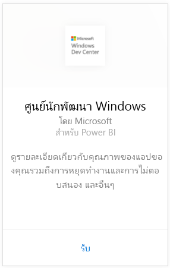
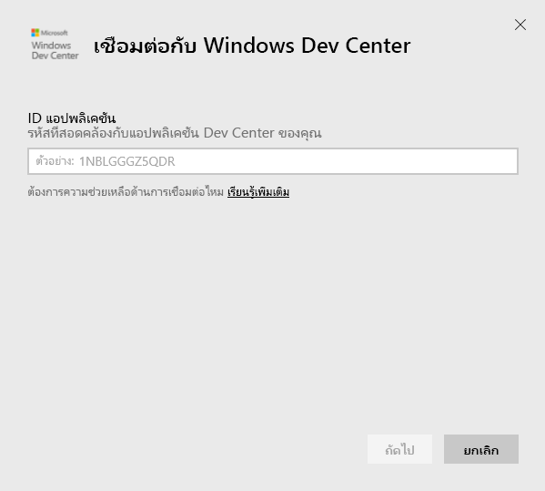
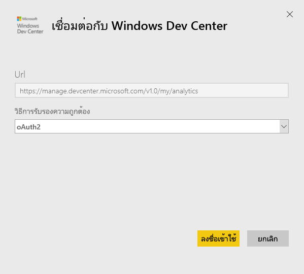
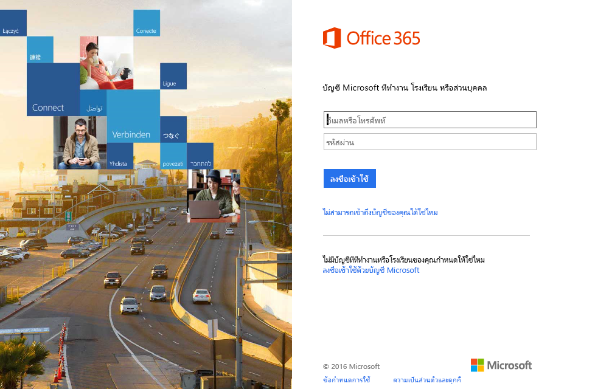
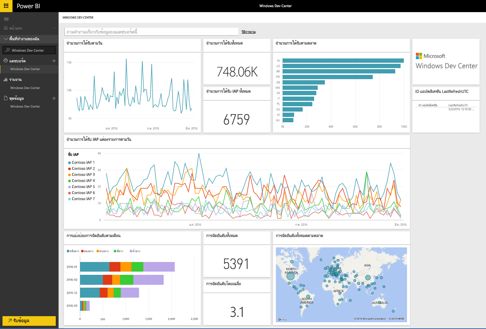
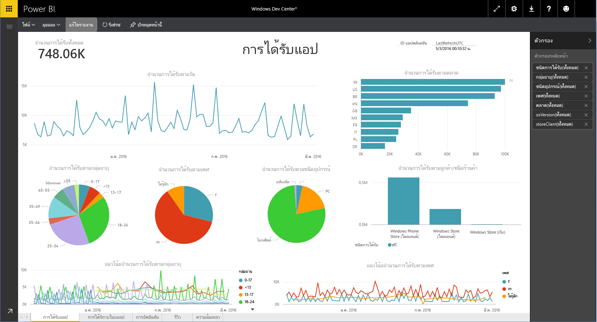

# เชื่อมต่อกับ Windows Dev Center ด้วย Power BI
สำรวจและตรวจสอบข้อมูล Windows Dev Center app analytics ใน Power BI ด้วยชุดเนื้อหา Power BI ข้อมูลจะรีเฟรชโดยอัตโนมัตหนึ่งครั้งต่อวัน

เชื่อมต่อไปยัง[ชุดเนื้อหา Windows Dev Center ](https://app.powerbi.com/getdata/services/devcenter)สำหรับ Power BI

## วิธีการเชื่อมต่อ
1. เลือกปุ่ม**รับข้อมูล**ที่ด้านล่างของพื้นที่นำทางด้านซ้ายมือ
   
   
2. ในกล่อง**บริการ** เลือก**รับ**
   
   
3. เชื่อมต่อกับ **Windows Dev Center**  \> **รับ**
   
   
4. ป้อนรหัสแอปพลิเคชันของแอปที่คุณเป็นเจ้าของ และคลิกถัดไป ดูรายละเอียดที่ [การค้นหาพารามิเตอร์เหล่านั้น](#FindingParams) ที่ด้านล่าง
   
   
5. สำหรับ **วิธีการรับรองความถูกต้อง** ให้เลือก **oAuth2** \> **ลงชื่อเข้าใช้** เมื่อได้รับการถาม ให้ใส่ข้อมูลประจำตัวของ Azure Active Directory ที่เชื่อมโยงกับบัญชีผู้ใช้ Windows Dev Center (รายละเอียดเพิ่มเติมใน[ความต้องการของระบบ](#Requirements))ของคุณ
   
    
   
    
6. หลังจากอนุมัติ กระบวนการนำเข้าจะเริ่มโดยอัตโนมัติ เมื่อเสร็จสิ้น แดชบอร์ดใหม่ รายงาน และแบบจำลองจะปรากฏในบานหน้าต่างนำทาง เลือกแดชบอร์ดเพื่อดูข้อมูลที่นำเข้าของคุณ และเลือกไทล์เพื่อนำทางไปยังรายงานด้านใน
   
    
   
    

**ฉันต้องทำอะไรตอนนี้**

* ลอง[ถามคำถามในกล่อง Q&A](consumer/end-user-q-and-a.md)ที่ด้านบนของแดชบอร์ด
* [เปลี่ยนไทล์](service-dashboard-edit-tile.md)ในแดชบอร์ด
* [เลือกไทล์](consumer/end-user-tiles.md)เพื่อเปิดรายงานด้านใน
* แม้ว่าชุดข้อมูลของคุณจะถูกกำหนดให้รีเฟรชรายวัน แต่คุณสามารถเปลี่ยนกำหนดการรีเฟรช หรือลองรีเฟรชตามความต้องการได้โดยใช้**รีเฟรชเดี๋ยวนี้**

## มีอะไรรวมอยู่บ้าง
ชุดเนื้อหาDev Center Power BI มีข้อมูลการวิเคราะห์สำหรับแอปของคุณและ การจัดหา IAP หารจัดอันดับ บทวิจารณ์ และสถานภาพแอป ข้อมูลถูกจำกัดล่าสุด 3 เดือน และเป็นหน้าต่างเคลื่อนที่ได้ ดังนั้นวันที่รวมอยู่จะถูกอัพเดตเมื่อรีเฟรชชุดข้อมูล

## ความต้องการของระบบ
ชุดเนื้อหานี้จำเป็นต้องใช้แอปอย่างน้อยหนึ่งอย่างน้อยหนึ่งแอปเพื่อเผยแพร่ไปยัง Windows Store และบัญช Windows Dev Center (รายละเอียดเพิ่มเติม[ที่นี่](https://msdn.microsoft.com/windows/uwp/publish/manage-account-users))

## การค้นหาพารามิเตอร์
คุณสามารถค้นหา ID ของแอปพลิเคชั่น โดยไปที่หน้าข้อมูลประจำตัวแอปภายใต้การจัดการแอป

ID แอปพลิเคชัน อยู่ที่ส่วนท้ายของ URL สำหรับ Windows 10 Store ของคุณ https://www.microsoft.com/store/apps/ **{applicationId}**

## ขั้นตอนถัดไป
[เริ่มต้นใช้งานใน Power BI](service-get-started.md)

[รับข้อมูลใน Power BI](service-get-data.md)

