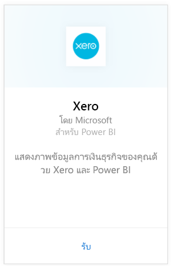
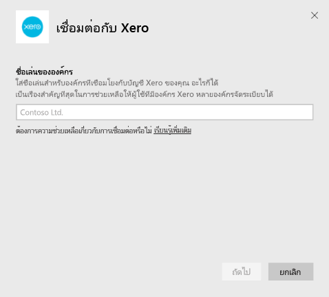
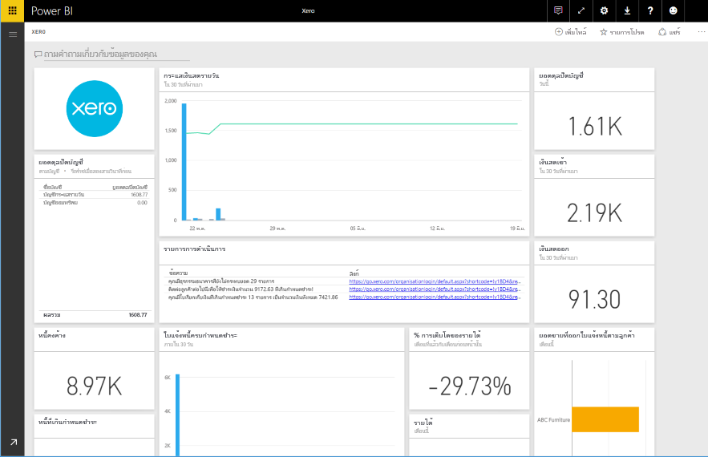

# เชื่อมต่อกับ Xero ด้วย Power BI
Xero ใช้งานบัญชีซอฟต์แวร์ online อย่างง่ายดาย ที่ถูกออกแบบมาสำหรับธุรกิจขนาดเล็กโดยเฉพาะ สร้างการแสดงภาพดึงดูดความสนใจที่ยึดตาม financials Xero ของคุณกับชุดเนื้อหา Power BI นี้ แดชบอร์ดเริ่มต้นของคุณรวมเมตริกธุรกิจขนาดเล็กมากมายเช่นฐานะเงินสด รายได้เทียบกับค่าใช้จ่าย แนวโน้มการสูญเสียกำไร วันที่เป็นหนี้ และการคืนทุน

เชื่อมต่อกับ[ชุดเนื้อหา Xero](https://app.powerbi.com/getdata/services/xero)สำหรับ Power BI หรือเรียนรู้เพิ่มเติมเกี่ยวกับการรวมกันของ[Xero และ Power BI](https://help.xero.com/Power-BI)

## วิธีการเชื่อมต่อ
1. เลือกปุ่ม**รับข้อมูล**ที่ด้านล่างของพื้นที่นำทางด้านซ้ายมือ
   
   
2. ในกล่อง**บริการ** เลือก**รับ**
   
   
3. เลือก**Xero** \> **รับ**
   
   
4. ใส่ชื่อเล่นสำหรับองค์กรที่เชื่อมโยงกับบัญชี Xero ของคุณ อะไรก็เป็นไปได้ นี่คือส่วนใหญ่เพื่อช่วยให้ผู้ใช้กับองค์กร Xero หลายตัวที่เป็นแบบเส้นตรงทั้งหมด ดูรายละเอียด[ด้านล่าง](#FindingParams)
   
   
5. สำหรับ**วิธีการรับรองตัวตน**และเลือก**OAuth**เมื่อลงชื่อเข้า Xero ของคุณและเลือกองค์กรเพื่อเชื่อม เมื่อเข้าสู่ระบบเสร็จสมบูรณ์แล้ว ให้เลือก**ลงชื่อเข้าใช้**เพื่อเริ่มกระบวนการการโหลด
   
    
   
    
6. หลังจากอนุมัติ กระบวนการนำเข้าจะเริ่มโดยอัตโนมัติ เมื่อเสร็จสิ้น แดชบอร์ดใหม่ รายงาน และแบบจำลองจะปรากฏในบานหน้าต่างนำทาง เลือกแดชบอร์ดเพื่อดูข้อมูลที่นำเข้าของคุณ
   
     

**ฉันต้องทำอะไรตอนนี้**

* ลอง[ถามคำถามในกล่อง Q&A](consumer/end-user-q-and-a.md)ที่ด้านบนของแดชบอร์ด
* [เปลี่ยนไทล์](service-dashboard-edit-tile.md)ในแดชบอร์ด
* [เลือกไทล์](consumer/end-user-tiles.md)เพื่อเปิดรายงานด้านใน
* แม้ว่าชุดข้อมูลของคุณจะถูกกำหนดให้รีเฟรชรายวัน แต่คุณสามารถเปลี่ยนกำหนดการรีเฟรช หรือลองรีเฟรชตามความต้องการได้โดยใช้**รีเฟรชเดี๋ยวนี้**

## มีอะไรรวมอยู่บ้าง
แดชบอร์ดชุดเนื้อหาประกอบด้วยไทล์และเมตริกที่ครอบคลุมหลายพื้นที่ พร้อมกับรายงานที่เกี่ยวข้องเมื่อต้องการเรียนรู้เพิ่มเติม  

| พื้นที่ | แดชบอร์ดไทล์ | รายงาน |
| --- | --- | --- |
| เงินสด |กระแสเงินสดรายวัน  เงินสดเข้า  เงินสดออก  ยอดดุลปิดบัญชี ตามบัญชีผู้ใช้  ยอดดุลปิดบัญชีวันนี้ |บัญชีธนาคาร |
| ลูกค้า |ยอดขายที่ออกใบแจ้งหนี้  ยอดขายที่ออกใบแจ้งหนี้ตามลูกค้า  แนวโน้มการเพิ่มยอดขายที่ออกใบแจ้งหนี้  ใบแจ้งหนี้ครบกำหนดชำระ  หนี้คงค้าง  หนี้ที่เกินกำหนดชำระ |ลูกค้า  สินค้าคงคลัง |
| ผู้ขาย |การสั่งซื้อที่เรียกเก็บเงิน  การสั่งซื้อที่เรียกเก็บเงินโดยผู้ขาย  แนวโน้มการเติบโตของการสั่งซื้อที่เรียกเก็บเงิน   ใบเรียกเก็บเงินที่ครบกำหนด  เจ้าหนี้คงเหลือ  เจ้าหนี้เกินกำหนด |ผู้ขาย  สินค้าคงคลัง |
| สินค้าคงคลัง |ยอดขายรายเดือนตามผลิตภัณฑ์ |สินค้าคงคลัง |
| กำไรขาดทุน |กำไรและขาดทุนรายเดือน  กำไรสุทธีนี้  กำไรสุทธิเดือนนี้  บัญชีค่าใช้จ่ายสูงสุด |กำไรขาดทุน |
| งบดุล |สินทรัพย์รวม  หนี้สินรวม  ส่วนผู้ถือหุ้น |งบดุล |
| สถานภาพ |อัตราส่วนปัจจุบัน  อัตรากำไรขั้นต้น   อัตราผลตอบแทนจากสินทรัพย์รวม  อัตราส่วนหนี้สินรวมต่อส่วนของผู้ถือหุ้น |สถานภาพ  อภิธานศัพท์และบันทึกทางเทคนิค |

ชุดข้อมูลยังรวมถึงตารางต่อไปนี้เพื่อกำหนดค่ารายงานและแดชบอร์ดของคุณ  

* ที่อยู่  
* คำเตือน  
* ยอดคงเหลือในบัญชีประจำวันของธนาคาร  
* งบธนาคาร  
* ที่ติดต่อ  
* การเบิกค่าใช้จ่าย  
* รายการใบแจ้งหนี้  
* ใบแจ้งหนี้  
* รายการ  
* สิ้นสุดเดือน  
* องค์กร  
* งบดุลทดลอง  
* บัญชี Xero

## ความต้องการของระบบ
จำเป็นต้องเข้าถึงชุดเนื้อหา Xero ต้องการบทบาทต่อไปนี้ "รายงาน +มาตรฐาน" หรือ "ผู้แนะนำ"

## การค้นหาพารามิเตอร์
ใส่ชื่อสำหรับองค์กรของคุณเพื่อติดตามใน Power BI สิ่งนี้ทำให้คุณสามารถเชื่อมต่อกับองค์กรหลายองค์กรได้ โปรดทราบว่า คุณไม่สามารถเชื่อมต่อกับองค์กรเดียวกันหลายครั้ง ซึ่งจะส่งผลต่อการรีเฟรชตามกำหนดการ   

## การแก้ไขปัญหา
* ผู้ใช้ Xero ต้องมีบทบาทต่อไปนี้เพื่อเข้าถึงชุดเนื้อหา Xero สำหรับ Power BI: "รายงาน +มาตรฐาน" หรือ "ผู้แนะนำ" ชุดเนื้อหาอิงตามการให้อนุญาตแก่ผู้ใช้เพื่อเข้าถึงข้อมูลรายงานผ่านทาง Power BI  
* ถ้าคุณได้รับข้อความล้มเหลวหลังจากการโหลดบางครั้ง ตรวจสอบระยะเวลาเพื่อดูข้อความข้อผิดพลาดนั้น โปรดทราบว่า access token ที่ Xero ให้มา สามารถใช้ได้แค่เพียง 30 นาที ดังนั้นบัญชีที่มีข้อมูลมากกว่าที่ถูกโหลดในกรอบเวลาจะล้มเหลว เราได้ทำงานอย่างหนักเพื่อปรับปรุงส่วนนี้
* ในระหว่างการโหลด ไทล์บนแดชบอร์ดที่จะอยู่ในสถานะโหลดแบบทั่วไป ซึ่งคาดว่าจะไม่เปลี่ยนจนกว่าการโหลดจะเสร็จสิ้นโดยสมบูรณ์ ถ้าคุณได้รับการแจ้งเตือนว่าการโหลดของคุณเสร็จสมบูรณ์แล้ว แต่ยังคงมีไทล์กำลังโหลด ลองรีเฟรชแดชบอร์ดไทล์โดยใช้...ในด้านบนขวาของแดชบอร์ดของคุณ
* ถ้าชุดเนื้อหาของคุณล้มเหลวในการรีเฟรช โปรดตรวจสอบถ้าคุณมีการเชื่อมต่อกับองค์กรเดียวกันมากกว่าหนึ่งครั้งใน Power BI หรือไม่ Xero ช่วยให้การเชื่อมต่อแบบเดี่ยวกับองค์กรการเท่านั้น และคุณอาจเห็นข้อผิดพลาดที่ระบุข้อมูลประจำตัวของคุณว่าไม่ถูกต้อง ถ้าคุณเชื่อมต่อไปยังตำแหน่งเดียวกันมากกว่าหนึ่งครั้ง  
* สำหรับปัญหาการเชื่อมต่อชุดเนื้อหา Xero กับ Power BI เช่นข้อความข้อผิดพลาดหรือเวลาในการโหลดช้า ก่อนอื่นให้ล้างแคช / คุกกี้และรีสตาร์ตเบราว์เซอร์ แล้วเชื่อมต่อกับ Power BI  

สำหรับปัญหาอื่นๆ โปรดรายงานที่ http://support.powerbi.com ถ้าปัญหายังคงมีอยู่

## ขั้นตอนถัดไป
[เริ่มต้นใช้งานใน Power BI](service-get-started.md)

[รับข้อมูลใน Power BI](service-get-data.md)

