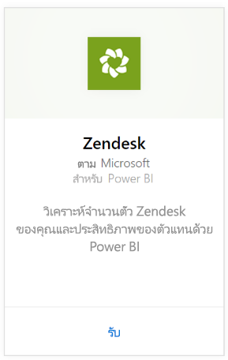
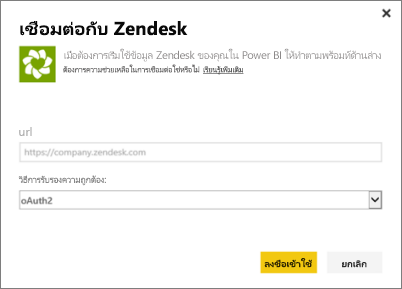
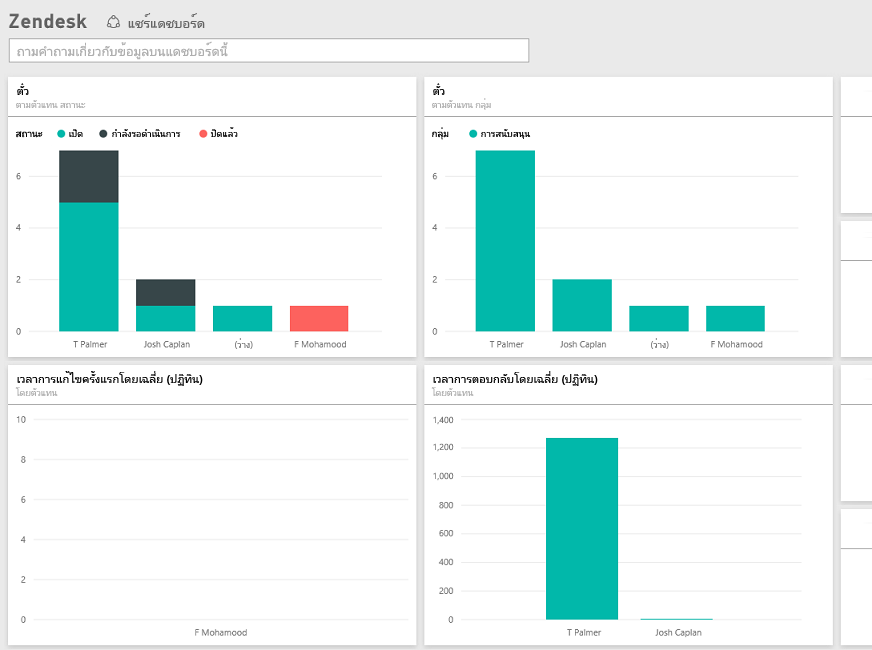

# เชื่อมต่อกับ Zendesk ด้วย Power BI
ชุดเนื้อหา Zendesk นำเสนอแดชบอร์ด Power BI และชุดของรายงาน Power BI ที่มีข้อมูลเชิงลึกเกี่ยวกับปริมาณตั๋วและประสิทธิภาพการทำงานของบริษัทตัวแทน คุณสามารถใช้แดชบอร์ดและรายงานที่มีให้ได้ หรือปรับแต่งเพื่อไฮไลท์ข้อมูลที่คุณสนใจมากที่สุด  ข้อมูลจะรีเฟรชโดยอัตโนมัติหนึ่งครั้งต่อวัน 

เชื่อมต่อไปยัง[ชุดเนื้อหา Zendesk](https://app.powerbi.com/getdata/services/zendesk)หรืออ่านเพิ่มเติมเกี่ยวกับการ[รวม Zendesk](https://powerbi.microsoft.com/integrations/zendesk)กับ Power BI

>[!NOTE]
>จำเป็นต้องมีบัญชีผู้ดูแลระบบ Zendesk เพื่อเชื่อมต่อ รายละเอียดเพิ่มเติมเกี่ยวกับ[ข้อกำหนด](#Requirements)ที่ด้านล่าง

## วิธีการเชื่อมต่อ
1. เลือกปุ่ม**รับข้อมูล**ที่ด้านล่างของพื้นที่นำทางด้านซ้ายมือ
   
   
2. ในกล่อง**บริการ** เลือก**รับ**
   
    
3. เลือก**Zendesk** \> **รับ**
   
   
4. ให้ URL ที่เชื่อมโยงกับบัญชีของคุณ นี่จะเป็นในรูปแบบ**https://company.zendesk.com** ดูรายละเอียดบน[ค้นหาพารามิเตอร์](#FindingParams)เหล่านี้ที่ด้านล่าง
   
   
5. เมื่อมีข้อความปรากฏ ใส่ข้อมูลประจำตัวของ Zendesk  เลือก**oAuth 2**เป็นกลไกการรับรองความถูกต้อง แล้วคลิก**ลงชื่อเข้าใช้** ทำตามขั้นตอนการรับรองความถูกต้อง Zendesk (ถ้าคุณลงชื่อเข้าใช้ Zendesk อยู่แล้วในเบราว์เซอร์ของคุณ คุณอาจไม่ได้รับข้อความปรากฏให้ใส่ข้อมูลประจำตัว)
   
   > [!NOTE]
   > คุณต้องเชื่อมต่อกับบัญชีผู้ดูแลระบบ Zendesk สำหรับชุดเนื้อหานี้ 
   > 
   > 
   
   
6. คลิก**อนุญาต**เพื่ออนุญาตให้ Power BI เข้าถึงข้อมูล Zendesk ของคุณ
   
   
7. คลิก **เชื่อมต่อ** เพื่อเริ่มกระบวนการนำเข้า หลังจาก Power BI นำเข้าข้อมูล คุณเห็นแดชบอร์ด รายงาน และชุดข้อมูลใหม่ในแผงนำทางด้านซ้าย รายการใหม่จะถูกทำเครื่องหมายด้วย เครื่องหมายดอกจันสีเหลือง\*
   
   

**ฉันต้องทำอะไรตอนนี้**

* ลอง[ถามคำถามในกล่อง Q&A](consumer/end-user-q-and-a.md)ที่ด้านบนของแดชบอร์ด
* [เปลี่ยนไทล์](service-dashboard-edit-tile.md)ในแดชบอร์ด
* [เลือกไทล์](consumer/end-user-tiles.md)เพื่อเปิดรายงานด้านใน
* แม้ว่าชุดข้อมูลของคุณจะถูกกำหนดให้รีเฟรชรายวัน แต่คุณสามารถเปลี่ยนกำหนดการรีเฟรช หรือลองรีเฟรชตามความต้องการได้โดยใช้**รีเฟรชเดี๋ยวนี้**

## มีอะไรรวมอยู่บ้าง
ชุดเนื้อหา Power BI ประกอบด้วยข้อมูลต่อไปนี้:  

* ผู้ใช้ (ผู้ใช้ปลายทางและตัวแทน)  
* องค์กร  
* กลุ่ม  
* ตั๋ว  

นอกจากนี้ยังมีชุดของหน่วยวัดที่มีการคำนวณ เช่น เวลาเฉลี่ยในการรอและจำนวนตั๋วที่ได้รับการแก้ไขใน 7 วันที่ผ่าน รายการทั้งหมดจะรวมอยู่ในชุดเนื้อหา

## ข้อกำหนดของระบบ
บัญชีผู้ดูแลระบบ Zendesk จำเป็นสำหรับการเข้าถึงชุดเนื้อหา Zendesk ถ้าคุณตัวแทนหรือเป็นผู้ใช้ปลายทาง และคุณสนใจดูข้อมูล Zendesk ของคุณ โปรดเพิ่มคำแนะนำและตรวจทานตัวเชื่อมต่อ Zendesk ในการ[Power BI Desktop](desktop-connect-to-data.md)

## การค้นหาพารามิเตอร์
URL ของ Zendesk ของคุณจะเหมือนกับ URL ที่คุณใช้เพื่อลงชื่อเข้าใช้บัญชี Zendesk ของคุณ ถ้าคุณไม่แน่ใจใน URL ของ Zendesk ของคุณ คุณสามารถใช้ตัว[ช่วยเหลือในการเข้าสู่ระบบ](https://www.zendesk.com/login/) สำหรับ Zendesk ได้

## การแก้ไขปัญหา
ถ้าคุณมีปัญหาในการเชื่อมต่อ กรุณาตรวจสอบ URL ของ Zendesk ของคุณ และยืนยันว่าคุณกำลังใช้บัญชีผู้ดูแลระบบ Zendesk

## ขั้นตอนถัดไป
* [Power BI คืออะไร](power-bi-overview.md)
* [รับข้อมูล](service-get-data.md)

