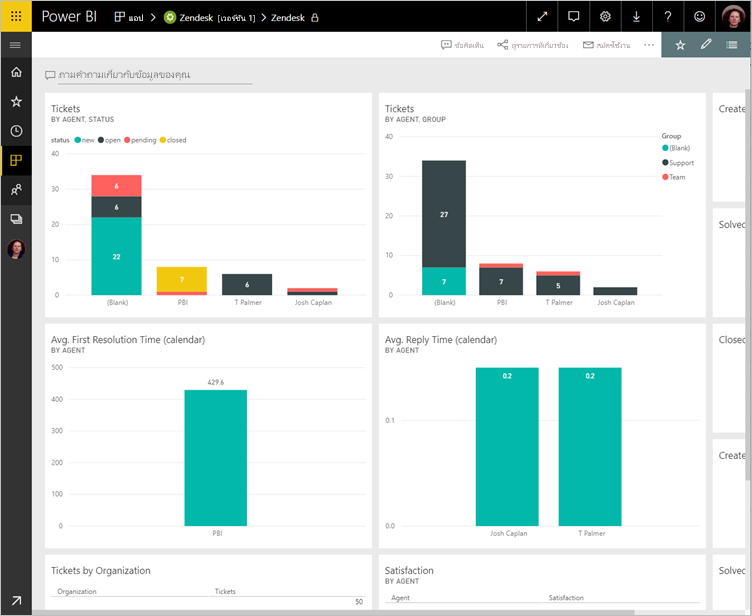

# เชื่อมต่อกับ Zendesk ด้วย Power BI

บทความนี้แนะนำคุณเกี่ยวกับการดึงข้อมูลของคุณจากบัญชี Zendesk ของคุณกับแอป Power BI เทมเพลต แอ Zendesk มีแดชบอร์ด Power BI และชุดของรายงาน Power BI ที่ให้ข้อมูลเชิงลึกเกี่ยวกับปริมาณตั๋วและประสิทธิภาพของตัวแทน ข้อมูลถูกรีเฟรชโดยอัตโนมัติวันละครั้ง 

หลังจากที่คุณติดตั้งแอปเทมเพล คุณสามารถกำหนดแดชบอร์ดและรายงานเพื่อเน้นข้อมูลที่คุณสนใจมากที่สุด จากนั้น คุณสามารถแจกจ่ายเป็นแอปให้เพื่อนร่วมงานในองค์กรของคุณ

เชื่อมต่อไปยัง[ชุดเนื้อหา Zendesk](https://app.powerbi.com/getdata/services/zendesk)หรืออ่านเพิ่มเติมเกี่ยวกับการ[รวม Zendesk](https://powerbi.microsoft.com/integrations/zendesk)กับ Power BI

หลังจากที่คุณติดตั้งแอปเทมเพล คุณสามารถเปลี่ยนแดชบอร์ดและรายงาน จากนั้น คุณสามารถแจกจ่ายเป็นแอปให้เพื่อนร่วมงานในองค์กรของคุณ

>[!NOTE]
>คุณต้องมีบัญชีผู้ดูแลระบบ Zendesk เพื่อเชื่อมต่อ รายละเอียดเพิ่มเติมเกี่ยวกับ[ข้อกำหนด](#system-requirements) อยู่ที่ด้านล่าง

## วิธีการเชื่อมต่อ

[!INCLUDE [powerbi-service-apps-get-more-apps](./includes/powerbi-service-apps-get-more-apps.md)]

3. เลือก**Zendesk** \> **รับทันที**
4. ใน**ติดตั้งแอป Power BI นี้ใช่ไหม**เลือก**ติดตั้ง**
4. ในการ**แอ**บานหน้าต่าง เลือกแบบ**Zendesk**ไทล์

    

6. ใน**เริ่มต้นใช้งานแอปของคุณใหม่**เลือก**เชื่อมต่อข้อมูล**

    

4. ให้ URL ที่เชื่อมโยงกับบัญชีของคุณ URL มีรูปแบบ **https://company.zendesk.com** ดูรายละเอียดที่ [การค้นหาพารามิเตอร์เหล่านี้](#finding-parameters) ด้านล่าง
   
   

5. เมื่อมีข้อความปรากฏ ใส่ข้อมูลประจำตัวของ Zendesk  เลือก**oAuth 2**เป็นกลไกการรับรองความถูกต้อง แล้วคลิก**ลงชื่อเข้าใช้** ทำตามขั้นตอนการรับรองความถูกต้อง Zendesk (ถ้าคุณกำลังอยู่แล้วลงชื่อเข้าใช้ Zendesk ในเบราว์เซอร์ของคุณ คุณอาจไม่ได้รับพร้อมท์สำหรับข้อมูลประจำตัว)
   
   > [!NOTE]
   > ชุดเนื้อหานี้จำเป็นต้องให้คุณเชื่อมต่อกับบัญชีผู้ดูแลระบบ Zendesk 
   > 
   
   
6. คลิก**อนุญาต**เพื่ออนุญาตให้ Power BI เข้าถึงข้อมูล Zendesk ของคุณ
   
   
7. คลิก **เชื่อมต่อ** เพื่อเริ่มกระบวนการนำเข้า 
8. หลังจาก Power BI นำเข้าข้อมูล คุณเห็นรายการเนื้อหาสำหรับแอปของคุณ Zendesk: แดชบอร์ดใหม่ รายงาน และชุดข้อมูล
9. เลือกแดชบอร์ดเพื่อเริ่มกระบวนการสำรวจ

    
   
## ปรับเปลี่ยน และแจกจ่ายแอปของคุณ

คุณได้ติดตั้งแอปเทมเพล Zendesk ซึ่งหมายความว่า คุณจะสร้างพื้นที่ทำงานแอ Zendesk ในพื้นที่ทำงาน คุณสามารถเปลี่ยนรายงานและแดชบอร์ด และแจกจ่ายเป็นแอ*แอ*ให้เพื่อนร่วมงานในองค์กรของคุณได้ 

1. เมื่อต้องดูเนื้อหาทั้งหมดของ Zendesk พื้นที่ทำงานใหม่ ในแถบนำทางด้านซ้าย เลือก**พื้นที่ทำงาน** > **Zendesk** 

    

    มุมมองนี้คือ รายการเนื้อหาสำหรับพื้นที่ทำงาน ในมุมขวาบน คุณเห็น**อัปเดตแอปฯ** เมื่อคุณพร้อมที่จะแจกจ่ายแอปของคุณให้เพื่อนร่วมงานของคุณ ที่อยู่ที่คุณจะเริ่มต้น 

    

2. เลือก**รายงาน**และ**ชุดข้อมูล**เพื่อดูองค์ประกอบอื่น ๆ ในพื้นที่ทำงาน

    อ่านเกี่ยวกับ[แจกจ่ายแอ](service-create-distribute-apps.md)ให้เพื่อนร่วมงานของคุณ

## ความต้องการของระบบ
บัญชีผู้ดูแลระบบ Zendesk จำเป็นสำหรับการเข้าถึงชุดเนื้อหา Zendesk ถ้าคุณเป็นตัวแทน หรือผู้ใช้ปลายทาง และคุณสนใจดูข้อมูล Zendesk ของคุณ เพิ่มคำแนะนำ และตรวจทานตัวเชื่อมต่อ Zendesk ในการ[Power BI Desktop](desktop-connect-to-data.md)

## การค้นหาพารามิเตอร์
URL ของ Zendesk ของคุณจะเหมือนกับ URL ที่คุณใช้เพื่อลงชื่อเข้าใช้บัญชี Zendesk ของคุณ ถ้าคุณไม่แน่ใจใน URL ของ Zendesk ของคุณ คุณสามารถใช้ตัว[ช่วยเหลือในการเข้าสู่ระบบ](https://www.zendesk.com/login/) สำหรับ Zendesk ได้

## การแก้ไขปัญหา
ถ้าคุณกำลังมีปัญหาการเชื่อมต่อ ตรวจสอบ URL ของ Zendesk ของคุณ และยืนยันว่า คุณกำลังใช้บัญชีผู้ดูแลระบบ Zendesk

## ขั้นตอนถัดไป

* [สร้างพื้นที่ทำงานใหม่ใน Power BI](service-create-the-new-workspaces.md)
* [ติดตั้งและใช้แอปฯใน Power BI](consumer/end-user-apps.md)
* [เชื่อมต่อกับแอป Power BI สำหรับบริการภายนอก](service-connect-to-services.md)
* มีคำถามหรือไม่ [ลองถามชุมชน Power BI](http://community.powerbi.com/)

