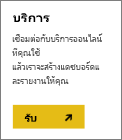
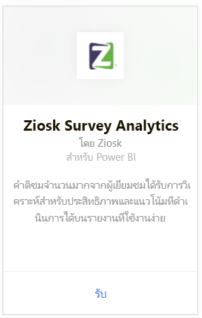
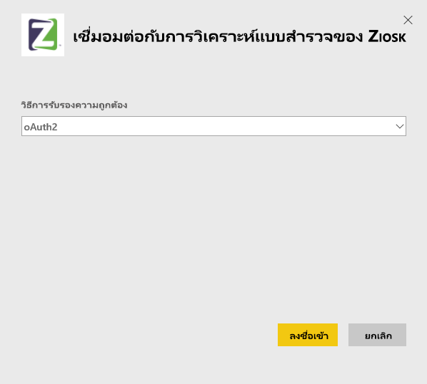
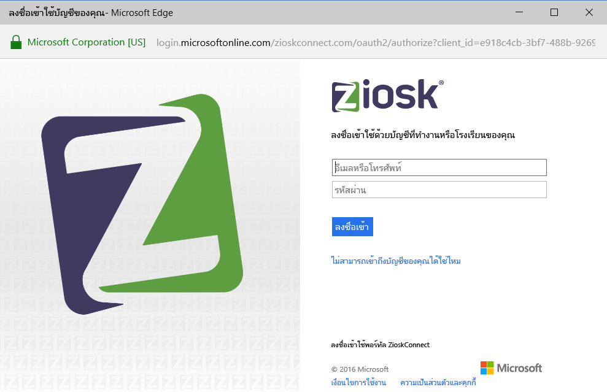
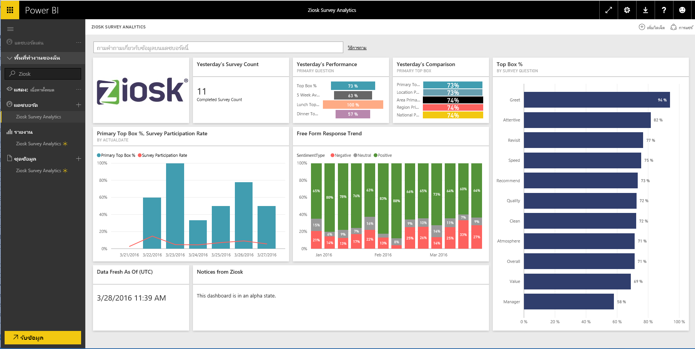

# เชื่อมอมต่อกับ Ziosk Survey Analytics ด้วย Power BI
แพ็คเนื้อหาสำหรับ Power BI มีการนำเสนอร้านอาหาร ด้วยแท็บเล็ต Ziosk มีการเข้าถึงข้อมูลเชิงลึกที่ให้มาโดยข้อมูลสำรวจ Ziosk รวมถึงการแบ่งเซกเมนต์ โดยวัน ตำแหน่งที่ตั้ง พนักงาน และอื่น ๆ

เชื่อมต่อไปยัง[ชุดเนื้อหา Ziosk Survey Analytics](https://app.powerbi.com/getdata/services/ziosk-survey-analytics)สำหรับ Power BI

## วิธีการเชื่อมต่อ
1. เลือกปุ่ม**รับข้อมูล**ที่ด้านล่างของพื้นที่นำทางด้านซ้ายมือ  
   
    
2. ในกล่อง**บริการ** เลือก**รับ**  
   
    
3. เลือก**Ziosk Survey Analytics**แล้วเลือก**รับ**  
   
    
4. เลือก**OAuth 2**แล้วเลือก**ลงชื่อเข้าใช้** เมื่อไดมีการถามคำถาม ให้ใส่ข้อมูลประจำตัว Ziosk ของคุณ
   
    
   
    
5. เมื่อเชื่อมต่อแล้ว แดชบอร์ด รายงาน และชุดข้อมูลจะโหลดโดยอัตโนมัต เมื่อเสร็จสมบูรณแล้ว์ ไทล์จะอัปเดตด้วยข้อมูลจากบัญชี Ziosk ของคุณ
   
    

**ฉันต้องทำอะไรตอนนี้**

* ลอง[ถามคำถามในกล่อง Q&A](consumer/end-user-q-and-a.md)ที่ด้านบนของแดชบอร์ด
* [เปลี่ยนไทล์](service-dashboard-edit-tile.md)ในแดชบอร์ด
* [เลือกไทล์](consumer/end-user-tiles.md)เพื่อเปิดรายงานด้านใน
* แม้ว่าชุดข้อมูลของคุณจะถูกกำหนดให้รีเฟรชรายวัน แต่คุณสามารถเปลี่ยนกำหนดการรีเฟรช หรือลองรีเฟรชตามความต้องการได้โดยใช้**รีเฟรชเดี๋ยวนี้**

## มีอะไรรวมอยู่บ้าง
ชุดเนื้อหานี้ประกอบด้วยข้อมูลจากตารางต่อไปนี้  

    - ประเภทแอลกอฮอล์  
    - ประเภทอาหารเรียกน้ำย้อย  
    - CommentKeywords  
    - วันที่  
    - Daypart  
    - ประเภทขนมหวาน  
    - FreeForm  
    - ประเภทของเด็ก  
    - ข้อความ  
    - ประเภทเนื้อหา premium  
    - คำถาม  
    - จัดเก็บ  
    - แบบสำรวจ  
    - WEEKDAY  

## ความต้องการของระบบ
บัญชีของ Ziosk ที่ มีสิทธิ์ในการตารางข้างต้นจำเป็นต้องใช้เพื่อสร้างอินสแตนซ์ของชุดเนื้อหานี้

## ขั้นตอนถัดไป
[Power BI คืออะไร](power-bi-overview.md)

[Power BI แนวคิดพื้นฐาน](consumer/end-user-basic-concepts.md)

