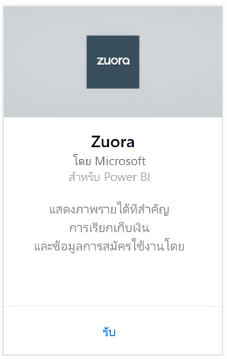
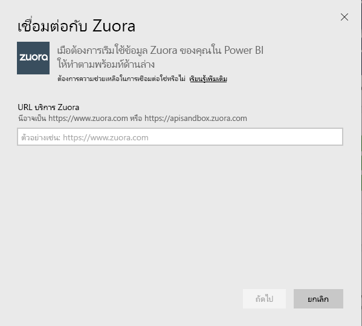
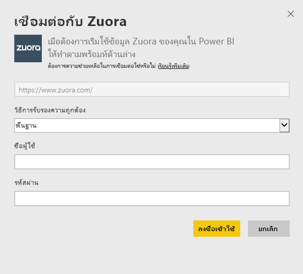
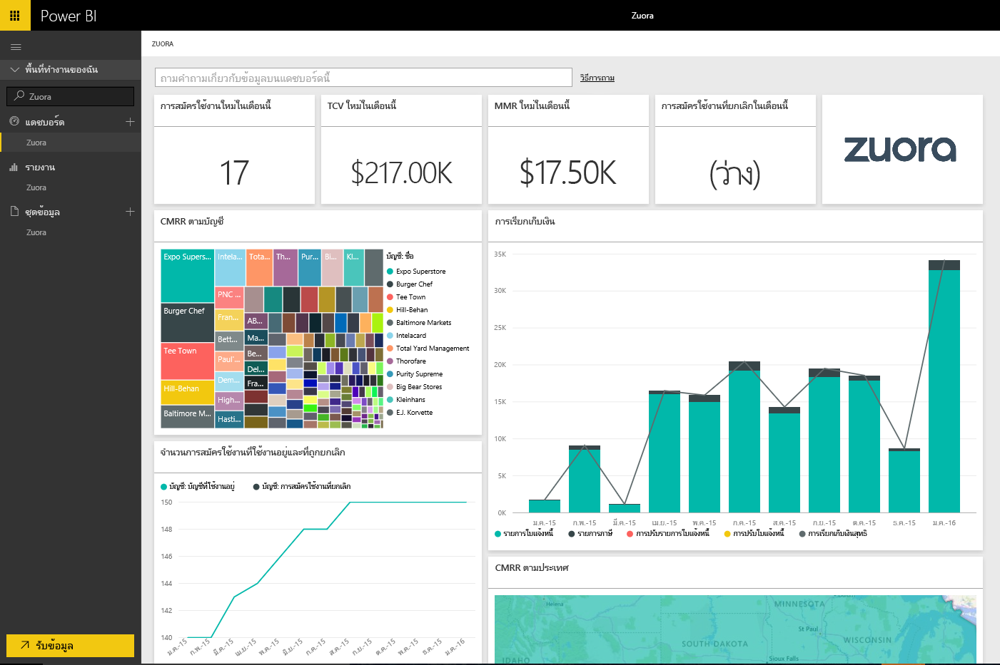

# เชื่อมต่อกับ Zuora ด้วย Power BI
Zuora สำหรับ Power BI อนุญาตให้คุณแสดงภาพข้อมูลรายได้ที่สำคัญ การเรียกเก็บเงิน และสมัครใช้งาน ใช้แดชบอร์ดตามค่าเริ่มต้นและรายงานเพื่อวิเคราะห์แนวโน้มการใช้งาน ติดตามการเรียกเก็บเงินตามและการชำระเงิน และตรวจสอบรายได้ที่เป็นกิจวัตร หรือกำหนดสิ่งเหล่านั้นให้ตรงกับแดชบอร์ดแบบไม่ซ้ำของคุณเองและการรายงานความต้องการ

เชื่อมต่อไปยัง[Zuora](https://app.powerbi.com/getdata/services/Zuora)สำหรับ Power BI

## วิธีการเชื่อมต่อ
1. เลือกปุ่ม**รับข้อมูล**ที่ด้านล่างของพื้นที่นำทางด้านซ้ายมือ

   
2. ในกล่อง**บริการ** เลือก**รับ**

   
3. เลือก**Zuora** \> **รับ**

   
4. ระบุ URL Zuora ของคุณ นี่คือ "https://www.zuora.com" โดยทั่วไป ดูรายละเอียดบน[การค้นหาพารามิเตอร์เหล่านั้น](#FindingParams)ตรงด้านล่าง

   
5. สำหรับ**วิธีการรับรองความถูกต้อง** เลือก**พื้นฐาน**และใส่ชื่อผู้ใช้และรหัสผ่าน (ตัวพิมพ์ใหญ่-เล็ก) จากนั้นเลือก**ลงชื่อเข้าใช้**

    
6. หลังจากอนุมัติ กระบวนการนำเข้าจะเริ่มโดยอัตโนมัติ เมื่อเสร็จสิ้น แดชบอร์ดใหม่ รายงาน และแบบจำลองจะปรากฏในบานหน้าต่างนำทาง เลือกแดชบอร์ดเพื่อดูข้อมูลที่นำเข้าของคุณ

     

**ฉันต้องทำอะไรตอนนี้**

* ลอง[ถามคำถามในกล่อง Q&A](power-bi-q-and-a.md)ที่ด้านบนของแดชบอร์ด
* [เปลี่ยนไทล์](service-dashboard-edit-tile.md)ในแดชบอร์ด
* [เลือกไทล์](service-dashboard-tiles.md)เพื่อเปิดรายงานด้านใน
* ถึงแม้ว่าชุดข้อมูลของคุณถูกกำหนดให้รีเฟรซรายวัน คุณสามารถเปลี่ยนแปลงกำหนดเวลารีเฟรช หรือลองรีเฟรชตามความต้องการ โดยใช้**รีเฟรชทันที**

## มีอะไรรวมอยู่บ้าง
ชุดเนื้อหาใช Zuora AQUA API เพื่อดึงข้อมูลในตารางต่อไปนี้

| ตาราง |  |  |
| --- | --- | --- |
| บัญชี |InvoiceItemAdjustment |คืนเงิน |
| AccountingCode |การชำระเงิน |RevenueSchedule |
| AccountingPeriod |PaymentMethod |RevenueScheduleItem |
| BillTo |ผลิตภัณฑ์ |การสมัครใช้งาน |
| DateDim |ProductRatePlan |TaxationItem |
| ใบแจ้งหนี้ |ProductRatePlanCharge |การใช้งาน |
| InvoiceAdjustment |RatePlan | |
| InvoiceItem |RatePlanCharge | |

และยังมีหน่วยวัดจากการคำนวณเหล่านี้

| หน่วยวัด | คำอธิบาย | คำนวณจำลอง |
| --- | --- | --- |
| บัญชี ชำระเงิน |รวมจำนวนการชำระเงินในรอบระยะเวลา ตามวันมีผลบังคับใช้ชำระเงิน |SUM (Payment.Amount)  WHERE Payment.EffectiveDate = < TimePeriod.EndDate และ Payment.EffectiveDate > = TimePeriod.StartDate |
| บัญชี การคืนเงิน |คืนเงินรวมจำนวนในรอบระยะเวลา ตามวันการคืนเงินคืนเงิน มียอดรายงานเป็นจำนวนลบ |-1*SUM(Refund.Amount) WHERE Refund.RefundDate = < TimePeriod.EndDate Refund.RefundDate >= TimePeriod.StartDate |
| บัญช การชำระเงินสุทธิ |ชำระเงินด้วยบัญชีรวมถึงบัญชีการคืนเงินในรอบระยะเวลา |Account.Payments + Account.Refunds |
| บัญชี บัญชีที่ใช้งานอยู่ |จำนวนบัญชีผู้ใช้ที่ใช้งานอยู่ในระยะเวลา การสมัครใช้งานต้องมีการเริ่มต้นใช้งานก่อน(หรือใน) รอบระยะเวลาวันที่เริ่มต้น |COUNT (Account.AccountNumber) WHERE     Subscription.Status != "Expired" Subscription.Status != "Draft" Subscription.SubscriptionStartDate <= TimePeriod.StartDate (Subscription.SubscriptionEndDate > TimePeriod.StartDate OR Subscription.SubscriptionEndDate = null) –evergreen subscription |
| บัญช: รายได้ที่เป็นประจำโดยเฉลี่ย |ยอด MRR รวมต่อบัญชีที่มีการใช้งานอยู่ในช่วงเวลา |Gross MRR / Account.ActiveAccounts |
| บัญชี การสมัครใช้งานที่ถูกยกเลิก |นับจำนวนของบัญชีที่ยกเลิกการสมัครใช้งานในรอบระยะเวลา |COUNT (Account.AccountNumber) WHERE Subscription.Status = "Cancelled" Subscription.SubscriptionStartDate <= TimePeriod.StartDate Subscription.CancelledDate >= TimePeriod.StartDate |
| บัญชี ข้อผิดพลาดในการชำระเงิน |ค่าผลรวมของข้อผิดพลาดในการชำระเงิน |SUM (Payment.Amount) WHERE Payment.Status = "Error" |
| รายการกำหนดการรายได้ รายได้ที่รับรู้ |รายได้ที่รับรู้รายได้ทั้งหมดในรอบระยะเวลาบัญชี |SUM (RevenueScheduleItem.Amount) WHERE AccountingPeriod.StartDate = TimePeriod.StartDate |
| สมัครใช้งาน การสมัครใช้งานใหม่ |นับจำนวนของการสมัครใช้งานใหม่ในรอบระยะเวลา |COUNT (Subscription.ID) WHERE Subscription.Version = "1" Subscription.CreatedDate <= TimePeriod.EndDate Subscription.CreatedDate >= TimePeriod.StartDate |
| ใบแจ้งหนี้ รายการใบแจ้งหนี้ |ยอดเงินค่าธรรมเนียมรายการใบแจ้งหนี้รวมในรอบระยะเวลา |SUM (InvoiceItem.ChargeAmount) WHERE     Invoice.Status = "Posted" Invoice.InvoiceDate <= TimePeriod.EndDate Invoice.InvoiceDate >= TimePeriod.StartDate |
| ใบแจ้งหนี้ รายการภาษี |ยอดรวมภาษีอากรในช่วงเวลา |SUM (TaxationItem.TaxAmount) WHERE Invoice.Status = "Posted" Invoice.InvoiceDate <= TimePeriod.EndDate Invoice.InvoiceDate >= TimePeriod.StartDate |
| ใบแจ้งหนี้ ปรับปรุงรายการใบแจ้งหนี้ |ยอดรวมการปรับยอดใบแจ้งหนี้ในช่วงเวลา |SUM (InvoiceItemAdjustment.Amount)  WHERE     Invoice.Status = "Posted" InvoiceItemAdjustment.AdjustmentDate <= TimePeriod.EndDate InvoiceItemAdjustment.AdjustmentDate >= TimePeriod.StartDate |
| ใบแจ้งหนี้ ปรับปรุงใบแจ้งหนี้ |ยอดรวมการปรับมูลค่าของใบแจ้งหนี้ในช่วงเวลา |SUM (InvoiceAdjustment.Amount)  WHERE     Invoice.Status = "Posted" InvoiceAdjustment.AdjustmentDate <= TimePeriod.EndDate InvoiceAdjustment.AdjustmentDate >= TimePeriod.StartDate |
| ใบแจ้งหนี้ เรียกเก็บเงินสุทธิ |ผลรวมของรายการใบแจ้งหนี้ รายการภาษี การปรับปรุงรายการใบแจ้งหนี้ และปรับปรุงใบแจ้งหนี้ในรอบระยะเวลา |Invoice.InvoiceItems + Invoice.TaxationItems + Invoice.InvoiceItemAdjustments + Invoice.InvoiceAdjustments |
| ใบแจ้งหนี้ อายุยอดดุลใบแจ้งหนี้ |ผลรวมของใบแจ้งหนี้ลงยอดดุล |SUM (Invoice.Balance)  WHERE     Invoice.Status = "Posted" |
| ใบแจ้งหนี้ เรียกเก็บเงินรวม |ผลรวมของยอดเงินค่าธรรมเนียมรายการใบแจ้งหนี้สำหรับใบแจ้งหนี้ลงในรอบระยะเวลา |SUM (InvoiceItem.ChargeAmount)  WHERE     Invoice.Status = "Posted" Invoice.InvoiceDate <= TimePeriod.EndDate Invoice.InvoiceDate >= TimePeriod.StartDate |
| ใบแจ้งหนี้ ผลรวมการปรับปรุง |ยอดรวมของการปรับปรุงใบแจ้งหนี้ที่ประมวลผลและการปรับรายการใบแจ้งหนี้ที่เกี่ยวข้องกับใบแจ้งหนี้ที่โพสต์ |SUM (InvoiceAdjustment.Amount)  WHERE     Invoice.Status = "Posted" InvoiceAdjustment.Status = "Processed" + SUM (InvoiceItemAdjustment.Amount)  WHERE     Invoice.Status = "Posted" invoiceItemAdjustment.Status = "Processed" |
| อัตราค่าธรรมเนียมแผน MRR ทั้งหมด |ผลรวมของรายได้ที่เป็นกิจวัตรรายเดือนจากการสมัครใช้งานในรอบระยะเวลา |SUM (RatePlanCharge.MRR)  WHERE     Subscription.Status != "Expired" Subscription.Status != "Draft" RatePlanCharge.EffectiveStartDate <= TimePeriod.StartDate RatePlanCharge.EffectiveEndDate > TimePeriod.StartDate     RatePlanCharge.EffectiveEndDate = null --evergreen subscription |

## ความต้องการของระบบ
การเข้าถึง Zuora API นั้นจำเป็น

## การค้นหาพารามิเตอร์
ระบุ URL คุณโดยทั่วไปแล้วลงชื่อเข้าใช้เพื่อเข้าถึงข้อมูล Zuora ของคุณ มีตัวเลือกที่ถูกต้องคือ  

* https://www.zuora.com  
* https://www.apisandbox.zuora.com  
* URL ที่สอดคล้องกับอินสแตนซ์บริการของคุณ  

## การแก้ไขปัญหา
ชุดเนื้อหา Zuora ดึงในลักษณะที่แตกต่างกันต่างๆ ของบัญชี Zuora ของคุณ ถ้าคุณไม่ได้ใช้ฟีเจอร์บางอย่างคุณอาจเห็น ไทล์/รายงานที่เกี่ยวข้องว่างเปล่า ถ้าคุณมีปัญหาในการโหลด โปรดติดต่อฝ่ายการสนับสนุน Power BI

## ขั้นตอนถัดไป
[เริ่มต้นใช้งานใน Power BI](service-get-started.md)

[รับข้อมูลใน Power BI](service-get-data.md)
