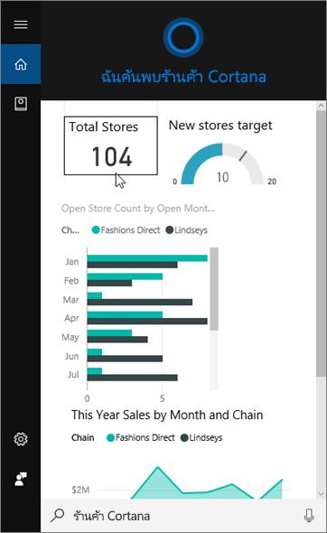
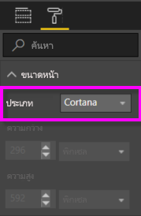
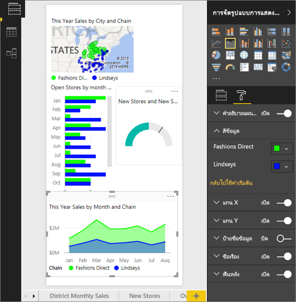
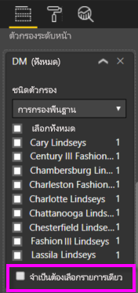

# ใช้บริการของ Power BI หรือ Power BI Desktop เพื่อสร้างหน้าคำตอบแบบกำหนดเองสำหรับ Cortana
ใช้ความสามารถเต็มของ Power BI เพื่อสร้างหน้ารายงานพิเศษ ที่เรียกว่า*หน้าคำตอบ Cortana* (และในบางครั้งเรียกว่า *การ์ดคำตอบ Cortana*) ที่ออกแบบมาโดยเฉพาะเพื่อตอบคำถาม Cortana

> [!IMPORTANT]
> การรวม Cortana กำลังจะถูกยกเลิกใน Power BI เริ่มต้น11มิถุนายน Cortana จะไม่สามารถใช้งานได้สำหรับแดชบอร์ดและรายงานใด ๆ อีกต่อไป

## ก่อนที่คุณเริ่มต้น
คุณมี 4 บทความที่แนะนำคุณเกี่ยวกับการตั้งค่า และใช้ Cortana สำหรับ Power BI ถ้าคุณยังไม่ได้อ่าน เริ่มต้นโดยอ่านบทความ 1 ก่อน บทความ 2 มีความสำคัญเป็นพิเศษ เพราะอธิบายขั้นตอนบางอย่างที่คุณจะต้องทำ ก่อนที่คุณสามารถเริ่มใช้หน้าคำตอบ Cortana

**บทความ 1**: [เรียนรู้วิธีที่ Cortana และ Power BI ทำงานร่วมกัน](service-cortana-intro.md)

**บทความ 2**: [สำหรับการค้นหารายงาน Power BI: เปิดใช้งานการรวม Cortana - Power BI - Windows สำหรับรายงาน](service-cortana-enable.md)

**บทความ 3**: บทความนี้

**บทความ 4**: [แก้ไขปัญหา](service-cortana-troubleshoot.md)

## สร้างหน้าคำตอบ Cortana ที่ออกแบบมาโดยเฉพาะสำหรับ Cortana
*หน้าคำตอบ Cortana* ในรายงานถูกปรับขนาดโดยเฉพาะสำหรับ Cortana เพื่อให้ Cortana สามารถแสดงในหน้าจอเป็นคำตอบของคำถาม เพื่อสร้างหน้าที่มีคำตอบสำหรับ Cortana:

1. เราขอแนะนำให้เริ่มจากหน้ารายงานเปล่า
2. ในบานหน้าต่าง**การจัดรูปแบบการแสดงข้อมูล** เลือกไอคอนรูปลูกกลิ้งทาสี แล้วเลือก **ขนาดหน้า** > **ชนิด** > **Cortana**
   
    
3. สร้างวิชวลหรือชุดของวิชวลที่คุณต้องการให้ปรากฏใน Cortana เพื่อเป็นคำตอบของคำถาม (หรือชุดของคำถาม) หนึ่ง

> [!NOTE]
> ในขณะนี้ หน้าคำตอบ Cortana ไม่รองรับรูปภาพที่มีภาพคงที่แสดงในนั้น คุณสามารถใส่รูปภาพในวิชวลตารางหรือเมทริกซ์ ที่ดึงมาแบบไดนามิกตาม URL ในข้อมูลของคุณ 
> 
> 

4. ตรวจสอบให้แน่ใจว่า วิชวลทั้งหมดอยู่ภายในเส้นขอบหน้า ไม่บังคับ ปรับเปลี่ยนการตั้งค่าจอแสดงผล ป้ายชื่อข้อมูล สี และพื้นหลัง  
   
    
5. ตั้งชื่อหน้า และเพิ่มชื่อสำรอง Cortana ใช้ชื่อเหล่านี้เมื่อค้นหาผลลัพธ์ ในบานหน้าต่าง**การจัดรูปแบบการแสดงข้อมูล** เลือกไอคอนรูปพู่กัน และเลือก**ข้อมูลเกี่ยวกับหน้า** เปิดใช้งานถามตอบสำหรับวิชวลนี้ โดยการเลื่อนแถบเลื่อนเพื่อ**เปิด**
   
    
   
   > [!TIP]
   > เพื่อปรับปรุงผลลัพธ์ หลีกเลี่ยงการใช้คำที่เป็นชื่อคอลัมน์
   > 
   > 
6. ไม่บังคับ ถ้ารายงานของคุณมีตัวกรองระดับหน้า คุณอาจต้องการตั้งค่า**จะต้องมีตัวเลือกเดี่ยว** Cortana จะแสดงรายงานนี้เป็นคำตอบ ถ้ามีรายการกรองรายการเดียวเท่านั้นที่ระบุในคำถาม **จะต้องมีตัวเลือกเดี่ยว** สามารถพบได้ด้านล่างของบานหน้าต่าง**ตัวกรอง**
   
   > [!NOTE]
   > คุณไม่จำเป็นต้องตั้งค่า**จะต้องมีตัวเลือกเดี่ยว** เพื่อให้ Cortana แสดงรายงานที่มีตัวกรองระดับหน้า ตัวอย่างเช่น "แสดงยอดขายสำหรับ Charlotte Lindseys" จะแสดงหน้าคำตอบโดยไม่คำนึงถึงค่าของ จะต้องมีตัวเลือกเดี่ยว
   > 
   > 
   
     
   
      ตัวอย่างเช่น ถ้าคุณขอให้ Cortana:
   
   * “แสดงยอดขายตามชื่อร้านค้า” หน้าคำตอบนี้จะไม่ปรากฏเนื่องจากคุณไม่มีรายการใด ๆ ในตัวกรองระดับหน้า
   * “แสดงยอดขายสำหรับ Cary Lindseys และ Charlotte Lindseys” หน้าคำตอบนี้จะไม่ปรากฏ เนื่องจากคุณระบุมากกว่าหนึ่งรายการจากตัวกรองระดับหน้า
   * “แสดงยอดขายสำหรับ Charlotte Lindseys” จะแสดงหน้าคำตอบนี้
     
     = "แสดงยอดขาย" หน้าคำตอบจะไม่ปรากฏขึ้น เนื่องจากคุณไม่ได้มีรายการใด ๆ ในตัวกรองระดับหน้า

> [!IMPORTANT]
> ก่อนที่หน้าคำตอบ Cortana ของคุณ สามารถเข้าถึงได้โดย Cortana คุณจะจำเป็นต้อง[เปิดใช้งานชุดข้อมูลสำหรับ Cortana](service-cortana-enable.md)
> 
> 

## Cortana เรียงลำดับผลลัพธ์อย่างไร?
ผลลัพธ์ที่มีคะแนนคำตอบสูง (เช่นตรงกันชื่อหน้าที่ระบุทั้งหมด) จะปรากฏขึ้นเป็นอันดับแรก ในฐานะที่เป็นรายการที่*ใกล้เคียงกันมากที่สุด*ใน Cortana รายการที่ใกล้เคียงกันมากที่สุด อาจปรากฏขึ้นหลายรายการ ถ้ามีหลายหน้าคำตอบ Cortana ใน Power BI คะแนนคำตอบระดับกลาง หรือระดับต่ำ เช่นคำตอบที่ไม่มาจากชื่อของหน้าคำตอบ หรือคำถามที่ใช้คำที่ Power BI ไม่เข้าใจ จะแสดงอยู่เป็นลิงก์ข้างใต้ รายการที่ใกล้เคียงกันมากที่สุด ใน Cortana

> [!NOTE]
> เมื่อมีชุดข้อมูลใหม่ หรือมีหน้าคำตอบ Cortana แบบกำหนดเองเพิ่มไปยัง Power BI และเปิดใช้งานสำหรับ Cortana สามารถใช้เวลาถึง 30 นาทีก่อนที่ผลลัพธ์จะเริ่มปรากฏใน Cortana เข้าสู่และออกจากระบบ Windows 10 หรือรีสตาร์ตกระบวนการ Cortana ใน Windows 10 จะทำให้เนื้อหาใหม่ปรากฏขึ้นทันทีได้
> 
> 

## ขั้นตอนถัดไป
[ใช้ Cortana กับ Power BI](service-cortana-intro.md)

ยังคงไม่สามารถทำให้ Cortana ทำงานร่วมกับ Power BI ได้?  ลอง[ตัวแก้ไขปัญหา Cortana](service-cortana-troubleshoot.md)

มีคำถามเพิ่มเติมหรือไม่? [ลองไปที่ชุมชน Power BI](https://community.powerbi.com/)

