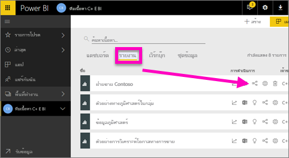
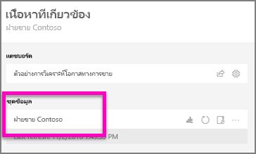
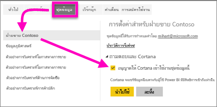
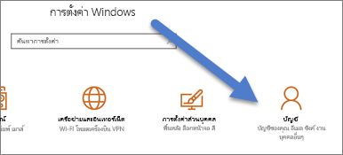
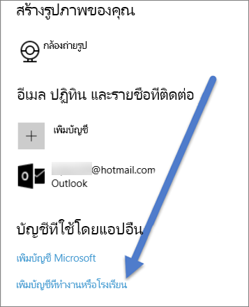

# เปิดใช้งาน Cortana เพื่อเข้าถึงรายงาน Power BI (และชุดข้อมูลภายในของพวกเขา)
คุณได้อ่าน[บทนำสู่ Cortana และ Power BI](service-cortana-intro.md) (ถ้าไม่ คุณอาจต้องการอ่านก่อน จากนั้นค่อยกลับมา) และตอนนี้คุณต้องการลองใช้ด้วยตนเอง  ก่อนที่คุณสามารถถามคำถามภาษาธรรมชาติใน Cortana และค้นหาคำตอบจากข้อมูลที่จัดเก็บไว้ใน***รายงาน*** Power BI มีความต้องการเพียงไม่กี่ตัว โดยเฉพาะ คุณจะต้องทำสิ่งต่อไปนี้

> [!NOTE]
> ถ้าคุณกำลังลองใช้ Cortana และ***แดชบอร์ด*** Power BI ซึ่งยังเป็นคุณสมบัติตัวอย่าง คุณสามารถข้ามส่วนที่เหลือของบทความนี้ได้ ไม่ต้องมีการตั้งค่าใด ๆ เพื่อให้ Cortana สามารถค้นหาแดชบอร์ด Power BI ของคุณได้
> 
> 

ใน Power BI service

* เปิดใช้งานชุดข้อมูลอย่างน้อยหนึ่งตัวสำหรับ Cortana (รายงานถูกสร้างขึ้นจากชุดข้อมูล ดังนั้น Cortana ต้องการเข้าถึงชุดข้อมูลเหล่านั้น)

ใน Microsoft Windows

* ตรวจสอบว่า คุณกำลังใช้ Windows 10 เวอร์ชัน 1511 หรือใหม่กว่า
* ตรวจสอบให้แน่ใจว่า Power BI และ Windows สามารถ "พูดคุย" กันได้ ซึ่งหมายความว่า กำลังเชื่อมต่อบัญชีของคุณกับ Windows

## ใช้ Power BI service เพื่อเปิดใช้งาน Cortana เพื่อเข้าถึงหน้ารายงานใน Power BI
เปิดใช้งานการรายงานใน Power BI เพื่อเข้าถึงได้โดย Cortana เป็นกระบวนการง่าย ๆ  อันที่จริงแล้วจากนั้นคุณจำเป็นต้องทำทั้งหมดคือเปิดใช้งานชุดข้อมูลด้านในของรายงาน โดยการเลือก "เปิดใช้งาน Cortana ในการเข้าถึงชุดข้อมูลนี้" หลังจากนั้น ผู้ใช้ใดๆก็ตามที่มีสิทธิ์เข้าถึงชุดข้อมูลใน Power BI ผ่านทาง Power BI ที่แชร์แบบทั่วไป แอป ชุดเนื้อหาฟีเจอร์และจะสามารถรับคำตอบจากรายงานใน Cortana ใน Windows 10

คุณจำเป็นต้องลงชื่อเข้าใช้บริการ Power BI (ไม่ Power BI Desktop) และทำซ้ำขั้นตอนเหล่านี้สำหรับแต่ละชุดข้อมูลที่คุณต้องการให้ Cortana เพื่อให้สามารถเข้าถึง

1. กำหนดชุดข้อมูลใดเพื่อเปิดใช้งาน จากรายการเนื้อหารายงาน เลือกรายงานคุณต้องการให้ Cortana เข้าถึง และเลือกคำ**ไอคอน**มุมมองที่เกี่ยวข้อง
   
    
2. ชุดข้อมูลเกี่ยวข้องกับรายงานนี้คือ**ยอดขายของ Contoso**
   
    
3. ทางด้านขวาของชื่อชุดข้อมูล เลือก**จุดไข่ปลา (...) > ตั้งค่า**  
   
    
4. เลือก**Q&A และ Cortana** > **อนุญาตให้ Cortana เข้าถึงชุดข้อมูลนี้** > **นำไปใช้**
   
   
   
   ในตัวอย่างนี้ เรากำลังเปิดใช้งาน Cortana ในชุดข้อมูลยอดขายของ Contoso
   
   > [!NOTE]
   > เมื่อมีชุดข้อมูลใหม่ หรือมีการ์ดคำตอบของ Cortana ถูกเพิ่มไปยัง Power BI และเปิดใช้งานสำหรับ Cortana สามารถใช้เวลาถึง 30 นาทีก่อนที่ผลลัพธ์จะเริ่มปรากฏใน Cortana เข้าสู่และออกจากระบบ Windows 10 หรือรีสตาร์ตกระบวนการ Cortana ใน Windows 10 จะทำให้เนื้อหาใหม่ปรากฏขึ้นทันทีได้
   > 
   > ถ้าคุณเปิดใช้งานชุดข้อมูลสำหรับ Cortana และชุดข้อมูลที่เป็นส่วนหนึ่งของชุดเนื้อหาหรือแอปที่คุณเป็นเจ้าของ คุณจะต้องเผยแพร่อีกครั้งดับผู้ร่วมงานของคุณ ซึ่งยังสามารถใช้กับ Cortana
   > 
   > 

## เพิ่มข้อมูลประจำตัวของ Power BI ลงใน Windows
คุณจะต้องใช้ Windows 10 เวอร์ชัน 1511 หรือใหม่กว่า

1. ตรวจสอบเวอร์ชันของ Windows 10 ที่คุณกำลังเรียกใช้อยู่ เปิด**การตั้งค่า**
    

    แล้ว เลือก**ระบบ > เกี่ยวกับ** ด้านล่างของหน้าจอ คุณจะเห็น**ข้อมูลจำเพาะของ Windows > เวอร์ชัน**

   * ถ้าคุณมี Windows 10 เวอร์ชัน 1511 (อัปเดต Windows 10 พฤศจิกายน 2015) จนถึง 1607 ให้เพิ่มบัญชีการทำงานหรือโรงเรียน และบัญชี Microsoft (ทำขั้นตอนที่ 2 และ 3 ที่ด้านล่าง)ของคุณ
   * ถ้าคุณมี Windows 10 เวอร์ชัน 1607 (อัปเดต Windows 10 กรกฎาคม 2016 ) หรือใหม่กว่า ให้เพิ่มบัญชีการทำงาน หรือโรงเรียน (ทำเพียงขั้นตอนที่ 2 ด้านล่าง) ของคุณ
1. เพิ่มบัญชีที่ทำงาน หรือโรงเรียนสำหรับ Cortana ของคุณ
   
   * เปิด**ตั้งค่า** > **บัญชี**
     
       
   * เลื่อนไปด้านล่างและเลือก**เพิ่มบัญชีผู้ใช้ทำงานหรือบัญชีโรงเรียน** หรือ จากหน้า**บัญชีผู้ใช้**ให้เลือก**เข้าถึงที่ทำงานหรือที่โรงเรียน > เชื่อมต่อ**
     
     

Cortana จะใช้นี้ทำงาน หรือโรงเรียนเพื่อตรวจสอบ Power BI สำหรับคำตอบของคำถามของคุณใน Cortana ที่อาจเกิดขึ้น

## ขั้นตอนถัดไป
[สร้าง Cortana *ตอบการ์ด*ใน Power BI](service-cortana-answer-cards.md)

[แก้ไขปัญหาการรวม Cortana และ Power BI](service-cortana-troubleshoot.md)

มีคำถามเพิ่มเติมหรือไม่ [ลองไปที่ชุมชน Power BI](http://community.powerbi.com/)

