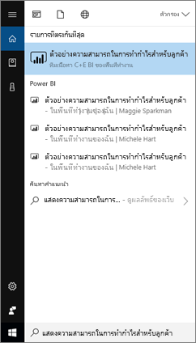
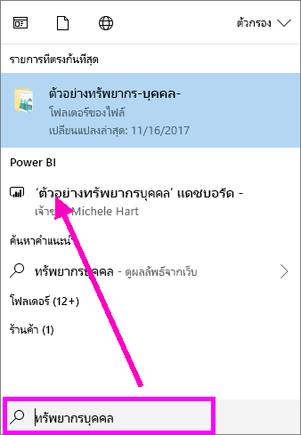
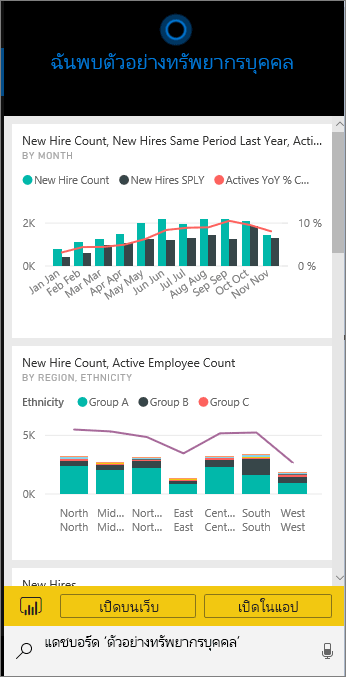
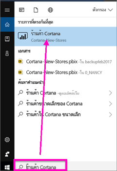
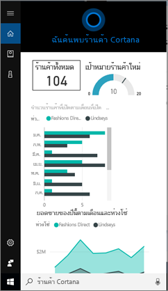
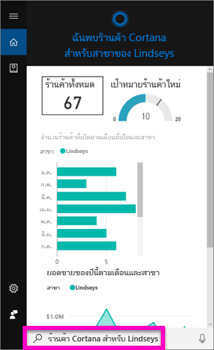
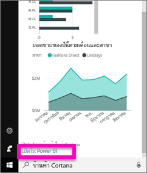
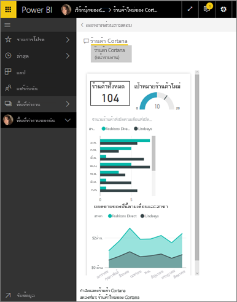

# ค้นหาและดูข้อมูล Power BI ของคุณได้อย่างรวดเร็วโดยใช้ Cortana สำหรับ Power BI
ใช้ Cortana ในทุกอุปกรณ์ Windows 10 ของคุณเพื่อให้ได้คำตอบสำหรับคำถามทางธุรกิจที่สำคัญของคุณทันที โดยการรวม Cortana กับ Power BI ทำให้สามารถดึงข้อมูลที่สำคัญได้โดยตรงจากแดชบอร์ดและรายงาน Power BI สิ่งที่ต้องใช้คือ Windows 10 เวอร์ชั่นพฤศจิกายน ปี 2015 หรือเวอร์ชั่นใหม่กว่า Cortana, Power BI และสิทธิ์การเข้าถึงอย่างน้อยหนึ่งชุดข้อมูล

## แสดงตัวอย่างประสบการณ์การใช้งานการค้นหา*แดชบอร์ด* Cortana ใหม่สำหรับ Windows 10
ตอนนี้คุณสามารถ[ใช้ Cortana เพื่อดึงข้อมูลบางชนิดของหน้ารายงาน](service-cortana-answer-cards.md)ได้แล้ว ตอนนี้เราได้เพิ่ม**ประสบการณ์ใหม่** นั่นคือ ความสามารถในการดึงแดชบอร์ดด้วยเช่นกัน ลองใช้งานดูและ[โปรดส่งคำติชมมาที่เรา](mailto:pbicortanasg@microsoft.com) ในท้ายที่สุด*ประสบการณ์ใหม่*จะขยายผลเพื่อรวมการค้นหาด้วย Cortana สำหรับรายงานด้วย  หนึ่งในประโยชน์สำคัญของประสบการณ์ใหม่นี้คือ คุณไม่จำเป็นต้องทำอะไรพิเศษเพื่อที่จะตั้งค่า ไม่ต้องเปิดใช้งาน Cortana หรือการกำหนดค่า Windows 10 ระบบจะทำงานด้วยตัวเอง

> [!NOTE]
> ถ้าระบบยังไม่ “ทำงาน” อย่างที่กล่าวมา โปรดดู[บทความการแก้ไขปัญหาเบื้องต้น](service-cortana-troubleshoot.md)สำหรับความช่วยเหลือ
> 
> 

เทคโนโลยีพื้นฐานใช้[บริการการค้นหา Azure ของ Microsoft](https://docs.microsoft.com/azure/search/) บริการการค้นหานี้มีความสามารถพิเศษ เช่น การจัดอันดับแบบสมาร์ท แก้ไขข้อผิดพลาด และเติมคำอัตโนมัติ

ทั้งสองประสบการณ์การใช้งาน Cortana จะทำงานไปพร้อมกัน

## Cortana สำหรับเอกสารประกอบ Power BI
เรามีบทความ 4 บทที่จะให้คำแนะนำคุณเกี่ยวกับการตั้งค่าและใช้ Cortana สำหรับ Power BI ชุดบทความนี้จะนำคุณผ่านขั้นตอนไปยัง

**บทความ 1** (บทความนี้): ทำความเข้าใจวิธีการที่ Cortana และ Power BI ทำงานร่วมกัน

**บทความ 2**:[ค้นหารายงาน Power BI: เปิดใช้งานการรวม Cortana - Power BI - Windows สำหรับรายงาน](service-cortana-enable.md)

**บทความ 3**: [ค้นหารายงาน Power BI: สร้าง*บัตรคำตอบ Cortana*](service-cortana-answer-cards.md) พิเศษ

**บทความ 4**: [แก้ไขปัญหา](service-cortana-troubleshoot.md)

## Cortana และ Power BI ทำงานร่วมกันอย่างไร?
เมื่อคุณใช้ Cortana เพื่อถามคำถาม Power BI สามารถเป็นหนึ่งในตำแหน่งที่ Cortana ค้นหาคำตอบ ใน Power BI, Cortana สามารถค้นหาคำตอบที่เต็มไปด้วยข้อมูลจากรายงาน Power BI (ที่ประกอบด้วยหน้ารายงานชนิดพิเศษที่เรียกว่า *บัตรคำตอบ Cortana*) และจากแดชบอร์ด Power BI ได้

ถ้า Cortana พบคำตอบที่ตรงกับคำถาม ระบบจะแสดงชื่อของหน้าแดชบอร์ดหรือรายงานในหน้าจอ Cortana ของคุณ สามารถเปิดหน้าแดชบอร์ดหรือรายงานใน Power BI ได้ คุณสามารถสำรวจหน้ารายงานได้ใน Cortana ซึ่งเป็นหน้ารายงานแบบโต้ตอบ

### Cortana และแดชบอร์ด (*ประสบการณ์ใหม่*)
Cortana สามารถค้นหาคำตอบในแดชบอร์ดที่คุณเป็นเจ้าของและแดชบอร์ดที่มีการแชร์กับคุณได้ ถามคำถามกับ Cortana โดยใช้ชื่อเรื่อง คำสำคัญ ชื่อเจ้าของ ชื่อพื้นที่ทำงาน ชื่อแอปฯ และอื่น ๆ

คำถามของคุณต้องมีอย่างน้อย 2 คำเพื่อให้ Cortana ค้นหาคำตอบได้ ดังนั้น ถ้าคุณค้นหาในแดชบอร์ดด้วยชื่อที่มีหนึ่งคำ (การตลาด) ให้เพิ่มคำว่า "แสดง" หรือ "Power BI" หรือ ชื่อเจ้าของที่จะตอบคำถามของคุณ อย่างเช่นใน "แสดงการตลาด" และ "ตัวอย่าง michele hart" 

ถ้าหัวเรื่องแดชบอร์ดของคุณมีมากกว่าหนึ่งคำ Cortana จะส่งกลับแดชบอร์ดนั้นเท่านั้นหากการค้นหาตรงกับคำอย่างน้อยสองคำ หรือหากแดชบอร์ดของคุณตรงกับหนึ่งในคำเหล่านั้นรวมกับชื่อเจ้าของ สำหรับแดชบอร์ดที่ชื่อว่า "ตัวอย่างกำไรจากลูกค้า": 

* "แสดงลูกค้า" จะ*ไม่*ส่งกลับผลลัพธ์แดชบอร์ด Power BI   
* "เปล่งคำพูด เช่น"แสดงกำไรจากลูกค้า" "ลูกค้า p" "ลูกค้า s" "ตัวอย่างกำไรจาก" "ตัวอย่าง michele hart" "แสดงตัวอย่างกำไรจากลูกค้า" และ "แสดงลูกค้า p ของฉัน" *จะ*ส่งกลับผลลัพธ์ Power BI หนึ่งผลลัพธ์
* การเพิ่มคำว่า "powerbi" จะนับเป็นหนึ่งคำจากที่กำหนดไว้สองคำ ดังนั้น "powerbi sample" *จะ*ส่งกลับผลลัพธ์ Power BI หนึ่งผลลัพธ์ 
  
    

### Cortana และรายงาน
 Cortana สามารถค้นหาคำตอบในรายงานที่มี[หน้าที่ออกแบบมาโดยเฉพาะสำหรับการแสดงผลโดย Cortana](service-cortana-answer-cards.md)ได้ เพียงแค่ถามคำถามโดยใช้ชื่อเรื่องหรือคำสำคัญจากหนึ่งในหน้ารายงานพิเศษเหล่านี้  

เทคโนโลยีพื้นฐานสำหรับรายงานใช้ [การถามตอบ Microsoft Power BI](consumer/end-user-q-and-a.md)

เมื่อคุณถามคำถามใน Cortana, Power BI ตอบคำถามจากหน้ารายงานที่ออกแบบมาโดยเฉพาะสำหรับ Cortana คำตอบที่เป็นไปได้จะถูกกำหนดโดย Cortana โดยตรงจากใน*บัตรคำตอบ* Cortana ที่สร้างไว้แล้วใน Power BI  เพื่อเป็นการสำรวจคำตอบเพิ่มเติม ให้เปิดผลลัพธ์ใน Power BI

> [!NOTE]
> ก่อนที่ Cortana จะสามารถค้นหาคำตอบในรายงาน Power BI ของคุณได้ คุณจะต้อง[เปิดใช้งานคุณลักษณะนี้โดยใช้บริการ Power BI และตั้งค่า Windows เพื่อสื่อสารกับ Power BI](service-cortana-enable.md)  
> 
> 

## ใช้ Cortana เพื่อรับคำตอบจาก Power BI
1. เริ่มต้นใน Cortana มีหลายวิธีในการ*เปิด* Cortana: เลือกไอคอน Cortana ในแถบงาน (ดังรูปภาพด้านล่าง) ใช้คำสั่งเสียง หรือแตะที่ไอคอนค้นหาบนอุปกรณ์เคลื่อนที่ Windows ของคุณ
   
     
2. เมื่อ Cortana พร้อม ให้พิมพ์หรือพูดคำถามของคุณลงในแถบค้นหาด้วย Cortana Cortana แสดงผลลัพธ์ที่พร้อมใช้งาน ถ้ามีแดชบอร์ด Power BI ที่ตรงกับคำถามนั้น แดชบอร์ดนั้นจะแสดงอยู่ใต้**คู่ที่ดีที่สุด**หรือ**Power BI**
   
     
   
   > [!NOTE]
   > ปัจจุบันสนับสนุนเฉพาะภาษาอังกฤษเท่านั้น
   > 
   > 
3. เลือกแดชบอร์ดดังกล่าวเพื่อเปิดแดชบอร์ดใน Cortana

    

    คุณสามารถเปลี่ยนเค้าโครงได้โดย[การแก้ไข*มุมมองโทรศัพท์*ของแดชบอร์ด](service-create-dashboard-mobile-phone-view.md)นั้นได้ 

1. จาก Cortana คุณยังมีตัวเลือกในการเปิดแดชบอร์ดในบริการ Power BI หรือ Power BI สำหรับอุปกรณ์เคลื่อนที่ เปิดแดชบอร์ดในบริการ Power BI โดยการเลือก**เปิดบนเว็บ** 
   
      
4. ตอนนี้มาใช้ Cortana เพื่อค้นหารายงานกัน เราจำเป็นต้องทราบ[รายงานที่มีหน้าที่มีบัตรคำตอบ Cortana ](service-cortana-answer-cards.md) ในตัวอย่างนี้ ชื่อรายงานคือ "Cortana-New-Stores" ที่มีหน้าบัตรคำตอบ Cortana ชื่อ "ร้านค้า Cortana"  
   
     พิมพ์หรือพูดคำถามของคุณลงในแถบค้นหาด้วย Cortana Cortana แสดงผลลัพธ์ที่พร้อมใช้งาน ถ้ามีหน้ารายงาน Power BI ที่ตรงกับคำถาม ระบบจะแสดงหน้านั้นใต้**คู่ที่ดีที่สุด**หรือ**Power BI** และในตัวอย่างนี้ิ ไฟล์ .pbix (และไฟล์สำรองข้อมูล) ที่ฉันใช้ในการสร้างบัตรคำตอบจะแสดง -- ด้วย ใต้**เอกสาร**
   
      
5. เลือก **Cortana ที่เก็บ**หน้ารายงานเพื่อแสดงในหน้าต่าง Cortana
   
       
   
    อย่าลืมว่า*บัตรคำตอบ*เป็นชนิดพิเศษของหน้ารายงาน Power BI ที่สร้างขึ้นโดยเจ้าของชุดข้อมูล  สำหรับข้อมูลเพิ่มเติม ดู[สร้างบัตรคำตอบ Cortana](service-cortana-answer-cards.md)
6. แต่นั่นไม่ใช่ทั้งหมด โต้ตอบกับการแสดงภาพบนบัตรคำตอบเช่นเดียวกับที่คุณทำใน Power BI
   
   * ตัวอย่างเช่น เลือกองค์ประกอบหนึ่งในการแสดงภาพเพื่อทำการกรองไขว้ และไฮไลท์การแสดงภาพอื่น ๆ บนบัตรคำตอบ
     
     
   * หรือใช้ภาษาธรรมชาติเพื่อกรองผลลัพธ์แทน  ตัวอย่างเช่น ถาม "ร้านค้า Cortana สำหรับ Lindseys" และดูบัตรที่ถูกกรองให้แสดงข้อมูลสำหรับเชนธุรกิจ Lindseys เท่านั้น
     
     
7. สำรวจต่อไป เลื่อนไปด้านล่างของหน้าต่าง Cortana แล้วเลือก**เปิดใน Power BI**
   
     
8. หน้ารายงานเปิดขึ้นใน Power BI    
     

## ข้อควรพิจารณาและการแก้ไขปัญหา
* Cortana จะไม่สามารถเข้าถึงบัตร Cortana ใด ๆ ที่ไม่ได้[เปิดใช้งานสำหรับ Power BI](service-cortana-enable.md) ได้
* ยังคงไม่สามารถทำให้ Cortana ทำงานร่วมกับ Power BI ได้?  ลอง[ตัวแก้ไขปัญหา Cortana](service-cortana-troubleshoot.md)
* ในขณะนี้ Cortana สำหรับ Power BI ใช้งานได้ในภาษาอังกฤษเท่านั้น
* Cortana สำหรับ Power BI ใช้งานได้บนอุปกรณ์เคลื่อนที่ Windows เท่านั้น

มีคำถามเพิ่มเติมหรือไม่? [ลองไปที่ชุมชน Power BI](http://community.powerbi.com/)

## ขั้นตอนถัดไป
[เปิดใช้งานการรวม Cortana - Power BI - Windows สำหรับรายงาน](service-cortana-enable.md)

