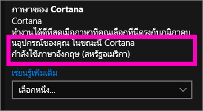
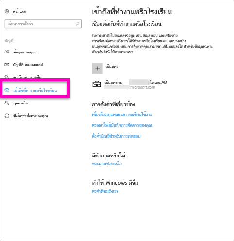
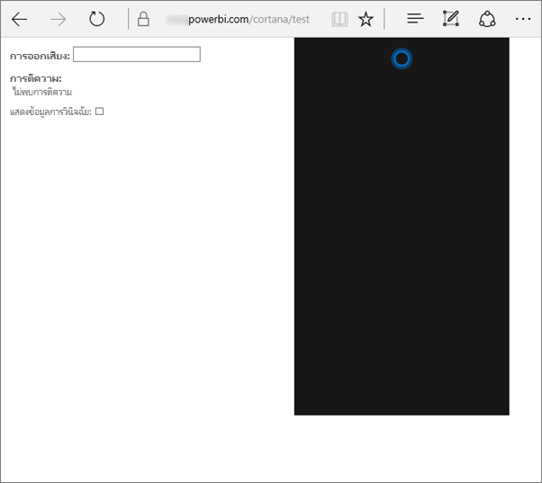
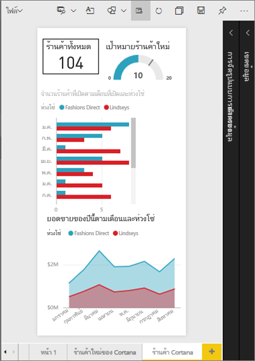
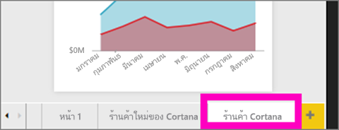
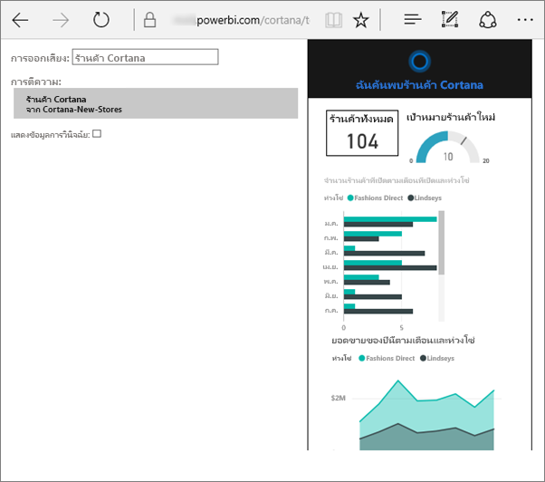

# แก้ไขปัญหา Cortana สำหรับ Power BI
บทความนี้เป็นส่วนหนึ่งของชุดบทความต่อเนื่อง ถ้าคุณยังไม่ได้อ่าน เราขอแนะนำให้คุณอ่านสามบทความต่อไปนี้

**บทความ 1**: [ทำความเข้าใจวิธีการที่ Cortana และ Power BI ทำงานร่วมกันเพื่อค้นหาแดชบอร์ดและรายงาน Power BI](service-cortana-intro.md)

**บทความ 2**: [สำหรับการค้นหารายงาน: เปิดใช้งานการทำงานร่วมกันระหว่าง Cortana - Power BI - Windows](service-cortana-enable.md)

**บทความ 3**: [สำหรับการค้นหารายงาน: สร้าง*บัตรคำตอบ Cortana*](service-cortana-answer-cards.md)พิเศษ

ถ้าคุณยังคงพบปัญหาเกี่ยวกับการรวม Cortana เข้ากับ Power BI คุณมาถูกที่แล้ว ทำตามขั้นตอนด้านล่างเพื่อวินิจฉัยและแก้ไขปัญหานี้

## ทำไม Cortana ไม่พบคำตอบจากรายงานหรือแดชบอร์ด Power BI ของฉัน?
1. คุณมีบัญชี Power BI ใช่หรือไม่?  ถ้าไม่มี [ลงทะเบียนสำหรับทดลองใช้ฟรี](https://powerbi.microsoft.com/get-started/)
2. Cortana ใช้งานได้หรือไม่?  คุณเห็นไอคอน Cortana ในแถบงานของคุณหรือไม่?

    

    เมื่อคุณเลือกไอคอนนี้ Cortana จะเปิดขึ้นพร้อมเขตข้อมูลที่คุณสามารถพิมพ์ได้หรือไม่?
3. คุณได้ใช้อย่างน้อย 2 คำในการค้นหาของคุณหรือไม่? Cortana ต้องมีวลีที่มีอย่างน้อย 2 คำเพื่อค้นหาคำตอบใน Power BI ลองเพิ่ม "แสดง" ไปยังจุดเริ่มต้นของคำถามของคุณ
4. ถ้าแดชบอร์ดของคุณมีชื่อเรื่องที่มีมากกว่าหนึ่งคำ Cortana จะส่งกลับแดชบอร์ดนั้นเท่านั้น ถ้าการค้นหาตรงกับอย่างน้อยสองคำ สำหรับแดชบอร์ดที่มีชื่อ "ยอดขาย FY16":

   * "แสดงยอดขาย" จะ*ไม่*ส่งกลับผลลัพธ์ Power BI   
   * "แสดงยอดขาย fy16" "ยอดขาย fy16" "แสดงยอดขาย fy16" และ “แสดงยอดขาย f” *จะ*ส่งกลับผลลัพธ์ Power BI หนึ่ง    
   * การเพิ่มคำว่า "powerbi" จะนับเป็นหนึ่งใน 2 คำที่จำเป็น ดังนั้น "powerbi sales" *จะ*ส่งกลับผลลัพธ์ Power BI หนึ่งผลลัพธ์
5. คุณมีสิทธิ์เข้าถึงหรือแก้ไขรายงานหรือแดชบอร์ดใด ๆ หรือไม่? สำหรับรายงาน ตรวจสอบให้แน่ใจว่าเนื้อหาที่คุณกำลังพยายามค้นหานั้นมี[บัตรคำตอบ](service-cortana-answer-cards.md)  สำหรับแดชบอร์ด ตรวจสอบให้แน่ใจว่าเนื้อหาที่คุณพยายามค้นหานั้นอยู่ใน**แชร์กับฉัน** พื้นที่ทำงานแอปฯ  หรือ**พื้นที่ทำงานของฉัน** [ใช้เครื่องมือแก้ไขปัญหา](#try-the-cortana-troubleshooting-tool)เพื่อช่วยระบุปัญหาดังกล่าว
6. คุณกำลังใช้อุปกรณ์เคลื่อนที่หรือไม่?  ในขณะนี้เราสนับสนุนเฉพาะการรวม Power BI และ Cortana บนอุปกรณ์เคลื่อนที่ Windows เท่านั้น
7. มีการกำหนดค่า Cortana เป็นภาษาอังกฤษหรือไม่?  การรวม Cortana-Power BI ปัจจุบันสนับสนุนเฉพาะภาษาอังกฤษเท่านั้น เปิด Cortana แล้วเลือกไอคอน cog เพื่อแสดงการตั้งค่าของคุณ เลื่อนลงไปยัง**ภาษา Cortana** และตรวจสอบให้แน่ใจว่ากำหนดเป็นหนึ่งในตัวเลือกภาษาอังกฤษ

   
8. คุณมีการเปิดใช้งานมากกว่า 100 รายงานสำหรับ Cortana หรือไม่?  Cortana ค้นหาสูงสุด 100 รายงานเท่านั้น  เพื่อให้แน่ใจว่ารายงานของคุณรวมอยู่ด้วย ย้ายหรือคัดลอกรายงานไปยัง**พื้นที่ทำงานของฉัน (My Workspace)** เนื่องจาก Cortana ค้นหาที่นั่นก่อน
9. คุณอาจต้องให้เวลาระบบสักครู่ ในครั้งแรกที่คุณพิมพ์การสอบถาม แบบจำลองอาจ*หยุดชั่วขณะ* กรุณารอสักครู่เพื่อให้ข้อมูลสามารถโหลดลงในหน่วยความจำ จากนั้นลองอีกครั้ง
10. สำหรับแดชบอร์ด อาจใช้เวลาถึง 24 ชั่วโมงกว่าจะสามารถเข้าถึงได้สำหรับ Cortana    
11. สำหรับรายงาน เมื่อมีชุดข้อมูลใหม่ หรือมีบัตรคำตอบแบบกำหนดเองเพิ่มไปยัง Power BI และเปิดใช้งานสำหรับ Cortana สามารถใช้เวลาถึง 30 นาทีก่อนที่ผลลัพธ์จะเริ่มปรากฏใน Cortana การเข้าสู่และออกจากระบบ Windows 10 หรือรีสตาร์ตกระบวนการ Cortana ใน Windows 10 จะทำให้เนื้อหารายงานใหม่ปรากฏขึ้นทันทีได้  
12. ผู้ดูแลระบบ Power BI ของคุณสามารถ "ปฏิเสธที่จะเข้าร่วม" ได้ ให้ตรวจสอบกับผู้ดูแลระบบของคุณเพื่อดูว่าเป็นในกรณีนี้หรือไม่

## รายงานเท่านั้น: ทำไม Cortana ไม่พบคำตอบจากรายงาน Power BI ของฉัน
1. หากคุณกำลังมองหาคำตอบในรายงาน คุณมีรายงานใด ๆ กับ**บัตรคำตอบ** Cortana หรือไม่? บัตรคำตอบเป็นวิธีเดียวที่ Cortana สามารถค้นหาคำตอบในรายงาน Power BI ของคุณได้  เรียนรู้วิธีการสร้างบัตรคำตอบ โดยการอ่าน[สร้างบัตรคำตอบ Cortana ในบริการ Power BI และ Power BI Desktop](service-cortana-answer-cards.md)
2. เวอร์ชันของ Windows ที่คุณใช้คือ 1511 หรือเวอร์ชันที่ใหม่กว่าหรือไม่?  ค้นหาคำตอบโดยการเปิดการตั้งค่า Windows แล้วเลือก**ระบบ > เกี่ยวกับ** ถ้าไม่พบคำตอบ อัปเดตเวอร์ชั่นของ Windows ของคุณ
3. คุณเชื่อมต่อบัญชี Windows และ Power BI ของคุณหรือไม่? นี่อาจทำให้คุณสับสน ทำตามคำแนะนำใน[เปิดใช้งาน Cortana สำหรับ Power BI](service-cortana-enable.md#add-your-power-bi-credentials-to-windows)
4. มีการเปิดใช้ชุดข้อมูลเบื้องต้นสำหรับ Cortana หรือไม่? บางทีเพื่อนร่วมงานของคุณอาจแชร์ชุดข้อมูลที่เธอได้เปิดใช้งานสำหรับ Cortana แล้วก็เป็นได้ แต่หากไม่ใช่กรณีนั้น [เรียนรู้วิธีการเปิดใช้งานชุดข้อมูลสำหรับ Cortana ด้วยตัวคุณเอง](service-cortana-enable.md) ซึ่งทำได้รวดเร็วและง่ายดาย

## แดชบอร์ดเท่านั้น: ทำไม Cortana ไม่พบคำตอบจากแดชบอร์ดน Power BI ของฉัน
1. ตรวจสอบให้แน่ใจว่าคุณกำลังเชื่อมต่อกับบัญชีที่ทำงานของคุณ Power BI ต้องมีการเชื่อมต่อนี้เพื่อให้สามารถรับรองความถูกต้องของสิทธิ์การเข้าถึงข้อมูลได้ เพื่อตรวจสอบว่าคุณมีการเชื่อมต่ออยู่หรือไม่ ในการเชื่อมต่อบัญชีที่ทำงานของคุณให้ใช้กล่องค้นหา Windows เพื่อนำทางไปยัง "เชื่อมต่อกับที่ทำงาน หรือโรงเรียน"  

    
2. คุณสามารถเข้าถึง Cortana ได้หรือไม่? เลือกกล่องค้นหา Windows และให้สิทธิ์การเข้าถึง Cortana ไปยังข้อมูลของคุณ

## ลองใช้เครื่องมือแก้ไขปัญหาของ Cortana
ยังพบปัญหาอยู่ใช่หรือไม่?  ตอนนี้เป็นเวลาดีที่จะเรียกใช้เครื่องมือแก้ไขปัญหา Cortana และทำให้จำนวนปัญหาที่เป็นไปได้น้อย

### มีปัญหาในการดึงคำตอบจากรายงานหรือไม่?
1. สำหรับรายงาน ก่อนที่เรียกใช้เครื่องมือแก้ไขปัญหา ตรวจสอบให้แน่ใจว่าได้ตั้งค่าตัวกรอง**ระดับหน้า**บนบัตรคำตอบ Cortana ของคุณเป็น**จำเป็นต้องมีส่วนที่เลือกส่วนเดียว** สำหรับความช่วยเหลือสำหรับขั้นตอนนี้ ให้ดู[บัตรคำตอบสร้าง Cortana](service-cortana-answer-cards.md)
2. เปิดเครื่องมือแก้ไขปัญหาโดยการเพิ่ม "/cortana/test" ไปยังจุดสิ้นสุดของ URL ของบริการ Power BI ของคุณ URL ของคุณควรมีลักษณะดังนี้:

   app.powerbi.com/cortana/test

   
3. ในเขตข้อมูล**Utterance** เมื่อต้องการแก้ไขปัญหารายงาน ให้พิมพ์ชื่อของบัตรคำตอบ Cortana ***ตรงตามที่ปรากฏในแท็บ Power BI***

   

    

   
4. บางครั้งในครั้งแรกที่คุณพิมพ์ลงในเขตข้อมูล**Utterance** อาจไม่มีสิ่งใดเกิดขึ้น ให้คุณคิดถึงขั้นตอนนี้เหมือนกับเป็นการเริ่มแจ้งระบบ คุณทำให้เครื่องมือแก้ไขปัญหาทราบว่าถึงเวลาเปิดใช้งานแล้ว ตัดและวาง หรือพิมพ์ลงในเขตข้อมูล**Utterance**อีกครั้ง ในตัวอย่างนี้ ชื่อของบัตรคำตอบของเราคือ**ร้านค้า Cortana** การวางหรือการพิมพ์**ร้านค้า Cortana**ลงในเครื่องมือดังกล่าวสร้างผลลัพธ์หนึ่งที่แสดงในเขตข้อมูล**การแปลความ (Interpretation)** คลิกเพื่อดูบัตรคำตอบที่แสดงในหน้าต่าง Cortana - ในกรณีนี้คือ **ร้านค้า Cortana**

   

   เนื่องจากเราได้รับผลลัพธ์หนึ่ง ในตอนนี้เราทราบว่า Cortana **ถูก**เปิดใช้งานใน Power BI แล้ว ซึ่งนั่นช่วยจำกัดจำนวนปัญหาลงเป็นปัญหาด้าน Windows หรือการตั้งค่าภาษาของ Cortana หรือมีชุดข้อมูลมากกว่า 100 ชุดที่เปิดใช้งานสำหรับ Cortana

### มีปัญหาในการดึงคำตอบจากแดชบอร์ดหรือไม่?
กำลังมองหาแดชบอร์ดที่มีการแชร์กับคุณอยู่หรือไม่?  เปิด Power BI > **แชร์กับฉัน**และค้นหาชื่อของแดชบอร์ด  จากนั้นพิมพ์ชื่อนั้นลงในเขตข้อมูล**Utterances**

#### ปัญหาที่ทราบสำหรับเครื่องมือแก้ไขปัญหา
* ถ้าเครื่องมือนี้ไม่ดึงผลลัพธ์ในครั้งแรก ให้วางคิวรี่ลงในกล่องข้อความ Utterance แทน
* ตามการออกแบบ คิวรี่ต้องมีอย่างน้อย 2 คำ  ถ้าคิวรี่ของคุณสั้นเกินไป ให้เพิ่มคำว่า "แสดง"
* สตริงคิวรี่บางสตริงที่มีคำบุพบทอยู่ด้วยอาจไม่ทำงาน (ตัวอย่างเช่น ยอดขายตามรายการสินค้า) ลองใช้คำศัพท์อื่นสำหรับคิวรี่ที่ไม่มีคำบุพบท และเป็นคำที่มีความหมาย/ไม่ซ้ำ

มีคำถามเพิ่มเติมหรือไม่? [ลองไปที่ชุมชน Power BI](http://community.powerbi.com/)
