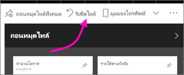

# สร้างมุมมองของแดชบอร์ด Power BI ที่ปรับให้เหมาะกับโทรศัพท์มือถือ
เมื่อคุณดูแดชบอร์ดในแอปมือถือ Power BI บนโทรศัพท์ของคุณ คุณจะสังเกตเห็นแดชบอร์ดที่เป็นแบบซ้อนถัดๆกัน ที่มีขนาดเดียวกันทั้งหมด ใน Power BI service คุณสามารถสร้างมุมมองของแดชบอร์ดโดยเฉพาะสำหรับโทรศัพท์ของคุณ

เมื่อคุณเปิดใช้งานทางโทรศัพท์ทางด้านข้าง จากนั้นคุณจะเห็นแดชบอร์ดถูกวางเค้าโครงในบริการ ไม่ เป็นตามที่คุณออกแบบสำหรับโทรศัพท์งาน

> [!NOTE]
> เมื่อคุณแก้ไขมุมมองโทรศัพท์ ทุกคนที่ดูแดชบอร์ดบนโทรศัพท์ของคุณสามารถดูการเปลี่ยนแปลงที่คุณทำในแบบเรียลไทม์ ตัวอย่างเช่น ถ้าคุณถอนหมุดไทล์ทั้งหมดในมุมมองโทรศัพท์ของแดชบอร์ด แดชบอร์ดบนโทรศัพท์จะไม่มีไทล์ทันที 
> 
> 

## สร้างมุมมองโทรศัพท์ของแดชบอร์ด
1. ใน Power BI service เปิดแดชบอร์ด
2. เลือกลูกศรที่อยู่ถัดจาก**มุมมองเว็บ**ที่มุมบนขวา > เลือก**มุมมองโทรศัพท์**

    

    ถ้าคุณไม่ได้เป็นเจ้าของแดชบอร์ด คุณจะไม่เห็นตัวเลือกนี้

    

    มุมมองแก้ไขแดชบอร์ดโทรศัพท์เปิดขึ้น ที่นี่คุณสามารถถอนการปักหมุด ปรับขนาด และจัดเรียงไทล์ให้พอดีกับมุมมองโทรศัพท์ได้ แดชบอร์ดเวอร์ชันบนเว็บไม่เปลี่ยนแปลง

1. เลือกไทล์เพื่อลาก ปรับขนาดหรือถอนหมุด คุณสังเกตเห็นว่า ไทล์อื่นจะย้ายออกในขณะที่คุณลากไทล์
   
    
   
    หมุดไทล์ที่ถูกถอนจะไปอยู่ในบานหน้าต่างไทล์ที่ถูกถอน ซึ่งเป็นที่ที่พวกมันอยูเว้นแต่ว่าคุณเพิ่มมันกลับมา
   
    
2. ถ้าคุณเปลี่ยนใจ ให้เลือก**รีเซ็ตไทล์**เพื่อเปลี่ยนเป็นขนาดและลำดับเดิมของพวกมัน
   
    
   
    เพียงแค่เปิดมุมมองแก้ไขของโทรศัพท์ใน Power BI service เปลี่ยนแปลงขนาดและรูปร่างของไทล์บนโทรศัพท์ของคุณเล็กน้อย ดังนั้นเพื่อเปลี่ยนแดชบอร์ดให้อยู่ในสถานะเช่นเดียวกับก่อนที่คุณได้เปิดแก้ไขมุมมองโทรศัพท์ ให้เลือก**รีเซ็ตไทล์**
3. เมื่อคุณพอใจกับเค้าโครงแดชบอร์ดโทรศัพท์ ให้เลือกลูกศรที่อยู่ถัดจาก**มุมมองโทรศัพท**ที่มุมบนขวา > เลือก**มุมมองเว็บ**
   
    Power BI จะบันทึกเค้าโครงโทรศัพท์โดยอัตโนมัติ

## ขั้นตอนถัดไป
* [สร้างรายงานที่ปรับให้เหมาะสมสำหรับแอปมือถือ Power BI](desktop-create-phone-report.md)
* [สร้างภาพแบบตอบสนองที่ปรับให้เหมาะสมกับทุกขนาด](desktop-create-responsive-visuals.md)
* มีคำถามเพิ่มเติมหรือไม่ [ลองถามชุมชน Power BI](http://community.powerbi.com/)

