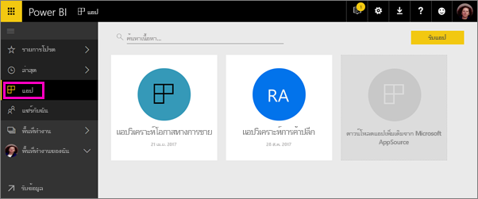
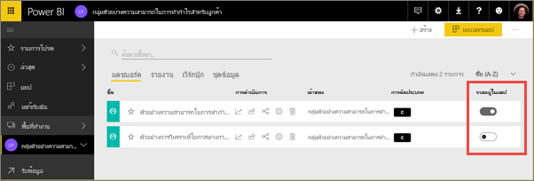
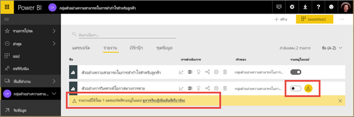
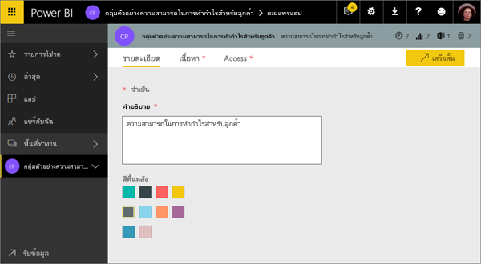
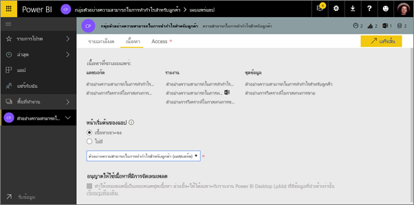
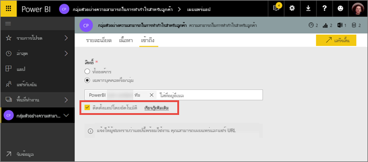
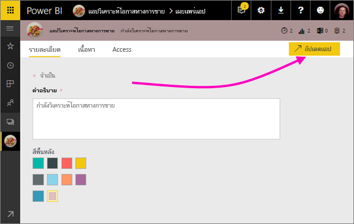
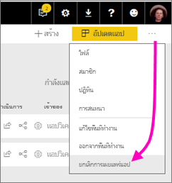

# เผยแพร่แอปที่มีแดชบอร์ดและรายงานใน Power BI

ใน Power BI คุณสามารถเผยแพร่*แอป*ด้วยคอลเลกชันของแดชบอร์ดและรายงานที่เกี่ยวข้องได้ คุณสร้างแอปใน*พื้นที่ทำงานแอป*ที่คุณสามารถทำงานร่วมกันบนเนื้อหาของ Power BI กับเพื่อนร่วมงานของคุณ จากนั้น คุณสามารถเผยแพร่แอปที่เสร็จแล้วไปยังกลุ่มบุคคลขนาดใหญ่ต่างๆ ในองค์กรของคุณ อ่านเพิ่มเติมเกี่ยวกับ[สร้างพื้นที่ทำงานแอป](service-create-workspaces.md)

ผู้ใช้ทางธุรกิจของคุณจำเป็นต้องมีหลายแดชบอร์ดและรายงาน Power BI เพื่อการบริหารธุรกิจของตน ด้วยแอป Power BI คุณสามารถสร้างคอลเลกชันของแดชบอร์ดและรายงาน และเผยแพร่แอปเหล่านี้ไปยังองค์กรของคุณ หรือไปยังบุคคลหรือกลุ่มที่เฉพาะเจาะจงได้ หากคุณเป็นผู้สร้างรายงานหรือผู้ดูแลระบบ แอปจะช่วยให้คุณจัดการสิทธิ์บนคอลเลกชันเหล่านี้ได้ง่ายขึ้น

ผู้ใช้ทางธุรกิจได้รับแอปฯของคุณในสองสามวิธีที่แตกต่างกัน ถ้าผู้ดูแลระบบ Power BI ให้สิทธิ์ คุณสามารถติดตั้งแอปโดยอัตโนมัติในบัญชี Power BI ของเพื่อนร่วมงาน หรือเพื่อนร่วมงานของคุณสามารถติดตั้งแอปฯของคุณจาก Microsoft AppSource หรือคุณสามารถส่งลิงก์ได้โดยตรง พวกเขาสามารถค้นหาและกลับไปยังเนื้อหาของคุณได้อย่างง่ายดายเนื่องจากทั้งหมดอยู่ในที่เดียว พวกเขาไม่สามารถปรับเปลี่ยนเนื้อหาของแอป แต่พวกเขาสามารถโต้ตอบกับเนื้อหาของแอปในบริการ Power BI หรือในแอปสำหรับอุปกรณ์เคลื่อนที่- – ด้วยการกรอง เน้น และเรียงลำดับข้อมูลด้วยตนเอง พวกเขาจะได้รับอัปเดตโดยอัตโนมัติ และคุณสามารถควบคุมความถี่ในการรีเฟรชข้อมูลได้ อ่านเพิ่มเติมเกี่ยวกับการ[ประสบการณ์การใช้งานแอปฯสำหรับผู้ใช้ทางธุรกิจ](consumer/end-user-apps.md)

**คุณทราบหรือไม่** Power BI กำลังแสดงตัวอย่างการใช้งานพื้นที่ทำงานใหม่ อ่าน[สร้างพื้นที่ทำงานใหม่ (ตัวอย่าง)](service-create-the-new-workspaces.md) เพื่อดูว่าพื้นที่ทำงานจะเปลี่ยนแปลงไปอย่างไรในอนาคต 

## แอปฯและชุดเนื้อหาองค์กร
แอปฯเป็นวิวัฒนาการของชุดเนื้อหาองค์กร ชุดเนื้อหาไม่พร้อมใช้งานในตัวอย่างการใช้งานพื้นที่ทำงานใหม่ หลังจากการใช้งานพื้นที่ทำงานใหม่พร้อมให้บริการ คุณจะไม่สามารถใช้ชุดเนื้อหาในพื้นที่ทำงานที่สร้างขึ้นใหม่ ถ้าคุณยังไม่ได้ย้ายชุดเนื้อหา เริ่มโยกย้ายชุดเนื้อหาของคุณไปยังแอป

## วิดีโอ: แอปและพื้นที่ทำงานของแอป
<iframe width="640" height="360" src="https://www.youtube.com/embed/Ey5pyrr7Lk8?showinfo=0" frameborder="0" allowfullscreen></iframe>

## สิทธิ์การใช้งานสำหรับแอปฯ
สมาชิกแต่ละรายของพื้นที่ทำงานแอปต้องมีสิทธิ์ใช้งาน Power BI Pro สำหรับผู้ใช้แอป มีสองตัวเลือก

* ตัวเลือกที่ 1: ผู้ใช้ทางธุรกิจทั้งหมดจำเป็นต้องมีสิทธิ์การใช้งาน **Power BI Pro** เพื่อดูแอปฯของคุณ 
* ตัวเลือกที่ 2: ถ้าแอปของคุณอยู่ในความจุ Power BI Premium ผู้ใช้ฟรีในองค์กรของคุณสามารถดูเนื้อหาแอป อ่าน[Power BI Premium คืออะไร](service-premium.md)สำหรับรายละเอียด

## เผยแพร่แอปฯของคุณ
เมื่อแดชบอร์ดและรายงานในพื้นที่ทำงานของคุณพร้อม คุณสามารถเลือกแดชบอร์ดและรายงานที่คุณต้องการเผยแพร่ แล้วเผยแพร่สิ่งดังกล่าวในฐานะเป็นแอปหนึ่ง คุณสามารถส่งลิงก์โดยตรงไปยังผู้ชมที่มากกว่านั้นได้ หรือผู้ชมสามารถค้นหาแอปฯของคุณจากแท็บ Apps โดยไปที่**ดาวน์โหลด และสำรวจแอปฯเพิ่มเติมจาก AppSource** 

1. ในมุมมองรายการพื้นที่ทำงาน ตัดสินใจเลือกแดชบอร์ดและรายงานที่คุณต้องการให้รวมอยู่ในแอปฯ

     

     ถ้าคุณเลือกที่จะไม่เผยแพร่รายงาน คุณจะเห็นคำเตือนถัดจากรายงานและแดชบอร์ดที่เกี่ยวข้องกับรายงาน คุณยังสามารถเผยแพร่แอปฯนั้นได้ แต่ไทล์ของแดชบอร์ดที่เกี่ยวข้องจะหายไปจากรายงานนั้น

     

2. เลือกปุ่ม**เผยแพร่แอปฯ**ที่มุมบนขวาเพื่อเริ่มกระบวนการของการแชร์เนื้อหาทั้งหมดในพื้นที่ทำงานนั้น
   
     

3. บน**รายละเอียด** กรอกข้อมูลในคำอธิบายเพื่อช่วยให้ผู้คนพบแอปฯ คุณสามารถตั้งค่าสีพื้นหลังเพื่อปรับแต่ง
   
     

4. บน**เนื้อหา** คุณสามารถดูเนื้อหาที่จะเผยแพร่เป็นส่วนหนึ่งของแอปฯได้ ซึ่งเป็นทุกสิ่งที่คุณเลือกไว้ในพื้นที่ทำงานนั้น นอกจากนี้ คุณยังสามารถตั้งค่าหน้าเริ่มต้นแอปฯได้ ซึ่งเป็นหน้าที่ผู้ใช้จะเห็นแดชบอร์ดหรือรายงานเป็นอันดับแรก เมื่อไปยังแอปฯของคุณ คุณสามารถเลือก**ไม่มี (None)** ได้ จากนั้น ผู้ใช้จะไปยังรายการของเนื้อหาทั้งหมดในแอปฯ 
   
     

5. ที่**การเข้าถึง** ตัดสินใจว่าใครที่สามารถเข้าถึงแอปฯได้: ไม่ว่าจะเป็นทุกคนในองค์กรของคุณ หรือบุคคลที่เฉพาะเจาะจง หรือกลุ่มความปลอดภัย Active Directory ถ้าคุณมีสิทธิ์ต่าง ๆ คุณสามารถตัดสินใจที่จะติดตั้งแอปฯโดยอัตโนมัติสำหรับผู้รับได้ ผู้ดูแลระบบของ Power BI สามารถเปิดใช้งานการตั้งค่านี้ได้ในพอร์ทัลผู้ดูแลระบบของ Power BI ได้ อ่าน[การติดตั้งแอปโดยอัตโนมัติ](#how-to-install-an-app-automatically-for-end-users)เพิ่มเติม

    

6. เมื่อคุณเลือก**เสร็จสิ้น** คุณจะเห็นข้อความยืนยันว่าแอปฯพร้อมสำหรับการเผยแพร่ ในกล่องโต้ตอบความสำเร็จ คุณสามารถคัดลอก URL ซึ่งเป็นลิงก์โดยตรงไปยังแอปฯของคุณ และส่งลิงก์นี้ไปยังบุคคลที่คุณแชร์ด้วยได้
   
     

อ่านเพิ่มเติมเกี่ยวกับการ[ประสบการณ์การใช้งานแอปฯสำหรับผู้ใช้ทางธุรกิจ](consumer/end-user-apps.md)

## เปลี่ยนแอปฯที่คุณเผยแพร่
หลังจากที่คุณเผยแพร่แอปฯ คุณอาจต้องการเปลี่ยนแปลงหรือปรับปรุงแอปฯนั้น เป็นเรื่องง่ายที่จะอัปเดตถ้าคุณเป็นผู้ดูแลระบบหรือเป็นสมาชิกของพื้นที่ทำงานแอป หรือเป็นผู้สนับสนุนในพื้นที่ทำงานแอปใหม่ 

1. เปิดพื้นที่ทำงานแอปฯที่สอดคล้องกับแอปฯดังกล่าว 
   
     
2. เปิดแดชบอร์ดหรือรายงาน คุณจะเห็นว่าคุณสามารถทำการเปลี่ยนแปลงที่คุณต้องการได้
   
     พื้นที่ทำงานแอปเป็นพื้นที่ที่คุณจัดเตรียมข้อมูล ดังนั้นการเปลี่ยนแปลงของคุณจะไม่อยู่ในแอปจนกว่าคุณเผยแพร่อีกครั้ง ซึ่งนี่ช่วยให้คุณทำการเปลี่ยนแปลงได้โดยไม่กระทบต่อแอปฯที่เผยแพร่แล้ว  
 
3. ย้อนกลับไปยังรายการพื้นที่ทำงานแอปฯของเนื้อหาและเลือก**อัปเดตแอปฯ**
   
     

4. อัปเดต**รายละเอียด**, **เนื้อหา**และ**การเข้าถึง** ถ้าคุณจำเป็นต้องอัปเดต ให้เลือก**อัปเดตแอปฯ**
   
     

บุคคลที่คุณได้เผยแพร่แอปฯด้วยนั้นจะเห็นแอปฯเวอร์ชั่นที่อัปเดตโดยอัตโนมัติ 

## ติดตั้งแอปฯโดยอัตโนมัติสำหรับผู้ใช้ปลายทาง
แอปฯจะส่งข้อมูลที่ผู้ใช้จำเป็นต้องใช้ในการทำงานของตน ถ้าผู้ดูแลระบบมอบสิทธิ์ให้แก่คุณ คุณสามารถติดตั้งแอปสำหรับผู้ใช้ปลายทางโดยอัตโนมัติ จึงทำให้ง่ายต่อการแจกจ่ายแอปไปยังบุคคลหรือกลุ่มที่ถูกต้อง แอปของคุณจะปรากฏโดยอัตโนมัติในรายการเนื้อหาแอปของผู้ใช้ปลายทาง โดยผู้ใช้นั้นไม่ต้องค้นหาจาก Microsoft AppSource หรือติดตามลิงก์การติดตั้ง ซึ่งนี่ทำให้ง่ายต่อการเผยแพร่เนื้อหา Power BI มาตรฐานไปยังผู้ใช้ของคุณ

### วิธีการติดตั้งแอปฯโดยอัตโนมัติสำหรับผู้ใช้ปลายทาง
เมื่อผู้ดูแลระบบได้กำหนดให้สิทธิ์ใช้งานแก่คุณ คุณมีทางเลือกใหม่ที่จะ**ติดตั้งแอปโดยอัตโนมัติ** เมื่อคุณเลือกกล่อง และเลือก**เสร็จสิ้น** (หรือ**อัปเดตแอป**สำหรับแอปที่มีอยู่), แอปจะถูกส่งไปยังผู้ใช้ทั้งหมด หรือกลุ่มที่กำหนดไว้ในหัวข้อ**สิทธิ์ใช้งาน**ของแอปบนแท็บ **เข้าถึง**

### วิธีที่ผู้ใช้รับแอปฯซึ่งส่งไปให้พวกเขา
หลังจากที่คุณส่งแอปฯไปแล้ว แอปฯดังกล่าวจะแสดงอยู่ในรายการ Apps โดยอัตโนมัติ คุณสามารถดูแลแอปที่ผู้ใช้หรือบทบาทของงานในองค์กรของคุณที่ถูกกำหนดต้องมี

### ข้อควรพิจารณาสำหรับการติดตั้งแอปฯโดยอัตโนมัติ
นี่คือสิ่งที่ควรทราบเมื่อส่งแอปให้กับผู้ใช้ปลายทาง:

* การติดตั้งแอปฯโดยอัตโนมัติสำหรับผู้ใช้อาจต้องใช้เวลา แอปฯส่วนใหญ่จะติดตั้งทันทีสำหรับผู้ใช้ แต่การส่งแอปฯอาจใช้เวลา  ซึ่งขึ้นอยู่กับจำนวนของรายการในแอปฯและจำนวนของบุคคลที่สามารถเข้าถึงได้ เราขอแนะนำให้ส่งแอปฯในช่วงนอกเวลาใช้งานและส่งแอปฯให้มีระยะเวลาห่างก่อนใช้งานมากพอสมควร ตรวจสอบกับผู้ใช้หลายรายก่อนที่จะสื่อสารเกี่ยวกับความพร้อมใช้งานแอปฯไปยังผู้ใช้จำนวนมาก

* รีเฟรชเบราว์เซอร์ของคุณ ก่อนที่จะเห็นแอปฯที่ส่งไปในรายการ Apps ผู้ใช้อาจจำเป็นต้องรีเฟรช หรือปิดและเปิดเบราว์เซอร์ของตนอีกครั้ง

* ถ้าผู้ใช้ไม่เห็นแอปฯในรายการ Apps โดยทันที ผู้ใช้ควรรีเฟรช หรือปิดและเปิดเบราว์เซอร์ของตนอีกครั้ง

* พยายามอย่าส่งแอปฯมากเกินไป ระมัดระวังไม่ให้มีการส่งแอปฯมากเกินไป เพื่อให้ผู้ใช้ของคุณรู้สึกว่าแอปฯที่ติดตั้งไว้ล่วงหน้าจะมีประโยชน์กับพวกเขา เป็นเรื่องดีที่คุณควรควบคุมว่าใครสามารถส่งแอปฯให้กับผู้ใช้ปลายทางได้ เพื่อให้เหมาะสมกับกำหนดเวลา คุณสามารถกำหนดผู้ติดต่อสำหรับการรับแอปฯในองค์กรของคุณที่ส่งไปยังผู้ใช้ปลายทางได้

* ผู้เยี่ยมชมที่ไม่ยอมรับคำเชิญจะไม่ได้รับแอปที่ติดตั้งโดยอัตโนมัติสำหรับพวกเขา  

## ยกเลิกการเผยแพร่แอปฯ
สมาชิกของพื้นที่ทำงานแอปฯสามารถยกเลิกการเผยแพร่แอปฯได้

>[!NOTE]
>เมื่อคุณยกเลิกการประกาศแอป ผู้ใช้แอปจะสูญเสียการเลือกกำหนดเองของพวกเขา ซึ่งหมายความว่าที่คั่นหน้าส่วนบุคคล ข้อคิดเห็น หรือการสมัครใช้งานใดๆ ที่เกี่ยวข้องกับเนื้อหาในแอปจะสูญหาย โปรดยกเลิกการประกาศแอปหากต้องการลบออกเท่านั้น
> 
> 

* ในพื้นที่ทำงานแอปฯ เลือกจุดไข่ปลา (**...** ) ที่มุมขวาบน > **ยกเลิกการเผยแพร่แอปฯ**
  
     

การดำเนินการนี้จะถอนการติดตั้งแอปฯสำหรับทุกคนที่คุณได้เผยแพร่ไป และบุคคลเหล่านี้จะไม่สามารถเข้าถึงแอปฯได้อีกต่อไป ขั้นตอนนี้จะไม่ลบพื้นที่ทำงานแอปฯหรือเนื้อหา

## ขั้นตอนถัดไป
* [สร้างพื้นที่ทำงานแอป](service-create-workspaces.md)
* [ติดตั้งและใช้แอปฯใน Power BI](consumer/end-user-apps.md)
* [แอปฯ Power BI สำหรับบริการภายนอก](service-connect-to-services.md)
* [พอร์ทัลผู้ดูแล Power BI](https://docs.microsoft.com/power-bi/service-admin-portal)
* มีคำถามหรือไม่? [ลองถามชุมชน Power BI](http://community.powerbi.com/)
