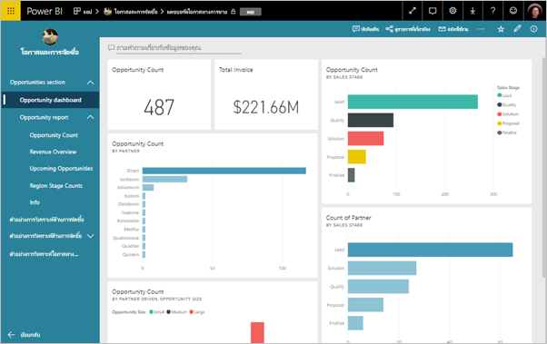
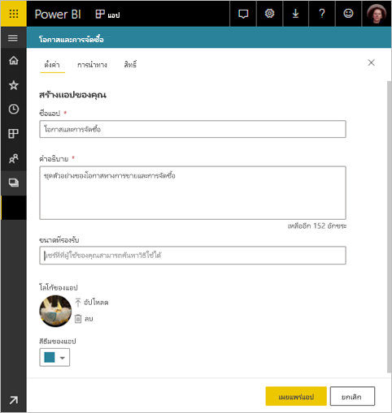
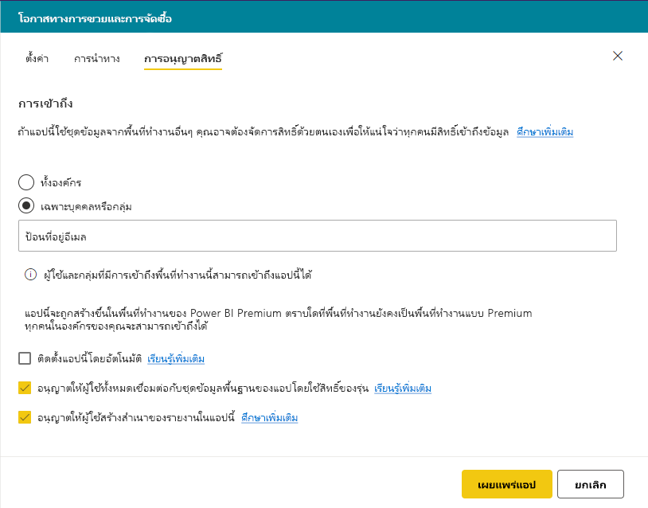
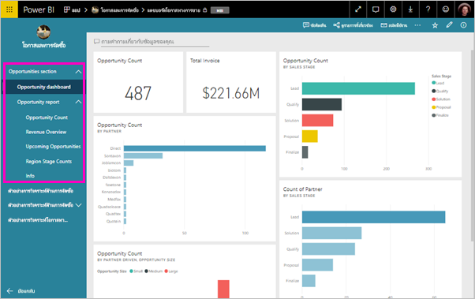

# เผยแพร่แอปใน Power BI

ใน Power BI คุณสามารถสร้างเนื้อหาทางบรรจุ จาก นั้นแจกจ่ายให้กับผู้ชมที่กว้างขวางเป็นแอ*แอ*ได้ คุณสร้างแอปใน*พื้นที่ทำงานแอป*ที่คุณสามารถทำงานร่วมกันบนเนื้อหาของ Power BI กับเพื่อนร่วมงานของคุณ จากนั้น คุณสามารถเผยแพร่แอปที่เสร็จแล้วไปยังกลุ่มบุคคลขนาดใหญ่ต่างๆ ในองค์กรของคุณ 

ผู้ใช้ทางธุรกิจของคุณจำเป็นต้องมีหลายแดชบอร์ดและรายงาน Power BI เพื่อการบริหารธุรกิจของตน ด้วยแอป Power BI คุณสามารถสร้างคอลเลกชันของแดชบอร์ดและรายงาน และเผยแพร่แอปเหล่านี้ไปยังองค์กรของคุณ หรือไปยังบุคคลหรือกลุ่มที่เฉพาะเจาะจงได้ หากคุณเป็นผู้สร้างรายงานหรือผู้ดูแลระบบ แอปจะช่วยให้คุณจัดการสิทธิ์บนคอลเลกชันเหล่านี้ได้ง่ายขึ้น

ผู้ใช้ทางธุรกิจได้รับแอปของคุณในสองสามวิธีที่แตกต่างกัน:

- พวกเขาสามารถค้นหา และติดตั้งแอปของคุณจาก Microsoft AppSource
- คุณสามารถส่งลิงก์โดยตรง
- คุณสามารถติดตั้งแอปโดยอัตโนมัติในบัญชี Power BI ของเพื่อนร่วมงานของคุณถ้าผู้ดูแลระบบ Power BI ของคุณให้สิทธิ์คุณ

คุณสามารถสร้างแอ ด้วยตนเองนำทางมีอยู่ภายใน เพื่อให้ผู้ใช้ของคุณสามารถค้นหาวิธีการใช้เนื้อหาของคุณได้อย่างง่ายดาย พวกเขาไม่สามารถปรับเปลี่ยนเนื้อหาของแอป พวกเขาสามารถโต้ตอบกับข้อมูล ในบริการ Power BI หรือหนึ่งในแอปสำหรับอุปกรณ์เคลื่อน- – กรอง เน้น และเรียงลำดับข้อมูลด้วยตนเองได้ พวกเขาจะได้รับอัปเดตโดยอัตโนมัติ และคุณสามารถควบคุมความถี่ในการรีเฟรชข้อมูลได้ อ่านเพิ่มเติมเกี่ยวกับการ[ประสบการณ์การใช้งานแอปฯสำหรับผู้ใช้ทางธุรกิจ](consumer/end-user-apps.md)

## สิทธิ์การใช้งานสำหรับแอปฯ
เมื่อต้องสร้าง หรืออัปเดตแอ คุณจำเป็นต้องมีสิทธิ์การใช้งาน Power BI Pro สำหรับแอ*ผู้บริโภค*มีสองตัวเลือก

* ตัวเลือกที่ 1: ผู้ใช้ทางธุรกิจทั้งหมดจำเป็นต้องมีสิทธิ์การใช้งาน **Power BI Pro** เพื่อดูแอปฯของคุณ 
* ตัวเลือกที่ 2: ถ้าพื้นที่ทำงานของแออยู่ในความจุ Power BI Premium ผู้ใช้ฟรีในองค์กรของคุณสามารถดูเนื้อหาแอป อ่าน[Power BI Premium คืออะไร](service-premium.md)สำหรับรายละเอียด

## เผยแพร่แอปฯของคุณ
เมื่อแดชบอร์ดและรายงานในพื้นที่ทำงานของคุณพร้อม คุณสามารถเลือกแดชบอร์ดและรายงานที่คุณต้องการเผยแพร่ แล้วเผยแพร่สิ่งดังกล่าวในฐานะเป็นแอปหนึ่ง 

1. ในมุมมองรายการพื้นที่ทำงาน ตัดสินใจว่า แดชบอร์ดและรายงานที่คุณต้อง**รวมอยู่ในแอ**

     

     ถ้าคุณเลือกที่ไม่มีรายงานที่มีแดชบอร์ดที่เกี่ยวข้อง คุณเห็นคำเตือนถัดจากรายงาน คุณยังสามารถเผยแพร่แอ แต่แดชบอร์ดที่เกี่ยวข้องจะไม่มีไทล์จากรายงานนั้น

     

2. เลือกคำ**เผยแพร่แอ**ปุ่มมุมบนขวาเพื่อเริ่มกระบวนการในการสร้าง และเผยแพร่แอปจากพื้นที่ทำงาน
   
     

3. บน**ตั้งค่า**กรอกชื่อและคำอธิบายเพื่อช่วยให้ผู้คนค้นหาแอป คุณสามารถตั้งค่าสีของธีมเพื่อปรับแต่ง คุณยังสามารถเพิ่มการเชื่อมโยงไปยังไซต์ฝ่ายสนับสนุน
   
     

4. บน**นำทาง**คุณเลือกเนื้อหาเผยแพร่เป็นส่วนหนึ่งของแอป จากนั้น คุณสามารถเพิ่มนำทางแอป เพื่อจัดระเบียบเนื้อหาในส่วน ดู[ออกแบบประสบการณ์การนำทางสำหรับแอปของคุณ](#design-the-navigation-experience-for-your-app)ในบทความนี้สำหรับรายละเอียด
   
     

5. บน**เข้าถึง**ตัดสินใจว่า ใครสามารถเข้าถึงแอป 
    - ใน[พื้นที่ทำงานแบบคลาสสิก](service-create-workspaces.md): ทุกคนในองค์กร หรือของคุณ บุคคลที่เจาะจง กลุ่มความปลอดภัยของ Azure Active Directory (AAD)
    - ในการ[พื้นที่ทำงานประสบการณ์การใช้งานใหม่](service-create-the-new-workspaces.md): บุคคลที่เจาะจง กลุ่มความปลอดภัย AAD และรายการการแจกจ่าย กลุ่ม และ Office 365

6. ถ้าคุณมีสิทธิ์ คุณสามารถติดตั้งแอปโดยอัตโนมัติสำหรับผู้รับ ผู้ดูแลระบบของ Power BI สามารถเปิดใช้งานการตั้งค่านี้ได้ในพอร์ทัลผู้ดูแลระบบของ Power BI ได้ อ่านเพิ่มเติมเกี่ยวกับ[โดยอัตโนมัติติดตั้งแอ](#automatically-install-apps-for-end-users)ในบทความนี้

     

7. เมื่อคุณเลือก**เผยแพร่แอ**คุณเห็นข้อความยืนยันพร้อมสำหรับการเผยแพร่ ในการ**แชร์แอปนี้**กล่องโต้ตอบ คุณสามารถคัดลอก URL ที่เชื่อมโยงโดยตรงกับแอปนี้ได้
   
     

คุณสามารถส่งที่เชื่อมโยงโดยตรงไปยังบุคคลที่คุณได้แชร์กับ หรือพวกเขาสามารถค้นหาแอปของคุณบนแท็บ Apps โดยไปที่**ดาวน์โหลด และสำรวจแอปเพิ่มเติมจาก AppSource**ได้ อ่านเพิ่มเติมเกี่ยวกับการ[ประสบการณ์การใช้งานแอปฯสำหรับผู้ใช้ทางธุรกิจ](consumer/end-user-apps.md)

## เปลี่ยนแอปฯที่คุณเผยแพร่
หลังจากที่คุณเผยแพร่แอปฯ คุณอาจต้องการเปลี่ยนแปลงหรือปรับปรุงแอปฯนั้น เป็นเรื่องง่ายเพื่อปรับปรุงถ้าคุณเป็นผู้ดูแลระบบหรือสมาชิกในพื้นที่ทำงานแอใหม่ 

1. เปิดพื้นที่ทำงานแอปฯที่สอดคล้องกับแอปฯดังกล่าว 
   
     

2. ทำการเปลี่ยนแปลงที่คุณต้องการแดชบอร์ดหรือรายงาน
 
     พื้นที่ทำงานแอปเป็นพื้นที่ที่คุณจัดเตรียมข้อมูล ดังนั้นการเปลี่ยนแปลงของคุณจะไม่อยู่ในแอปจนกว่าคุณเผยแพร่อีกครั้ง ซึ่งนี่ช่วยให้คุณทำการเปลี่ยนแปลงได้โดยไม่กระทบต่อแอปฯที่เผยแพร่แล้ว  
 
    > [!IMPORTANT]
    > ถ้าคุณเอารายงานออก และปรับปรุงแอ แม้ว่าคุณเพิ่มรายงานกลับไปยังแอ ผู้บริโภคแอปฯ ของคุณสูญเสียการกำหนดค่าทั้งหมดเช่นบุ๊กมาร์ก ข้อคิดเห็น และอื่น ๆ  
 
3. กลับไปยังรายการของเนื้อหาและเลือกพื้นที่ทำงานแอ**อัปเดตแอปฯ**ในมุมขวาบน
   
1. อัปเด**ตั้งค่า**, **นำทาง**และ**สิทธิ์**ถ้าคุณจำเป็นต้อง จาก นั้นเลือก**อัปเดตแอปฯ**
   
บุคคลที่คุณได้เผยแพร่แอปฯด้วยนั้นจะเห็นแอปฯเวอร์ชั่นที่อัปเดตโดยอัตโนมัติ 

## ออกแบบประสบการณ์การนำทางสำหรับแอปของคุณ
การ**สร้างการนำทางใหม่**ตัวเลือกที่ช่วยให้คุณสามารถสร้างการนำทางแบบกำหนดเองสำหรับแอปของคุณ นำทางแบบกำหนดเองทำให้ง่ายขึ้นสำหรับผู้ใช้ของคุณเพื่อค้นหา และใช้เนื้อหาในแอป แอปที่มีอยู่มีการปิดใช้งานตัวเลือกนี้และเริ่มต้นแอใหม่ไปยังตัวเลือกที่อยู่บน

เมื่อปิดตัวเลือกอยู่ คุณสามารถเลือก**เพจเริ่มต้นแอ**ไปเป็น**เนื้อหาที่เฉพาะเจาะจง**เช่นแดชบอร์ด หรือรายงาน หรือเลือก**ไม่มี**เพื่อแสดงรายการพื้นฐาน เนื้อหาไปยังผู้ใช้

เมื่อคุณเปิดใช้งาน**สร้างการนำทางใหม่**คุณสามารถออกแบบการนำทางแบบกำหนดเองได้ ตามค่าเริ่มต้น ทั้งหมดรายงาน แดชบอร์ด และสมุดงาน Excel ที่คุณใส่ไว้ในแอปของคุณจะแสดงรายการเป็นรายการแบบแฟลต 

คุณสามารถกำหนดค่าการนำทางแอปโดยเพิ่มเติม:
* จัดลำดับรายการใช้ขึ้น / ลงลูกศร 
* เปลี่ยนชื่อรายการในการ**รายงานรายละเอียด**, **รายละเอียดแดชบอร์ด**และ**รายละเอียดสมุดงาน**
* ซ่อนรายการบางอย่างจากการนำทาง
* ใช้**ใหม่**ตัวเลือกเพื่อเพิ่ม**ส่วน**กลุ่มเนื้อหาที่เกี่ยวข้อง
* ใช้**ใหม่**ตัวเลือกเพื่อเพิ่มการ**ลิงก์**กับทรัพยากรภายนอกเพื่อนำทางด้านซ้าย 

เมื่อคุณเพิ่มตัว**ลิงก์**ใน**ลิงก์รายละเอียด**คุณสามารถเลือกที่ลิงก์เปิดขึ้น ตามค่าเริ่มต้น ลิงก์เปิดในการ**แท็บปัจจุบัน**แต่คุณสามารถเลือก**แท็บใหม่**หรือ**พื้นที่เนื้อหา** 

### ข้อควรพิจารณาสำหรับการใช้ตัวเลือกตัวสร้างการนำทางใหม่
นี่คือสิ่งที่ควรทราบเมื่อใช้ตัวสร้างการนำทางใหม่ทั่วไป:
* หน้ารายงานจะแสดงในพื้นที่การนำทางแอเป็นส่วนขยายได้
* ถ้าคุณปิดตัวสร้างการนำทางใหม่ และเผยแพร่ หรืออัปเดตแอปของคุณ คุณสูญเสียการกำหนดเองที่คุณทำ ตัวอย่าง ส่วน จัดลำดับ ลิงก์ และชื่อแบบกำหนดเองสำหรับรายการนำทางจะสูญหายทั้งหมด

เมื่อต้องการเพิ่มลิงก์เพื่อนำทางแอปของคุณและเลือกตัวเลือกพื้นที่เนื้อหา:
* ให้แน่ใจว่า สามารถฝังลิงก์ บริการบางอย่างบล็อกการฝังเนื้อหาของพวกเขาในไซต์ของบริษัทอื่นเช่น Power BI
* ฝังเนื้อหา Power BI service เช่นรายงานหรือแดชบอร์ดในพื้นที่ทำงานอื่น ๆ ไม่ได้รับการสนับสนุน 
* เซิร์ฟเวอร์รายงาน Power BI ฝังเนื้อหาผ่านทางดั้งเดิมของฝังเนื้อหา URL จากการปรับใช้ในองค์กรบน ใช้ขั้นตอนใน[สร้าง URL ของเซิร์ฟเวอร์รายงาน BI Power](https://docs.microsoft.com/power-bi/report-server/quickstart-embed#creating-the-power-bi-report-server-report-url)เพื่อรับ URL โปรดทราบว่า การรับรองความถูกต้องทั่วไปใช้กฎ เพื่อดูเนื้อหาจำเป็นต้องมีการเชื่อมต่อ VPN ไปยังเซิร์ฟเวอร์ภายในองค์กร 
* คำเตือนด้านความปลอดภัยจะปรากฏที่ด้านบนของเนื้อหาแบบฝังตัวเพื่อระบุเนื้อหาไม่ได้อยู่ใน Power BI

## ติดตั้งแอปฯโดยอัตโนมัติสำหรับผู้ใช้ปลายทาง
ถ้าผู้ดูแลระบบมอบสิทธิ์ คุณสามารถติดตั้งแอปโดยอัตโนมัติ*ผลักดัน*ไปผู้ใช้ปลายทางได้ ฟังก์ชันพุนี้ทำให้ง่ายต่อการแจกจ่ายแอขวาไปยังบุคคลหรือกลุ่ม แอปของคุณปรากฏขึ้นโดยอัตโนมัติในรายการเนื้อหาแอของผู้ใช้ปลายทางของคุณ พวกเขาไม่จำเป็นต้องค้นหาจาก Microsoft AppSource หรือทำตามลิงก์การติดตั้ง ดูวิธีการเปิดใช้งานผู้ดูแลระบบ[ส่งแอปฯ ผู้](service-admin-portal.md#push-apps-to-end-users)ในบทความพอร์ทัลผู้ดูแลระบบของ Power BI

### วิธีการส่งแอโดยอัตโนมัติไปยังผู้ใช้ปลายทาง
เมื่อผู้ดูแลระบบได้กำหนดให้สิทธิ์ใช้งานแก่คุณ คุณมีทางเลือกใหม่ที่จะ**ติดตั้งแอปโดยอัตโนมัติ** เมื่อคุณเลือกกล่อง และเลือก**เผยแพร่แอปฯ** (หรือ**อัปเดตแอปฯ**), แอถูกส่งไปยังผู้ใช้ทั้งหมด หรือกลุ่มที่กำหนดไว้ใน**สิทธิ์**ส่วนของแอปบน**Access**แท็บ

### วิธีที่ผู้ใช้ได้รับแอปที่คุณส่งให้พวกเขา
หลังจากที่คุณส่งแอ จะแสดงอยู่ในรายการ Apps โดยอัตโนมัติ ด้วยวิธีนี้ คุณสามารถเรียบเรียงเชื่อมแอที่ผู้ใช้ที่ระบุหรืองานบทบาทในองค์กรของคุณต้องการได้ที่ปลายนิ้วของพวกเขา

### ข้อควรพิจารณาสำหรับการติดตั้งแอปฯโดยอัตโนมัติ
นี่คือสิ่งที่ควรทราบเมื่อส่งแอปให้กับผู้ใช้ปลายทาง:

* การติดตั้งแอปฯโดยอัตโนมัติสำหรับผู้ใช้อาจต้องใช้เวลา แอปส่วนใหญ่ติดตั้งทันทีสำหรับผู้ใช้ แต่แอปฯ อาจใช้เวลา  ซึ่งขึ้นอยู่กับจำนวนของรายการในแอปฯและจำนวนของบุคคลที่สามารถเข้าถึงได้ เราขอแนะนำให้ส่งแอปฯในช่วงนอกเวลาใช้งานและส่งแอปฯให้มีระยะเวลาห่างก่อนใช้งานมากพอสมควร ตรวจสอบกับผู้ใช้หลายรายก่อนที่จะสื่อสารเกี่ยวกับความพร้อมใช้งานแอปฯไปยังผู้ใช้จำนวนมาก

* รีเฟรชเบราว์เซอร์ ก่อนที่จะเห็นแอปฯที่ส่งไปในรายการ Apps ผู้ใช้อาจจำเป็นต้องรีเฟรช หรือปิดและเปิดเบราว์เซอร์ของตนอีกครั้ง

* ถ้าผู้ใช้ไม่เห็นแอในรายการแอป ทันทีพวกเขาควรรีเฟรช หรือปิด และเปิดเบราว์เซอร์ของพวกเขา

* พยายามอย่าส่งแอปฯมากเกินไป ระมัดระวังไม่ให้มีการส่งแอปฯมากเกินไป เพื่อให้ผู้ใช้ของคุณรู้สึกว่าแอปฯที่ติดตั้งไว้ล่วงหน้าจะมีประโยชน์กับพวกเขา เป็นเรื่องดีที่คุณควรควบคุมว่าใครสามารถส่งแอปฯให้กับผู้ใช้ปลายทางได้ เพื่อให้เหมาะสมกับกำหนดเวลา สร้างผู้ติดต่อสำหรับการรับแอปในองค์กรของคุณส่งไปยังผู้ใช้ปลายทาง

* ผู้ใช้เป็นผู้เยี่ยมชมที่ไม่ได้ยอมรับคำเชิญไม่ได้รับแอปที่ติดตั้งโดยอัตโนมัติสำหรับพวกเขา  

## ยกเลิกการเผยแพร่แอปฯ
สมาชิกของพื้นที่ทำงานแอปฯสามารถยกเลิกการเผยแพร่แอปฯได้

>[!IMPORTANT]
>เมื่อคุณยกเลิกการประกาศแอป ผู้ใช้แอปจะสูญเสียการเลือกกำหนดเองของพวกเขา พวกเขาจะสูญเสียใด ๆ ที่คั่นหน้าส่วนบุคคล ข้อคิดเห็น หรือสมัครใช้งานที่เกี่ยวข้องกับเนื้อหาในแอป โปรดยกเลิกการประกาศแอปหากต้องการลบออกเท่านั้น
> 
> 

* ในพื้นที่ทำงานแอปฯ เลือกจุดไข่ปลา ( **...** ) ที่มุมขวาบน > **ยกเลิกการเผยแพร่แอปฯ**
  
     

การดำเนินการนี้จะถอนการติดตั้งแอปฯสำหรับทุกคนที่คุณได้เผยแพร่ไป และบุคคลเหล่านี้จะไม่สามารถเข้าถึงแอปฯได้อีกต่อไป ขั้นตอนนี้จะไม่ลบพื้นที่ทำงานแอปฯหรือเนื้อหา

## ดูแอปของคุณเผยแพร่

เมื่อผู้ใช้ของคุณแอปเปิดแอป พวกเขาเห็นการนำทางที่คุณสร้างขึ้น แทนบานหน้าต่างนำทางด้านซ้ายของ Power BI มาตรฐาน นำทางแอแสดงรายการรายงานและแดชบอร์ดในส่วนคุณได้กำหนด จะยังแสดงรายการแต่ละหน้าในแต่ละรายงาน แทนที่ชื่อรายงาน

## ขั้นตอนถัดไป
* [สร้างพื้นที่ทำงานแอป](service-create-workspaces.md)
* [ติดตั้งและใช้แอปฯใน Power BI](consumer/end-user-apps.md)
* [แอปฯ Power BI สำหรับบริการภายนอก](service-connect-to-services.md)
* [พอร์ทัลผู้ดูแล Power BI](https://docs.microsoft.com/power-bi/service-admin-portal)
* มีคำถามหรือไม่? [ลองถามชุมชน Power BI](http://community.powerbi.com/)
