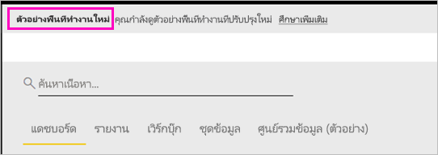
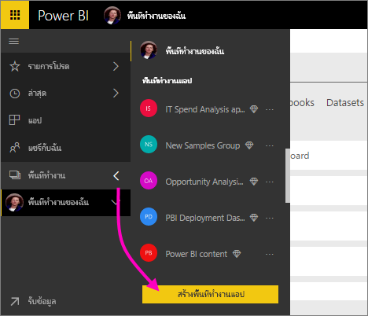
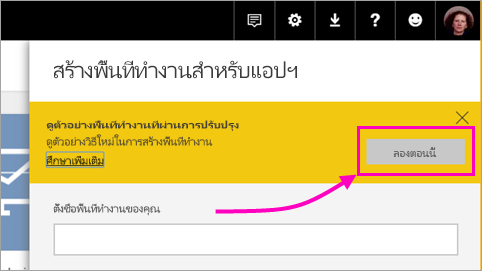
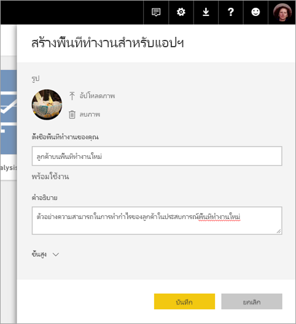
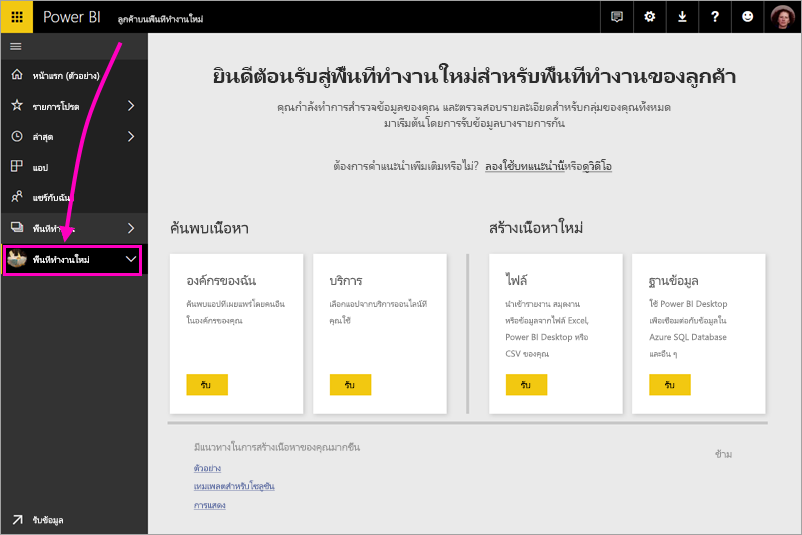
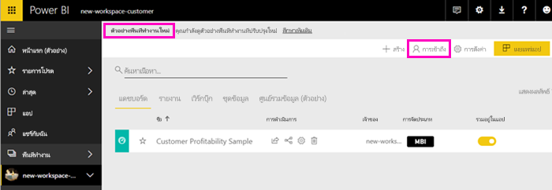
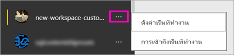

# สร้างพื้นที่ทำงานใหม่ (ตัวอย่าง) ใน Power BI

Power BI แนะนำตัวอย่างการใช้งานพื้นที่ทำงานใหม่ พื้นที่ทำงานยังเป็นพื้นที่ที่ทำงานร่วมกับเพื่อนร่วมงานเพื่อสร้างคอลเลกชันของแดชบอร์ดและรายงาน ซึ่งคุณสามารถรวมสิ่งดังกล่าวลงใน*แอป*และเผยแพร่แอปนั้นไปทั่วทั้งองค์กรของคุณ หรือไปยังบุคคลหรือกลุ่มที่ประสงค์ 

ด้วยตัวอย่างพื้นที่ทำงานใหม่ ตอนนี้คุณสามารถ:

- กำหนดบทบาทพื้นที่ทำงานให้กับกลุ่มผู้ใช้: กลุ่มความปลอดภัย รายการการแจกจ่าย กลุ่ม Office 365 และบุคคลต่างๆ
- สร้างพื้นที่ทำงานใน Power BI โดยไม่ต้องสร้างกลุ่ม Office 365
- ใช้บทบาทพื้นที่ทำงานที่ละเอียดมากขึ้นในการจัดการสิทธิ์ที่ยืดหยุ่นขึ้นในพื้นที่ทำงาน
 
เมื่อคุณสร้างพื้นที่ทำงานใหม่ คุณไม่ได้กำลังสร้างกลุ่ม Office 365 พื้นฐานที่เกี่ยวข้อง การดูแลระบบพื้นที่ทำงานทั้งหมดอยู่ใน Power BI ไม่ได้อยู่ใน Office 365 คุณยังคงสามารถเพิ่มกลุ่ม Office 365 ให้กับพื้นที่ทำงาน เพื่อจัดการผู้ใช้ที่จะเข้าถึงเนื้อหาผ่านทางกลุ่ม Office 365 อย่างไรก็ตาม คุณยังสามารถใช้กลุ่มรักษาความปลอดภัย รายชื่อการแจกจ่ายและเพิ่มบุคคลได้โดยตรงภายใน Power BI เพื่อให้คุณสามารถเข้าถึงพื้นที่ทำงานได้อย่างมีความยืดหยุ่น เนื่องจากการจัดการพื้นที่ทำงานอยู่ใน Power BI แล้ว ผู้ดูแลระบบ BI ที่มีอำนาจจะตัดสินใจว่าใครในองค์กรสามารถสร้างพื้นที่ทำงานได้ ดู [ผู้ดูแลระบบบทความเกี่ยวกับพอร์ทัล Power BI, พื้นที่ทำงาน](service-admin-portal.md#workspace-settings) สำหรับรายละเอียด 

คุณสามารถเพิ่มบุคคลหรือกลุ่มผู้ใช้ให้กับพื้นที่ทำงานใหม่ในฐานะเป็นสมาชิก ผู้สนับสนุน หรือผู้ดูแลระบบ ทุกคนในกลุ่มผู้ใช้มีบทบาทตามที่คุณกำหนด ถ้าบุคคลอยู่ในกลุ่มผู้ใช้หลายกลุ่ม กลุ่มเหล่านั้นมีสิทธิ์ระดับสูงสุดที่กำหนดโดยบทบาท  ดู[บทบาทในพื้นที่ทำงานใหม่](#roles-in-the-new-workspaces)ในภายหลังในบทความนี้สำหรับคำอธิบายเรื่องบทบาทที่แตกต่างกัน

ทุกคนที่คุณเพิ่มลงในพื้นที่ทำงานแอปต้องมีสิทธิ์การใช้งาน Power BI Pro ในพื้นที่ทำงาน ผู้ใช้เหล่านี้สามารถทำงานร่วมกันบนแดชบอร์ดและรายงานที่คุณวางแผนที่จะเผยแพร่ไปยังผู้ชมวงกว้างหรือแม้แต่ทั่วทั้งองค์กรของคุณ ถ้าคุณต้องการแจกจ่ายเนื้อหาให้กับบุคคลอื่นภายในองค์กรของคุณ คุณสามารถมอบหมายใบอนุญาต Power BI Pro ให้กับผู้ใช้เหล่านั้นหรือวางพื้นที่ทำงานในความสามารถของ Power BI Premium ได้

ด้วยพื้นที่ทำงานใหม่ เรากำลังออกแบบฟีเจอร์บางอย่างใหม่ ดู [คุณลักษณะพื้นที่ทำงานของแอปที่ทำงานต่างไปจากนี้](#app-workspace-features-that-work-differently) ในบทความนี้เพื่อดูคำอธิบายเกี่ยวกับการเปลี่ยนแปลงที่คุณคาดหวังว่าจะเป็นแบบถาวรพร้อมกับการดูตัวอย่าง เนื่องจากนี่เป็นเพียงฟีเจอร์ตัวอย่าง จึงมีข้อจำกัดบางอย่างที่คุณควรระวัง ดู [ปัญหาที่ทราบแล้ว](#known-issues) ในบทความนี้สำหรับคำอธิบายข้อจำกัดในปัจจุบัน 

## เผยแพร่พื้นที่ทำงานแอปใหม่

ในระหว่างช่วงแสดงตัวอย่าง พื้นที่ทำงานใหม่ และเก่าสามารถอยู่ร่วมเคียงข้างกัน และคุณสามารถสร้างอันใดก็ได้ เมื่อตัวอย่างพื้นที่ทำงานใหม่สิ้นสุดและมีให้พร้อมใช้งาน พื้นที่ทำงานเก่าสามารถยังคงอยู่ในระยะหนึ่ง คุณจะไม่สามารถสร้างพื้นที่ทำงานเก่า และคุณต้องเตรียมโยกย้ายพื้นที่ทำงานของคุณไปยังโครงสร้างพื้นฐานของพื้นที่ทำงานใหม่ ไม่ต้องกังวล คุณจะมีเวลาหลายเดือนในการโยกย้ายให้เสร็จสมบูรณ์

## สร้างพื้นที่ทำงานแอปใหม่หนึ่งชิ้น

1. เริ่มต้นโดยการสร้างพื้นที่ทำงานแอป เลือก**พื้นที่ทำงาน** > **สร้างพื้นที่ทำงานแอป**
   
     

2. ใน**แสดงตัวอย่างพื้นที่ทำงานที่ปรับปรุง**เลือก**ลองใช้ทันที**
   
     

2. ตั้งชื่อพื้นที่ทำงาน ถ้าไม่มีชื่อ แก้ไขโดยให้ ID ที่ไม่ซ้ำกัน
   
     แอปจะมีชื่อเดียวกันกับพื้นที่ทำงาน
   
1. เพิ่มรูปภาพ ถ้าคุณต้องการ ขนาดไฟล์จะต้อง น้อยกว่า 45 KB
 
    

1. เลือก**บันทึก**

    ต่อไปนี้เ**ยินดีต้อนรับ**หน้าจอสำหรับพื้นที่ทำงานของคุณใหม่ คุณสามารถเพิ่มข้อมูลได้ 

    

1. ตัวอย่าง เลือก**ตัวอย่าง** > **ตัวอย่างกำไรจากลูกค้า**

    ในตอนนี้ในรายการเนื้อหาพื้นที่ทำงาน คุณเห็น**ตัวอย่างพื้นที่ทำงานใหม่** เนื่องจากคุณเป็นผู้ดูแลระบบ คุณยังเห็นการดำเนินการใหม่**เข้าถึง**

    

1. เลือก**เข้าถึง**

1. เพิ่มกลุ่มความปลอดภัย รายการการแจกจ่าย กลุ่ม Office 365 หรือบุคคลลงในพื้นที่ทำงานเหล่านี้เป็นสมาชิก ผู้สนับสนุน หรือผู้ดูแลระบบ ดู[บทบาทในพื้นที่ทำงานใหม่](#roles-in-the-new-workspaces)ในภายหลังในบทความนี้สำหรับคำอธิบายเรื่องบทบาทที่แตกต่างกัน

    

9. เลือก**เพิ่ม** > **ปิด**

1. Power BI จะสร้างพื้นที่ทำงาน และเปิดพื้นที่ทำงานนั้น ซึ่งจะปรากฏขึ้นในรายการของพื้นที่ทำงานที่คุณเป็นสมาชิก เนื่องจากคุณเป็นผู้ดูแลระบบ คุณสามารถเลือกจุดไข่ปลา (...) เพื่อย้อนกลับ และทำการเปลี่ยนแปลงการตั้งค่าพื้นที่ทำงาน เพิ่มสมาชิกใหม่ หรือเปลี่ยนสิทธิ์ของพวกเขา

     

## เพิ่มเนื้อหาลงในพื้นที่ทำงานแอป

หลังจากที่คุณสร้างพื้นที่ทำงานแอปสไตล์ใหม่ ก็ถึงวลาเพิ่มเนื้อหา การเพิ่มเนื้อหาจะคล้ายกันกับที่เกิดขึ้นในพื้นที่ทำงานสไตล์ใหม่ และเก่า แต่มีข้อยกเว้นหนึ่งข้อ ในพื้นที่ทำงานแอปสไตล์หรือเก่า คุณสามารถอัปโหลด หรือเชื่อมต่อกับไฟล์ เหมือนกับที่คุณทำใน My Workspace ของคุณ ในพื้นที่ทำงานใหม่ คุณไม่สามารถเชื่อมต่อกับชุดเนื้อหาระดับองค์กร หรือชุดเนื้อหาของบุคคลที่สามเช่น Microsoft Dynamics CRM, Salesforce หรือ Google Analytics ในพื้นที่ทำงานปัจจุบัน คุณสามารถเชื่อมต่อกับชุดเนื้อหาได้

เมื่อคุณดูเนื้อหาในรายการเนื้อหาของพื้นที่ทำงานแอป ชื่อพื้นที่ทำงานแอปจะแสดงอยู่ว่าเป็นเจ้าของ

### เชื่อมต่อกับบริการอื่นๆ ที่เป็นของบุคคลที่สามในพื้นที่ทำงานใหม่ (ตัวอย่าง)

ในการใช้งานพื้นที่ทำงานใหม่ เรากำลังทำการเปลี่ยนแปลงเพื่อเน้นแอป แอปสำหรับบริการที่เป็นบุคคลสามทำให้ผู้ใช้สามารถรับข้อมูลจากบริการที่พวกเขาใช้ เช่น Microsoft Dynamics CRM, Salesforce หรือ Google Analytics ได้ง่าย
แอประดับองค์กรให้ข้อมูลภายในที่ผู้ใช้ของคุณต้องการแก่ผู้ใช้นั้น เราวางแผนที่จะเพิ่มความสามารถให้แก่แอปองค์กรเพื่อให้ผู้ใช้สามารถกำหนดเนื้อหาที่พวกเขาค้นหาภายในแอป ซึ่งจะขจัดความต้องการชุดเนื้อหา 

ด้วยตัวอย่างพื้นที่ทำงานใหม่ คุณไม่สามารถสร้าง หรือใช้ชุดเนื้อหาระดับองค์กร แต่ คุณสามารถใช้แอปเชื่อมต่อกับบริการของบุคคลที่สาม หรือขอให้ทีมภายในของคุณให้ชุดเนื้อหาแก่แอป ที่คุณกำลังใช้อยู่ในขณะนี้ได้ 

## บทบาทในพื้นที่ทำงานใหม่

บทบาทช่วยให้คุณจัดการว่าใครสามารถทำอะไรในพื้นที่ทำงาน เพื่อให้ทีมสามารถทำงานร่วมกัน พื้นที่ทำงานใหม่ช่วยให้คุณสามารถกำหนดบทบาทให้ กับบุคคล และกลุ่มผู้ใช้: กลุ่มความปลอดภัย กลุ่ม Office 365 และรายการการแจกจ่าย 

เมื่อคุณกำหนดบทบาทให้กับกลุ่มผู้ใช้ บุคคลในกลุ่มจะสามารถเข้าถึงเนื้อหา ถ้าคุณให้สิทธิ์กลุ่มผู้ใช้ ผู้ใช้ทั้งหมดที่อยู่ในกลุ่มจะมีสิทธิ์ ผู้ใช้ที่อยู่ในกลุ่มผู้ใช้หลายกลุ่มในบทบาทต่างๆ จะได้รับสิทธิ์ระดับสูงสุดที่มอบให้พวกเขา 

พื้นที่ทำงานใหม่ให้สามบทบาท: ผู้ดูแลระบบ สมาชิก และผู้สนับสนุน

**ผู้ดูแลระบบสามารถ:**

- ปรับปรุง และลบพื้นที่ทำงาน 
- เพิ่ม/ลบบุคคล รวมถึงผู้ดูแลระบบอื่นๆ
- ทำสิ่งที่สมาชิกสามารถทำ

**สมาชิกสามารถ:** 

- เพิ่มสมาชิกหรือผู้อื่นให้มีสิทธิ์ที่ต่ำกว่า
- เผยแพร่ และอัปเดตแอป
- แชร์รายการหรือแชร์แอป
- อนุญาตให้ผู้อื่นแชร์รายการซ้ำ
- ทำทุกสิ่งที่ผู้สนับสนุนสามารถทำได้

**ผู้สนับสนุนสามารถ:** 

- สร้าง แก้ไข และลบเนื้อหาในพื้นที่ทำงาน 
- เผยแพร่รายงานไปยังพื้นที่ทำงาน ลบเนื้อหา
- ไม่สามารถให้บุคคลใหม่เข้าถึงเนื้อหา ไม่สามารถแชร์เนื้อหาใหม่ แต่สามารถแชร์เนื้อหากับบุคคลที่เคยได้รับการแชร์พื้นที่ทำงาน รายการ หรือแอปแล้ว 
- ไม่สามารถปรับเปลี่ยนสมาชิกของกลุ่ม
 
เรากำลังสร้างเวิร์กโฟลว์การขอการเข้าถึงทั่วทั้งบริการเพื่อให้ผู้ใช้ที่ไม่สามารถเข้าถึงสามารถร้องขอได้ เวิร์กโฟลว์การเข้าถึงคำขอมีอยู่สำหรับแดชบอร์ด รายงาน และแอป

## แจกจ่ายแอป

เมื่อเนื้อหาพร้อมแล้ว คุณสามารถเลือกได้ว่าแดชบอร์ดและรายงานใดที่คุณต้องการจะเผยแพร่ จากนั้นเผยแพร่ในฐานะเป็น*แอป* คุณสามารถสร้างแอปหนึ่งจากแต่ละพื้นที่ทำงาน เพื่อนร่วมงานของคุณสามารถรับแอปของคุณด้วยสองสามวิธีที่แตกต่างกัน คุณสามารถติดตั้งแอปโดยอัตโนมัติในบัญชี Power BI ของเพื่อนร่วมงานของคุณถ้าผู้ดูแลระบบ Power BI ของคุณให้สิทธิ์คุณ มิฉะนั้น พวกเขาสามารถค้นหา และติดตั้งแอปของคุณจาก Microsoft AppSource หรือคุณสามารถส่งลิงก์ให้พวกเขาได้โดยตรง พวกเขาจะได้รับอัปเดตโดยอัตโนมัติ และคุณสามารถควบคุมความถี่ในการรีเฟรชข้อมูลได้ ดู[เผยแพร่แอปด้วยแดชบอร์ดและรายงานใน Power BI](service-create-distribute-apps.md) สำหรับรายละเอียด

## แปลงพื้นที่ทำงานแอปเก่าเป็นแอปใหม่

ในระหว่างช่วงแสดงตัวอย่าง คุณไม่สามารถแปลงพื้นที่ทำงานแอปเก่าของคุณเป็นพื้นที่ทำงานแอปใหม่ได้โดยอัคโนมัติ อย่างไรก็ตาม คุณสามารถสร้างพื้นที่ทำงานแอปใหม่ และเผยแพร่เนื้อหาไปยังที่ตั้งใหม่นั้น 

เมื่อพื้นที่ทำงานใหม่พร้อมใช้งานโดยทั่วไป (GA), คุณสามารถเลือกเข้าร่วมในการโยกย้ายพื้นที่ทำงานเก่าโดยอัตโนมัติ สักพักหลัง GA คุณจะต้องโยกย้ายพื้นที่ทำงานเก่า

## แอปฯ Power BI ถามที่ถามบ่อย

### พื้นที่ทำงานแอปใหม่แตกต่างจากพื้นที่ทำงานแอปปัจจุบันอย่างไร
* การสร้างพื้นที่ทำงานแอปจะไม่สร้างเอนทิตีอย่างเดียวกันใน Office 365 อย่างเช่นพื้นที่ทำงานแอปัจจุบันทำ (คุณยังสามารถเพิ่มกลุ่ม Office 365 ให้กับพื้นที่ทำงานของคุณ โดยการกำหนดบทบาทให้กับกลุ่มดังกล่าว) 
* ในพื้นที่ทำงานแอปปัจจุบัน คุณสามารถเพิ่มบุคคลให้กับรายการสมาชิกและรายการผู้ดูแลระบบ ในพื้นที่ทำงานแอปใหม่ คุณสามารถเพิ่มกลุ่มความปลอดภัย AD หลายกลุ่ม รายการการแจกจ่าย หรือกลุ่ม Office 365 ไปยังรายการสมาชิกและรายการผู้ดูแลระบบเพื่อทำให้ง่ายต่อการจัดการผู้ใช้ 
- คุณสามารถสร้างชุดเนื้อหาระดับองค์กรจากพื้นที่ทำงานแอปปัจจุบัน แต่คุณไม่สามารถสร้างชุดเนื้อหาระดับองค์กรจากพื้นที่ทำงานแอปใหม่
- คุณสามารถใช้ชุดเนื้อหาระดับองค์กรจากพื้นที่ทำงานแอปปัจจุบัน คุณไม่สามารถเรียกใช้ชุดเนื้อหาจากพื้นที่ทำงานแอปใหม่
- ในระหว่างการแสดงตัวอย่าง ความสามารถบางอย่างยังไม่เปิดใช้งานเพื่อพื้นที่ทำงานแอปใหม่ ดูหัวข้อถัดไป [ฟีเจอร์ของพื้นที่ทำงานใหม่ที่วางแผนไว้อื่นๆ](service-create-the-new-workspaces.md#other-planned-new-app-workspace-preview-features) สำหรับรายละเอียด

## ฟีเจอร์ของตัวอย่างพื้นที่ทำงานแอปใหม่ที่วางแผนไว้

ฟีเจอร์ของตัวอย่างพื้นที่ทำงานแอปใหม่อื่นๆ กำลังได้รับการพัฒนา แต่ยังไม่พร้อมใช้งานเมื่อเราเปิดใช้ตัวอย่าง:

- ไม่มีปุ่ม**ออกจากพื้นที่ทำงาน**
- เมตริกการใช้งานไม่ได้รับการสนับสนุน
- วิธีการทำงานของ Premium: คุณสามารถกำหนด และสร้างพื้นที่ทำงานในความจุระดับ Premium แต่เมื่อต้องย้ายพื้นที่ทำงานระหว่างความจุที่แตกต่างกัน ไปที่การตั้งค่าของพื้นที่ทำงาน
- การฝัง SharePoint web part ยังไม่ได้รับการสนับสนุน
- ไม่มีปุ่ม **OneDrive** สำหรับกลุ่ม Office 365 ใน รับข้อมูล/ไฟล์

## พื้นที่ทำงานแอปมีการทำงานดังกล่าวแตกต่างกัน

ฟีเจอร์บางอย่างของพื้นที่ทำงานแอปใหม่ทำงานแตกต่างจากพื้นที่ทำงานแอปปัจจุบัน ความแตกต่างเหล่านี้เป็นความตั้งใจ ตามคำติชมที่เราได้รับจากลูกค้า และจะทำให้เกิดความยืดหยุ่นในการการทำงานร่วมกับพื้นที่ทำงาน

- สมาชิกสามารถหรือไม่สามารถแชร์ต่อ: ถูกแทนที่ ด้วยบทบาทผู้สนับสนุน
- พื้นที่ทำงานแบบอ่านอย่างเดียว: แทนที่จะอนุญาตให้ผู้ใช้เข้าถึงแบบอ่านอย่างเดียวในพื้นที่ทำงาน คุณจะกำหนดผู้ใช้มีบทบาทเป็นผู้ดูที่กำลังจะเผยแพร่ ซึ่งอนุญาตให้เข้าถึงเนื้อหาในพื้นที่ทำงานได้แบบอ่านอย่างเดียวเหมือนกัน

## ปัญหาที่ทราบแล้ว

ปัญหาต่อไปนี้เป็นเรื่องที่ทราบกันดี และการแก้ไขอยู่ในระหว่างการพัฒนา:

- ผู้ใช้หรือกลุ่มผู้ใช้ที่ถูกเพิ่มเป็นผู้รับอีเมล์จากการสมัครใช้งานอาจไม่ได้รับอีเมล์ แม้ว่าพวกเขาควรจะได้รับ ปัญหาเกิดขึ้นเมื่อหนึ่งในพื้นที่ทำงานใหม่อยู่ในความจุระดับ Premium แต่พื้นที่ทำงานของฉันของผู้ใช้ที่สร้างการสมัครใช้งานไม่ได้อยู่ในความจุระดับ Premium ถ้าพื้นที่ทำงานของฉันอยู่ในความจุระดับ Premium ผู้ใช้และกลุ่มผู้ใช้ฟรีจะได้รับอีเมล
- หลังจากพื้นที่ทำงานถูกย้ายจากความจุระดับ Premium ไปยังความจุที่แชร์ร่วมกัน ในบางกรณี ผู้ใช้และกลุ่มผู้ใช้ฟรีจะยังคงได้รับอีเมล์แม้ว่าพวกเขาไม่ควรได้รับ ปัญหาเกิดขึ้นเมื่อพื้นที่ทำงานของฉันของผู้ใช้สร้างการสมัครใช้งานในความจุระดับ Premium

## ขั้นตอนถัดไป
* [สร้างพื้นที่ทำงานปัจจุบัน](service-create-workspaces.md)
* [ติดตั้งและใช้แอปฯใน Power BI](service-create-distribute-apps.md)
* มีคำถามหรือไม่ [ลองถามชุมชน Power BI](http://community.powerbi.com/)
