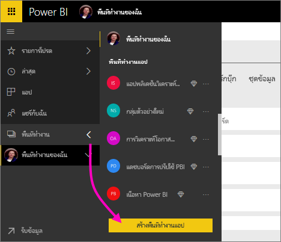
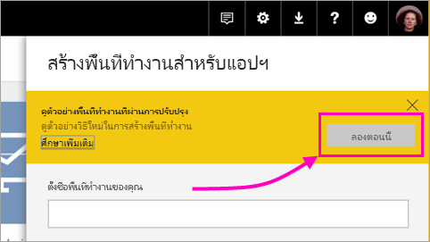
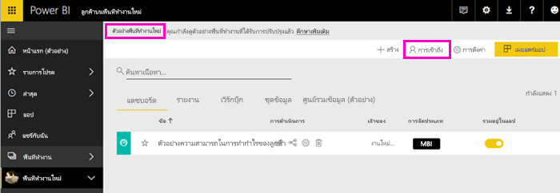
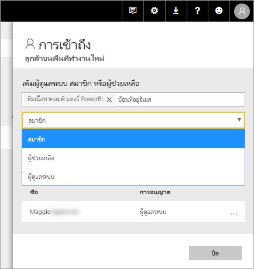
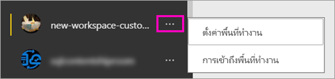

# สร้างพื้นที่ทำงานใหม่ (ตัวอย่าง) ใน Power BI

Power BI แนะนำตัวอย่างการใช้งานพื้นที่ทำงานใหม่ พื้นที่ทำงานยังเป็นพื้นที่ที่ทำงานร่วมกับเพื่อนร่วมงานเพื่อสร้างคอลเลกชันของแดชบอร์ดและรายงาน ซึ่งคุณสามารถรวมสิ่งดังกล่าวลงใน*แอป*และเผยแพร่แอปนั้นไปทั่วทั้งองค์กรของคุณ หรือไปยังบุคคลหรือกลุ่มที่ประสงค์ 

ด้วยตัวอย่างพื้นที่ทำงานใหม่ ตอนนี้คุณสามารถ:

- กำหนดบทบาทพื้นที่ทำงานให้กับกลุ่มผู้ใช้: กลุ่มความปลอดภัย รายการการแจกจ่าย กลุ่ม Office 365 และบุคคลต่างๆ
- สร้างพื้นที่ทำงานใน Power BI โดยไม่ต้องสร้างกลุ่ม Office 365
- ใช้บทบาทพื้นที่ทำงานที่ละเอียดมากขึ้นในการจัดการสิทธิ์ที่ยืดหยุ่นขึ้นในพื้นที่ทำงาน

สำหรับพื้นหลังเพิ่มเติม ดูบทความ [พื้นที่ทำงานใหม่ (ตัวอย่าง)](service-new-workspaces.md)

## สร้างพื้นที่ทำงานแอปใหม่หนึ่งชิ้น

1. เริ่มต้นโดยการสร้างพื้นที่ทำงานแอป เลือก**พื้นที่ทำงาน** > **สร้างพื้นที่ทำงานแอป**
   
     

2. ใน**แสดงตัวอย่างพื้นที่ทำงานที่ปรับปรุง**เลือก**ลองใช้ทันที**
   
     

2. ตั้งชื่อพื้นที่ทำงาน ถ้าไม่มีชื่อ แก้ไขโดยให้ ID ที่ไม่ซ้ำกัน
   
     แอปจะมีชื่อเดียวกันกับพื้นที่ทำงาน
   
1. เพิ่มรูปภาพ ถ้าคุณต้องการ ขนาดไฟล์จะต้อง น้อยกว่า 45 KB
 
    

1. เลือก**บันทึก**

    ต่อไปนี้เ**ยินดีต้อนรับ**หน้าจอสำหรับพื้นที่ทำงานของคุณใหม่ คุณสามารถเพิ่มข้อมูลได้ 

    

1. ตัวอย่าง เลือก**ตัวอย่าง** > **ตัวอย่างกำไรจากลูกค้า**

    ในตอนนี้ในรายการเนื้อหาพื้นที่ทำงาน คุณเห็น**ตัวอย่างพื้นที่ทำงานใหม่** เนื่องจากคุณเป็นผู้ดูแลระบบ คุณยังเห็นการดำเนินการใหม่**เข้าถึง**

    

1. เลือก**เข้าถึง**

1. เพิ่มกลุ่มความปลอดภัย รายการการแจกจ่าย กลุ่ม Office 365 หรือบุคคลลงในพื้นที่ทำงานเหล่านี้เป็นสมาชิก ผู้สนับสนุน หรือผู้ดูแลระบบ ดู[บทบาทในพื้นที่ทำงานใหม่](service-new-workspaces.md#roles-in-the-new-workspaces)สำหรับคำอธิบายเรื่องบทบาทที่แตกต่างกัน

    

9. เลือก**เพิ่ม** > **ปิด**

1. Power BI จะสร้างพื้นที่ทำงาน และเปิดพื้นที่ทำงานนั้น ซึ่งคุณจะเห็นในรายการของพื้นที่ทำงานที่คุณเป็นสมาชิก เนื่องจากคุณเป็นผู้ดูแลระบบ คุณสามารถเลือกจุดไข่ปลา (...) เพื่อย้อนกลับ และทำการเปลี่ยนแปลงการตั้งค่าพื้นที่ทำงาน เพิ่มสมาชิกใหม่ หรือเปลี่ยนสิทธิ์ของพวกเขา

     

## เพิ่มเนื้อหาลงในพื้นที่ทำงานแอป

หลังจากที่คุณสร้างพื้นที่ทำงานแอปสไตล์ใหม่ ก็ถึงวลาเพิ่มเนื้อหา การเพิ่มเนื้อหาจะคล้ายกันกับที่เกิดขึ้นในพื้นที่ทำงานสไตล์ใหม่ และเก่า แต่มีข้อยกเว้นหนึ่งข้อ ในพื้นที่ทำงานแอปสไตล์หรือเก่า คุณสามารถอัปโหลด หรือเชื่อมต่อกับไฟล์ เหมือนกับที่คุณทำใน My Workspace ของคุณ ในพื้นที่ทำงานใหม่ คุณไม่สามารถเชื่อมต่อกับชุดเนื้อหาระดับองค์กร หรือชุดเนื้อหาของบุคคลที่สามเช่น Microsoft Dynamics CRM, Salesforce หรือ Google Analytics ในพื้นที่ทำงานปัจจุบัน คุณสามารถเชื่อมต่อกับชุดเนื้อหาได้

เมื่อคุณดูเนื้อหาในรายการเนื้อหาของพื้นที่ทำงานแอป ชื่อพื้นที่ทำงานแอปจะถูกแสดงในฐานะเป็นเจ้าของ

### เชื่อมต่อกับบริการอื่นๆ ที่เป็นของบุคคลที่สามในพื้นที่ทำงานใหม่ (ตัวอย่าง)

ในการใช้งานพื้นที่ทำงานใหม่ เรากำลังทำการเปลี่ยนแปลงเพื่อเน้น*แอป* แอปสำหรับบริการที่เป็นบุคคลสามทำให้ผู้ใช้สามารถรับข้อมูลจากบริการที่พวกเขาใช้ เช่น Microsoft Dynamics CRM, Salesforce หรือ Google Analytics ได้ง่าย
แอประดับองค์กรให้ข้อมูลภายในที่ผู้ใช้ของคุณต้องการแก่ผู้ใช้นั้น เราวางแผนที่จะเพิ่มความสามารถให้แก่แอปองค์กรเพื่อให้ผู้ใช้สามารถกำหนดเนื้อหาที่พวกเขาค้นหาภายในแอป ความสามารถดังกล่าวจะขจัดความต้องการสำหรับชุดเนื้อหา 

ด้วยตัวอย่างพื้นที่ทำงานใหม่ คุณไม่สามารถสร้าง หรือใช้ชุดเนื้อหาระดับองค์กร แต่ คุณสามารถใช้แอปเชื่อมต่อกับบริการของบุคคลที่สาม หรือขอให้ทีมภายในของคุณให้ชุดเนื้อหาแก่แอป ที่คุณกำลังใช้อยู่ในขณะนี้ได้ 

## แจกจ่ายแอป

เมื่อเนื้อหาพร้อมแล้ว คุณสามารถเลือกได้ว่าแดชบอร์ดและรายงานใดที่คุณต้องการจะเผยแพร่ จากนั้นเผยแพร่ในฐานะเป็น*แอป* คุณสามารถสร้างแอปหนึ่งจากแต่ละพื้นที่ทำงาน เพื่อนร่วมงานของคุณสามารถรับแอปของคุณด้วยสองสามวิธีที่แตกต่างกัน คุณสามารถติดตั้งแอปโดยอัตโนมัติในบัญชี Power BI ของเพื่อนร่วมงานของคุณถ้าผู้ดูแลระบบ Power BI ของคุณให้สิทธิ์คุณ มิฉะนั้น พวกเขาสามารถค้นหา และติดตั้งแอปของคุณจาก Microsoft AppSource หรือคุณสามารถส่งลิงก์ให้พวกเขาได้โดยตรง พวกเขาจะได้รับอัปเดตโดยอัตโนมัติ และคุณสามารถควบคุมความถี่ในการรีเฟรชข้อมูลได้ ดู[เผยแพร่แอปด้วยแดชบอร์ดและรายงานใน Power BI](service-create-distribute-apps.md) สำหรับรายละเอียด

## แปลงพื้นที่ทำงานแอปเก่าเป็นแอปใหม่

ในระหว่างช่วงแสดงตัวอย่าง คุณไม่สามารถแปลงพื้นที่ทำงานแอปเก่าของคุณเป็นพื้นที่ทำงานแอปใหม่ได้โดยอัคโนมัติ อย่างไรก็ตาม คุณสามารถสร้างพื้นที่ทำงานแอปใหม่ และเผยแพร่เนื้อหาไปยังที่ตั้งใหม่นั้น 

เมื่อพื้นที่ทำงานใหม่พร้อมใช้งานโดยทั่วไป (GA), คุณสามารถเลือกเข้าร่วมในการโยกย้ายพื้นที่ทำงานเก่าโดยอัตโนมัติ สักพักหลัง GA คุณจะต้องโยกย้ายพื้นที่ทำงานเก่า

## ขั้นตอนถัดไป
* อ่านเกี่ยวกับ[จัดระเบียบงานในพื้นที่ทำงานใหม่ (ตัวอย่าง) ใน Power BI](service-new-workspaces.md)
* [สร้างพื้นที่ทำงานปัจจุบัน](service-create-workspaces.md)
* [ติดตั้งและใช้แอปฯใน Power BI](service-create-distribute-apps.md)
* มีคำถามหรือไม่ [ลองถามชุมชน Power BI](http://community.powerbi.com/)
