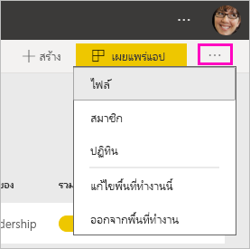
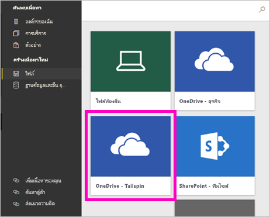
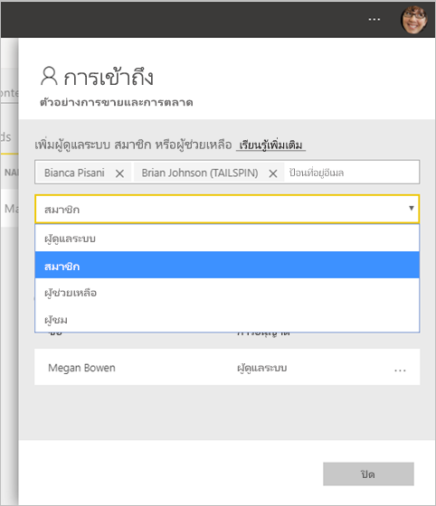

# สร้างพื้นที่ทำงานใหม่ใน Power BI

Power BI แนะนำการใช้งานพื้นที่ทำงานใหม่ พื้นที่ทำงานยังเป็นสถานที่ทำงานร่วมกับเพื่อนร่วมงานเพื่อสร้างคอลเลกชันของแดชบอร์ด รายงานและรายงานที่มีการแบ่งหน้า จากนั้น คุณสามารถรวมคอลเลกชันเหล่านั้นเข้าด้วยกันเป็น*แอป* และแจกจ่ายให้กับทั้งองค์กรคุณหรือเฉพาะบุคคลหรือกลุ่ม 

นี่คือสิ่งที่แตกต่างกัน ในพื้นที่ทำงานใหม่ คุณสามารถ:

- กำหนดบทบาทพื้นที่ทำงานให้กับกลุ่มผู้ใช้: กลุ่มความปลอดภัย รายการการแจกจ่าย กลุ่ม Office 365 และบุคคลต่างๆ
- สร้างพื้นที่ทำงานใน Power BI โดยไม่ต้องสร้างกลุ่ม Office 365
- ใช้บทบาทพื้นที่ทำงานที่ละเอียดมากขึ้นในการจัดการสิทธิ์ที่ยืดหยุ่นขึ้นในพื้นที่ทำงาน

> [!NOTE]
> เมื่อต้องการบังคับใช้การรักษาความปลอดภัยระดับแถว (RLS) สำหรับผู้ใช้ Power BI Pro ที่เรียกดูเนื้อหาในพื้นที่ทำงาน ให้มอบหมายบทบาทผู้ชมให้แก่ผู้ใช้

สำหรับพื้นหลังเพิ่มเติม ดูบทความ [พื้นที่ทำงานใหม่](service-new-workspaces.md)

## สร้างพื้นที่ทำงานใหม่หนึ่งพื้นที่

1. เริ่มต้นโดยการสร้างพื้นที่ทำงาน เลือก **พื้นที่ทำงาน** > **สร้างพื้นที่ทำงาน**
   
     

2. คุณกำลังสร้างพื้นที่ทำงานที่อัปเกรดโดยอัตโนมัติ เว้นแต่ว่าคุณจะเลือกที่จะ**แปลงกลับเป็นแบบดั้งเดิม**
   
     
     
     ถ้าคุณเลือก**แปลงกลับเป็นแบบดั้งเดิม** คุณจะสร้าง[พื้นที่ทำงานโดยยึดตาม Office 365 Group](service-create-workspaces.md) 

2. ตั้งชื่อพื้นที่ทำงาน ถ้าไม่มีชื่อ แก้ไขโดยให้ชื่อที่ไม่ซ้ำกัน
   
     แอปสำหรับพื้นที่ทำงานจะมีชื่อและไอคอนเดียวกันกับพื้นที่ทำงาน
   
1. ต่อไปนี้คือรายการที่เป็นตัวเลือกบางอย่างที่คุณสามารถตั้งค่าสำหรับพื้นที่ทำงานของคุณ:

    อัปโหลด**รูปพื้นที่ทำงาน** ไฟล์สามารถเป็นรูปแบบ .png หรือ .jpg ได้ ขนาดไฟล์จะต้องน้อยกว่า 45 KB
    
    [เพิ่ม**รายชื่อติดต่อ**](#workspace-contact-list) ตามค่าเริ่มต้น ผู้ดูแลระบบพื้นที่ทำงานเป็นผู้ติดต่อ 
    
    [ระบุ**พื้นที่ทำงาน OneDrive**](#workspace-onedrive) โดยการพิมพ์เพียงแค่ชื่อของ Office 365 Group ที่มีอยู่ไม่ใช่ URL ในตอนนี้ พื้นที่ทำงานนี้สามารถใช้ตำแหน่งที่เก็บไฟล์ของ Office 365 Group นั้นได้ 

    

    หากต้องการกำหนดพื้นที่ทำงานสำหรับ**ความจุเฉพาะ**บนแท็บ**พรีเมียม** เลือก**ความจุเฉพาะ**
     
    

1. เลือก**บันทึก**

    Power BI จะสร้างพื้นที่ทำงาน และเปิดพื้นที่ทำงานนั้น ซึ่งคุณจะเห็นในรายการของพื้นที่ทำงานที่คุณเป็นสมาชิก 

## รายการผู้ติดต่อของพื้นที่ทำงาน

รายการผู้ติดต่อของพื้นที่ทำงานใหม่ช่วยให้คุณสามารถระบุผู้ใช้ที่ได้รับการแจ้งเตือนเกี่ยวกับปัญหาที่เกิดขึ้นในพื้นที่ทำงาน ตามค่าเริ่มต้น ผู้ใช้หรือกลุ่มใดๆ ที่ระบุเป็นพื้นที่ทำงานผู้ดูแลระบบจะได้รับแจ้ง แต่คุณสามารถปรับแต่งรายการได้ ผู้ใช้หรือกลุ่มที่แสดงอยู่ในรายการผู้ติดต่อจะแสดงในส่วนติดต่อผู้ใช้ (UI) เพื่อช่วยให้ผู้ใช้รับความช่วยเหลือที่เกี่ยวข้องกับพื้นที่ทำงาน

1. เข้าถึงการตั้งค่า**รายชื่อผู้ติดต่อ**ใหม่ด้วยหนึ่งในสองวิธี:

    ในบานหน้าต่าง**สร้างพื้นที่ทำงาน**เมื่อคุณสร้างในครั้งแรก

    ในบานหน้าต่างการแจ้งเตือนทางด้านซ้าย เลือกลูกศรถัดจาก**พื้นที่ทำงาน** เลือกจุดไข่ปลา (...) ถัดจากชื่อพื้นที่ทำงานของคุณ > **การตั้งค่าพื้นที่ทำงาน** บานหน้าต่าง**การตั้งค่า**จะเปิดขึ้น

    

2. ภายใต้ **ขั้นสูง** > **รายชื่อผู้ติดต่อ** ใช้ค่าเริ่มต้น, **ผู้ดูแลระบบพื้นที่ทำงาน**, หรือเพิ่มรายชื่อ **กลุ่มหรือผู้ใช้ที่เฉพาะเจาะจง**ของคุณเอง 
3. เลือก**บันทึก**

## พื้นที่ทำงาน OneDrive

ฟีเจอร์ของพื้นที่ทำงาน OneDrive ช่วยให้คุณสามารถกำหนดค่าการเก็บไฟล์ SharePoint Document Library ในกลุ่ม Office 365 และจะพร้อมใช้งานให้ผู้ใช้พื้นที่ทำงาน คุณสร้างกลุ่มภายนอก Power BI ก่อน 

Power BI จะไม่เชื่อมสิทธิ์ของผู้ใช้หรือกลุ่มผู้ใช้ที่มีการกำหนดค่าการเข้าถึงพื้นที่ทำงานเข้ากับสมาชิกกลุ่มผู้เป็นสมาชิกของ Office 365 แนวทางปฏิบัติที่ดีที่สุดคือการให้ Office 365 Group เดียวกันซึ่งมีที่เก็บข้อมูลไฟล์ที่คุณกำหนดค่าในการตั้งค่า Office 365 Group นี้ [เข้าถึงพื้นที่ทำงาน](#give-access-to-your-workspace) จากนั้นจัดการการเข้าถึงพื้นที่ทำงานโดยการจัดการสมาชิกของ Office 365 Group 

1. เข้าถึงการตั้งค่า**พื้นที่ทำงาน OneDrive** ใหม่ในหนึ่งในสองวิธี:

    ในบานหน้าต่าง**สร้างพื้นที่ทำงาน**เมื่อคุณสร้างในครั้งแรก

    ในบานหน้าต่างการแจ้งเตือนทางด้านซ้าย เลือกลูกศรถัดจาก**พื้นที่ทำงาน** เลือกจุดไข่ปลา (...) ถัดจากชื่อพื้นที่ทำงานของคุณ > **การตั้งค่าพื้นที่ทำงาน** บานหน้าต่าง**การตั้งค่า**จะเปิดขึ้น

    

2. ภายใต้ **ขั้นสูง** > **พื้นที่ทำงาน OneDrive** พิมพ์ชื่อของ Office 365 Group ที่คุณสร้างก่อนหน้านี้ Power BI จะเลือก OneDrive สำหรับกลุ่มโดยอัตโนมัติ

    

3. เลือก**บันทึก**

### เข้าถึงตำแหน่งที่ตั้งพื้นที่ทำงาน OneDrive

หลังจากที่คุณได้กำหนดค่าตำแหน่งที่ตั้งของ OneDrive แล้ว คุณสามารถเข้าถึงได้จากตำแหน่งที่ต่างกันเล็กน้อยในพื้นที่ทำงาน:

- เลือก **พื้นที่ทำงาน** > *ชื่อพื้นที่ทำงาน* > เมนูจุดไข่ปลา ( **...** ) > **ไฟล์** 

    

- เลือกเมนูจุดไข่ปลา ( **...** ) ในมุมขวาบนของพื้นที่ทำงาน > **ไฟล์**

    
    
- ในการใช้งาน**ดูไฟล์** > **ข้อมูล** รายการ **OneDrive – Business** คือ OneDrive สำหรับธุรกิจของคุณเอง OneDrive ที่สองคือรายการที่คุณเพิ่ม

    

## เพิ่มเนื้อหาไปยังพื้นที่ทำงานของคุณ

หลังจากที่คุณสร้างพื้นที่ทำงานสำหรับการใช้งานพื้นที่ทำงานใหม่ ถึงเวลาเพิ่มเนื้อหาในพื้นที่ทำงาน การเพิ่มเนื้อหาจะคล้ายกันในพื้นที่ทำงานใหม่และพื้นที่ทำงานแบบดั้งเดิม ใช้ปุ่มสร้างหรือใช้ดูข้อมูลเพื่อเพิ่มเนื้อหาลงในพื้นที่ทำงานของคุณ

1. ในหน้าจอ**ยินดีต้อนรับ**สำหรับพื้นที่ทำงานของคุณใหม่ คุณสามารถเพิ่มข้อมูลได้ 

    

1. ตัวอย่าง เลือก**ตัวอย่าง** > **ตัวอย่างกำไรจากลูกค้า**

> [!NOTE]
> คุณไม่สามารถเพิ่มชุดเนื้อหาองค์กรหรือชุดเนื้อหาของบริษัทอื่นไปยังพื้นที่ทำงานใหม่ได้ แอปพร้อมใช้งานสำหรับชุดเนื้อหาของบริษัทอื่นจำนวนมากที่คุณใช้ก่อนหน้านี้ ใช้พื้นที่ทำงานแบบดั้งเดิมถ้าคุณต้องการใช้ชุดเนื้อหาต่อไป ชุดเนื้อหาจะถูกยกเลิกการสนับสนุน ดังนั้นจึงเป็นวิธีที่ดีที่สุดที่จะใช้แอปแทน

เมื่อคุณดูเนื้อหาในรายการเนื้อหาของพื้นที่ทำงาน ชื่อพื้นที่ทำงานจะถูกแสดงในฐานะเป็นเจ้าของ

### การเชื่อมต่อกับบริการอื่น ๆ ที่เป็นของบุคคลที่สามในพื้นที่ทำงานใหม่

ในการใช้งานพื้นที่ทำงานใหม่ เรากำลังทำการเปลี่ยนแปลงเพื่อเน้น*แอป* แอปสำหรับบริการที่เป็นบุคคลสามทำให้ผู้ใช้สามารถรับข้อมูลจากบริการที่พวกเขาใช้ เช่น Microsoft Dynamics CRM, Salesforce หรือ Google Analytics ได้ง่าย

ในการใช้งานของพื้นที่ทำงานใหม่ คุณไม่สามารถสร้าง หรือใช้ชุดเนื้อหาระดับองค์กร แต่ คุณสามารถใช้แอปเชื่อมต่อกับบริการของบุคคลที่สาม หรือขอให้ทีมภายในของคุณให้ชุดเนื้อหาแก่แอป ที่คุณกำลังใช้อยู่ในขณะนี้ได้ 

## ให้สิทธิ์การเข้าถึงพื้นที่ทำงานของคุณ

1. ในรายการเนื้อหาของพื้นที่ทำงานเนื่องจากคุณเป็นผู้ดูแลระบบ คุณจะเห็นการดำเนินการใหม่**การเข้าถึง**

    

1. เลือก**เข้าถึง**

1. เพิ่มกลุ่มความปลอดภัย รายการการแจกจ่าย กลุ่ม Office 365 หรือบุคคลลงในพื้นที่ทำงานเหล่านี้เป็นสมาชิก ผู้สนับสนุน หรือผู้ดูแลระบบ ดู[บทบาทในพื้นที่ทำงานใหม่](service-new-workspaces.md#roles-in-the-new-workspaces)สำหรับคำอธิบายเรื่องบทบาทที่แตกต่างกัน

    

9. เลือก**เพิ่ม** > **ปิด**

## แจกจ่ายแอป

ถ้าคุณต้องการแจกจ่ายเนื้อหาอย่างเป็นทางการไปยังผู้ชมจำนวนมากภายในองค์กรของคุณ คุณสามารถเผยแพร่แอปจากพื้นที่ทำงานของคุณได้  เมื่อเนื้อหาพร้อมแล้ว คุณสามารถเลือกได้ว่าแดชบอร์ดและรายงานใดที่คุณต้องการจะเผยแพร่ จากนั้นเผยแพร่ในฐานะเป็น*แอป* คุณสามารถสร้างแอปหนึ่งจากแต่ละพื้นที่ทำงาน

อ่านเกี่ยวกับ[การเผยแพร่แอปจากพื้นที่ทำงานใหม่](service-create-distribute-apps.md)

## ขั้นตอนถัดไป
* อ่านเกี่ยวกับ[การจัดระเบียบงานในการใช้งานพื้นที่ทำงานใหม่ใน Power BI](service-new-workspaces.md)
* [สร้างพื้นที่ทำงานแบบดั้งเดิม](service-create-workspaces.md)
* [เผยแพร่แอปจากพื้นที่ทำงานใหม่ใน Power BI ](service-create-distribute-apps.md)
* มีคำถามหรือไม่ [ลองถามชุมชน Power BI](http://community.powerbi.com/)
