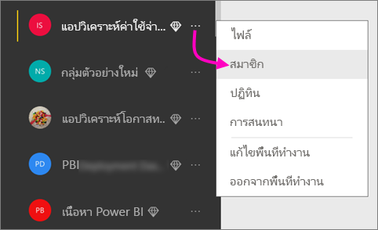
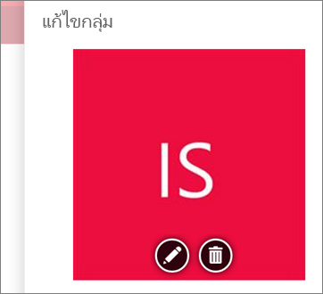
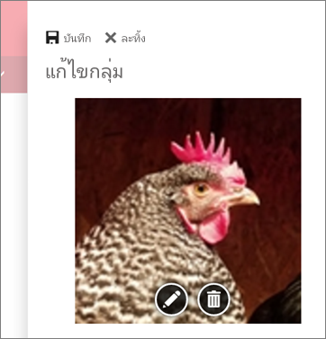
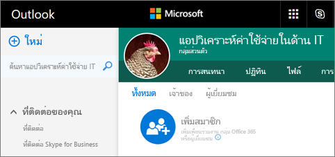
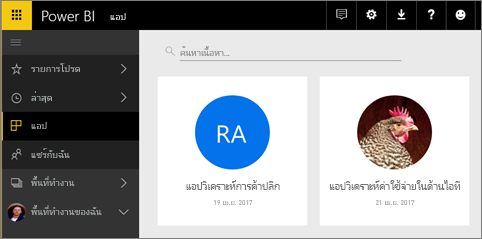

# สร้างพื้นที่ทำงานแบบคลาสสิกใน Power BI

ใน Power BI คุณสามารถสร้าง*พื้นที่ทำงาน*จะทำงานร่วมกับเพื่อนร่วมงานเพื่อสร้าง และปรับปรุงคอลเลกชันของแดชบอร์ด รายงาน และรายงานแบบแบ่งหน้าได้ จาก นั้นคุณสามารถรวมคอลเลกชันร่วมกันใน*แอ*ที่คุณสามารถแจกจ่ายองค์กรของคุณทั้งหมด หรือเฉพาะบุคคลหรือกลุ่ม 

**คุณทราบหรือไม่** Power BI มีพื้นที่ทำงานประสบการณ์ใหม่ ซึ่งตอนนี้ค่าเริ่มต้น อ่าน[จัดระเบียบงานในพื้นที่ทำงานใหม่](service-new-workspaces.md)สำหรับรายละเอียดเกี่ยวกับพื้นที่ทำงานใหม่ 

เมื่อคุณสร้างพื้นที่ทำงานแบบคลาสสิก คุณกำลังสร้างกลุ่ม Office 365 พื้นฐาน เกี่ยวข้อง การดูแลระบบพื้นที่ทำงานทั้งหมดอยู่ใน Office 365 คุณสามารถเพิ่มผู้ร่วมงานไปยังพื้นที่ทำงานเหล่านี้ได้ในฐานะเป็นสมาชิกหรือเป็นผู้ดูแลระบบ ในพื้นที่ทำงาน คุณสามารถทำงานร่วมกันทั้งหมดบนแดชบอร์ด รายงาน และบทความอื่นๆ ที่คุณวางแผนที่จะเผยแพร่ไปยังผู้ชมจำนวนมาก ทุกคนที่คุณเพิ่มลงในพื้นที่ทำงานแอปต้องมีสิทธิ์การใช้งาน Power BI Pro 

## วิดีโอ: แอปและพื้นที่ทำงานของแอป
<iframe width="640" height="360" src="https://www.youtube.com/embed/Ey5pyrr7Lk8?showinfo=0" frameborder="0" allowfullscreen></iframe>

## สร้างพื้นที่ทำงานแบบคลาสสิกแอตามกลุ่ม Office 365

เมื่อคุณสร้างพื้นที่ทำงานแอป แอปนั้นจะถูกสร้างบนกลุ่ม Office 365

[!INCLUDE [powerbi-service-create-app-workspace](./includes/powerbi-service-create-app-workspace.md)]

เมื่อคุณเริ่มสร้างพื้นที่ทำงานเป็นครั้งแรก คุณอาจต้องรอเป็นเวลาหนึ่งชั่วโมงหรือมากกว่า เพื่อให้พื้นที่ทำงานเผยแพร่ไปยัง Office 365 

### เพิ่มรูปภาพลงในพื้นที่ทำงานแอป Office 365 ของคุณ (เป็นตัวเลือก)
ตามค่าเริ่มต้น Power BI สร้างวงกลมสีขนาดเล็กสำหรับแอปฯของคุณด้วยชื่อย่อของแอปฯ แต่คุณอาจต้องการกำหนดด้วยตนเองด้วยรูปภาพหนึ่ง ในการเพิ่มรูปภาพ คุณจำเป็นต้องมีสิทธิ์การใช้งาน Exchange Online

1. เลือก**พื้นที่ทำงาน** เลือกจุดไข่ปลา (...) ที่อยู่ถัดจากชื่อของพื้นที่ทำงาน จากนั้นเลือก**สมาชิก** 
   
     
   
    บัญชี Office 365 Outlook สำหรับพื้นที่ทำงานเปิดขึ้นในหน้าต่างเบราว์เซอร์ใหม่
2. เมื่อคุณเลื่อนไปเหนือวงกลมสีที่ด้านบนซ้าย วงกลมนั้นจะเปลี่ยนเป็นไอคอนรูปดินสอ เลือกไอคอนนั้น
   
     
3. เลือกไอคอนรูปดินสออีกครั้งและค้นหารูปภาพที่คุณต้องการใช้
   
     

     รูปภาพได้ไฟล์.png, .jpg หรือ.bmp ขนาดไฟล์มีขนาดใหญ่ ขึ้นเป็น 3 เมกะไบต์ 

4. เลือก**บันทึก**
   
     
   
    รูปภาพแทนที่วงกลมสีในหน้าต่าง Office 365 Outlook 
   
     
   
    ในไม่กี่นาที ภาพจะปรากฏในแอปฯใน Power BI ด้วยเหมือนกัน
   
     

## เพิ่มเนื้อหาลงในพื้นที่ทำงานแอป

หลังจากที่คุณสร้างพื้นที่ทำงานแอป ถึงเวลาเพิ่มเนื้อหา ซึ่งเหมือนกับการเพิ่มเนื้อหาไปยังพื้นที่ทำงานของฉัน เว้นแต่ว่าบุคคลอื่นในพื้นที่ทำงานสามารถดู และทำงานบนแอปนั้นได้ ความแตกต่างอย่างมากเมื่อคุณทำเสร็จแล้วคือ คุณสามารถเผยแพร่เนื้อหาในฐานะเป็นแอปฯ เมื่อคุณดูเนื้อหาในรายการเนื้อหาของพื้นที่ทำงานแอป ชื่อพื้นที่ทำงานแอปจะถูกแสดงในฐานะเป็นเจ้าของ

### เชื่อมต่อกับบริการที่เป็นบุคคลที่สามในพื้นที่ทำงานแอป

แอปสามารถใช้บริการที่เป็นบุคคลที่สามที่ Power BI สนับสนุน จึงง่ายสำหรับคุณที่จะได้รับข้อมูลจากบริการที่คุณใช้ เช่น Microsoft Dynamics CRM, Salesforce หรือ Google Analytics คุณสามารถเผยแพร่แอประดับองค์กรเพื่อให้ข้อมูลแก่ผู้ใช้ที่ต้องการข้อมูลนั้น

ในพื้นที่ทำงานปัจจุบัน คุณยังสามารถเชื่อมต่อด้วยการใช้ชุดเนื้อหาองค์กร และชุดเนื้อหาของบุคคลสาม เช่น Microsoft Dynamics CRM, Salesforce หรือ Google Analytics พิจารณาการโยกย้ายชุดเนื้อหาองค์กรของคุณไปยังแอป

## แจกจ่ายแอป

ถ้าคุณต้องการแจกจ่ายเนื้อหาทางไปยังผู้ชมขนาดใหญ่ภายในองค์กรของคุณ คุณสามารถเผยแพร่แอปจากพื้นที่ทำงานของคุณ  เมื่อเนื้อหาพร้อม คุณเลือกแดชบอร์ดและรายงานที่คุณต้องการเผยแพร่ และเผยแพร่เป็นแอ*แอ* คุณสามารถสร้างแอปหนึ่งจากแต่ละพื้นที่ทำงาน

รายการแอปในการนำทางด้านซ้ายแสดงทั้งหมดคุณได้ติดตั้งแอป เพื่อนร่วมงานของคุณสามารถรับแอปของคุณด้วยสองสามวิธีที่แตกต่างกัน 
- พวกเขาสามารถค้นหา และติดตั้งแอปของคุณจาก Microsoft AppSource
- คุณสามารถส่งลิงก์โดยตรง 
- คุณสามารถติดตั้งแอปโดยอัตโนมัติในบัญชี Power BI ของเพื่อนร่วมงานของคุณถ้าผู้ดูแลระบบ Power BI ของคุณให้สิทธิ์คุณ 

ผู้ใช้เห็นเนื้อหาแอปที่ปรับปรุงโดยอัตโนมัติหลังจากที่คุณเผยแพร่การอัปเดจากพื้นที่ทำงานของคุณ คุณสามารถควบคุมถี่ข้อมูลรีเฟรช โดยการตั้งค่ากำหนดการรีเฟรชในชุดข้อมูลที่ใช้ โดยแอเนื้อหาในพื้นที่ทำงานของคุณ ดู[เผยแพร่แอปจากพื้นที่ทำงานใหม่ใน Power BI](service-create-distribute-apps.md)สำหรับรายละเอียด

## แบบคลาสสิกแอป power BI ถามที่ถามบ่อย

### แอปฯต่าง ๆ แตกต่างจากชุดเนื้อหาองค์กรอย่างไร?
แอปฯเป็นวิวัฒนาการของชุดเนื้อหาองค์กร ถ้าคุณมีชุดเนื้อหาองค์กรอยู่แล้ว ชุดเนื้อหาเหล่านี้จะยังสามารถใช้งานร่วมกันไปกับแอปฯได้ แอปและชุดเนื้อหามีความแตกต่างที่สำคัญบางอย่าง 

* หลังจากที่ผู้ใช้ธุรกิจติดตั้งชุดเนื้อหาแล้ว ชุดเนื้อหานั้นจะสูญเสียข้อมูลประจำตัวที่จัดกลุ่ม ซึ่งเป็นเพียงรายการของแดชบอร์ดและรายงานที่ค่อย ๆ มาพร้อมกับแดชบอร์ดและรายงานอื่น ๆ อีกนัยหนึ่ง แอปฯยังคงรักษาการจัดกลุ่มและข้อมูลประจำตัวของตนไว้ได้หลังจากติดตั้ง การจัดกลุ่มนี้ทำให้ง่ายสำหรับผู้ใช้ทางธุรกิจในการนำทางไปยังแอปอย่างต่อเนื่องเมื่อเวลาผ่านไป
* คุณสามารถสร้างหลายชุดเนื้อหาจากพื้นที่ทำงานใด ๆ ได้ แต่จะเป็นแอปฯที่มีความสัมพันธ์ 1:1 กับพื้นที่ทำงานของแอปฯ 
* เมื่อเวลาผ่านไป เราวางแผนที่จะยกเลิกการสนับสนุนชุดเนื้อหาองค์กร จากนี้ไป เราขอแนะนำให้คุณสร้างแอปฯขึ้น  
* ด้วยตัวอย่างการใช้งานพื้นที่ทำงานใหม่ เรากำลังดำเนินการขั้นตอนแรกที่จะยุติการสนับสนุนชุดเนื้อหาองค์กร คุณไม่สามารถใช้หรือสร้างชุดเนื้อหาองค์กรในพื้นที่ทำงานตัวอย่าง

ดู[พื้นที่ทำงานแอปใหม่ว่าแตกต่างจากพื้นที่ทำงานแอปที่มีอยู่อย่างไร](service-new-workspaces.md#how-are-the-new-workspaces-different-from-current-workspaces) ทั้งนี้ เพื่อเปรียบเทียบพื้นที่ทำงานทั้งสอง 

## ขั้นตอนถัดไป
* [ติดตั้งและใช้แอปฯใน Power BI](service-create-distribute-apps.md)
- [สร้างพื้นที่ทำงานใหม่ (ตัวอย่าง)](service-create-the-new-workspaces.md)
* มีคำถามหรือไม่ [ลองถามชุมชน Power BI](http://community.powerbi.com/)
