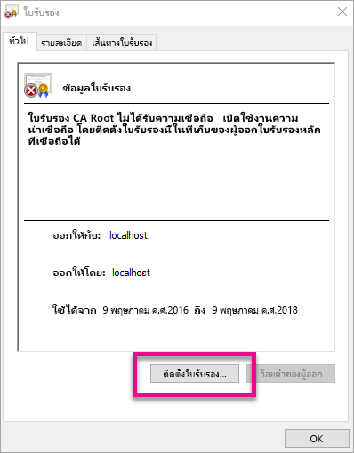
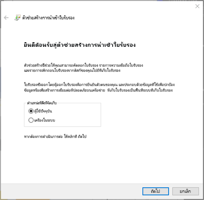
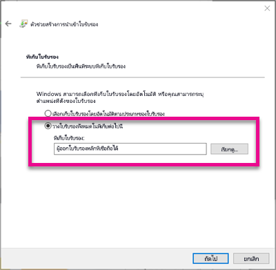
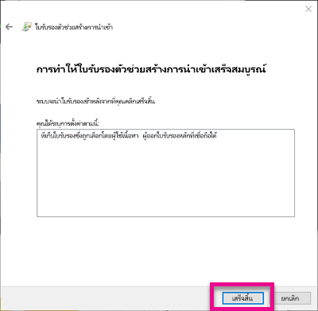
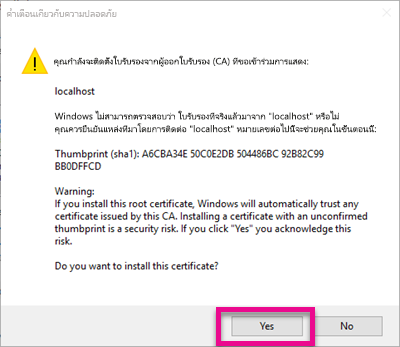
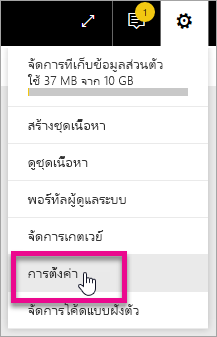
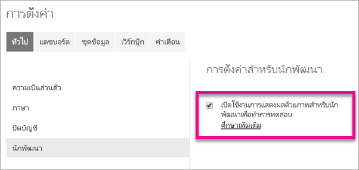
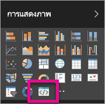

# <a name="use-developer-tools-to-create-custom-visuals"></a>ใช้เครื่องมือสำหรับนักพัฒนาเพื่อสร้างวิชวลแบบกำหนดเอง
วิชวลแบบกำหนดเองช่วยให้คุณตอบสนองความต้องการของผู้ใช้ และสอดคล้องกับการออกแบบของแอปคุณ เรียนรู้วิธีสร้างวิชวลแบบกำหนดเองสำหรับ Power BI โดยใช้เครื่องมือนักพัฒนา

> [!NOTE]
> คุณสามารถใช้เอกสารนี้เพื่อเริ่มต้นพัฒนา สำหรับข้อมูลที่ลึกขึ้น ดูข้อมูลอ้างอิงภายใน [ที่เก็บ git สำหรับวิชวล Power BI](https://github.com/Microsoft/PowerBI-visuals)
> 
> 

## <a name="requirements"></a>ข้อกำหนด
* ต้องการ NodeJS 4.0+ (แนะนำ 5.0 หรือใหม่กว่า) [ดาวน์โหลด NodeJS](https://nodejs.org)

## <a name="install-nodejs-and-the-power-bi-tools"></a>ติดตั้ง NodeJS และเครื่องมือของ Power BI
เพื่อสร้างวิชวลแบบกำหนดเอง คุณจะต้องติดตั้ง NodeJS NodeJS จำเป็นสำหรับการเรียกใช้เครื่องมือทางบรรทัดคำสั่ง

1. ดาวน์โหลด และติดตั้ง [NodeJS](https://nodejs.org) จำเป็นต้องใช้เวอร์ชัน 4.0 หรือใหม่กว่า แต่แนะนำให้ใช้เวอร์ชัน 5.0 ขึ้นไป
2. ติดตั้งเครื่องมือบรรทัดคำสั่ง เรียกใช้คำสั่งต่อไปนี้จากพร้อมท์คำสั่ง

        npm install -g powerbi-visuals-tools
3. คุณสามารถยืนยันว่า เครื่องมือได้ติดตั้งเรียบร้อยแล้ว ด้วยคำสั่งต่อไปนี้ โดยไม่ใส่พารามิเตอร์ใด ๆ

        pbiviz

    คุณควรเห็นการแสดงผลความช่วยเหลือ

    <pre><code>
         +syyso+/
    oms/+osyhdhyso/
    ym/       /+oshddhys+/
    ym/              /+oyhddhyo+/
    ym/                     /osyhdho
    ym/                           sm+
    ym/               yddy        om+
    ym/         shho /mmmm/       om+
     /    oys/ +mmmm /mmmm/       om+
    oso  ommmh +mmmm /mmmm/       om+
   ymmmy smmmh +mmmm /mmmm/       om+
   ymmmy smmmh +mmmm /mmmm/       om+
   ymmmy smmmh +mmmm /mmmm/       om+
   +dmd+ smmmh +mmmm /mmmm/       om+
         /hmdo +mmmm /mmmm/ /so+//ym/
               /dmmh /mmmm/ /osyhhy/
                 //   dmmd
                       ++

       PowerBI Custom Visual Tool

    Usage: pbiviz [options] [command]

    Commands:

    new [name]        Create a new visual
    info              Display info about the current visual
    start             Start the current visual
    package           Package the current visual into a pbiviz file
    update [version]  Updates the api definitions and schemas in the current visual. Changes the version if specified
    help [cmd]        display help for [cmd]

    Options:

    -h, --help      output usage information
    -V, --version   output the version number
    --install-cert  Install localhost certificate
    </code></pre>

<a name="ssl-setup"></a>

### <a name="server-certificate-setup"></a>การตั้งค่าใบรับรองของเซิร์ฟเวอร์
เพื่อเปิดใช้งานแสดงตัวอย่างแบบสดของวิชวลคุณ จำเป็นต้องใช้เซิร์ฟเวอร์ https ที่เชื่อถือได้ ก่อนที่คุณจะเริ่มต้น คุณต้องติดตั้งใบรับรอง SSL ซึ่งจะอนุญาตให้แอสเซทของวิชวลโหลดลงในเว็บเบราว์เซอร์ของคุณ 

> [!NOTE]
> นี่คือการตั้งค่าแบบครั้งเดียวสำหรับเวิร์กสเตชันสำหรับการพัฒนาของคุณ
> 
> 

เพื่อ*สร้าง*ใบรับรอง เรียกใช้คำสั่งต่อไปนี้

    pbiviz --create-cert

> [!NOTE]
> คุณควรเห็นข้อความ ที่บอกให้คุณทราบตำแหน่งที่ตั้งของใบรับรอง และวลีรหัสผ่านที่สร้างขึ้นใหม่
> 
> 


เพื่อ*ติดตั้ง*ใบรับรอง เรียกใช้คำสั่งต่อไปนี้

    pbiviz --install-cert

> [!NOTE]
> คุณควรเห็นข้อความ ที่บอกให้คุณใช้วลีรหัสผ่านของคุณที่เพิ่งสร้างขึ้นใหม่ เพื่อติดตั้งใบรับรอง PFX
> 
> 

**ระบบปฏิบัติการ Windows**

1. เลือก**ติดตั้งใบรับรอง...** .

    
2. เลือก**ผู้ใช้ปัจจุบัน** แล้วเลือก**ถัดไป**

    
3. เลือก**วางใบรับรองทั้งหมดในที่เก็บต่อไปนี้** และเลือก**เรียกดู...**
4. เลือก**ผู้ออกใบรับรองหลักที่น่าเชื่อถือ** แล้วเลือก**ตกลง** เลือก**ถัดไป**

    
5. เลือก**เสร็จสิ้น**

    
6. เลือก**ใช่**บนกล่องโต้ตอบคำเตือนด้านความปลอดภัย

    
7. ปิดทุกเบราว์เซอร์ที่คุณเปิดอยู่

> [!NOTE]
> ถ้าเบราว์เซอร์ยังไม่รู้จักใบรับรอง คุณอาจจำเป็นต้องรีสตาร์ตคอมพิวเตอร์ของคุณ
> 
> 

**OSX**

1. ถ้าล็อกมุมบนซ้ายถูกล็อค เลือกเพื่อปลดล็อก ค้นหา *localhost* และดับเบิลคลิกที่ใบรับรอง

    
2. เลือก**เชื่อถือเสมอ**และปิดหน้าต่าง

    
3. ใส่ชื่อผู้ใช้และรหัสผ่านของคุณ เลือก**อัพเดทการตั้งค่า**

    
4. ปิดทุกเบราว์เซอร์ที่คุณเปิดอยู่

> [!NOTE]
> ถ้าเบราว์เซอร์ยังไม่รู้จักใบรับรอง คุณอาจจำเป็นต้องรีสตาร์ตคอมพิวเตอร์ของคุณ
> 
> 

## <a name="enable-live-preview-of-developer-visual"></a>เปิดใช้งานการแสดงตัวอย่างแบบสดของวิชวลผู้พัฒนา
เพื่อเปิดใช้งานการแสดงตัวอย่างแบบสดของวิชวลที่กำหนดเองของคุณ ทำตามขั้นตอนต่อไปนี้ ซึ่งทำให้วิชวลนี้สามารถใช้งานได้ภายในบริการของ Power BI เมื่อแก้ไขรายงาน

1. เรียกดู และลงชื่อเข้าใช้ [app.powerbi.com](https://app.powerbi.com)
2. เลือก**ไอคอนรูปเฟือง** แล้วเลือก**ตั้งค่า**

    
3. เลือก**นักพัฒนา** แล้วเลือก**เปิดใช้งานวิชวลผู้พัฒนาสำหรับการทดสอบ**

    
4. เลือก**วิชวลผู้พัฒนา**ในบานหน้าต่าง**การแสดงภาพ**

    

   > [!NOTE]
   > คุณจำเป็นต้องเรียกใช้ `pbiviz start` จากโฟลเดอร์วิชวลในเครื่องพัฒนาของคุณ สำหรับข้อมูลเพิ่มเติมเกี่ยวกับการสร้างวิชวลของคุณ ดู[สร้างวิชวลใหม่](#create-a-new-visual)ในบทความนี้
   > 
   > 
5. เลือกวิชวลในพื้นที่รายงาน คุณสามารถผูกข้อมูลในแบบเดียวกันกับที่คุณทำกับวิชวลอื่น ๆ

ในตอนนี้คุณสามารถเริ่มพัฒนาวิชวลของคุณได้แล้ว

## <a name="create-a-new-visual"></a>สร้างวิชวลใหม่
คุณสามารถสร้างโครงการวิชวลใหม่ โดยการเรียกใช้คำสั่งต่อไปนี้

```
pbiviz new MyVisualName
```

คุณสามารถเปลี่ยน *MyVisualName* เป็นชื่อคุณต้องการตั้งให้ภาพ ซึ่งสามารถเปลี่ยนแปลงในภายหลัง โดยการปรับเปลี่ยนเขตข้อมูล `name` และ `displayName` ในไฟล์ `pbiviz.json` ที่สร้างขึ้นได้

คำสั่งนี้จะสร้างโฟลเดอร์ใหม่ในไดเรกทอรีที่เรียกใช้คำสั่ง ซึ่งจะสร้างเทมเพลตพื้นฐานเริ่มต้น สำหรับวิชวลของคุณ เมื่อคำสั่งเสร็จสมบูรณ์ คุณสามารถเปิดไดเรกทอรี และใช้ตัวแก้ไขโปรดของคุณ เพื่อเริ่มการทำงานกับวิชวลใหม่ของคุณ

## <a name="testing-your-visual-in-power-bi"></a>ทดสอบวิชวลของคุณใน Power BI
คุณสามารถทดสอบวิชวลของคุณภายในบริการของ Power BI ในรายงานและแดชบอร์ด

<a name="running-your-visual"></a>

### <a name="running-your-visual"></a>เรียกใช้วิชวลของคุณ
คุณสามารถเรียกใช้วิชวลของคุณ โดยทำดังต่อไปนี้

1. เปิดพร้อมท์คำสั่ง
2. เปลี่ยนไดเรกทอรีไปยังโฟลเดอร์ของวิชวล โฟลเดอร์นี้ประกอบด้วยไฟล์ `pbiviz.json`
3. เรียกใช้คำสั่งต่อไปนี้

    ```
    pbiviz start
    ```

    

ถ้าคุณอยู่ในตำแหน่งที่ไม่ถูกต้อง คุณจะเห็นข้อผิดพลาดที่คล้ายกับต่อไปนี้

```
    error  LOAD ERROR Error: pbiviz.json not found. You must be in the root of a visual project to run this command.
        at e (C:\Users\[user]\AppData\Roaming\npm\node_modules\powerbi-visuals-tools\lib\VisualPackage.js:67:35)
        at Function.loadVisualPackage (C:\Users\[user]\AppData\Roaming\npm\node_modules\powerbi-visuals-tools\lib\VisualPackage.js:62:16)
        at Object.<anonymous> (C:\Users\[user]\AppData\Roaming\npm\node_modules\powerbi-visuals-tools\bin\pbiviz-start.js:43:15)
        at Module._compile (module.js:556:32)
        at Object.Module._extensions..js (module.js:565:10)
        at Module.load (module.js:473:32)
        at tryModuleLoad (module.js:432:12)
        at Function.Module._load (module.js:424:3)
        at Module.runMain (module.js:590:10)
        at run (bootstrap_node.js:394:7)
```

### <a name="viewing-your-visual-in-power-bi"></a>ดูวิชวลของคุณใน Power BI
เพื่อดูวิชวลของคุณในรายงาน ไปที่รายงานนั้น แล้วเลือกวิชวลภายในบานหน้าต่าง**การแสดงภาพ**

> [!NOTE]
> คุณต้องเรียกใช้คำสั่ง `pbiviz start` ตามที่ได้อธิบายไว้ในส่วน[เรียกใช้วิชวลของคุณ](#running-your-visual) ก่อนที่คุณจะทำสิ่งนี้
> 
> 


จากนั้นคุณจะเห็นเทมเพลตเริ่มต้นสำหรับวิชวลนี้


| รายการในแถบเครื่องมือ | คำอธิบาย |
| --- | --- |
| รีเฟรชวิชวล |รีเฟรชวิชวลด้วยตนเอง ถ้าการโหลดโดยอัตโนมัติถูกปิดใช้งาน |
| สลับการโหลดโดยอัตโนมัติ |เมื่อเปิดใช้งาน วิชวลจะอัปเดตโดยอัตโนมัติทุกครั้งที่คุณบันทึกไฟล์วิชวลของคุณ |
| แสดงมุมมองข้อมูล |แสดงมุมมองข้อมูลเบื้องต้นของวิชวลสำหรับการดีบัก |
| รับความช่วยเหลือ |เอกสารประกอบภายใน GitHub |
| ส่งคำติชม |แจ้งให้เราทราบถ้ามีอะไรที่เราสามารถปรับปรุงประสบการณ์การใช้งานให้ดีขึ้นได้ (ต้องมีบัญชีผู้ใช้ GitHub) |

## <a name="package-your-visual-for-use-in-power-bi-desktop-and-distribution"></a>แพคเกจวิชวลของคุณสำหรับใช้งานใน Power BI Desktop และการแจกจ่าย
ก่อนที่คุณสามารถโหลดวิชวลของคุณลงใน [Power BI Desktop](https://powerbi.microsoft.com/desktop/) หรือแชร์กับชุมชนใน [แกลเลอรีวิชวลของ Power BI](https://visuals.powerbi.com) คุณจะต้องสร้างไฟล์ `pbiviz`

คุณสามารถแพคเกจวิชวลของคุณ โดยทำดังนี้

1. เปิดพร้อมท์คำสั่ง
2. เปลี่ยนไดเรกทอรีไปยังโฟลเดอร์ของวิชวล โฟลเดอร์นี้ประกอบด้วยไฟล์ `pbiviz.json`
3. เรียกใช้คำสั่งต่อไปนี้

    ```
    pbiviz package
    ```

คำสั่งนี้จะสร้าง `pbiviz` ในไดเรกทอรี `dist/` ของโครงการวิชวลของคุณ ถ้ามีแฟ้ม `pbiviz` อยู่แล้ว แฟ้มนั้นจะถูกเขียนทับ

## <a name="updating-the-visuals-api-version"></a>ปรับปรุงเวอร์ชัน API ของวิชวล
เมื่อคุณสร้างวิชวลโดยใช้ `pbiviz new` สำเนาของ ข้อกำหนดชนิด API และ json schema จะถูกคัดลอกลงในไดเรกทอรีของวิชวลคุณ คุณสามารถใช้คำสั่ง `pbiviz update` เพื่ออัปเดตแฟ้มเหล่านี้ได้ถ้าจำเป็น ซึ่งจะมีประโยชน์ ถ้าเราเผยแพร่การแก้ไขสำหรับ API เวอร์ชันก่อนหน้า หรือ ถ้าคุณต้องการปรับปรุงเป็น API เวอร์ชันล่าสุด

### <a name="updating-your-existing-api-version"></a>ปรับปรุง API เวอร์ชันที่คุณที่มีอยู่
ถ้าเราเผยแพร่การอัปเดต API ที่มีอยู่ คุณสามารถรับเวอร์ชันล่าสุด โดยทำดังต่อไปนี้

```
#Update your version of pbiviz
npm install -g powerbi-visuals-tools

#Run update from the root of your visual project, where pbiviz.json is located
pbiviz update
```

ซึ่งจะดาวน์โหลดเครื่องมือล่าสุดจาก npm ซึ่งรวมถึง ข้อกำหนดชนิด และ schema ที่อัปเดตแล้ว การใช้ `pbiviz update` จะเขียนทับคุณสมบัติ `apiVersion` ในแฟ้ม *pbiviz.json* ของคุณด้วยเวอร์ชันล่าสุด

### <a name="upgrading-to-a-different-api-version"></a>อัปเกรด API เป็นเวอร์ชันอื่น
คุณสามารถอัปเดต API เป็นเวอร์ชันอื่น โดยใช้ขั้นตอนเดียวกับด้านบน คุณสามารถระบุเวอร์ชันของ API ที่คุณต้องการใช้ให้ชัดเจน

```
#Update your version of pbiviz
npm install -g powerbi-visuals-tools

#Run update from the root of your visual project, where pbiviz.json is located
pbiviz update 1.2.0
```

ตัวอย่างนี้จะปรับปรุงวิชวลของไปใช้ API เวอร์ชัน 1.2.0 คุณสามารถแทน `1.2.0` ด้วยเวอร์ชันใด ๆ ที่คุณต้องการได้

> [!WARNING]
> เวอร์ชัน API เริ่มต้นที่ใช้โดยเครื่องมือจะเป็น API รุ่นเสถียรเสมอ เวอร์ชันใด ๆ ที่มาหลังเวอร์ชัน API เริ่มต้นจะไม่เสถียร และสามารถเปลี่ยนแปลงได้ ซึ่งอาจทำงานที่ไม่คาดคิด และทำงานแตกต่างกันระหว่างบริการของ Power BI กับ Power BI Desktop สำหรับเวอร์ชัน API เสถียรรุ่นปัจจุบัน ดู[บันทึกการเปลี่ยนแปลง](https://github.com/Microsoft/PowerBI-visuals/blob/master/ChangeLog.md) สำหรับข้อมูลเพิ่มเติมเกี่ยวกับรุ่นก่อนวางจำหน่าย ดู[แผนการทำงาน](https://github.com/Microsoft/PowerBI-visuals/blob/master/Roadmap/README.md)
> 
> 

## <a name="inside-the-visual-project"></a>ภายในโครงการวิชวล
โครงการวิชวลของคุณ คือโฟลเดอร์ที่สร้างขึ้นเมื่อคุณเรียกใช้คำสั่ง `pbiviz new` 

### <a name="file-structure"></a>โครงสร้างไฟล์

| รายการ | คำอธิบาย |
| --- | --- |
| assets/ |ใช้เพื่อจัดเก็บแอสเซทของวิชวล (ไอคอน, ภาพหน้าจอ เป็นต้น) |
| dist/ |เมื่อคุณเรียกใช้ `pbiviz package` ไฟล์ pbiviz จะถูกสร้างขึ้นที่นี่ |
| src/ |รหัส Typescript สำหรับวิชวลของคุณ |
| style/ |สไตล์ Less สำหรับวิชวลของคุณ |
| .gitignore |บอก git ให้ละเว้นไฟล์ที่ไม่ควรติดตามในที่เก็บ |
| capabilities.json |ใช้เพื่อกำหนด[ความสามารถ](https://github.com/Microsoft/PowerBI-visuals/blob/master/Capabilities/Capabilities.md)ของวิชวลของคุณ |
| package.json |ใช้โดย [npm](https://www.npmjs.com/) เพื่อจัดการโมดูล |
| pbiviz.json |แฟ้มการกำหนดค่าหลัก |
| tsconfig.json |การตั้งค่าคอมไพเลอร์ Typescript เรียนรู้เพิ่มเติมเกี่ยวกับ [tsconfig.json](https://www.typescriptlang.org/docs/handbook/tsconfig-json.html) |

### <a name="pbivizjson"></a>pbiviz.json
แฟ้มนี้เป็นแฟ้มกำหนดค่าหลักสำหรับวิชวลของคุณ ประกอบด้วยเมตาดาต้า ตลอดจนข้อมูลเกี่ยวกับไฟล์ของคุณ ที่จำเป็นต้องใช้เพื่อสร้างวิชวลของคุณ

```
{
    "visual": {
        "name": "myVisual", // internal visual name (should not contain spaces)
        "displayName": "My Visual!", // visual name displayed to user (used in gallery)
        "guid": "PBI_CV_xxxxxxx", // a unique id for this visual MUST BE UNIQUE
        "visualClassName": "Visual" // the entry class for your visual
        "version": "1.0.0", // visual version. Should be semantic version (increment if you update the visual)
        "description": "", // description used in gallery
        "supportUrl": "", // url to where users can get support for this visual
        "gitHubUrl": "" // url to the source in github (if applicable)
    },
    "apiVersion": "1.0.0", //API version this visual was created with
    "author": {
        "name": "", // your name
        "email": "" // your e-mail
    },
    "assets": {
        "icon": "assets/icon.png" // relative path to your icon file (20x20 png)
    },
    "style": "style/visual.less", // relative path to your less file
    "capabilities": "capabilities.json" // relative path to your capabilities definition 
}
```

### <a name="visual-source-typescript"></a>รหัสของวิชวล (TypeScript)
รหัสของวิชวลควรเขียนในภาษา TypeScript ซึ่งเป็นเซตใหญ่ของ JavaScript ที่สนับสนุนลักษณะการทำงานขั้นสูงขึ้น และการเข้าถึงฟังก์ชันการทำงานใน ES6/ES7 ได้ก่อน

ไฟล์ TypeScript ทั้งหมดควรถูกเก็บไว้ในไดเรกทอรี `src/` และเพิ่มลงในอาร์เรย์ `files` ใน `tsconfig.json` ซึ่งทำให้คอมไพเลอร์ TypeScript สามารถโหลดไฟล์เหล่านี้ ได้ถูกต้องตามลำดับการโหลด

เมื่อวิชวลของคุณถูกสร้างขึ้น ไฟล์ TypeScript ทั้งหมดจะถูกคอมไพล์ลงในไฟล์ JavaScript เดียว ซึ่งช่วยให้คุณสามารถอ้างอิงองค์ประกอบที่ส่งออกจากไฟล์อื่น ๆ โดยไม่จำเป็นต้อง `require` ด้วยตัวเอง ตราบใดที่ไฟล์ทั้งสองอยู่ในรายการใน tsconfig

คุณสามารถสร้างแฟ้มหลายแฟ้ม และคลาสหลายคลาส เท่าที่คุณจำเป็นสำหรับการสร้างวิชวลของคุณ

เรียนรู้เพิ่มเติมเกี่ยวกับ [TypeScript](http://www.typescriptlang.org/)

### <a name="visual-style-less"></a>สไตล์ของวิชวล (Less)
การกำหนดสไตล์ของวิชวลจัดการด้วย cascading style sheet (CSS) เพื่อความสะดวกของคุณ เราใช้ Less เป็นพรีคอมไพเลอร์ซึ่งสนับสนุนคุณลักษณะขั้นสูงบางอย่าง เช่น การซ้อน ตัวแปร การผสม เงื่อนไข ลูป ฯลฯ ถ้าคุณไม่ต้องการใช้คุณลักษณะเหล่านี้ คุณสามารถเพียงแค่เขียน CSS แบบธรรมดาในไฟล์ Less ก็ได้

ไฟล์ Less ทั้งหมดควรเก็บไว้ในไดเรกทอรี `style/` ไฟล์ที่ระบุภายใต้เขตข้อมูล `style` ภายในแฟ้ม `pbiviz.json` ของคุณจะถูกโหลด ไฟล์เพิ่มเติมอื่น ๆ ควรโหลดโดยใช้ `@import`

เรียนรู้เพิ่มเติมเกี่ยวกับ [Less](http://lesscss.org/)

## <a name="debugging"></a>การดีบัก
สำหรับเคล็ดลับเกี่ยวกับการดีบักวิชวลแบบกำหนดเองของคุณ ดู[คู่มือการแก้จุดบกพร่อง](https://github.com/Microsoft/PowerBI-visuals/blob/master/tools/debugging.md)

## <a name="submit-your-visual-to-appsource"></a>ส่งวิชวลของคุณไป AppSource
คุณสามารถแสดงวิชวลของคุณเพื่อให้บุคคลอื่นได้ใช้งาน โดยการส่งไป AppSource สำหรับข้อมูลเพิ่มเติมเกี่ยวกับกระบวนการนี้ ดู[เผยแพร่วิชวลแบบกำหนดเองลงใน AppSource](developer/office-store.md)

## <a name="troubleshooting"></a>การแก้ไขปัญหา
**ไม่พบคำสั่ง Pbiviz (หรือข้อผิดพลาดที่คล้ายกัน)**

ถ้าคุณเรียกใช้ `pbiviz` ในบรรทัดคำสั่ง / เทอร์มินัล คุณควรเห็นหน้าจอความช่วยเหลือ ถ้าไม่มี แสดงว่าคำสั่งนั้นไม่ได้ถูกติดตั้งอย่างถูกต้อง ตรวจสอบให้แน่ใจว่า คุณติดตั้ง NodeJS เวอร์ชันขั้นต่ำ 4.0

สำหรับข้อมูลเพิ่มเติม ดู[ติดตั้ง NodeJS และเครื่องมือ Power BI](#install-nodejs-and-the-power-bi-tools)

**ไม่พบดีบักวิชวลในแท็บการแสดงภาพ**

ดีบักวิชวล มีลักษณะเหมือนไอคอนรูปพร้อมท์ภายในแท็บ**แสดงภาพ**


ถ้าคุณไม่เห็นไอคอนนั้น ตรวจสอบให้แน่ใจว่าคุณได้เปิดใช้งานภายในการตั้งค่า Power BI 

> [!NOTE]
> ดีบักวิชวล ในขณะใช้งานได้เฉพาะ ในบริการของ Power BI และยังไม่รองรับโดย Power BI Desktop หรือแอปสำหรับอุปกรณ์เคลื่อนที่ วิชวลที่แพคเกจแล้วจะยังคงทำงานได้ทุก ๆ ที่
> 
> 

สำหรับข้อมูลเพิ่มเติม ดู[เปิดใช้งานการแสดงตัวอย่างแบบสดของวิชวลผู้พัฒนา](#enable-live-preview-of-developer-visual)

**ไม่สามารถติดต่อเซิร์ฟเวอร์วิชวล**

เรียกใช้เซิร์ฟเวอร์วิชวล ด้วยคำสั่ง `pbiviz start` ในบรรทัดคำสั่ง / เทอร์มินัล จากรากของโครงการของวิชวลคุณ ถ้าเซิร์ฟเวอร์กำลังทำงาน เป็นไปได้ว่าใบรับรอง SSL ของคุณไม่ได้ติดตั้งอย่างถูกต้อง

สำหรับข้อมูลเพิ่มเติม ดู[เรียกใช้วิชวลของคุณ](#running-your-visual)หรือ[การตั้งค่าใบรับรองเซิร์ฟเวอร์](#ssl-setup)

## <a name="next-steps"></a>ขั้นตอนถัดไป
[จัดรูปแบบข้อมูลใน Power BI](power-bi-report-visualizations.md)  
[แสดงภาพแบบกำหนดเองใน Power BI](power-bi-custom-visuals.md)  
[เผยแพร่วิชวลแบบกำหนดเองไปยัง Office store](developer/office-store.md)  
[TypeScript](http://www.typescriptlang.org/)  
[Less CSS](http://lesscss.org/)  

คำถามเพิ่มเติมหรือไม่ [ลองถามชุมชน Power BI](http://community.powerbi.com/)

