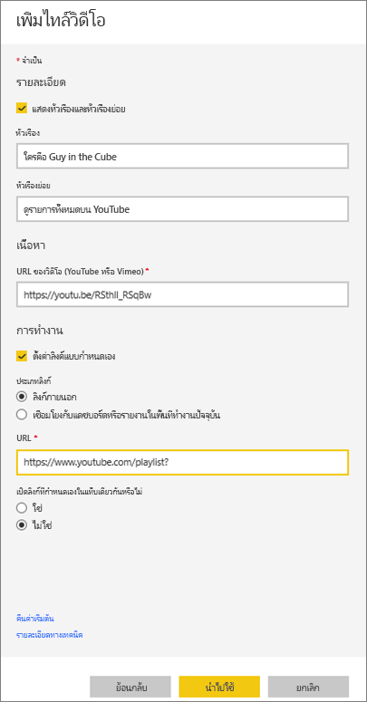
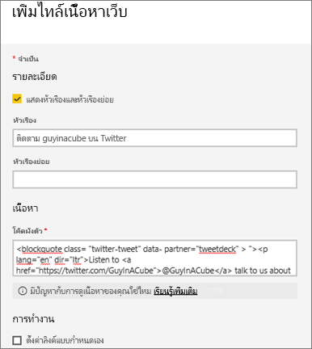
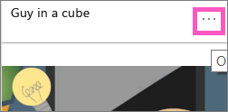
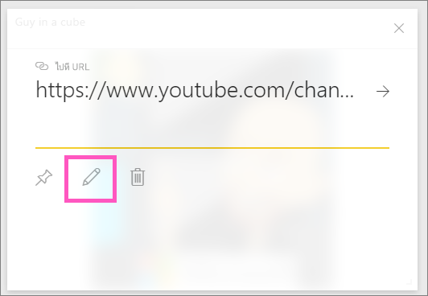

# <a name="add-images-videos-and-more-to-your-dashboard"></a>เพิ่มรูปภาพ วิดีโอ การสตรีมข้อมูลไปยังแดชบอร์ดของคุณ

ด้วยการเพิ่มไทล์ลงในแดชบอร์ดของคุณ คุณสามารถวางรูปภาพ กล่องข้อความ วิดีโอ ข้อมูลการสตรีม หรือโค้ดของเว็บลงบนแดชบอร์ดของคุณได้ 

ดู อแมนดา เพิ่มไทล์ลงในแดชบอร์ด

   
<iframe width="560" height="315" src="https://www.youtube.com/embed/e2PD8m1Q0vU" frameborder="0" allowfullscreen></iframe>


## <a name="add-an-image-video-or-other-tile"></a>เพิ่มรูปภาพ วิดีโอ หรือไทล์อื่นๆ
คุณสามารถเพิ่มรูปภาพ กล่องข้อความ วิดีโอ ข้อมูล การสตรีม หรือโค้ดของเว็บลงบนแดชบอร์ดได้โดยตรง

1. เลือก **เพิ่มไทล์** จากแถบเมนูด้านบนของแดชบอร์ดของคุณ ขึ้นอยู่กับข้อจำกัดด้านพื้นที่ คุณอาจเห็นเฉพาะเครื่องหมายบวก  เท่านั้น
   
    
2. เลือกชนิดของไทล์ที่ต้องเพิ่ม: 

    **[เนื้อหาเว็บ](#add-web-content)**

    **[รูปภาพ](#add-an-image)**

    **[กล่องข้อความ](#add-a-text-box-or-dashboard-heading)**

    **[วิดีโอ](#add-a-video)**

    **[ข้อมูลการสตรีมแบบกำหนดเอง](#add-streaming-data)**
   
    

## <a name="add-an-image"></a>เพิ่มไฟล์รูปภาพ
หากคุณต้องการเพิ่มโลโก้บริษัทหรือภาพอื่น ๆ ลงในแดชบอร์ดของคุณ คุณสามารถบันทึกไฟล์ภาพออนไลน์และเชื่อมโยงไปยังแดชบอร์ดได้ ตรวจสอบให้แน่ใจว่าไม่จำเป็นต้องใช้ข้อมูลรับรองความปลอดภัยเพื่อเข้าถึงไฟล์ภาพ ตัวอย่างเช่นเนื่องจาก OneDrive และ SharePoint จำเป็นต้องรับรองความถูกต้อง ดังนั้นรูปภาพที่เก็บไว้จะไม่สามารถเพิ่มลงในแดชบอร์ดด้วยแนวทางนี้ได้  

1. จากหน้าต่าง **เพิ่มไทล์** เลือก **รูปภาพ** > **ถัดไป**

2. จากหน้าต่าง **เพิ่มไทล์รูปภาพ** เพิ่มข้อมูลรูปภาพ:   
   
   a. เมื่อต้องการแสดงชื่อเรื่องเหนือรูปภาพ ให้เลือก**แสดงชื่อเรื่องและคำบรรยาย** แล้วป้อน **ชื่อเรื่อง** และ **คำบรรยาย** ทางเลือก

   b. ป้อน **URL** ของรูปภาพ

   c. เมื่อต้องการทำไทล์การเชื่อมโยงหลายมิติ ให้เลือก **กำหนดค่าการเชื่อมโยงหลายมิติแบบกำหนดเอง** และป้อน **URL** 

      เมื่อเพื่อนร่วมงานคลิกที่รูปภาพหรือชื่อเรื่องนี้ พวกเขาจะถูกนำไปยัง URL นี้

   d. เลือก**นำไปใช้** 

      

3. บนแดชบอร์ด ปรับขนาด และย้ายรูปภาพตามความจำเป็น
     
     

## <a name="add-a-text-box-or-dashboard-heading"></a>เพิ่มข้อความกล่องหรือแดชบอร์ดหัวเรื่อง

เมื่อต้องเพิ่มหัวเรื่องแดชบอร์ด พิมพ์หัวเรื่องของคุณในกล่องข้อความ และเพิ่มฟอนต์

1. จากหน้าต่าง **เพิ่มไทล์** เลือก **กล่องข้อความ** > **ถัดไป**

2. จัดรูปแบบข้อความ:
   
   a. เมื่อต้องการแสดงชื่อเรื่องเหนือกล่องข้อความ ให้เลือก**แสดงชื่อเรื่องและคำบรรยาย** แล้วป้อน **ชื่อเรื่อง** และ **คำบรรยาย** ทางเลือก

   b. ป้อนและจัดรูปแบบ**เนื้อหา**สำหรับกล่องข้อความ  

   c. อีกทางหนึ่งคือ ตั้งค่าการเชื่อมโยงแบบกำหนดเองสำหรับชื่อเรื่อง ลิงก์แบบกำหนดเองสามารถไซต์ภายนอก หรือในแดชบอร์ด หรือรายงานในพื้นที่ทำงานของคุณ อย่างไรก็ตาม ในตัวอย่างนี้ เราได้เพิ่มการเชื่อมโยงหลายมิติภายในกล่องข้อความโดยตรง ดังนั้นจึงไม่ต้องเลือก **กำหนดค่าการเชื่อมโยงหลายมิติแบบกำหนดเอง**

   d. เลือก**นำไปใช้** 

     
   
3. บนแดชบอร์ด ปรับขนาด และย้ายรูปภาพตามความจำเป็น
   
   

## <a name="add-a-video"></a>เพิ่มไฟล์วิดีโอ
เมื่อคุณเพิ่มไทล์วิดีโอ YouTube หรือ Vimeo ไปยังแดชบอร์ด วิดีโอเล่นบนแดชบอร์ดของคุณ

1. จากหน้าต่าง **เพิ่มไทล์** เลือก **วิดีโอ** > **ถัดไป**
2. เพิ่มข้อมูลวิดีโอไปยังบานหน้าต่าง **เพิ่มไทล์วิดีโอ**:   
   
   a. เมื่อต้องการแสดงชื่อเรื่องและคำบรรยายที่ด้านบนสุดของไทล์ วิดีโอ ให้เลือก**แสดงชื่อเรื่องและคำบรรยาย** แล้วป้อน **ชื่อเรื่อง** และ **คำบรรยาย** ทางเลือก ในตัวอย่างนี้ เราจะเพิ่ม**คำบรรยาย** แล้ว เปลี่ยนเป็นการเชื่อมโยงหลายมิติกลับไปยังรายการที่เล่นทั้งหมดบน YouTube

   b. ป้อน **URL ของวิดีโอ** สำหรับวิดีโอดังกล่าว

   c. เพิ่มการเชื่อมโยงหลายมิติสำหรับ **ชื่อเรื่อง** และ **คำบรรยาย** เพื่อให้เพื่อนร่วมงานของคุณสามารถดูรายการที่เล่นทั้งหมดบน YouTube ได้หลังจากที่พวกเขารับชมวิดีโอแบบฝัง เมื่อต้องการทำเช่นนั้น ภายใต้ **ฟังก์ชันการทำงาน** ให้เลือก **ตั้งค่าลิงก์แบบกำหนดเอง** จากนั้นป้อน **URL** สำหรับรายการที่จะเล่น

   d. เลือก**นำไปใช้**  

   

3. บนแดชบอร์ด ปรับขนาด และย้ายรูปภาพตามความจำเป็น
     
   
4. เลือกไทล์วิดีโอเล่นวิดีโอ
5. เลือกชื่อเรื่องรองการเยี่ยมชมเล่นบน YouTube

## <a name="add-streaming-data"></a>เพิ่มชุดข้อมูลการสตรีม
คุณสามารถใช้ PubNub เพื่อเพิ่มข้อมูลการสตรีม เช่น ฟีด Twitter หรือข้อมูลเซนเซอร์ไปยังไทล์ในแดชบอร์ดของคุณ Power BI ได้สร้างการบูรณาการเพื่อรับข้อมูลจาก PubNub ต่อไปนี้ เราจะอธิบายวิธีการทำงาน
   

คุณสามารถใช้ PubNub เพื่อเพิ่มข้อมูลการสตรีม เช่น ฟีด Twitter หรือข้อมูลเซนเซอร์ไปยังไทล์ในแดชบอร์ดของคุณ Power BI ได้สร้างการบูรณาการเพื่อรับข้อมูลจาก PubNub ต่อไปนี้ เราจะอธิบายวิธีการทำงาน 

<iframe width="560" height="315" src="https://www.youtube.com/embed/kOuINwgkEkQ" frameborder="0" allowfullscreen></iframe>

1. จากหน้าต่าง **เพิ่มไทล์** เลือก **ข้อมูลการสตรีมแบบกำหนดเอง** > **ถัดไป**
2. เลือก **เพิ่มชุดข้อมูลการสตรีม**
3. สร้าง**ชุดข้อมูลการสตรีมใหม่**โดยใช้ API ของ Power BI หรือ PubNub
4. กรอกข้อมูลในเขตข้อมูลสำหรับ **ชื่อชุดข้อมูล**, **รหัสการสมัครใช้งาน** และ **ชื่อช่องทาง** หากเป็นการเชื่อมต่อที่ปลอดภัยก็จะมีรหัสการตรวจสอบความถูกต้อง คุณสามารถใช้ค่าตัวอย่างจาก PubNub เพื่อลองใช้ได้
5. เลือก**ถัดไป**
    คุณเห็นเขตข้อมูลที่มีอยู่ในชุดข้อมูลโดยมีประเภทข้อมูลและรูปแบบ JSON
6. เลือก **เชื่อมต่อ**
    คุณได้สร้างชุดข้อมูลการสตรีมแล้ว
7. กลับไปที่แดชบอร์ดแล้วเลือก **เพิ่มไทล์** > **ข้อมูลการสตรีมแบบกำหนดเอง** > **ถัดไป**
8. เลือกชุดข้อมูลเซนเซอร์ที่คุณสร้าง > **ถัดไป**
9. เลือกชนิดภาพวิชวลที่คุณต้องการ บ่อยครั้งที่แผนภูมิเส้นใช้งานได้ดีสำหรับข้อมูลนี้
10. เลือก **แกน** **คำอธิบายแผนภูมิ** และ **ค่า**
11. ตัดสินใจเลือกระยะเวลาที่คุณต้องการแสดงผลเป็นวินาที นาที หรือ ชั่วโมง
12. เลือก**ถัดไป**
13. ให้ **ชื่อเรื่อง** และ **คำบรรยาย** หากคุณต้องการ
14. ปักหมุดเหล่านั้นไปยังแดชบอร์ดของคุณ


1. จากหน้าต่าง **เพิ่มไทล์** เลือก **ข้อมูลการสตรีมแบบกำหนดเอง** > **ถัดไป**

2. เลือก **เพิ่มชุดข้อมูลการสตรีม**

3. สร้าง**ชุดข้อมูลการสตรีมใหม่**โดยใช้ API ของ Power BI หรือ PubNub

4. กรอกข้อมูลในเขตข้อมูลสำหรับ **ชื่อชุดข้อมูล**, **รหัสการสมัครใช้งาน** และ **ชื่อช่องทาง** หากเป็นการเชื่อมต่อที่ปลอดภัยก็จะมีรหัสการตรวจสอบความถูกต้อง คุณสามารถใช้ค่าตัวอย่างจาก PubNub เพื่อลองใช้ได้

5. เลือก**ถัดไป**

   คุณเห็นเขตข้อมูลที่มีอยู่ในชุดข้อมูลโดยมีประเภทข้อมูลและรูปแบบ JSON

6. เลือก **เชื่อมต่อ**

   คุณได้สร้างชุดข้อมูลการสตรีมแล้ว

7. กลับไปที่แดชบอร์ดแล้วเลือก **เพิ่มไทล์** > **ข้อมูลการสตรีมแบบกำหนดเอง** > **ถัดไป**

8. เลือกชุดข้อมูลเซนเซอร์ที่คุณสร้าง > **ถัดไป**

9. เลือกชนิดภาพวิชวลที่คุณต้องการ บ่อยครั้งที่แผนภูมิเส้นใช้งานได้ดีสำหรับข้อมูลนี้

10. เลือก **แกน** **คำอธิบายแผนภูมิ** และ **ค่า**

11. ตัดสินใจเลือกระยะเวลาที่คุณต้องการแสดงผลเป็นวินาที นาที หรือ ชั่วโมง

12. เลือก**ถัดไป**

13. อีกทางหนึ่งคือให้ **ชื่อเรื่อง** และ **คำบรรยาย**

14. ปักหมุดเหล่านั้นไปยังแดชบอร์ดของคุณ

## <a name="add-web-content"></a>เพิ่มเนื้อหาเว็บ
คุณสามารถวางหรือพิมพ์เนื้อหา HTML ใดก็ตามในฐานะไทล์ไปยังรายงานหรือแดชบอร์ดของคุณ ป้อนโค้ดการฝังด้วยตนเอง หรือคัดลอก/วางจากเว็บไซต์ เช่น Twitter, YouTube, embed.ly และอื่น ๆ

1. จากหน้าต่าง **เพิ่มไทล์** เลือก **เนื้อหาของเว็บ** > **ถัดไป**

2. เพิ่มข้อมูลลงในบานหน้าต่าง **เพิ่มไทล์เนื้อหาของเว็บ**:
   
   a. เมื่อต้องการแสดงชื่อเรื่องเหนือไทล์ ให้เลือก**แสดงชื่อเรื่องและคำบรรยาย** แล้วป้อน **ชื่อเรื่อง** และ **คำบรรยาย** ทางเลือก

   b. ป้อนโค้ดการฝัง ในตัวอย่างนี้ เรากำลังคัดลอกและวางฟีด Twitter

   c. เลือก**นำไปใช้**

   
   

3. บนแดชบอร์ด ปรับขนาด และย้ายรูปภาพตามความจำเป็น
     
   

### <a name="tips-for-embedding-web-content"></a>เคล็ดลับสำหรับการฝังเนื้อหาบนเว็บ
* สำหรับ iframes ใช้แหล่งข้อมูลความปลอดภัย ถ้าคุณใส่โค้ดการฝัง iframe ของคุณ และได้รับไทล์ว่าง ตรวจสอบว่าคุณไม่ได้ใช้ *http* สำหรับแหล่งข้อมูล iframe ถ้าเป็นเช่นนั้น เปลี่ยนให้เป็น *https*
  
  ```html
  <iframe src="https://xyz.com">
  ```
* แก้ไขข้อมูลความกว้างและความสูง โค้ดการฝังนี้ฝังวิดีโอ และตั้งค่าโปรแกรมเล่นวิดีโอให้มีความละเอียดเท่ากับ 560 x 315 พิกเซล ขนาดนี้จะไม่เปลี่ยนแปลงเมื่อคุณปรับขนาดไทล์
  
  ```html
  <iframe width="560" height="315"
  src="https://www.youtube.com/embed/Cle_rKBpZ28" frameborder="0"
   allowfullscreen></iframe>
  ```
  
  หากคุณต้องการให้โปรแกรมเล่นปรับขนาดให้พอดีกับขนาดไทล์ ให้ตั้งค่าความกว้างและความสูงเป็น 100%
  
  ```html
  <iframe width="100%" height="100%"
  src="https://www.youtube.com/embed/Cle_rKBpZ28" frameborder="0"
   allowfullscreen></iframe>
  ```
* โค้ดนี้จะฝังทวีตและเก็บลิงก์แยกต่างหากบนแดชบอร์ด ลิงก์สำหรับพ็อดแคสต์ AFK, หน้า Twitter ของ \@GuyInACube, ติดตาม, #analytics, ตอบกลับ, รีทวีต, และถูกใจ  เลือกไทล์เองนำคุณไปยัง podcast บน Twitter
  
  ```html
  <blockquote class="twitter-tweet" data-partner="tweetdeck">
  <p lang="en" dir="ltr">Listen to
  <a href="https://twitter.com/GuyInACube">@GuyInACube</a> talk to
  us about making videos about Microsoft Business Intelligence
  platform
  <a href="https://t.co/TmRgalz7tv">https://t.co/TmRgalz7tv </a>
  <a href="https://twitter.com/hashtag/analytics?src=hash">
  #analytics</a></p>&mdash; AFTK Podcast (@aftkpodcast) <a
  href="https://twitter.com/aftkpodcast/status/693465456531771392">
  January 30, 2016</a></blockquote> <script async src="//platform.twitter.com/widgets.js" charset="utf-8"></script>
  ```

## <a name="edit-a-tile"></a>แก้ไขไทล์
เมื่อต้องการทำการเปลี่ยนแปลงไปยังไทล์ที่มีอยู่:

1. วางเมาส์เหนือมุมขวาบนของไทล์แล้วเลือก **ตัวเลือกเพิ่มเติม** (...)
   
    
2. เลือก **แก้ไขรายละเอียด** เพื่อแสดงหน้าต่าง **รายละเอียดไทล์** และทำการเปลี่ยนแปลง
   
    

## <a name="considerations-and-troubleshooting"></a>ข้อควรพิจารณาและการแก้ไขปัญหา
* เมื่อต้องการทำให้ง่ายต่อการย้ายไทล์บนแดชบอร์ดของคุณ ให้เพิ่มชื่อเรื่องและ/หรือคำบรรยาย
* ถ้าคุณต้องการฝังเนื้อหาจากเว็บไซต์ แต่ไม่ให้เว็บไซต์คุณฝังโค้ดเพื่อคัดลอก และวาง โปรดดู embed.ly สำหรับความช่วยเหลือในการสร้างโค้ดแบบฝัง

## <a name="next-steps"></a>ขั้นตอนถัดไป
[แนะนำไทล์แดชบอร์ดสำหรับนักออกแบบ Power BI](service-dashboard-tiles.md)

มีคำถามเพิ่มเติมหรือไม่? [ลองไปที่ชุมชน Power BI](https://community.powerbi.com/)

