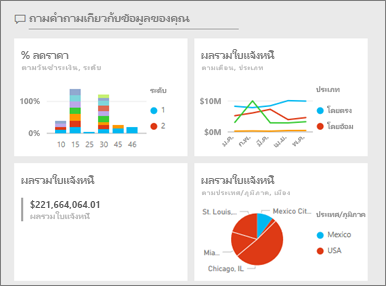
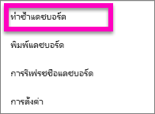
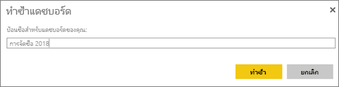
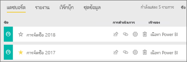

# สร้างมุมมองโทรศัพท์สำหรับแดชบอร์ดใน Power BI

 มีเหตุผลมากมายว่าทำไมต้องคำสำเนาแดชบอร์ด คุณอาจต้องการทำการเปลี่ยนแปลง และทดสอบของประสิทธิภาพการทำงานกับต้นฉบับ หรือสร้างเวอร์ชันที่ต่างกันเล็กน้อยเพื่อกระจาย ให้ผู้ร่วมงาน ภูมิภาค หรือทีม บางครั้งเพื่อนร่วมงานชื่นชอบการออกแบบแดชบอร์ดของคุณ และต้องการใช้สำหรับรายงานเพื่อเสนอผู้จัดการของตน อาจะมีอีกเหตุผลหนึ่งถ้าคุณมีฐานข้อมูลใหม่ว่ามีโครงสร้างข้อมูลเดียวกันกับชนิดข้อมูลและต้องการใช้แดชบอร์ดที่คุณเคยสร้างอีกครั้ง ซึ่งสามารถทำได้เช่นกัน แต่อาจจำเป็นต้องทำงานบางอย่างใน Power BI Desktop 

แดชบอร์ดที่ถูกสร้าง(และถูกคัดลอก)โดยใช้ Power BI service และสามารถดูได้ในอุปกรณ์เคลื่อนที่ Power BI และ Power BI Embedded  แดชบอร์ดใช้งานใน Power BI Desktop ไม่ได้ 

เพื่อทำสำเนาของแดชบอร์ด คุณต้องเป็น*ผู้สร้าง*แดชบอร์ด แดชบอร์ดที่มีการแชร์กับคุณเป็นแอปไม่สามารถซ้ำกันได้

1. เปิดแดชบอร์ด
2. ที่มุมบนขวา ให้เลือก**ตัวเลือกเพิ่มเติม** (...) แล้วเลือก**ทำสำเนาแดชบอร์ด**
   
   
3. ตั้งชื่อแดชบอร์ดแล้วเลือก**ทำสำเนา** 
   
   
4. แดชบอร์ดใหม่จะถูกบันทึกในพื้นที่ทำงานเดียวกันเป็นต้นฉบับ 
   
   

5.    เปิดแดชบอร์ดใหม่ละแก้ไขตามความจำเป็น นี่คือบางสิ่งที่คุณอาจต้องการทำต่อไป    
    a. [ย้าย เปลี่ยนชื่อ ปรับขนาด หรือแม้กั่งลบไทล์](service-dashboard-edit-tile.md)  
    b. แก้ไขรายละเอียดไทล์และไฮเปอร์ลิงก์ โดยเลือก**ตัวเลือกเพิ่มเติม** (...) ของไทล์ แล้วเลือก**แก้ไขรายละเอียด**  
    c. [เพิ่มไทล์ใหม่จากแถบเมนูแดชบอร์ด](service-dashboard-add-widget.md) (**เพิ่มไทล์**)  
    d. ปักหมุดไทล์ใหม่[จาก Q&A](service-dashboard-pin-tile-from-q-and-a.md)หรือ[จากรายงาน](service-dashboard-pin-tile-from-report.md)  
    e. เปลี่ยนชื่อแดชบอร์ด เปิดหรือปิด Q&A และตั้งค่าไทล์โฟลว์จากบานหน้าต่างการตั้งค่าแดชบอร์ด  (เลือกดรอปดาวน์**ตัวเลือกเพิ่มเติม** (... ) ของแดชบอร์ด และเลือก **การตั้งค่า**)  
    f. แชร์แดชบอร์ดของคุณโดยตรงกับเพื่อนร่วมงาน หรือเป็นส่วนหนึ่งของแอป Power BI 

## ขั้นตอนถัดไป
* [เคล็ดลับสำหรับการออกแบบแดชบอร์ด ที่ยอดเยี่ยม](service-dashboards-design-tips.md) 

มีคำถามเพิ่มเติมหรือไม่ [ลองไปที่ชุมชน Power BI](http://community.powerbi.com/)

