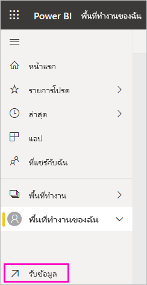

# สร้างแดชบอร์ด Power BI จากรายงาน
คุณได้อ่าน[บทนำเกี่ยวกับแดชบอร์ดใน Power BI](service-dashboards.md) แล้วและตอนนี้ คุณต้องการสร้างของคุณเอง มีหลายวิธีในการสร้างแดชบอร์ด ตัวอย่างเช่น คุณสามารถสร้างจากรายงาน จาก scratch จากชุดข้อมูล หรือโดยการทำซ้ำแดชบอร์ดที่มีอยู่แล้ว  

เราจะเริ่มต้นโดยการสร้างแดชบอร์ดที่ง่ายและรวดเร็วซึ่งปักหมุดการจัดรูปแบบการแสดงข้อมูลจากรายงานที่มีการทำขึ้นแล้ว 

หลังจากเสร็จสิ้นบทความนี้ คุณจะเข้าใจเรื่องต่อไปนี้เป็นอย่างดี:
- ความสัมพันธ์ระหว่างแดชบอร์ดและรายงาน
- วิธีการเปิดมุมมองการแก้ไขในตัวแก้ไขรายงาน
- วิธีการปักหมุดไทล์ 
- วิธีการนำทางระหว่างแดชบอร์ดและรายงาน 
 

> [!NOTE] 
> แดชบอร์ดเป็นคุณลักษณะของบริการ Power BI ไม่ใช่ Power BI Desktop ถึงแม้ว่าคุณไม่สร้างแดชบอร์ดในแอปสำหรับอุปกรณ์เคลื่อนที่ Power BI แต่คุณสามารถ[ดูและแชร์](consumer/mobile/mobile-apps-view-dashboard.md)ได้
>
> 

## วิดีโอ: สร้างแดชบอร์ดโดยการปักหมุดภาพและรูปภาพจากรายงานหนึ่ง
ดู Amanda สร้างแดชบอร์ดใหม่โดยการปักหมุดไปที่การแสดงภาพจากรายงาน จากนั้นให้ทำตามขั้นตอนในส่วนถัดไป [นำเข้าชุดข้อมูลพร้อมรายงาน](#import-a-dataset-with-a-report)เพื่อลองด้วยตนเองโดยใช้ตัวอย่างการวิเคราะห์การจัดซื้อ
    

<iframe width="560" height="315" src="https://www.youtube.com/embed/lJKgWnvl6bQ" frameborder="0" allowfullscreen></iframe>

## นำเข้าชุดข้อมูลที่มีรายงาน
ในคำแนะนำทีละขั้นตอนนี้ เราจะนำเข้าหนึ่งในชุดข้อมูลตัวอย่าง Power BI และใช้ในการสร้างแดชบอร์ดใหม่ของเรา ตัวอย่างที่เราใช้คือสมุดงาน Excel ที่มีแผ่นงาน PowerView สองแผ่น เมื่อ Power BI นำเข้าสมุดงาน โปรแกรมจะเพิ่มชุดข้อมูลและรายงานไปยังพื้นที่ทำงานของคุณ จากนั้น รายงานจะถูกสร้างขึ้นจากแผ่นงาน PowerView โดยอัตโนมัติ

1. ดาวน์โหลด[ไฟล์ Excel](http://go.microsoft.com/fwlink/?LinkId=529784) ตัวอย่างการวิเคราะห์การจัดซื้อ เราขอแนะนำให้บันทึกไฟล์ใน OneDrive for Business ของคุณ
2. บริการ Power BI ในเบราว์เซอร์ของคุณ (app.powerbi.com)
3. จากแผงนำทางด้านซ้าย เลือก **พื้นที่ทำงานของฉัน** จากนั้นเลือก **รับข้อมูล**

    
5. ภายใต้**ไฟล์** ให้เลือก**รับ**

   
6. นำทางไปยังตำแหน่งที่คุณบันทึกไฟล์ Excel สำหรับตัวอย่างการวิเคราะห์การจัดซื้อ เลือกไฟล์ดังกล่าว จากนั้นเลือก**เชื่อมต่อ**

   
7. สำหรับการดำเนินการนี้ เลือก**นำเข้า**

    
8. เมื่อข้อความแสดงความสำเร็จปรากฏขึ้น เลือก **x** เพื่อยกเลิก

   

> [!TIP]
> คุณทราบหรือไม่ คุณสามารถจำกัดแถบนำทางด้านซ้ายได้โดยการเลือกไอคอนที่มีสามเส้นที่อยู่ด้านบนของ ซึ่งช่วยให้คุณมีพื้นที่มากขึ้นในการรายงาน

### เปิดรายงานและปักหมุดไทล์ไปยังแดชบอร์ดของคุณ
1. ในพื้นที่ทำงานเดียวกัน เลือกแท็บ **รายงาน** จากนั้นเลือก **ตัวอย่างการวิเคราะห์การจัดซื้อ** เพื่อเปิดรายงาน

     รายงานเปิดขึ้นในมุมมองการอ่าน โปรดสังเกตว่ามีสองแถบที่ด้านซ้าย: **การวิเคราะห์ส่วนลด** และ **ภาพรวมการใช้จ่าย** แต่ละแถบจะแสดงหน้าของรายงานนั้น ๆ

2. เลือก**ตัวเลือกอื่นๆ (...)**  > **แก้ไขรายงาน**เพื่อเปิดรายงานในมุมมองการแก้ไข

    
3. เลื่อนไปเหนือการแสดงภาพเพื่อดูตัวเลือกที่พร้อมใช้งาน เมื่อต้องการเพิ่มการแสดงภาพลงในแดชบอร์ด เลือกไอคอนเข็มหมุด .

    
4. เนื่องจากเรากำลังสร้างแดชบอร์ดใหม่ ให้เลือกตัวเลือกสำหรับ**แดชบอร์ดใหม่**และตั้งชื่อ

    
5. เมื่อคุณเลือก**Pin**, Power BI สร้างแดชบอร์ดใหม่ในพื้นที่ทำงานปัจจุบัน หลังจากข้อความ **ปักหมุดไปยังแดชบอร์ด**ปรากฏขึ้น ให้เลือก**ไปยังแดชบอร์ด** หากมีข้อความปรากฏขึ้นให้บันทึกรายงาน เลือก**บันทึก**

    

    Power BI เปิดแดชบอร์ดใหม่ ซึ่งมีหนึ่งไทล์: การแสดงภาพที่คุณเพิ่งปักหมุด

   
7. เลือกไทล์ดังกล่าวเพื่อต้องกลับไปยังรายงาน ปักหมุดไทล์เพิ่มเติมไปยังแดชบอร์ดใหม่ เมื่อหน้าต่าง**ปักหมุดลงในแดชบอร์ด**แสดงขึ้นมา ให้เลือก**แดชบอร์ดที่มีอยู่**  

   

## ปักหมุดทั้งหน้ารายงานไปยังแดชบอร์ด
แทนที่จะเป็นการปักหมุดไปยังทีละภาพ คุณสามารถ[ปักหมุดทั้งหน้ารายงานเป็น*ไทล์สด*](service-dashboard-pin-live-tile-from-report.md)ได้ ลองทำดูกัน

1. ในตัวแก้ไขรายงาน เลือกแถบ **ภาพรวมการใช้จ่าย** เพื่อเปิดหน้าที่สอง ของรายงานขึ้น

   

2. เราต้องการการแสดงผลด้วยภาพทั้งหมดในรายงานบนแดชบอร์ดของคุณ ที่มุมขวาบนของแถบเมนู เลือก**ปักหมุดหน้ารายงานสด** ที่แดชบอร์ด ระบบจะอัปเดทไทล์หน้ารายงานสดทุกครั้งที่มีการรีเฟรชหน้าดังกล่าว

   

3. เมื่อหน้าต่าง**ปักหมุดลงในแดชบอร์ด**ปรากฎขึ้นมา ให้เลือก**แดชบอร์ดที่มีอยู่**

   

4. หลังจากข้อความแสดงความ สำเร็จ ปรากฏขึ้น เลือก**ไปยังแดชบอร์ด** ตรงจุดนี้คุุณจะเห็นไทล์ที่คุณได้ปักหมุดไทล์จากรายงาน ในตัวอย่างด้านล่าง เราได้ปักหมุดไทล์สองแผ่นจากหน้าหนึ่งของรายงานและหนึ่ง ไทล์รายงานสดที่อยู่บนหน้าสองของรายงาน

   

## ขั้นตอนถัดไป
ยินดีด้วย คุณได้สร้างแดชบอร์ดแรกของคุณแล้ว! ตอนนี้คุณมีแดชบอร์ดหนึ่งอันแล้ว มีสิ่งต่าง ๆ มากมายที่คุณสามารถทำได้บนแดชบอร์ดของคุณ ทำตามหนึ่งในบทความที่แนะนำด้านล่างหรือเริ่มต้นสำรวจด้วยตัวคุณเอง: 

* [ปรับขนาดและย้ายไทล์](service-dashboard-edit-tile.md)
* [ทั้งหมดเกี่ยวกับไทล์แดชบอร์ด](service-dashboard-tiles.md)
* [แชร์แดชบอร์ดของคุณโดยการสร้างแอปฯ](service-create-workspaces.md)
* [Power BI - แนวคิดพื้นฐาน](service-basic-concepts.md)
* [เคล็ดลับสำหรับการออกแบบแดชบอร์ด ที่ยอดเยี่ยม](service-dashboards-design-tips.md)

มีคำถามเพิ่มเติมหรือไม่? [ลองไปที่ชุมชน Power BI](http://community.powerbi.com/)
