# สร้างแดชบอร์ด Power BI จากรายงาน
คุณได้อ่าน[แดชบอร์ดใน Power BI](service-dashboards.md)และตอนนี้ คุณต้องการสร้างของคุณเอง มีหลายวิธีในการสร้างแดชบอร์ด สามารถสร้างจากรายงานโดยสร้างตั้งแต่เริ่มต้น จากชุดข้อมูลโดยการทำซ้ำแดชบอร์ดที่มีอยู่แล้ว และอื่น ๆ อีกมาก  

ในช่วงแรกที่คุณเริ่มอาจดูยุ่งยากมาก ดังนั้นเราจะเริ่มต้นโดยการสร้างแดชบอร์ดง่าย ๆ และรวดเร็วโดยการปักหมุดการแสดงภาพจากรายงานที่มีการทำขึ้นแล้ว เมื่อคุณดำเนินการในขั้น Quickstart นี้เสร็จเรียบร้อยแล้ว คุณจะเข้าใจอย่างดีในความสัมพันธ์ระหว่างแดชบอร์ดและรายงาน การเปิดมุมมองการแก้ไขในตัวแก้ไขแบบรายงาน การปักหมุดไทล์ และการเคลื่อนไปมาระหว่างแดชบอร์ดและรายงาน ใช้ลิงค์ในสารบัญที่อยู่ทางด้านซ้ายหรือ**ขั้นตอนถัดไป**ที่ด้านล่างเพื่อเลื่อนไปยังหัวข้อขั้นสูงกว่า

## ใครบ้างที่สามารถสร้างแดชบอร์ดได้?
การสร้างแดชบอร์ดเป็นคุณลักษณะสำหรับ**ผู้สร้าง** และจำเป็นต้องมีสิทธิ์ในการแก้ไขในรายงาน สิทธิ์ในการแก้ไขจะพร้อมใช้งานสำหรับผู้สร้างรายงานและผู้ร่วมงานที่ผู้สร้างให้สิทธิ์ในการเข้าถึง ตัวอย่างเช่น ถ้าเดวิดต้องสร้างรายงานในพื้นที่งาน ABC จากนั้นเพิ่มคุณเข้าไปเป็นสมาชิกของพื้นที่ทำงานนั้น ทั้งเดวิดและคุณจะมีสิทธิ์ในการแก้ไขรายงานนั้น ในทางกลับกัน ถ้ามีการแชร์รายงานกับคุณโดยตรงหรือเป็นส่วนหนึ่งของ[แอปฯ Power BI](service-create-distribute-apps.md) (คุณกำลัง**ใช้**รายงาน) คุณจะไม่สามารถปักหมุดไทล์ไปยังแดชบอร์ดได้

> **หมายเหตุ**: แดชบอร์ดเป็นคุณลักษณะของบริการ Power BI ไม่ใช่ Power BI Desktop ไม่สามารถสร้างแดชบอร์ดขึ้นใน Power BI สำหรับมือถือได้ แต่สามารถ[ดูและแชร์](consumer/mobile/mobile-apps-view-dashboard.md)บนมือถือได้
>
> 

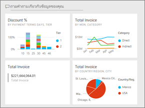

## วิดีโอ: สร้างแดชบอร์ดโดยการปักหมุดภาพและรูปภาพจากรายงานหนึ่ง
ดู Amanda สร้างแดชบอร์ดใหม่โดยการปักหมุดไปที่การแสดงภาพจากรายงาน จากนั้นให้ทำตามขั้นตอนด้านล่างวิดีโอเพื่อลองด้วยตนเองโดยใช้ตัวอย่างการวิเคราะห์การจัดซื้อ

<iframe width="560" height="315" src="https://www.youtube.com/embed/lJKgWnvl6bQ" frameborder="0" allowfullscreen></iframe>

### ข้อกำหนดเบื้องต้น
การทำตามคือ คุณต้องดาวน์โหลดตัวอย่างสมุดงาน Excel "การวิเคราะห์การจัดซื้อ" และเปิดในบริการ Power BI (app.powerbi.com)

## นำเข้าชุดข้อมูลที่มีรายงาน
เราจะนำเข้าหนึ่งชุดข้อมูลตัวอย่าง Power BI และใช้ในการสร้างแดชบอร์ดใหม่ของเรา ตัวอย่างที่เราจะใช้คือสมุดงาน Excel ที่มีแผ่นงาน PowerView สองแผ่น เมื่อ Power BI นำเข้าสมุดงาน โปรแกรมจะเพิ่มชุดข้อมูลและรายงานไปยังพื้นที่ทำงานของคุณ  จากนั้น รายงานจะถูกสร้างขึ้นจากแผ่นงาน PowerView โดยอัตโนมัติ

1. [เลือกลิงค์นี้](http://go.microsoft.com/fwlink/?LinkId=529784)เพื่อดาวน์โหลดและบันทึกไฟล์ Excel ของตัวอย่างการวิเคราะห์การจัดซื้อ เราขอแนะนำให้บันทึกไฟล์ใน OneDrive for Business ของคุณ
2. บริการ Power BI ในเบราว์เซอร์ของคุณ (app.powerbi.com)
3. เลือก**พื้นที่ทำงานของฉัน**
4. จากการนำทางด้านซ้าย เลือก**รับข้อมูล**

    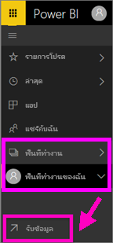
5. เลือก**ไฟล์**

   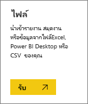
6. นำทางไปยังตำแหน่งที่คุณบันทึกไฟล์ Excel สำหรับตัวอย่างการวิเคราะห์การจัดซื้อ เลือกไฟล์ดังกล่าว จากนั้นเลือก**เชื่อมต่อ**

   
7. สำหรับการดำเนินการนี้ เลือก**นำเข้า**

    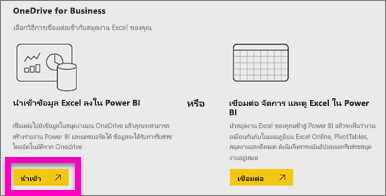
8. เมื่อข้อความแสดงความสำเร็จปรากฏขึ้น เลือก **x** เพื่อปิดลง

   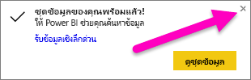

### เปิดรายงานและปักหมุดไทล์ไปยังแดชบอร์ด
1. ในพื้นที่ทำงานของคุณ เลือกแถบ**รายงาน** รายงานที่นำเข้ามาใหม่จะแสดงด้วยเครื่องหมายดอกจันสีเหลือง เลือกชื่อรายงานเพื่อเปิดใช้งาน

    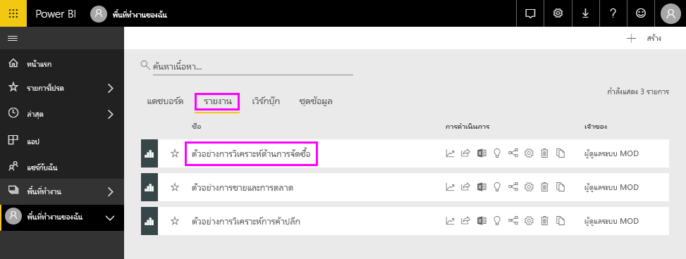
2. รายงานเปิดขึ้นในมุมมองการอ่าน โปรดสังเกตว่ามีสองแถบที่ด้านล่าง: วิเคราะห์การลดราคาและใช้ภาพรวม แต่ละแถบจะแสดงหน้าของรายงานนั้น ๆ
    เลือก**แก้ไขรายงาน**เพื่อเปิดรายงานในมุมมองการแก้ไข

    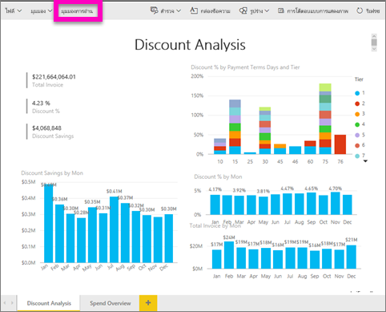
3. เลื่อนไปเหนือการแสดงภาพเพื่อดูตัวเลือกที่พร้อมใช้งาน เมื่อต้องการเพิ่มการแสดงภาพลงในแดชบอร์ด เลือกไอคอนเข็มหมุด

    
4. เนื่องจากเรากำลังสร้างแดชบอร์ดใหม่ ให้เลือกตัวเลือกสำหรับ**แดชบอร์ดใหม่**และตั้งชื่อ

   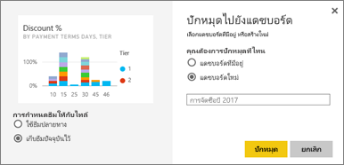
5. เมื่อคุณเลือก**Pin**, Power BI สร้างแดชบอร์ดใหม่ในพื้นที่ทำงานปัจจุบัน เมื่อข้อความ **ปักหมุดไปยังแดชบอร์ด**ปรากฏขึ้น ให้เลือก**ไปยังแดชบอร์ด** หากมีข้อความปรากฏขึ้นให้บันทึกรายงาน เลือก**บันทึก**

     
6. Power BI เปิดแดชบอร์ดใหม่ขึ้นและมีไทล์หนึ่งที่คุณเพิ่งปักหมุด นั่นคือ การแสดงภาพ

   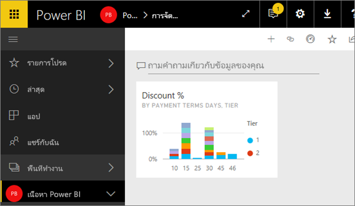
7. เมื่อต้องกลับไปยังรายงาน เลือกไทล์ดังกล่าว ปักหมุดไทล์เพิ่มเติมไปยังแดชบอร์ดใหม่ ครั้งนี้เมื่อหน้าต่าง**ปักหมุดลงในแดชบอร์ด**แสดงขึ้นมา ให้เลือก**แดชบอร์ดที่มีอยู่**  

   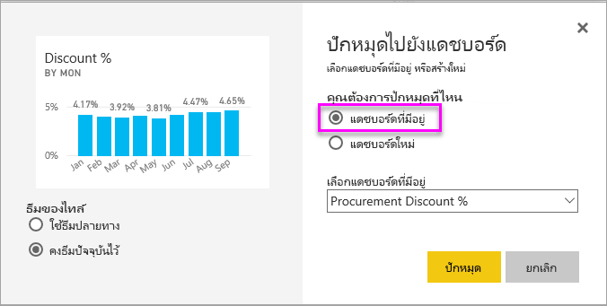

## ปักหมุดทั้งหน้ารายงานไปยังแดชบอร์ด
แทนที่จะเป็นการปักหมุดไปยังทีละภาพ คุณสามารถ[ปักหมุดทั้งหน้ารายงานเป็น*ไทล์สด*](service-dashboard-pin-live-tile-from-report.md)ได้ ลองทำดูกัน

1. ในตัวแก้ไขรายงาน เลือกแถบ **ภาพรวมการใช้จ่าย** เพื่อเปิดหน้าที่ 2 ของรายงานขึ้น

   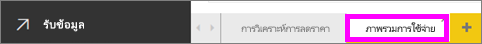

2. คุณต้องการภาพเหล่านี้ทั้งหมดบนแดชบอร์ดของคุณ  ที่มุมขวาบนของแถบเมนู เลือก**ปักหมุดหน้ารายงานสด** ที่แดชบอร์ด ระบบจะอัปเดทไทล์หน้ารายงานสดทุกครั้งที่มีการรีเฟรชหน้าดังกล่าว

   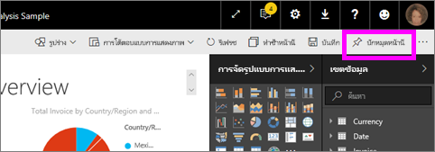

3. เมื่อหน้าต่าง**ปักหมุดลงในแดชบอร์ด**แสดงขึ้นมา ให้เลือก**แดชบอร์ดที่มีอยู่**

   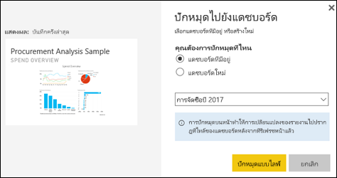

4. เมื่อข้อความแสดงความสำเร็จปรากฏขึ้น เลือก **ไปยังแดชบอร์ด** ตรงจุดนี้คุุณจะเห็นไทล์ที่คุณได้ปักหมุดไทล์จากรายงาน ในตัวอย่างด้านล่าง เราได้ปักหมุดไทล์ 2 แผ่นจากหน้า 1 ของรายงานและ 1 ไทล์รายงานสดที่อยู่บนหน้า 2 ของรายงาน

   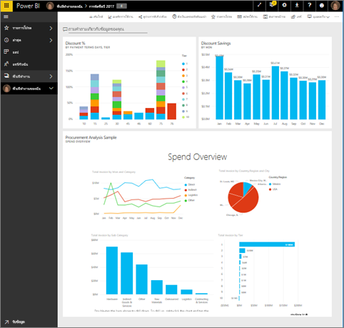

ยินดีด้วย คุณได้สร้างแดชบอร์ดแรกของคุณแล้ว! ตอนนี้คุณมีหนึ่งแดชบอร์ดแล้ว มีสิ่งต่าง ๆ มากมายที่คุณสามารถทำได้บนแดชบอร์ดของคุณ  ลองใช้หนึ่งใน**ขั้นตอนถัดไป**ที่แนะนำดังด้านล่าง หรือเริ่มเล่นและสำรวจด้วยตัวเอง   

## ขั้นตอนถัดไป
* [ปรับขนาดและย้ายไทล์](service-dashboard-edit-tile.md)
* [ทั้งหมดเกี่ยวกับไทล์แดชบอร์ด](service-dashboard-tiles.md)
* [แชร์แดชบอร์ดของคุณโดยการสร้างแอปฯ](service-create-workspaces.md)
* [Power BI - แนวคิดพื้นฐาน](service-basic-concepts.md)
* [เคล็ดลับสำหรับการออกแบบแดชบอร์ด ที่ยอดเยี่ยม](service-dashboards-design-tips.md)

มีคำถามเพิ่มเติมหรือไม่ [ลองไปที่ชุมชน Power BI](http://community.powerbi.com/)
