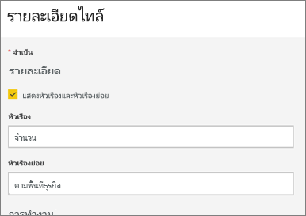
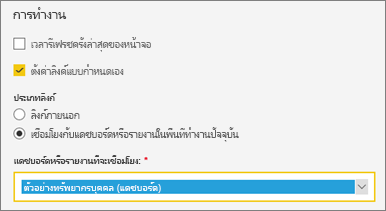
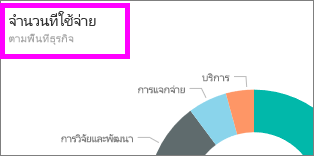
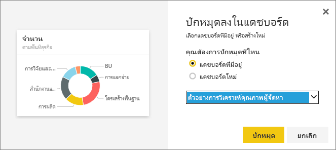

# แก้ไขหรือลบแดชบอร์ดไทล์

## *เจ้าของ*แดชบอร์ดเทียบกับ*ผู้บริใช้*แดชบอร์ด
เมื่อคุณสร้าง หรือเป็นเจ้าของแดชบอร์ด คุณมีตัวเลือกมากมายสำหรับการเปลี่ยนแปลงการลักษณะและพฤติกรรมของไทล์บนแดชบอร์ดนั้น ใช้การตั้งค่าและกลยุทธ์ด้านล่างเมื่อต้องการออกแบบแดชบอร์ด*โดยใช้*ประสบการณ์การใช้งานของผู้ร่วมงานของคุณ  จะเลือกไทล์เปิดรายงานที่สำคัญ URL ที่กำหนดเอง หรือแดชบอร์ดต่างๆ ได้อย่างไร อาจคุณจะ[เพิ่มไทล์ที่แสดงวิดีโอ หรือข้อมูลการสตรีม](service-dashboard-add-widget.md)หรือไม่ และแม้คุณอาจต้องการ[สร้างไทล์ที่มีตัวแบ่งส่วนข้อมูลแบบโต้ตอบ](service-dashboard-pin-live-tile-from-report.md) ในฐานะ*ผู้สร้าง*คุณมีตัวเลือกมากมาย 

<iframe width="560" height="315" src="https://www.youtube.com/embed/lJKgWnvl6bQ" frameborder="0" allowfullscreen></iframe>

บทความนี้ครอบคลุมเรื่องต่อไปนี้

* [สร้างภาพและปักหมุดกับแดชบอร์ด](#create)
* [ย้ายไทล์](#move)
* [ปรับขนาดไทล์](#resize)
* [เปลี่ยนชื่อไทล์](#rename)
* [เพิ่มไฮเปอร์ลิงก์ให้ไทล์](#hyperlink)
* [ปักหมุดไทล์ให้แดชบอร์ดต่างๆ](#different)
* [ลบไทล์](#delete)
  
  > [!TIP]
  > เมื่อต้องเปลี่ยนการแสดงภาพที่แสดงบนไทล์เอง ลบไทล์ และเพิ่ม[แดชบอร์ดไทล์](consumer/end-user-tiles.md)ใหม่

  
## ข้อกำหนดเบื้องต้น
เพื่อติดตาม ให้เปิด Power BI service(ไม่ใช่ Power BI Desktop) และ[ดาวน์โหลดตัวอย่างการวิเคราะห์การใช้จ่ายด้าน IT](sample-it-spend.md) เมื่อข้อความแสดงความสำเร็จปรากฏขึ้น เลือก **ไปยังแดชบอร์ด**

- - -

## สร้างภาพใหญ่และปักมันไว้กับแดชบอร์ด
1. จากแดชบอร์ดการวิเคราะห์การใช้จ่ายด้าน IT ให้เลือกไทล์ "Amount" เพื่อเปิดรายงาน

    

2. เปิดรายงานในมุมมองการแก้ไข โดยการเลือก**แก้ไขรายงาน**จากแถบเมนูด้านบน

3. เพิ่มหน้ารายงานใหม่โดยเลือกไอคอนเครื่องหมายบวก (+) ที่ด้านล่างของรายงาน

    

4. จากบานหน้าต่างเขตข้อมูล ให้เลือก**ข้อเท็จจริง > ยอด**และ**พื้นที่ธุรกิจ > พื้นที่ธุรกิจ**
 
5. จากบานหน้าต่างการแสดงภาพ ให้เลือกไอคอนแผนภูมิโดนัทเพื่อแปลงการสดงภาพลงเป็นแผนภูมิโดนัท

    

5. เลือกไอคอนหมุดและปักหมุดแผนภูมิโดนัทกับแดชบอร์ดตัวอย่างการวิเคราะห์การใช้จ่ายด้าน IT

   

6. เมื่อข้อความแสดงความ “สำเร็จ” ปรากฏขึ้น เลือก**ไปยังแดชบอร์ด** คุณจะถูกถามให้บันทึกการเปลี่ยนแปลง เลือก**บันทึก**

- - -

## ย้ายไทล์
บนแดชบอร์ด ค้นหาไทล์ใหม่ เลือกและกดไทล์เพื่อลากไปยังตำแหน่งใหม่บนผืนผ้าใบแดชบอร์ด

- - -

## ปรับขนาดไทล์
คุณสามารถสร้างไทล์ได้หลายขนาด จาก 1 x 1 หน่วยไทล์จนถึง 5 x 5 เลือกและลากหูหิ้ว(ที่มุมล่างขวา) เพื่อปรับขนาดไทล์

- - -
## เมนูจุดไข่ปลา (...)

1. เลือกจุดไข่ปลา (...) ในมุมขวาบนของไทล์ 
   
   

2. วางเคอร์เซอร์เหนือไทล์ "บัญชี" และเลือกจุดไข่ปลาเมื่อต้องแสดงตัวเลือก ตัวเลือกที่พร้อมใช้งานจะแตกต่างกันตามชนิดไทล์  ตัวอย่าง ตัวเลือกที่พร้อมใช้งานสำหรับไทล์รายงานแบบไลฟ์ต่างจากตัวเลือกที่พร้อมใช้งานสำหรับไทล์การแสดงภาพแบบมาตรฐาน นอกจากนี้ ถ้ามีการแชร์แดชบอร์ดกับคุณ(คุณไม่ใช่เจ้าของ) คุณจะมีตัวเลือกน้อยลง

   

3. ให้เลือก**แก้ไขรายละเอียด**เพื่อเปิดหน้าต่าง "ไทล์รายละเอียด" 

    เปลี่ยนชื่อและค่าเริ่มต้นลักษณะการทำงานของไทล์  ตัวอย่างเช่น คุณอาจตัดสินใจว่าเมื่อเลือก*ผู้บริโภค*ในฐานะไทล์ แทนที่จะเปิดรายงานที่ถูกใช้เพื่อสร้างไทล์ แดชบอร์ดใหม่ได้แสดงแทน  
   

### เปลี่ยนชื่อไทล์
ที่ด้านบนของหน้าต่าง "ไทล์รายละเอียด" ให้เปลี่ยน**ชื่อเรื่อง**เป็น**ยอดเงินที่ใช้**

### เปลี่ยนไฮเปอร์ลิงก์เริ่มต้น
ตามค่าเริ่มต้น การเลือกไทล์โดยปกติแล้วจะนำคุณไปยังรายงานทีไทล์ หรือ Q&A(ถ้าไทล์ถูกสร้างขึ้นใน Q&A) เมื่อต้องการเชื่อมโยงไปยังเว็บเพจ แดชบอร์ดอื่นหรือรายงาน (ในพื้นที่ทำงานเดียวกัน) รายงาน SSRS หรือเนื้อหาอื่นๆ แบบออนไลน์ ให้เพิ่มลิงก์แบบกำหนดเอง

1. ภายใต้หัวเรื่องฟังก์ชันการทำงาน ให้เลือก**ตั้งค่าลิงก์แบบกำหนดเอง**

2. เลือก**ลิงก์ไปยังแดชบอร์ดหรือรายงานในพื้นที่ทำงานปัจจุบัน**แล้ว เลือกจากรายการแบบดร๊อปดาวน์  ในตัวอย่างนี้ เราได้เลือกแดชบอร์ดตัวอย่างทรัพยากรบุคคล ถ้าคุณไม่มีตัวอย่างนี้อยู่ในพื้นที่ทำงานของคุณ คุณสามารถเพิ่มและกลับไปยังขั้นตอนนี้ หรือคุณสามารถเลือกแดชบอร์ดที่แตกต่างกัน 

    

3. เลือก**นำไปใช้**

4. ชื่อเรื่องใหม่แสดงบนไทล์  และ เมื่อคุณเลือกไทล์ Power BI เปิดแดชบอร์ดทรัพยากรบุคคลขึ้น 

    

### ปักหมุดแดชบอร์ดไทล์ที่แตกต่างกัน
1. จากเมนูดรอปดาวน์จุดไข่ปลา ให้เลือก**ปักหมุดไทล์** 
2. ให้ตัดสินใจว่าจะปักหมุดรายการซ้ำของไทล์นี้กับแดชบอร์ดที่มีอยแล้วหรือแดชบอร์ดใหม่ 
   
   
3. เลือก**หมุด**

### ลบไทล์
1. เพื่อลบไทล์ออกอย่างถาวรจากแดชบอร์ด ให้เลือก**ลบไทล์** จากเมนูดรอปดาวน์จุดไข่ปลา 

2. การลบไทล์ไม่ลบการแสดงภาพแบบพื้นฐาน เปิดรายงานพื้นฐาน โดยเลือกไทล์ "Amount" เปิดหน้าสุดท้ายในรายงานของคุณ เพื่อดูว่าการแสดงภาพต้นฉบับไม่ถูกลบจากรายงานหรือไม่ 

- - -
## ขั้นตอนถัดไป
[ไทล์แดชบอร์ดใน Power BI](consumer/end-user-tiles.md)

[แดชบอร์ดใน Power BI](consumer/end-user-dashboards.md)

[Power BI แนวคิดพื้นฐาน](consumer/end-user-basic-concepts.md)

มีคำถามเพิ่มเติมหรือไม่ [ลองไปที่ชุมชน Power BI](http://community.powerbi.com/)

