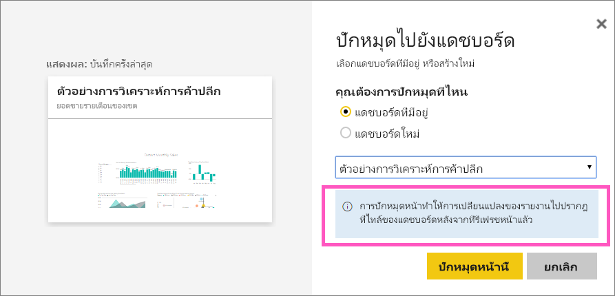
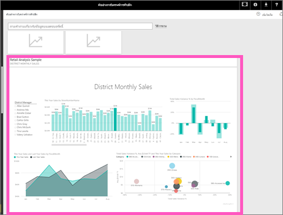

# ปักหมุดหน้ารายงานทั้งหน้าแบบไลฟ์ไทล์กับแดชบอร์ด Power BI
อีกวิธีในการเพิ่มใหม่[แดชบอร์ดไทล์](service-dashboard-tiles.md) คือการปักหมุดหน้ารายงานทั้งหน้า นี่คือวิธีง่ายๆ ในการปักหมุดการแสดงภาพมากกว่าหนึ่งครั้ง  นอกจากนี้ เมื่อคุณปักหมุดทั้งหน้า ไทล์จะเป็นแบบ*live* คุณสามารถโต้ตอบกับพวกมันได้จากที่นั่นบนแดชบอร์ด และเปลี่ยนแปลงที่คุณทำกับการแสดงภาพก่อนหน้านี้ในตัวแก้ไขรายงาน เช่นการเพิ่มตัวกรองหรือการเปลี่ยนแปลงเขตข้อมูลที่ใช้ในแผนภูมิ จะปรากฏในแดชบอร์ดไทล์เช่นกัน  

ปักหมุดไทล์แบบไลฟ์จากรายงานกับแดชบอร์ด สามารถใช้ได้ใน Power BI service (app.powerbi.com) เท่านั้น

> [!NOTE]
> คุณไม่สามารถปักหมุดไทล์จากรายงานที่ใช้ร่วมกันกับคุณได้
> 
> 

## ปักหมุดหน้ารายงาน
ดู Amanda ปักหมุดหน้ารายงานไว้กับแดชบอร์ด แล้วทำตามคำแนะนำทีละขั้นตอนด้านล่างวิดีโอเพื่อลองทำด้วยตนเอง

<iframe width="560" height="315" src="https://www.youtube.com/embed/EzhfBpPboPA" frameborder="0" allowfullscreen></iframe>

1. เปิด[รายงานในมุมมองการแก้ไข](service-interact-with-a-report-in-editing-view.md)
2. เนื่องจากการแสดงภาพไม่ได้ถูกเลือกจากแถบเมนู ให้เลือก**ปักหมุดหน้าแบบไลฟ์**
   
    
3. ปักหมุดไทล์ลงในแดชบอร์ดที่มีอยู่ หรือแดชบอร์ดใหม่ โปรดสังเกตว่า ข้อความที่ไฮไลท์ *การปักหมุดหน้าแบบไลฟ์สามารถทำให้รายงานปรากฏในแดชบอร์ดไทล์เปลี่ยนเมื่อมีการรีเฟรชหน้าได้*
   
   * แดชบอร์ดที่มีอยู่ ให้เลือกชื่อของแดชบอร์ดจากรายการแบบดร๊อปดาวน์ แดชบอร์ดที่แชร์กับคุณจะไม่ปรากฏขึ้นที่นี่
   * แดชบอร์ดใหม่ พิมพ์ชื่อของแดชบอร์ดใหม่
     
     
4. เลือก**Pin live** ข้อความว่าสำเร็จแล้ว (ใกล้กับมุมบนขวา) ช่วยให้คุณทราบว่า การหน้าถูกเพิ่มเป็นไทล์ ลงในแดชบอร์ดของคุณ

## เปิดแดชบอร์ดเพื่อดูไทล์ที่ถูกปักหมุดแบบไลฟ์
1. จากบานหน้าต่างนำทาง ให้เลือกแดชบอร์ดที่ มีไทล์แบบไลฟ์ใหม่ ที่นั่น คุณสามารถทำสิ่งต่างๆ เช่น[เปลี่ยนชื่อ ปรับขนาด ลิงก์ และย้าย](service-dashboard-edit-tile.md)หน้ารายงานที่ปักหมุดไว้ได้  
2. โต้ตอบกับไทล์รายงานแบบไลฟ์  ในสกรีนช็อตด้านล่าง ให้เลือกแถบบนคอลัมน์ แผนภูมิมีตัวกรองแบบสลับ และแสดงภาพอื่นๆ บนไทล์แบบไฮไลท์สลับ
   
    

## ขั้นตอนถัดไป
[แดชบอร์ดใน Power BI](service-dashboards.md)

มีคำถามเพิ่มเติมหรือไม่ [ลองไปที่ชุมชน Power BI](http://community.powerbi.com/)

